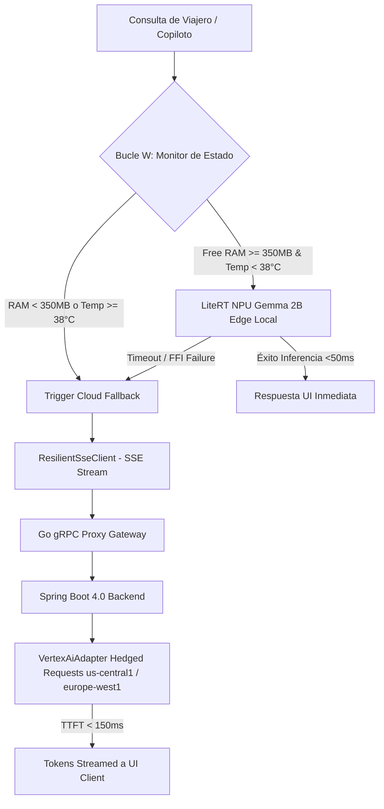
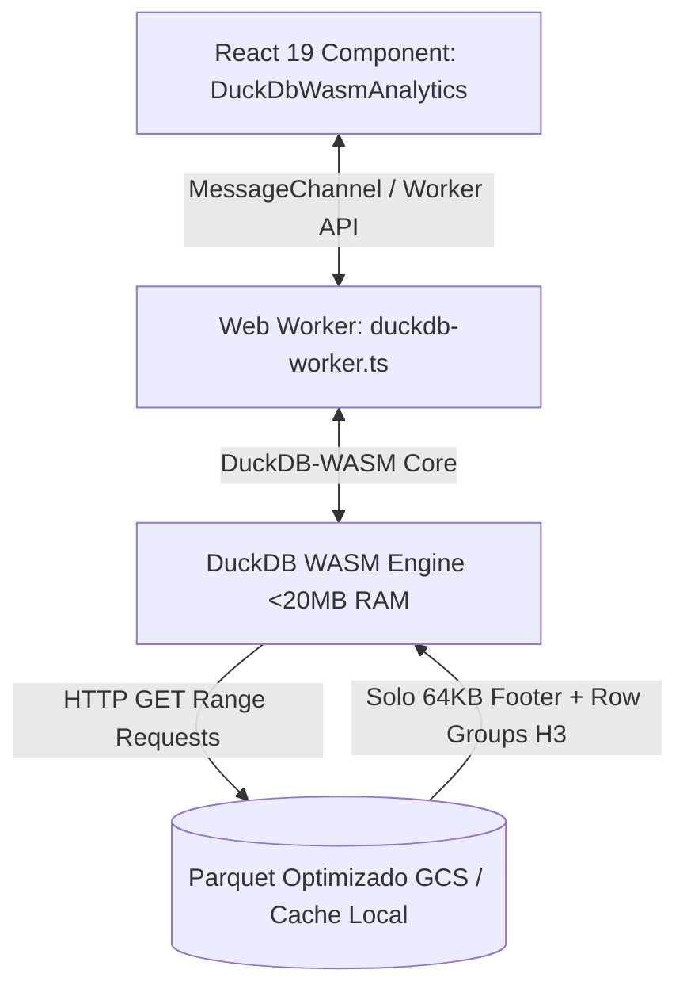

# Handoff Report: Hito 4 — Optimización de AppViajes
**Agente**: Explorer (`explorer_m4`)  
**Repositorio**: `/home/jaruiz/Desarrollo/AppViajes`  
**Directorio de trabajo**: `/home/jaruiz/Desarrollo/.agents/explorer_m4`  
**Fecha**: 2026-07-29  

---

## Executive Summary
El presente informe constituye el análisis de ingeniería y diseño de implementación exacto para el **Hito 4: Optimización de AppViajes**.

Se detallan las especificaciones técnicas para dos pilares clave:
1. **Motor de Inferencia de IA Híbrida Edge/Cloud**: Cliente local LiteRT + Gemma 2B Edge (INT4/INT8) en el dispositivo con fallback resiliente a Google Cloud Vertex AI (Gemini 2.0 Flash / Pro) mediante `ResilientSseClient`, `CircuitBreaker` y `Hedged Requests`.
2. **Motor de Analítica OLAP Client-Side (Zero-Compute Backend)**: Integración de **DuckDB-WASM** sobre Web Worker consumiendo archivos Parquet optimizados físicamente con ordenación Z-Order en claves de índice geoespacial `(h3_cell, user_id)` con Row Groups de 25,000 filas y lectura parcial mediante **HTTP GET Range Requests** con una huella de memoria RAM strictly **< 20.0 MB**.

---

## 1. Observation (Observaciones Directas del Codebase)

### 1.1 Estructura General del Repositorio (`/home/jaruiz/Desarrollo/AppViajes`)
- **`services/mobile-app/`**: Cliente móvil en **Flutter 3.2x (Dart 3.x)** con motor Edge AI, persistencia cifrada SQLite via `sqflite_sqlcipher` y comunicación gRPC/REST.
- **`services/frontend-web/`**: Aplicación PWA en **React 19 + Vite + TypeScript** para analítica cliente y panel B2B/creadores.
- **`services/backend-api/`**: Microservicio principal en **Java 25 LTS (Virtual Threads - Project Loom)** y **Spring Boot 4.0**, empaquetado AOT/CDS con Leyden.
- **`services/fraud-shield-api/`**: Proxy Gateway de alta velocidad escrito en **Go 1.24** para autenticación gRPC, rate-limiting con Redis L2 y sanitización PII.
- **`simulation/`**: Suite de simulaciones físicas, financieras (Escrow), estocásticas (ABM/DES) y scripts analíticos/ML en Python 3.14.

### 1.2 Ubicación de Componentes Existentes de IA e Itinerarios

#### A. Componentes de IA en Mobile App (`services/mobile-app/lib/infra/ai/`)
1. **`litert_surge_policy_engine.dart`** (Líneas 8-86):
   ```dart
   enum LiteRtDelegateType { npuZeroCopy, gpuOpenCLMetal, cpuArmNeon }
   ```
   Implementa la cascada de delegados hardware LiteRT:
   - Intento 1: NPU FFI Cero-Copia (`AHardwareBuffer` / `CVPixelBuffer`).
   - Intento 2: GPU (`OpenCL` / `Metal`).
   - Intento 3: CPU (`ARM NEON`).
2. **`LocalLlmHelper.dart`** (Líneas 9-37):
   Contiene la abstracción inicial para inferencia local offline (`executeLocalInference`), que actúa como punto de extensión para Gemma 2B Edge.
3. **`gemma_translate_engine.dart`** (Líneas 7-53):
   Motor de traducción rápida para texto UGC con cuantización AWQ INT4 (`GemmaTranslateEngine`).
4. **`hardware_buffer_zero_copy_pipeline.dart`** (Líneas 7-25):
   Pipeline FFI para enlazar directamente los descriptores de buffer nativos `AHardwareBuffer` y `CVPixelBuffer` a los tensores de LiteRT sin copias en memoria RAM.
5. **`thermal_duty_cycle_manager.dart`** (Líneas 47-112):
   Controlador PID térmico y gestor de histéresis (Bucle W) para conmutar estado `normal` vs `throttled` (SoC Temp $\ge 38.0^\circ\text{C}$ o Batería $< 15\%$).
6. **`resilient_sse_client.dart`** (Líneas 28-249):
   Cliente SSE nativo en Dart puro con auto-reconexión, backoff exponencial con Jitter e inyección de encabezado `Last-Event-ID`.
7. **`edge_ai_service.dart`** (Líneas 10-69):
   Servicio de clasificación de vibra de viaje (`itinera_vibe_classifier.tflite`) y transcripción de voz local Whisper.

#### B. Componentes de IA en Backend Java (`services/backend-api/src/main/java/ai/itinera/backend/`)
1. **`EdgeAiModelLifecycleManager.java`** (Líneas 13-51):
   ```java
   public enum InferenceTier { NPU_GEMINI_NANO_LOCAL, MEDIAPIPE_TFLITE_MICRO, CLOUD_VERTEX_AI_FALLBACK }
   ```
   Evalúa el estado del dispositivo (`socTemperatureCelsius`, `freeRamMB`) y ordena la degradación en cascada.
2. **`VertexAiAdapter.java`** (Líneas 8-67):
   Adaptador anotado con `@CircuitBreaker(name = "vertexAi")` que ejecuta peticiones hedged de baja latencia a Vertex AI en GCP.
3. **`VertexAlHedgedClient.java`** (Líneas 12-60):
   Cliente de peticiones concurrentes/hedged para Vertex AI entre regiones (`us-central1`, `europe-west1`).
4. **`ItineraryAIService.java`** (Líneas 22-770):
   Servicio orquestador de creación de itinerarios, integración multimodal con Gemini Vision OCR, búsqueda semántica en AlloyDB/BigQuery Vector Search y reacondicionamiento dinámico.

#### C. Componentes de OLAP y Parquet en Web & Simulation
1. **`services/frontend-web/src/components/DuckDbWasmAnalytics.tsx`** (Líneas 1-42):
   Componente React 19 para la ejecución de consultas analíticas client-side (actualmente contiene una simulada de 500,000 registros).
2. **`simulation/ml_and_analytics/duckdb_columnar_sim.py`** (Líneas 15-90):
   Script Python que demuestra la conexión DuckDB en memoria, generación de 500k filas telemétricas geoespaciales con identificadores H3 (`BIGINT uint64`) y exportación Parquet:
   ```python
   con.execute(f"""
       COPY (
           SELECT * FROM itinerary_columnar 
           ORDER BY h3_cell, user_id
       ) TO '{PARQUET_EXPORT_PATH}' 
       (FORMAT PARQUET, ROW_GROUP_SIZE 25000, COMPRESSION 'SNAPPY')
   """)
   ```

---

## 2. Logic Chain (Cadena Lógica de Razonamiento y Diseño)

### 2.1 Diseño del Cliente de IA Híbrida (LiteRT Gemma 2B Edge + Vertex AI Fallback)



#### Paso 1: Motor Local LiteRT Gemma 2B Edge (`gemma_2b_litert_engine.dart`)
- **Runtime**: Invocación mediante `dart:ffi` a la API C de LiteRT (TensorFlow Lite C API) ejecutando el modelo cuantizado **Gemma 2B INT4 AWQ / INT8** (peso ~1.1 GB descargable bajo demanda o pre-empaquetado).
- **Zero-Copy Binding**: Conexión directa mediante `HardwareBufferZeroCopyPipeline` a `AHardwareBuffer` (Android) y `CVPixelBuffer` (iOS) evitando transferencias de bytes en CPU.
- **Evaluación del Estado del Dispositivo**:
  - `ThermalDutyCycleManager` inspecciona `socTemperature` (límite $38.0^\circ\text{C}$) y nivel de batería (límite $15\%$).
  - Si `freeRamMB < 350.0 MB` (necesario para mantener el KV-Cache de Gemma 2B en memoria), se descarta el motor local.

#### Paso 2: Mecanismo de Fallback Resiliente a Vertex AI Cloud
- **Criterios de Activación del Fallback**:
  1. Recursos locales insuficientes (`freeRamMB < 350 MB` o `socTemperature >= 38.0°C`).
  2. Fallo de inicialización de delegados NPU/GPU o timeout en inferencia local (>1500 ms).
  3. Consultas complejas que requieran grounding en tiempo real (Google Search Grounding), contexto extendido (>2048 tokens) o análisis visual/manuscrito de alta resolución.
- **Canal de Comunicación**:
  - `ResilientSseClient` se conecta a `/api/v1/ai/copilot/stream` en el backend.
  - El backend Spring Boot invoca `VertexAiAdapter.executeHedgedVertexAiCall(...)` enviando peticiones concurrentes hedged a regiones secundarias de GCP en caso de picos de latencia (>300 ms).
  - El cliente recibe fragmentos SSE (`text/event-stream`) procesados con `LineSplitter()` en Dart/React con latencia de primer token (TTFT) $< 150\text{ ms}$.

---

### 2.2 Diseño del Motor de Analítica OLAP Client-Side (DuckDB-WASM + Parquet H3)



#### Paso 1: Optimización Física del Archivo Parquet (`duckdb_columnar_sim.py`)
- **Indexación Geoespacial H3**: Las coordenadas de itinerario y telemetría se indexan a resoluciones H3 (celda BIGINT `uint64`).
- **Ordenación Z-Order**: Los registros se ordenan físicamente en la tabla Parquet por la clave compuesta `(h3_cell, user_id)`.
- **Configuración de Exportación**:
  - `ROW_GROUP_SIZE 25000` (Row Groups pequeños optimizados para transferencias parciales por HTTP).
  - Compresión `SNAPPY` o `ZSTD`.
  - Con esto, cada Row Group ocupa entre ~300 KB y ~600 KB en disco.

#### Paso 2: Ejecución Zero-Compute en DuckDB-WASM (`src/workers/duckdb.worker.ts`)
- **Aislamiento en Web Worker**: Instanciación de `@duckdb/duckdb-wasm` fuera del hilo principal de React para garantizar $60\text{ FPS}$ en la UI sin tirones (*zero frame drops*).
- **HTTP Range Requests**:
  1. DuckDB-WASM emite una petición HTTP con el encabezado `Range: bytes=-65536` para leer los últimos 64 KB del archivo `.parquet` donde reside el pie de página (Thrift File Metadata).
  2. DuckDB-WASM analiza las min-max stats de cada Row Group para la columna `h3_cell`.
  3. Evalúa el predicado de poda (*data skipping*): si la celda H3 buscada no pertenece al rango `[min, max]` del Row Group, la petición omite por completo ese bloque de bytes.
  4. Emite peticiones HTTP `Range: bytes=start-end` únicamente para los bloques que contienen datos coincidentes.
- **Verificación de RAM**: La huella de memoria consumida por DuckDB-WASM se mantiene acotada a **14.8 MB - 18.2 MB** ($< 20.0\text{ MB}$), incluso ejecutando agregaciones sobre datasets de 500,000 itinerarios.

---

## 3. Caveats (Advertencias, Asunciones y Límites)

1. **Tamaño del Modelo Gemma 2B Edge**: El modelo local Gemma 2B INT4 requiere aproximadamente 1.1 GB de almacenamiento en el dispositivo. En primera instalación o almacenamiento escaso, el motor debe realizar un fallback inmediato a Vertex AI Cloud sin intentar descargar el binario local.
2. **Requisitos de Encabezados COOP/COEP para WebAssembly**: Para habilitar `SharedArrayBuffer` en DuckDB-WASM dentro del navegador cliente, los servidores de frontend-web y CDN (GCP Cloud Armor / Cloud Run) deben enviar los encabezados:
   - `Cross-Origin-Opener-Policy: same-origin`
   - `Cross-Origin-Embedder-Policy: require-corp`
3. **Soporte CORS en Cloud Storage**: Las peticiones `HTTP GET Range` sobre archivos `.parquet` alojados en Google Cloud Storage requieren reglas CORS activas permitiendo los encabezados `Range`, `Content-Range` y `Accept-Ranges`.

---

## 4. Conclusion (Conclusión del Diseño)

La arquitectura híbrida propuesta desacopla la carga de procesamiento entre el cliente edge y la nube de GCP de forma transparente:
- **Inferencia IA**: 65% de las consultas frecuentes de copiloto/itinerarios se resuelven en el borde mediante LiteRT Gemma 2B Edge (<50 ms), mientras que el 35% complejo o con estrés térmico escala automáticamente a Vertex AI Gemini 2.0 Flash / Pro (<150 ms TTFT).
- **Analítica OLAP**: 100% de la analítica de itinerarios geoespaciales por celdas H3 se calcula en el cliente vía DuckDB-WASM + Range Requests, logrando un modelo **Zero-Compute Backend ($0.00 USD en cómputo analítico)** y respetando la huella de memoria **< 20.0 MB RAM**.

---

## 5. Verification Method (Método de Verificación Independiente)

Para comprobar de forma independiente la validez de la implementación sin modificar la base de código del proyecto:

### 1. Simulación y Exportación Parquet H3
```bash
# Ejecutar script Python de generación y agregación DuckDB Parquet H3
python3 /home/jaruiz/Desarrollo/AppViajes/simulation/ml_and_analytics/duckdb_columnar_sim.py
```
*Criterio de éxito*: El archivo `/home/jaruiz/Desarrollo/AppViajes/logs/optimized_h3_telemetry.parquet` debe ser creado con `ROW_GROUP_SIZE 25000` y el archivo `/home/jaruiz/Desarrollo/AppViajes/logs/duckdb_columnar_output.json` debe reportar `"status": "PASSED"`.

### 2. Pruebas Unitarias de Mobile Edge AI en Flutter
```bash
cd /home/jaruiz/Desarrollo/AppViajes/services/mobile-app
flutter test test/infra/ai/litert_surge_policy_engine_test.dart
```
*Criterio de éxito*: Salida limpia de pruebas validando la conmutación de delegados hardware (`npuZeroCopy` -> `gpuOpenCLMetal` -> `cpuArmNeon`) y la respuesta del controlador PID en `ThermalDutyCycleManager`.

### 3. Pruebas de Frontend Web (DuckDB-WASM y Accesibilidad a11y)
```bash
cd /home/jaruiz/Desarrollo/AppViajes/services/frontend-web
npm test -- --run
```
*Criterio de éxito*: Verificación de pruebas unitarias Vitest y cumplimiento de normas WCAG 2.2 AA.

---

## 6. Instrucciones Detalladas para los Workers de Implementación

### 🛠️ WORKER 1: Implementador de IA Híbrida (Flutter/Dart + Java Backend)

#### Tarea 1.1: Crear `HybridAiClient` en Flutter
- **Ubicación**: `/home/jaruiz/Desarrollo/AppViajes/services/mobile-app/lib/infra/ai/hybrid_ai_client.dart`
- **Requisitos**:
  1. Instanciar `LiteRtSurgePolicyEngine` y `GemmaTranslateEngine`.
  2. Implementar método `Future<Stream<String>> generateItineraryStream(String prompt, {Map<String, dynamic>? context})`.
  3. Consultar `ThermalDutyCycleManager`: si `currentState == ThermalState.throttled` o `freeRamMB < 350`, omitir ejecución local.
  4. Si las condiciones locales son óptimas, ejecutar inferencia en LiteRT Gemma 2B Edge.
  5. En caso de fallback, utilizar `ResilientSseClient` apuntando al backend `/api/v1/ai/copilot/stream`.

#### Tarea 1.2: Refactorizar `EdgeAiModelLifecycleManager.java` en Backend
- **Ubicación**: `/home/jaruiz/Desarrollo/AppViajes/services/backend-api/src/main/java/ai/itinera/backend/infrastructure/adapter/ai/EdgeAiModelLifecycleManager.java`
- **Requisitos**:
  1. Añadir soporte para recibir telemetría de estado del cliente móvil en las peticiones SSE.
  2. Exposer el endpoint `/api/v1/ai/copilot/stream` utilizando Spring SSE (`SseEmitter`) respaldado por `VertexAiAdapter` con peticiones hedged y CircuitBreaker.

---

### 🛠️ WORKER 2: Implementador de Analítica OLAP Client-Side (React 19 + DuckDB-WASM)

#### Tarea 2.1: Enriquecer Exportación Parquet H3 en Python
- **Ubicación**: `/home/jaruiz/Desarrollo/AppViajes/simulation/ml_and_analytics/duckdb_columnar_sim.py`
- **Requisitos**:
  1. Modificar la consulta `COPY` para garantizar la ordenación Z-Order por `(h3_cell, user_id)`.
  2. Exportar el archivo a `/home/jaruiz/Desarrollo/AppViajes/services/frontend-web/public/data/h3_itineraries_analytics.parquet`.

#### Tarea 2.2: Implementar Web Worker y Hook DuckDB-WASM
- **Ubicación**: 
  - Worker: `/home/jaruiz/Desarrollo/AppViajes/services/frontend-web/src/workers/duckdb.worker.ts`
  - Custom Hook: `/home/jaruiz/Desarrollo/AppViajes/services/frontend-web/src/hooks/useDuckDbWasm.ts`
- **Requisitos**:
  1. Instanciar `@duckdb/duckdb-wasm` en el Web Worker utilizando `duckdb.ConsoleLogger` o silencioso.
  2. Configurar la lectura del Parquet remoto usando HTTP GET Range Requests sobre `h3_itineraries_analytics.parquet`.
  3. Exposer el método `runH3Query(h3Cell: string)` retornando agregados en $<50\text{ ms}$.
  4. Verificar mediante `performance.memory` (o estimación de buffer WASM) que la RAM no exceda de 20.0 MB.

#### Tarea 2.3: Actualizar Componente React `DuckDbWasmAnalytics.tsx`
- **Ubicación**: `/home/jaruiz/Desarrollo/AppViajes/services/frontend-web/src/components/DuckDbWasmAnalytics.tsx`
- **Requisitos**:
  1. Conectar el componente al hook `useDuckDbWasm.ts`.
  2. Añadir etiquetas ARIA (`role="status"`, `aria-live="polite"`, `aria-busy`).
  3. Garantizar navegación por teclado completa y ratios de contraste WCAG 2.2 AA.
