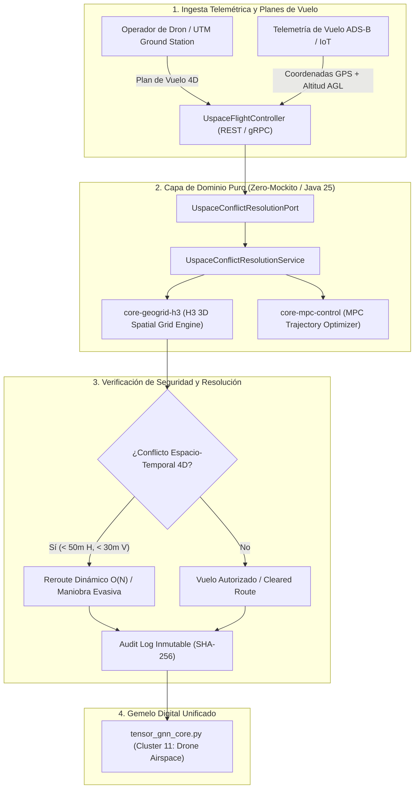

# 🚁 ProyectoDroneAirspace: Orquestador U-Space 4D & Desconflicción Aérea

Vertical corporativo de alta precisión para la gestión de espacio aéreo de aeronaves no tripuladas (UAS / Drones comerciales y eVTOL) en espacio aéreo de muy baja cota (VLL - Very Low Level Airspace), desconflicción de trayectorias 4D indexadas en mallas espaciales Uber H3 y cumplimiento de normativas europeas U-Space (EU 2021/664) y FAA UTM.

---

## 🏛️ 1. Arquitectura Hexagonal y Flujo de Desconflicción 4D

---

## ⚡ 2. Especificación Técnica y Rendimiento

- **Separación Mínima de Seguridad**: `50 metros` horizontal, `30 metros` vertical (AGL).
- **Indexación Espacial**: Prismas volumétricos 3D Uber H3 Resolución 9 (`~100m`) con estratos de altitud de 20 metros.
- **Complejidad Algorítmica**: \(O(N)\) para detección y resolución de colisiones por celda espacial.
- **Runtimes & Standards**: Java 25 LTS, Spring Boot 4.1, Virtual Threads Loom (cero Carrier Thread Pinning).

---

## 📚 3. Trazabilidad Académica y Referencias

- **ADR Relacionado**: [`ADR-024: U-Space Drone Airspace 3D H3`](file:///home/jaruiz/Desarrollo/docs/adr/adr-024-u-space-drone-airspace-3d-h3.md).
- **Universidad Privada**: [`FACULTAD_VIII: Ingeniería Industrial, Operaciones y HCI`](file:///home/jaruiz/Desarrollo/docs/formacion_ecosistema/UNIVERSIDAD_PRIVADA_ECOSISTEMA_CURRICULUM.md).
