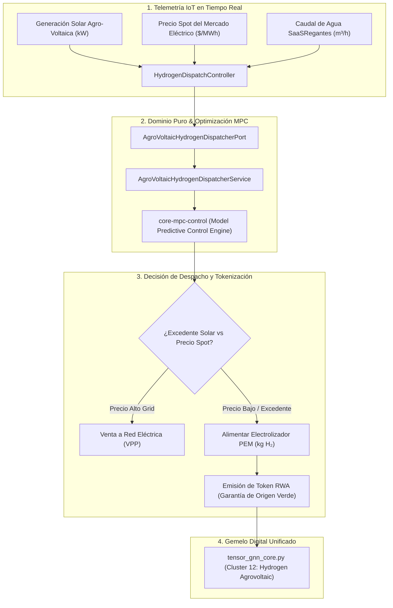

# ⚡ ProyectoHidrogeno: Despacho Óptimo Agro-Voltaico & Producción de Hidrógeno Verde

Vertical corporativo para la orquestación energética acoplada entre plantas fotovoltaicas agro-voltaicas y electrolizadores PEM (Proton Exchange Membrane), optimización de despacho mediante Control Predictivo Basado en Modelos (MPC) y tokenización de activos de hidrógeno verde (RWA ERC-3643 / Garantías de Origen).

---

## 🏛️ 1. Arquitectura Hexagonal y Flujo de Despacho Agro-Voltaico

---

## ⚡ 2. Características Técnicas y Rendimiento

- **Algoritmo de Despacho**: Control Predictivo Cuadrático (MPC) con horizonte móvil de 24 horas y resolución en \(O(H \cdot n \cdot m)\).
- **Eficiencia de Membrana PEM**: Monitorización continua de degradación de celda y optimización de temperatura (\(55^\circ\text{C} - 75^\circ\text{C}\)).
- **Integración Trans-Sectorial**: Acoplamiento directo con `ProyectoEnergia` (solar), `SaaSRegantes` (agua purificada) y `ProyectoTokenRWA` (activos reales).
- **Testing**: Zero-Mockito TDD en Java 25 y JUnit 5 (9 tests pasando al 100%).

---

## 📚 3. Referencias Documentales

- **ADR Relacionado**: [`ADR-020: Model Predictive Control Quadratic Optimization`](file:///home/jaruiz/Desarrollo/docs/adr/adr-020-model-predictive-control-quadratic-optimization.md).
- **Universidad Privada**: [`FACULTAD_VIII: Ingeniería Industrial y Operaciones`](file:///home/jaruiz/Desarrollo/docs/formacion_ecosistema/UNIVERSIDAD_PRIVADA_ECOSISTEMA_CURRICULUM.md).
