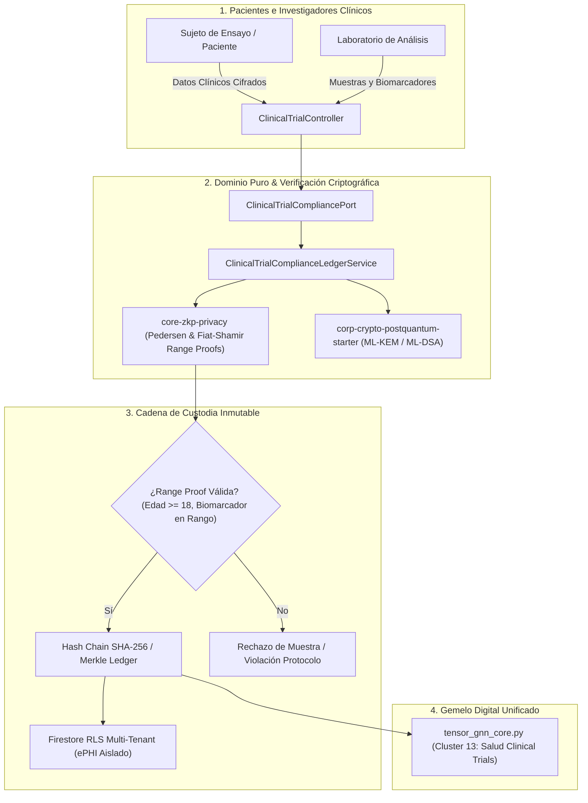

# 🏥 ProyectoSalud: Ensayos Clínicos Descentralizados & Custodia Biomédica Zero-PII

Vertical corporativo de salud digital para la orquestación segura de ensayos clínicos multicéntricos, trazabilidad inmutable de muestras biológicas (Chain of Custody) y verificación de criterios de inclusión mediante pruebas de conocimiento cero (Zero-Knowledge Proofs - ZKP) y criptografía post-cuántica (PQC), cumpliendo rigurosamente con **FDA 21 CFR Part 11, HIPAA y GDPR/LOPD**.

---

## 🏛️ 1. Arquitectura Hexagonal y Flujo de Verificación ZKP

---

## ⚡ 2. Características Técnicas y Cumplimiento

- **Privacidad Zero-PII**: Cero almacenamiento de identificadores personales en texto plano; validación matemática de inclusión mediante Range Proofs \(O(1)\).
- **Inmunidad Post-Cuántica**: Cifrado de canal con NIST ML-KEM-768 y firmas digitales ML-DSA-65.
- **Cadena de Custodia**: Trazabilidad temporal de cada alícuota con marcas de tiempo en nanosegundos y hash de bloque inmutable.
- **Testing**: Zero-Mockito TDD en Java 25 y JUnit 5 (13 tests pasando al 100%).

---

## 📚 3. Referencias Documentales

- **ADR Relacionado**: [`ADR-025: Decentralized Clinical Trials Zero-PII`](file:///home/jaruiz/Desarrollo/docs/adr/adr-025-decentralized-clinical-trials-zero-pii.md).
- **Universidad Privada**: [`FACULTAD_X: Criptografía Cuántica & Privacidad`](file:///home/jaruiz/Desarrollo/docs/formacion_ecosistema/UNIVERSIDAD_PRIVADA_ECOSISTEMA_CURRICULUM.md).
