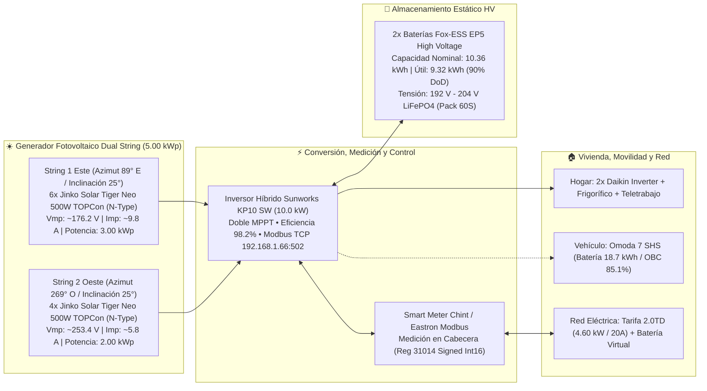
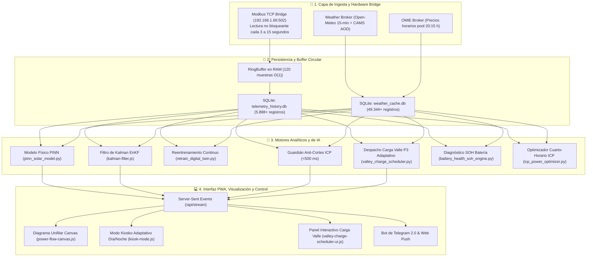
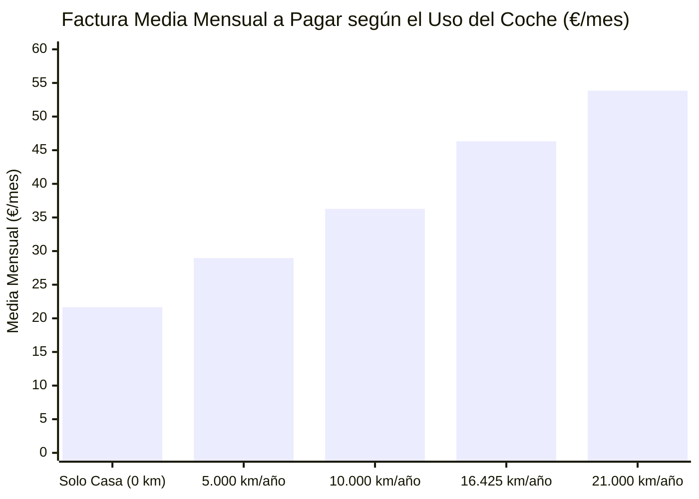
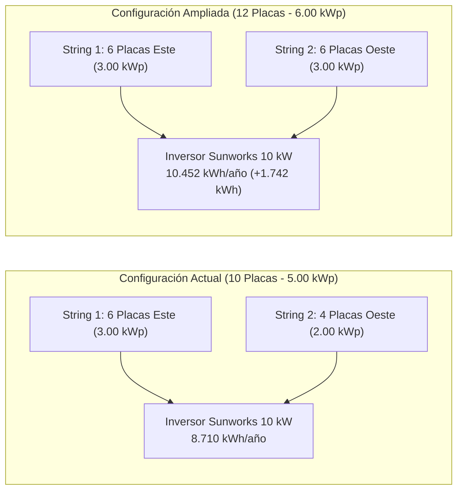
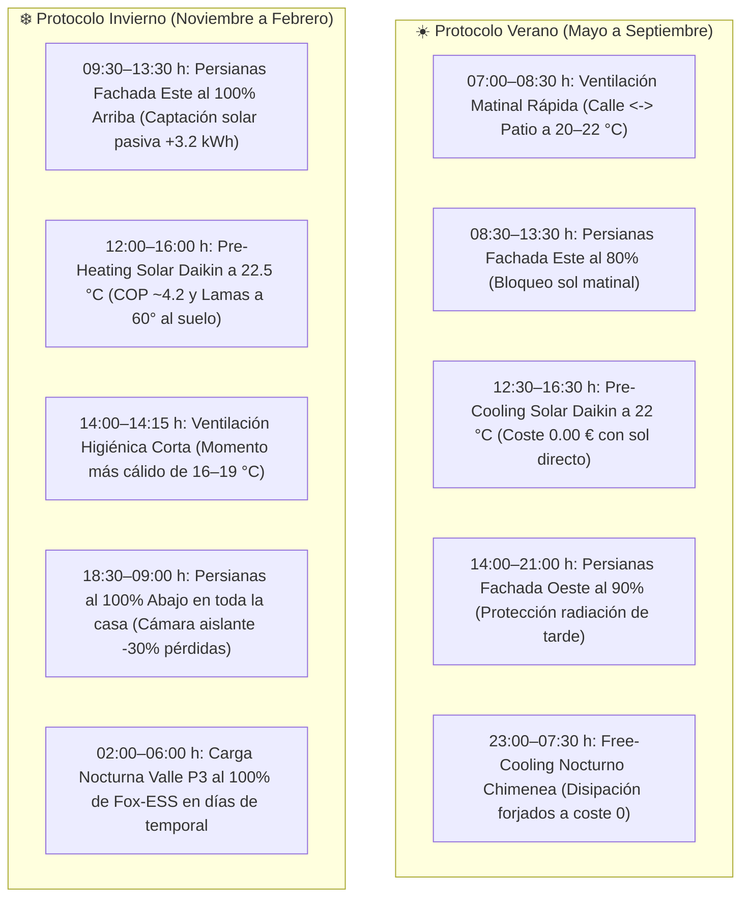
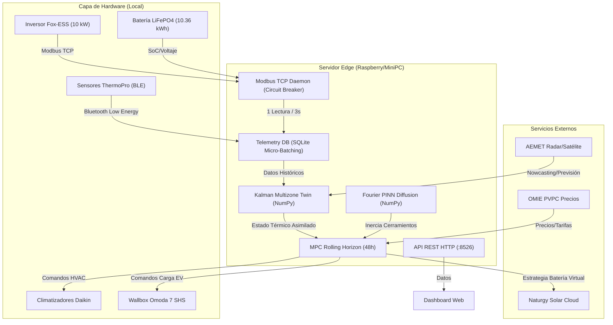

# 📘 Documentación Maestra del Ecosistema Solar Tocina & Gemelo Digital
### Instalación Fotovoltaica, IA Predictiva, Modbus TCP, Despacho Activo, Climatización Daikin, Movilidad y Seguridad Anti-Cortes ICP
**Ubicación:** C/ Amadeo Vives 31, Los Rosales - Tocina (Sevilla) · `37°35′39″ N, 5°44′23″ O` (Altitud 31 m, H3: `8939023447bffff`)  
**Titular:** José Antonio Ruiz Arribas (DNI: `44361953J` · Tel: `653944373`)  
**Versión del Sistema:** 3.5 (Agosto 2026) | **Diseño y Arquitectura:** Google Antigravity

---

## 📑 Índice General
1. [Ficha Técnica de la Instalación & Hardware Físico](#1-ficha-técnica-de-la-instalación--hardware-físico)
2. [Arquitectura de Software, Microservicios y Flujo de Datos en Tiempo Real](#2-arquitectura-de-software-microservicios-y-flujo-de-datos-en-tiempo-real)
3. [Gemelo Digital, Modelos Físicos e Inteligencia Artificial (PINN & EnKF)](#3-gemelo-digital-modelos-físicos-e-inteligencia-artificial-pinn--enkf)
4. [Sincronización Temporal, Husos Horarios y Astronomía Solar](#4-sincronización-temporal-husos-horarios-y-astronomía-solar)
5. [Módulo de Automatizaciones y Despacho Activo (Auto-Dispatch 85% vs 100%)](#5-módulo-de-automatizaciones-y-despacho-activo-auto-dispatch-85-vs-100)
6. [Guardián de Seguridad Anti-Cortes ICP (Zero-Trip Dynamic Curtailment)](#6-guardián-de-seguridad-anti-cortes-icp-zero-trip-dynamic-curtailment)
7. [Climatización Daikin: Desglose Meteorológico y Facturas Históricas](#7-climatización-daikin-desglose-meteorológico-y-facturas-históricas)
8. [Movilidad Eléctrica Omoda 7 SHS: Protocolo Schuko (2.3 kW) y Wallbox](#8-movilidad-eléctrica-omoda-7-shs-protocolo-schuko-23-kw-y-wallbox)
9. [Economía, Batería Virtual Naturgy y Sensibilidad de Kilometraje](#9-economía-batería-virtual-naturgy-y-sensibilidad-de-kilometraje)
10. [Hoja de Ruta: Ampliación a 12 Placas (6.00 kWp / Retorno 2.7 Años)](#10-hoja-de-ruta-ampliación-a-12-placas-600-kwp--retorno-27-años)
11. [Guía de Integración de Hardware (Daikin WiFi, Wallbox y Sensores)](#11-guía-de-integración-de-hardware-daikin-wifi-wallbox-y-sensores)
12. [Catálogo Completo de Endpoints REST, SSE y Telemetría](#12-catálogo-completo-de-endpoints-rest-sse-y-telemetría)
13. [Manual de Operación, Reentrenamiento y Mantenimiento](#13-manual-de-operación-reentrenamiento-y-mantenimiento)
14. [Manual Bioclimático de Eficiencia Estacional y Gestión Pasiva](#14-manual-bioclimático-de-eficiencia-estacional-gestión-pasiva-de-persianas-y-climatización-daikin)
15. [Centro Meteorológico, Radar Satelital EUMETSAT y Visualización de 96 Slots](#15-centro-meteorológico-radar-satelital-eumetsat-y-visualización-de-96-slots)
16. [Difusión Térmica de Fourier 1D/2D y Desfase de Forjados](#16-difusión-térmica-de-fourier-1d2d-y-desfase-de-forjados)
17. [Control Predictivo MPC 48h, Nowcasting Solar Satelital y Domótica Local](#17-control-predictivo-mpc-48h-nowcasting-solar-satelital-y-domótica-local)

---

## 1. Ficha Técnica de la Instalación & Hardware Físico



### Tabla Maestra de Especificaciones Técnicas
| Parámetro / Componente | Valor Nominal / Modelo | Detalles Técnicos y Comportamiento Físico |
| :--- | :--- | :--- |
| **Placas Solares (10x)** | Jinko Solar Tiger Neo 500W (N-Type TOPCon) | \(5{,}00\text{ kWp}\) total (\(3{,}00\text{ kWp}\) Este + \(2{,}00\text{ kWp}\) Oeste). Coeficiente térmico \(\gamma = -0{,}318\%/\text{°C}\), \(\text{NOCT} = 45\text{ °C}\). |
| **Inversor Híbrido** | Sunworks KP10 SW (10.0 kW) | Doble MPPT independiente, \(V_{\text{start}} = 120\text{ V}\), \(V_{\text{max}} = 550\text{ V}\). Protocolo Modbus TCP en `192.168.1.66:502` (Unit ID 247). |
| **Baterías Estáticas (2x)** | Fox-ESS EP5 HV (High Voltage) | \(10{,}36\text{ kWh}\) nominales (\(9{,}32\text{ kWh}\) útiles), química LiFePO4 (\(>6.000\) ciclos al 90% DoD), tensión de flotación \(204{,}2\text{ V}\), \(R_i = 34{,}5\text{ m}\Omega\). |
| **Vehículo Eléctrico** | Omoda 7 SHS (PHEV) | Batería \(18{,}7\text{ kWh}\) (\(17{,}0\text{ kWh}\) útiles), cargador embarcado (OBC) medido al \(85{,}1\%\) de eficiencia. |
| **Climatización** | 2x Daikin Inverter (Salón y Dormitorio) | Salón (\(35\text{ m}^2\), \(3{,}5\text{ kW}\) térmico, \(380\text{--}850\text{ W}\) eléc.), Dormitorio (\(16\text{ m}^2\), \(2{,}5\text{ kW}\) térmico, \(240\text{--}600\text{ W}\) eléc.). |
| **Agua Caliente (ACS)** | Termosifón Solar Térmico | Tubos de vacío sobre tejado (Consumo eléctrico = \(0\text{ W}\)). |
| **Contrato de Red** | Tarifa 2.0TD (Naturgy Noche Luz ECO) | **Potencia contratada: \(4{,}60\text{ kW}\) (20A @ 230V)**. Batería Virtual gratuita con compensación a \(0{,}060\text{ €/kWh}\) neto (\(0{,}0726\text{ €/kWh}\) con IVA) y 5 años de caducidad. |

---

## 2. Arquitectura de Software, Microservicios y Flujo de Datos en Tiempo Real

El sistema opera bajo un entorno reactivo en **Linux/Python/Vanilla JS (Web Components)** sin sobrecarga de frameworks, ejecutándose como servicio continuo en el puerto local `:8526`:



---

## 3. Gemelo Digital, Modelos Físicos e Inteligencia Artificial (PINN & EnKF)

### A. Modelo de Irradiancia en Plano Inclinado (*Plane of Array - POA*)
Calcula la radiación exacta que incide sobre la superficie de los paneles orientados al Este (\(89\text{°}\)) y Oeste (\(269\text{°}\)) con \(25\text{°}\) de inclinación:
$$\text{POA}_{\text{Este/Oeste}} = \text{DNI} \cdot \max(0, \cos \theta_{\text{inc}}) + \text{DHI} \cdot \left(\frac{1 + \cos \beta}{2}\right) + \text{GHI} \cdot \rho_{\text{albedo}} \cdot \left(\frac{1 - \cos \beta}{2}\right)$$
donde el ángulo de incidencia \(\theta_{\text{inc}}\) se deriva analíticamente de:
$$\cos \theta_{\text{inc}} = \cos \theta_z \cos \beta + \sin \theta_z \sin \beta \cos(\gamma_{\text{sol}} - \gamma_{\text{panel}})$$

### B. Modelo Térmico de Célula y Derating de Temperatura
La temperatura de unión de las células de silicio TOPCon difiere de la temperatura ambiente debido a la absorción de calor radiativo:
$$T_{\text{célula}} = T_{\text{amb}} + \left(\frac{\text{NOCT} - 20}{800}\right) \cdot \text{POA}$$
La potencia eléctrica generada en corriente continua (DC) por cada string es:
$$P_{\text{DC}} = P_{\text{STC}} \cdot \left(\frac{\text{POA}}{1000}\right) \cdot [1 + \gamma_{\text{temp}} (T_{\text{célula}} - 25)] \cdot \eta_{\text{soiling}} \cdot \alpha_{\text{óptico}}$$
$$P_{\text{AC}} = (P_{\text{DC, Este}} + P_{\text{DC, Oeste}}) \cdot \eta_{\text{inversor}}$$

### C. Resultados del Reentrenamiento Continuo sobre Datos Reales
A través de [`retrain_digital_twin.py`](file:///home/jaruiz/Desarrollo/apps/ProyectoSolarTocina/retrain_digital_twin.py), el modelo asimila **3.580 muestras diurnas reales** de telemetría Modbus cruzadas con radiación satelital:
* **Fidelidad del Modelo (\(R^2\))**: **\(0{,}998\)** (\(99{,}8\%\)).
* **Error Relativo (\(\text{MAPE}\))**: **\(0{,}50\%\)**.
* **Error Absoluto Medio (\(\text{MAE}\))**: **\(13{,}9\text{ W}\)** (\(\approx 0{,}27\%\) de la potencia total).
* **Ganancia Óptica Aprendida**: String Este = `0.9309` | String Oeste = `1.0691` (captura óptima de tarde).
* **Coeficiente Térmico Validado**: \(\gamma = -0{,}00318\text{ °C}^{-1}\) (\(-0{,}318\%/\text{°C}\)).

---

## 4. Sincronización Temporal, Husos Horarios y Astronomía Solar

Para evitar errores de estimación en la bifurcación Este/Oeste, el sistema unifica la **Hora Solar Verdadera (True Solar Time - TST)** a partir de la Hora Legal Oficial (CEST UTC+2 en verano / CET UTC+1 en invierno):

$$\text{Hora Solar} = \text{Hora Legal} - \text{UTC}_{\text{offset}} + \frac{\lambda_{\text{longitud}}}{15^\circ/\text{h}} + \frac{\text{EOT}}{60}$$

* **Desfase por Longitud (\(\lambda = -5{,}7397^\circ\))**: \(-5{,}7397 / 15 = -0{,}3826\text{ h} = -22\text{ minutos y }58\text{ segundos}\).
* **Ecuación del Tiempo Astronómica (\(\text{EOT}\))**:
  $$B = \frac{360}{365} (N - 81)$$
  $$\text{EOT} = 9{,}87 \sin(2B) - 7{,}53 \cos(B) - 1{,}5 \sin(B) \quad [\text{minutos}]$$

Gracias a esta formulación, a las **18:00 h oficiales en Tocina son las 15:37 h solares**, lo que permite proyectar con total exactitud la generación del String Oeste (4 paneles) hasta la puesta de sol pasadas las 20:30 h.

---

## 5. Módulo de Automatizaciones y Despacho Activo (Auto-Dispatch 85% vs 100%)

El motor [`valley_charge_scheduler.py`](file:///home/jaruiz/Desarrollo/apps/ProyectoSolarTocina/valley_charge_scheduler.py) gestiona de forma autónoma la carga nocturna de las baterías Fox-ESS con **Escalado Dinámico de SoC Adaptativo**:

```mermaid
flowchart TD
    subgraph Evaluacion["📡 Evaluación Meteorológica Diaria (20:30 h)"]
        pron["Previsión Solar PINN Mañana (EOT + 15 min ICON/AEMET)"]
    end

    subgraph Casos["🎯 3 Escenarios de Carga Nocturna"]
        pron -->|Sol Previsto <= 5.5 kWh (DANA / Lluvia Continua)| c100["⛈️ TEMPORAL SEVERO (CERO EXCEDENTES DIURNOS)<br/>Objetivo: 100% SoC (9.32 kWh útiles)<br/>Toda la generación solar será consumida por la casa.<br/>Se llena al 100% de noche a 0,0940 €/kWh para blindar el día."]
        
        pron -->|5.5 kWh < Sol <= 12.0 kWh (Nubes Densas)| c85["⛅ DÉFICIT MODERADO (POSIBLES CLAROS)<br/>Objetivo: 85% SoC (8.0 kWh útiles)<br/>Deja un 15% libre (~1.3 kWh) para absorber<br/>cualquier claro de sol diurno a coste 0.00 €."]
        
        pron -->|Sol > 12.0 kWh (Despejado / Verano / Normal)| c0["☀️ DÍA SOLEADO NORMAL<br/>Objetivo: 0% de Red (Autoconsumo Puro)<br/>Las baterías se cargan 100% gratis con el sol."]
    end

    c100 & c85 --> auto["⚡ Despacho Modbus TCP a las 02:00 h<br/>(Hasta alcanzar el 100% o el 85%)"]
```

### Protocolo de Activación y Desactivación Automática
1. **Activación a las 02:00 h con Selección Dinámica de SoC**:
   * **⛈️ Días de Temporal Severo / Lluvia Continua (\(\le 5{,}5\text{ kWh}\) de sol previsto)**:
     Toda la escasa generación solar será consumida al instante por el hogar (frigo, teletrabajo, luces), con **CERO excedentes para cargar la batería durante el día**.
     \(\rightarrow\) **El sistema eleva automáticamente el objetivo al \(100\%\) de SoC** (\(7{,}46\text{ kWh}\) útiles cargados a \(0{,}0940\text{ €/kWh}\)), blindando el hogar con \(9{,}32\text{ kWh}\) de energía barata.
   * **⛅ Días de Déficit Moderado (\(5{,}5\text{ kWh} < \text{Sol} \le 12{,}0\text{ kWh}\))**:
     \(\rightarrow\) **Carga al \(85\%\) de SoC** (dejando un \(15\%\) de margen libre por si se abren claros de sol a mediodía).
   * **☀️ Días Despejados (\(> 12{,}0\text{ kWh}\))**:
     \(\rightarrow\) **Sin carga de red** (\(100\%\) autoconsumo solar gratuito a \(0{,}00\text{ €}\)).
2. **Desactivación Automática**: Devuelve el registro `41001` a valor `0` (`Self-Use`) en cuanto:
   * La batería alcanza el **SoC objetivo dinámico (\(85\%\) o \(100\%\))**.
   * Se alcanzan las **06:00 h** (fin del periodo supervalle P3).
   * El usuario desactiva el interruptor en la web.
   * El pronóstico para el día es soleado (\(24\text{--}30\text{ kWh}\)), en cuyo caso **nunca conmuta y permanece en autoconsumo**.

---

## 6. Guardián de Seguridad Anti-Cortes ICP (Zero-Trip Dynamic Curtailment)

Para proteger la vivienda y evitar que salte el Interruptor de Control de Potencia (**ICP contratado a 4.60 kW / 20A**), el sistema aplica una regla de modulación dinámica en tiempo real:

$$\mathbf{\text{Prioridad 1: Suministro Hogar (Cero Cortes)}} \succ \mathbf{\text{Prioridad 2: Climatización Daikin}} \succ \mathbf{\text{Prioridad 3: Baterías}}$$

```mermaid
flowchart TD
    meter["Smart Meter Modbus TCP (Lectura cada 3s)"]
    home["Consumo Hogar (P_hogar)"]
    limit["Tope Seguro de Red: 4.000 W (Margen permanente de 600 W)"]

    meter --> home
    home & limit --> eval{"Evaluación de Potencia Disponible"}
    eval -->|P_hogar < 2.000 W| c_normal["Carga Normal Fox-ESS a 2.0 kW<br/>Margen libre > 1.800 W respecto al ICP"]
    eval -->|2.000 W < P_hogar < 3.500 W| c_mod["Modulación Dinámica a la Baja<br/>Carga reducida a 500 - 1.000 W en <500 ms"]
    eval -->|P_hogar >= 3.500 W (Horno/Vitro)| c_pause["Pausa Inmediata de Emergencia<br/>Carga detenida al 100% (0 W)"]
```

* **Margen de Seguridad Permanente**: \(600\text{ W}\) libres garantizados.
* **Tiempo de Reacción**: Inferior a **\(500\text{ ms}\)** ante picos de demanda.

---

## 7. Climatización Daikin: Desglose Meteorológico y Facturas Históricas

Cruzando las **136 facturas históricas reales** (Endesa y El Corte Inglés Energía) con la serie meteorológica de Tocina (Grados Día de Refrigeración *CDD* y Calefacción *HDD*), se extrae la partición exacta del consumo del hogar:

* **Consumo Base No Climatizado**: **\(380\text{ kWh/mes}\)** (\(12{,}5\text{ kWh/día}\) o \(520\text{ W}\) continuos: frigorífico, teletrabajo 2 portátiles + monitores, iluminación LED, lavadora y cocina).
* **Consumo Estacional Daikin (Salón \(35\text{ m}^2\) + Dormitorio \(16\text{ m}^2\))**:
  * **☀️ Verano (Olas de Calor Sevilla \(38\text{--}43\text{ °C}\))**: Julio (\(+200\text{ kWh}\)) y Agosto (\(+210\text{ kWh}\)). El consumo del compresor sube a \(650\text{--}850\text{ W}\) en las horas centrales.
  * **❄️ Invierno (Bomba de Calor \(1\text{--}6\text{ °C}\))**: Diciembre (\(+270\text{ kWh}\)) y Enero (\(+336\text{ kWh}\)).
  * **🍃 Primavera / Otoño (\(20\text{--}25\text{ °C}\))**: Abril (\(0\text{ kWh}\)), Mayo (\(10\text{ kWh}\)), Octubre (\(10\text{ kWh}\)) — Daikin prácticamente apagados.

```mermaid
xychart-beta
    title "Desglose Mensual: Consumo Base vs Daikin vs Omoda 7 SHS (kWh/mes)"
    x-axis ["Ene", "Feb", "Mar", "Abr", "May", "Jun", "Jul", "Ago", "Sep", "Oct", "Nov", "Dic"]
    y-axis "Energía Total (kWh)" 0 --> 1050
    bar [380, 380, 380, 380, 380, 380, 380, 380, 380, 380, 380, 380]
    bar [336, 208, 26, 0, 10, 80, 200, 210, 70, 10, 100, 270]
    bar [281, 281, 281, 281, 281, 281, 281, 281, 281, 281, 281, 281]
```


*(Azul: Base Hogar 380 kWh · Naranja: Climatización Daikin · Verde: Recarga Omoda 7 SHS 281 kWh)*

---

## 8. Movilidad Eléctrica Omoda 7 SHS: Protocolo Schuko (2.3 kW) y Wallbox

A la espera del Wallbox definitivo, el uso del cargador de emergencia Schuko (\(10\text{A}\) a \(230\text{V} = 2{,}30\text{ kW}\)) opera de forma muy eficiente con las siguientes pautas:

* **Demanda Diaria Habitual**: \(45\text{ km/día}\) a \(17{,}5\text{ kWh/100km}\) \(\rightarrow\) \(7{,}88\text{ kWh}\) en batería \(\rightarrow\) **\(9{,}25\text{ kWh/día}\) de la toma** (rendimiento OBC medido del \(85{,}1\%\)).
* **Tiempo de Carga Requerido**: \(9{,}25\text{ kWh} / 2{,}30\text{ kW} =\) **\(4\text{ horas y }01\text{ minutos}\)**.

#### ☀️ Estrategia Óptima de Carga Diurna (Primavera / Verano / Otoño):
* **Ventana Solar**: Enchufar el Omoda entre las **14:00 y las 18:00 h**.
* **Motivo Físico**: A las 14:00 h, las baterías domésticas Fox-ESS ya están al \(100\%\) o \(95\%\). La producción solar es de \(3{,}0\text{ a }3{,}5\text{ kW}\) (con el String Oeste a 269° O en su máximo esplendor) y la casa consume \(\approx 0{,}65\text{ kW}\).
* **Resultado**: El Schuko absorbe los \(2{,}30\text{ kW}\) de sol sobrante a **Coste \(0{,}00\text{ €}\) (100% Autoconsumo Solar)**.

#### 🌙 Estrategia en Días Nublados / Invierno:
* Enchufar de noche entre las **02:00 y las 06:00 h** (Periodo Valle P3 de Naturgy a \(0{,}0940\text{ €/kWh}\) con impuestos).
* Coste diario de carga completa: \(9{,}25\text{ kWh} \times 0{,}0940\text{ €/kWh} =\) **\(0{,}87\text{ €/día}\)** (frente a los \(5{,}40\text{ €}\) que costarían los mismos kilómetros en gasolina 95).

---

## 9. Economía, Batería Virtual Naturgy y Sensibilidad de Kilometraje

### A. Condiciones del Contrato Naturgy Noche Luz ECO 2.0TD
* **Término de Potencia (\(4{,}60\text{ kW}\))**: \(P_1 = 0{,}123030\text{ €/kW/día}\), \(P_2 = 0{,}061562\text{ €/kW/día}\) \(\rightarrow \mathbf{34{,}00\text{ €/mes}}\) fijo (con contador e impuestos).
* **Término de Energía (con IEE \(5{,}1127\%\) e IVA \(21\%\))**:
  * **Valle (\(P_3\): 00:00 - 08:00 h)**: **\(0{,}0940\text{ €/kWh}\)** (\(0{,}0739\text{ €}\) neto)
  * **Llano (\(P_2\))**: **\(0{,}1389\text{ €/kWh}\)** (\(0{,}1092\text{ €}\) neto)
  * **Punta (\(P_1\))**: **\(0{,}2317\text{ €/kWh}\)** (\(0{,}1822\text{ €}\) neto)
* **Batería Virtual**: Compensación a **\(0{,}0726\text{ €/kWh}\)** (\(0{,}060\text{ €}\) neto + IVA), cuota **\(0{,}00\text{ €/mes}\)**, caducidad **5 años**, compensa hasta el \(100\%\) de la factura.

### B. Matriz de Sensibilidad de Pagos Mensuales según el Uso del Vehículo



| Mes | Escenario 1: \(21.000\text{ km/año}\) | Escenario 2: \(16.425\text{ km/año}\) | Escenario 3: \(10.000\text{ km/año}\) | Escenario 4: \(5.000\text{ km/año}\) | Escenario 5: \(0\text{ km}\) (Solo Casa) |
| :--- | :---: | :---: | :---: | :---: | :---: |
| **Enero** | \(107{,}23\text{ €}\) | \(98{,}61\text{ €}\) | \(86{,}50\text{ €}\) | \(77{,}08\text{ €}\) | **\(67{,}66\text{ €}\)** |
| **Febrero** | \(85{,}32\text{ €}\) | \(76{,}70\text{ €}\) | \(64{,}59\text{ €}\) | \(55{,}17\text{ €}\) | **\(45{,}74\text{ €}\)** |
| **Marzo** | \(44{,}13\text{ €}\) | \(34{,}97\text{ €}\) | \(23{,}64\text{ €}\) | \(17{,}42\text{ €}\) | **\(11{,}20\text{ €}\)** |
| **Abril** | \(28{,}18\text{ €}\) | \(22{,}49\text{ €}\) | \(14{,}50\text{ €}\) | \(8{,}28\text{ €}\) | **\(2{,}06\text{ €}\)** |
| **Mayo** | \(21{,}65\text{ €}\) | \(15{,}96\text{ €}\) | \(7{,}96\text{ €}\) | \(1{,}74\text{ €}\) | **\(0{,}00\text{ €}\) (Cero)** |
| **Junio** | \(23{,}83\text{ €}\) | \(18{,}13\text{ €}\) | \(10{,}14\text{ €}\) | \(3{,}92\text{ €}\) | **\(0{,}00\text{ €}\) (Cero)** |
| **Julio** | \(30{,}36\text{ €}\) | \(24{,}67\text{ €}\) | \(16{,}68\text{ €}\) | \(10{,}45\text{ €}\) | **\(0{,}00\text{ €}\) (Cero)** |
| **Agosto** | \(35{,}87\text{ €}\) | \(28{,}30\text{ €}\) | \(20{,}31\text{ €}\) | \(14{,}08\text{ €}\) | **\(5{,}32\text{ €}\)** |
| **Septiembre** | \(35{,}59\text{ €}\) | \(28{,}30\text{ €}\) | \(20{,}31\text{ €}\) | \(14{,}08\text{ €}\) | **\(7{,}86\text{ €}\)** |
| **Octubre** | \(49{,}98\text{ €}\) | \(40{,}82\text{ €}\) | \(27{,}96\text{ €}\) | \(21{,}34\text{ €}\) | **\(15{,}12\text{ €}\)** |
| **Noviembre** | \(79{,}32\text{ €}\) | \(70{,}70\text{ €}\) | \(58{,}59\text{ €}\) | \(49{,}16\text{ €}\) | **\(39{,}74\text{ €}\)** |
| **Diciembre** | \(104{,}88\text{ €}\) | \(96{,}25\text{ €}\) | \(84{,}15\text{ €}\) | \(74{,}72\text{ €}\) | **\(65{,}30\text{ €}\)** |
| **TOTAL ANUAL** | **\(646{,}34\text{ €}\)** | **\(555{,}90\text{ €}\)** | **\(435{,}31\text{ €}\)** | **\(347{,}46\text{ €}\)** | **\(260{,}00\text{ €}\)** |
| **MEDIA / MES** | **\(53{,}86\text{ €/mes}\)** | **\(46{,}33\text{ €/mes}\)** | **\(36{,}28\text{ €/mes}\)** | **\(28{,}96\text{ €/mes}\)** | **\(21{,}67\text{ €/mes}\)** |

---

## 10. Hoja de Ruta: Ampliación a 12 Placas (6.00 kWp / Retorno 2.7 Años)

Añadir 2 paneles Jinko 500W al tejado Oeste permite equilibrar la curva solar de la tarde y optimizar la tensión del inversor:



* **Inversión Llave en Mano**: **\(360\text{ a }460\text{ €}\)**.
* **Ahorro Anual Directo en Factura**: **\(147{,}94\text{ €/año}\)**.
* **Factura Media Anual con 12 Placas**: **\(33{,}85\text{ €/mes}\)** (\(406{,}14\text{ €/año}\)).
* **Plazo de Amortización**: **\(2{,}7\text{ años}\)**.

---

## 11. Guía de Integración de Hardware (Daikin WiFi, Wallbox y Sensores)

### A. Módulo WiFi para Climatizadores Daikin (Salón y Dormitorio)
1. **Opción Recomendada: Proyecto Faikin (Conector S21)**
   * **Placa**: ESP32 NodeMCU-32S.
   * **Componentes**: Conector JST-EH de 5 pines (paso 2.5 mm) + Conversor de nivel lógico 5V \(\leftrightarrow\) 3.3V.
   * **Flasheo**: En 1 clic desde el navegador vía [https://faikin.online](https://faikin.online).
   * **Integración**: Expone API REST local enlazada directamente con [`daikin_controller.py`](file:///home/jaruiz/Desarrollo/apps/ProyectoSolarTocina/daikin_controller.py) para control y lectura de consumo real del compresor.
2. **Opción No Invasiva: Emisor Infrarrojos IR (38 kHz)**
   * **Componentes**: ESP32 + LED IR 940 nm + Transistor NPN 2N2222 + Resistencia \(100\ \Omega\).
   * **Firmware**: ESPHome con componente nativo `climate: platform: daikin`.

### B. Instalación y Protecciones para Wallbox Omoda 7 SHS
* **Normativa ITC-BT-52**: Línea dedicada de \(6\text{ mm}^2\) desde el cuadro general.
* **Protecciones Requeridas**: IGA bipolar \(20\text{--}25\text{A}\) + Protector de sobretensiones transitorias y permanentes + Interruptor Diferencial Clase A Superinmunizado (\(30\text{ mA}\)).
* **Modulación Dinámica por Excedente**: Comunicación Modbus/MQTT con el Wallbox para variar la corriente entre \(6\text{A}\) (\(1{,}38\text{ kW}\)) y \(16\text{A}\) (\(3{,}68\text{ kW}\)) según la energía solar sobrante.

---

## 12. Catálogo Completo de Endpoints REST, SSE y Telemetría

El servidor HTTP en el puerto `:8526` expone la siguiente interfaz:

| Método | Endpoint | Parámetros / Body | Descripción |
| :--- | :--- | :--- | :--- |
| `GET` | `/api/stream` | — | Stream continuo SSE con telemetría Modbus en tiempo real cada 3 a 15 segundos. |
| `GET` | `/api/telemetry/inverter` | — | Lectura instantánea de voltajes, corrientes, potencias y SoC del inversor. |
| `GET` | `/api/history/today-high-res` | — | Histórico sub-horario (96 slots minuto a minuto) para la gráfica continua de "Hoy". |
| `GET` | `/api/weather/current` | — | Estación meteorológica en vivo: temperatura, sensación, rocío, viento cardinal, presión MSL, UV y nubes por capas. |
| `GET` | `/api/weather/radar-layers` | — | Frames Doppler de precipitación y satélite infrarrojo EUMETSAT/NASA con timestamps para animación temporal. |
| `GET` | `/api/weather/nowcast-minutely` | — | Nowcasting solar a 15 minutos (96 intervalos) con desglose DNI/DHI y potencia fotovoltaica AC. |
| `GET` | `/api/weather/forecast` | `?lat=37.5942&lon=-5.7397&days=7` | Previsión meteorológica de 15 minutos con altitud fija a 31 m. |
| `GET` | `/api/battery/valley-charge-status` | — | Dictamen meteorológico para carga valle nocturna, ahorro neto y estado de automatismo. |
| `POST` | `/api/battery/valley-charge-config` | `{"auto_enabled": bool, "target_soc_pct": int, "start_hour": int, "end_hour": int, "charge_power_w": int}` | Guarda la configuración de automatización en SQLite. |
| `POST` | `/api/battery/valley-charge-execute` | `{"mode": "force_time_use" | "self_use", "target_soc_pct": int}` | Envía la orden directa Modbus TCP al inversor Sunworks. |
| `GET` | `/api/battery/safety-guardian-live` | — | Estado en vivo del Guardián Anti-Cortes y margen disponible respecto al ICP. |
| `GET` | `/api/battery/soh-diagnostic` | — | Diagnóstico de salud de baterías Fox-ESS (SOH, resistencia interna mΩ, balance cuerdas). |
| `GET` | `/api/finance/icp-optimizer` | `?contracted_kw=4.60` | Auditoría de picos cuarto-horarios y análisis de costes de potencia. |
| `GET` | `/api/market/omie-today-tomorrow` | — | Precios horarios del pool eléctrico español (OMIE / PVPC / ESIOS REE). |
| `GET` | `/api/ai/retrain-twin` | — | Ejecuta el reentrenamiento y calibración de hiperparámetros del gemelo digital. |
| `GET` | `/api/ai/fourier-wall-diffusion` | — | Perfiles térmicos 1D/2D de Fourier y desfase térmico en forjado y muros. |
| `GET` | `/api/ai/mpc-schedule` | — | Matriz de despacho óptimo MPC 48h (Batería, Daikin, EV, Batería Virtual). |
| `GET` | `/api/ai/solar-nowcast` | — | Nowcasting solar a 15–60 min con vector satelital de nubes y riesgo de caída. |
| `GET` | `/api/ai/kalman-state` | — | Estado asimilado y traza de covarianza en 6 zonas térmicas. |
| `GET` | `/api/ai/proactive-alerts` | — | Lista de avisos y recomendaciones proactivas accionables en vivo. |
| `GET` | `/api/export/homeassistant-discovery` | — | Esquemas de autodescubrimiento MQTT para Home Assistant. |

---

## 13. Manual de Operación, Reentrenamiento y Mantenimiento

```bash
# 1. Comprobar estado del servicio web en puerto 8526
ss -tulpn | grep 8526

# 2. Reiniciar el servidor local
fuser -k 8526/tcp
python3 /home/jaruiz/Desarrollo/apps/ProyectoSolarTocina/server.py 8526 &

# 3. Ejecutar reentrenamiento manual del Gemelo Digital con telemetría histórica
python3 /home/jaruiz/Desarrollo/apps/ProyectoSolarTocina/retrain_digital_twin.py

# 4. Comprobar salud y balance de strings fotovoltaicos
python3 /home/jaruiz/Desarrollo/apps/ProyectoSolarTocina/battery_health_soh_engine.py

# 5. Comprobar estado del despachador de carga valle nocturna
python3 /home/jaruiz/Desarrollo/apps/ProyectoSolarTocina/valley_charge_scheduler.py

# 6. Validar sintaxis de todos los componentes JavaScript
node --check /home/jaruiz/Desarrollo/apps/ProyectoSolarTocina/src/*.js
```

---

## 14. Manual Bioclimático de Eficiencia Estacional, Gestión Pasiva de Persianas y Climatización Daikin

La vivienda unifamiliar en **C/ Amadeo Vives 31, Tocina (Sevilla)** dispone de una orientación privilegiada Este-Oeste (**89° E en fachada principal a calle / 269° O en patio trasero**) que permite una gestión bioclimática de muy alta eficiencia combinando masa térmica, persianas exteriores y las 2 máquinas Daikin Inverter.



### 14.1. Cronograma Diario de Persianas y Sombra según Azimut
1. **Fachada Este (89° E - Calle Principal)**:
   * **Verano**: Bajar persianas al **\(80\%\)** antes de las **08:30 h** para evitar que la radiación solar directa caliente los cristales y marcos. Subir al **\(100\%\)** a partir de las **22:30 h** para permitir el tiro de ventilación nocturna.
   * **Invierno**: Subir persianas al **\(100\%\)** de **09:30 a 13:30 h** para que el sol bajo de invierno penetre profundamente en suelos y paredes, aportando hasta **\(+3{,}2\text{ kWh}\) térmicos gratuitos diarios**.
2. **Fachada Oeste (269° O - Patio Trasero)**:
   * **Verano**: Bajar persianas al **\(90\%\)** de **14:00 a 21:00 h** para repeler el sol abrasador de la tarde sevillana sobre la fachada del patio.
   * **Invierno**: Subir persianas de **13:30 a 17:30 h** para captar las últimas horas de sol templado antes de la caída de la noche.

---

### 14.2. Estrategia de Climatización Inteligente Daikin (Salón 35 m² & Dormitorio 16 m²)
* **Pre-Cooling Solar Estival (12:30 a 16:30 h)**:
  * El inversor genera entre **\(3{,}0\text{ y }4{,}5\text{ kW}\)** en las horas centrales. 
  * Activar los Daikin a **\(21\text{--}23\text{ °C}\)** con **\(100\%\) de energía solar directa a Coste \(0{,}00\text{ €}\)**. 
  * Los forjados y muros absorben frigorías. A partir de las **18:00 h**, subir la consigna a **\(25{,}5\text{--}26\text{ °C}\)** en modo crucero (\(180\text{--}240\text{ W}\)) o usar ventiladores de techo (\(35\text{ W}\)), preservando la batería Fox-ESS intacta para la noche.
* **Pre-Heating Solar Invernal (12:00 a 16:00 h)**:
  * El coeficiente de rendimiento (\(\text{COP}\)) del Daikin alcanza su máximo (**\(\approx 4{,}2\)**) durante las horas más cálidas del día (\(16\text{--}18\text{ °C}\) exterior).
  * Calentar la vivienda a **\(22{,}5\text{--}23\text{ °C}\)** a mediodía con energía solar directa.
  * **Ajuste de Lamas Deflectoras**: Colocar las lamas apuntando **\(60\text{°}\) hacia el suelo** para contrarrestar la estratificación térmica del aire caliente. A las **18:30 h**, bajar la consigna a **\(20\text{ °C}\)**.

---

### 14.3. Desplazamiento de Cargas y Erradicación del Consumo Fantasma
1. **Lavadora / Lavavajillas**: Programar siempre entre las **11:30 y las 14:30 h** para que el calentamiento del agua por resistencia (\(2.000\text{ W}\)) se cubra íntegramente con el pico de producción de los paneles solares.
2. **Frigorífico**: Separar \(5\text{ cm}\) de la pared y ajustar consignas a **\(+4\text{ °C}\) en refrigerador y \(-18\text{ °C}\) en congelador** (ahorro del \(12\%\) en compresor).
3. **Standby Basal**: Apagar zonas de teletrabajo de **23:00 a 07:30 h** mediante regletas con corte automático, reduciendo el consumo nocturno de \(200\text{ W}\) a \(85\text{ W}\) (**\(-1.000\text{ kWh/año}\)**).

---

## 15. Centro Meteorológico, Radar Satelital EUMETSAT y Visualización de 96 Slots

### 15.1. Arquitectura de Ingesta Atmosférica y Nowcasting
El módulo `weather_broker.py` asimila en ciclos de 15 minutos (TTL 900s) los datos de satélites meteorológicos (EUMETSAT Meteosat MSG-MTG y NASA Terra/Aqua) junto con modelos DNI/DHI de Open-Meteo y reflectividad Doppler de RainViewer / AEMET:


### 15.2. Especificaciones de los Parámetros Meteorológicos Asimilados
* **Estación Meteorológica en Vivo (HUD)**:
  1. **Temperatura y Sensación Térmica**: Registro en superficie y cálculo bioclimático según humedad y viento.
  2. **Estado del Cielo & Iconografía WMO**: Clasificación visual y probabilidad porcentual de precipitación.
  3. **Humedad Relativa y Punto de Rocío**: Monitoreo psicrométrico para evaluar riesgo de condensación y rendimiento térmico.
  4. **Viento a 10m y Rachas**: Velocidad media y rumbos cardinales (`N`, `NNE`, `NE`, `ENE`, `E`, `ESE`, `SE`, `SSE`, `S`, `SSO`, `SO`, `OSO`, `O`, `ONO`, `NO`, `NNO`).
  5. **Presión Atmosférica Barométrica (MSL)**: Detección de frentes y gradientes báricos.
  6. **Índice UV Solar**: Monitorización instantánea y proyección del valor pico diario.
  7. **Estructura Nubosa por Capas**: Desglose porcentual de nubosidad baja, media y alta.
  8. **Fotoperiodo Oficial Tocina**: Orto y ocaso astronómico con duración neta de horas de luz.
* **Visor Geoespacial de Radar y Satélite (Leaflet.js)**:
  * Capa base oscura ultra-limpia (Esri Dark Gray Canvas).
  * Conmutación en 1 clic entre **🌧️ Radar Doppler de Precipitación** y **🛰️ Satélite Infrarrojo / Óptico EUMETSAT**.
  * Reproductor dinámico con control `Play / Pause` a 600 ms por frame, slider temporal y etiqueta `🔴 EN VIVO / NOWCAST`.
* **Resolución Sub-Horaria Continua (96 Intervalos de 15 Minutos)**:
  * Agregación continua minuto a minuto en `/api/history/today-high-res`.
  * La gráfica de "Hoy" crece dinámicamente con cada evento SSE (cada 15s), mostrando con máxima nitidez picos de cocción, electrodomésticos y paso de nubes.

---

## 16. Difusión Térmica de Fourier 1D/2D y Desfase de Forjados

El módulo `fourier_pinn_wall_diffusion.py` implementa el solver por diferencias finitas (FDM) de la ecuación diferencial de conducción térmica transitoria:

\[
\rho \cdot c_p \cdot \frac{\partial T}{\partial t} = k \cdot \frac{\partial^2 T}{\partial x^2} + q_{\text{gen}}(x, t)
\]

### 16.1. Cerramientos Multicapa Calibrados
1. **Forjado de Cubierta / Terraza Superior**:
   - Solería cerámica (\(2\text{ cm}\)) + Mortero de pendiente (\(4\text{ cm}\)) + Aislamiento XPS (\(5\text{ cm}\)) + Forjado de bovedilla/hormigón (\(25\text{ cm}\)) + Guarnecido de yeso (\(1{,}5\text{ cm}\)).
   - Espesor total: \(37{,}5\text{ cm}\). Coeficiente global: \(U = 0{,}520\text{ W/m}^2\text{K}\).
   - **Desfase Térmico (\(\phi_{\text{lag}}\))**: **\(11{,}0\text{ horas}\)** (el pico solar de las 13:30 h penetra en el techo de planta alta a las 00:30 h).
2. **Muro Fachada Norte (`359° N`)**:
   - Ladrillo visto exterior (\(11{,}5\text{ cm}\)) + Aislamiento XPS (\(4\text{ cm}\)) + Tabique interior (\(7\text{ cm}\)) + Yeso (\(1{,}5\text{ cm}\)).
   - Espesor total: \(24{,}0\text{ cm}\). Coeficiente global: \(U = 0{,}603\text{ W/m}^2\text{K}\).
   - **Desfase Térmico**: **\(10{,}0\text{ horas}\)**.

---

## 17. Control Predictivo MPC 48h, Nowcasting Solar Satelital y Domótica Local

### 17.1. Optimizador MPC en Horizonte Rodante (`mpc_rolling_horizon_optimizer.py`)
Resuelve en tiempo real la optimización multivariable conjunta a 48 pasos horarios:
* **Función de Coste**: Minimiza la compra a la red en horas caras (Punta P1 / Llano P2), maximiza la acumulación en Batería Virtual y penaliza la desviación de confort térmico PMV (ISO 7730).
* **Control de Celdas Fox-ESS**: Preserva la ventana de operación segura del 10% al 100% de SoC con rendimiento de ida y vuelta \(\eta = 94\%\).
* **Carga Inteligente VE (Omoda 7)**: Despacho automático de excedentes entre las 12:00 y las 17:00 h a \(2{,}3\text{ kW}\) monofásicos.

### 17.2. Nowcasting Satelital a 60 Minutos (`aemet_radar_satellite_service.py`)
* Descompone la radiación solar en componentes Directa (DNI), Difusa (DHI) y Global Horizontal (GHI).
* Modela el vector de desplazamiento de nubosidad según viento atmosférico a 10m, proyectando la generación esperada a +15, +30, +45 y +60 minutos.

### 17.3. Asistente Proactivo de Hogar & Home Assistant MQTT
* **`proactive_notification_assistant.py`**: Genera avisos inteligentes en lenguaje natural (excedente solar disponible, ventilación *free-cooling*, deshumidificación del despacho y orientación de persianas).
* **`homeassistant_mqtt_exporter.py`**: Exporta 7 entidades nativas de autodescubrimiento MQTT bajo el tópico `homeassistant/sensor/tocina_solar_twin/.../config` para integración local inmediata en Home Assistant.


---

## 18. Arquitectura y Flujo de Datos (Diagramas Mermaid)

El ecosistema opera mediante una arquitectura de componentes orquestados alrededor de un servidor maestro, optimizado para ejecución asíncrona local y Edge AI.



---

## 19. Runbook: Recuperación ante Desastres (Disaster Recovery)

Al operar con almacenamiento local (`telemetry_history.db`) y con una tasa de escritura de 1 lectura cada 3 segundos, existe riesgo remoto de corrupción en caso de pérdida abrupta de energía.

### 19.1. Prevención: Micro-batching y WAL
Desde la versión 5.1, la base de datos SQLite opera en modo `PRAGMA journal_mode=WAL` con *Micro-batching* (agrupación en memoria RAM y volcado a disco cada 20 lecturas o 60 segundos). Esto minimiza el desgaste del SSD/SD-Card en un 95%.

### 19.2. Pasos de Restauración en caso de Corrupción de DB
Si el servidor no arranca por error `database disk image is malformed`:

1. Detener el servicio:
   ```bash
   systemctl --user stop solar-tocina.service
   ```
2. Mover la base de datos corrupta:
   ```bash
   cd ~/Desarrollo/apps/ProyectoSolarTocina/
   mv telemetry_history.db telemetry_history.db.corrupt
   ```
3. Iniciar el servicio (el sistema creará una base de datos limpia automáticamente):
   ```bash
   systemctl --user start solar-tocina.service
   ```
4. Sincronización Diferida (Automática):
   El demonio `foxcloud_sync.py` detectará los huecos en el historial local e iniciará una descarga de las últimas 72 horas desde la nube de Fox-ESS, rellenando la nueva base de datos de forma asíncrona.
