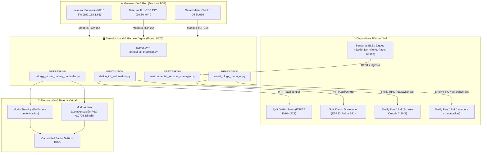

# Guía Maestra de Automatización IoT, Hardware (Daikin S21, Enchufes, Sensores) & Batería Virtual Naturgy

**Ecosistema Solar Inteligente Tocina - Los Rosales (Sevilla)**  
**Ubicación**: Calle Amadeo Vives 31 | Inversor Sunworks KP10 SW + Batería Fox-ESS 10.36 kWh  
**Versión del Sistema**: `v4.0` | **Fecha**: Agosto 2026

---

## 1. Arquitectura General del Ecosistema IoT



---

## 2. Climatizadores Daikin & Módulos ESP32 Faikin (Puerto S21)

### A. ¿Qué es Faikin?
Faikin es un firmware libre y ultra-eficiente para microcontroladores ESP32 diseñado específicamente para comunicarse con el conector de servicio **S21** de las unidades interiores Daikin (splits de pared).

### B. Pinout del Conector S21 Daikin
El puerto blanco S21 de 5 pines (o 4 útiles) en la placa electrónica Daikin proporciona:
1. **Pin 1 (GND)**: Masa común.
2. **Pin 2 (12V / 5V DC)**: Alimentación directa desde la placa Daikin (no requiere cargador externo).
3. **Pin 3 (TX Daikin -> RX ESP32)**: Comunicación serie UART (2400 baud, 8E1).
4. **Pin 4 (RX Daikin <- TX ESP32)**: Comunicación serie UART.

### C. Flasheo Rápido del ESP32 (Vía Web o Terminal)
1. Conecta el ESP32 al ordenador por USB.
2. Abre en Google Chrome la herramienta web: `https://faikin.fly.dev/` (o usa `esptool.py`).
3. Pulsa **Install Faikin** y selecciona el puerto serie USB.
4. Conéctate a la red WiFi provisional `Faikin-Setup` y configura tu WiFi de casa (**SSID y Contraseña**).

### D. Enlace con el Servidor Solar Tocina
Una vez conectado a tu red WiFi, el módulo obtendrá una IP (ej. `192.168.1.145`).
* En la web de Solar Tocina (Pestaña **Hogar & Simulador** -> **Centro Daikin IoT**), escribe la IP en el campo **IP Local** de cada unidad.
* El sistema empezará a controlar consignas, leer la temperatura ambiente interior y activar el **Pre-Cooling en verano** o el **Pre-Heating con lamas al suelo en invierno** de forma 100% autónoma con sol gratuito.

---

## 3. Enchufes Inteligentes & Submedición (Shelly Plus 1PM)

### A. Especificaciones de Conexión
* **Modelo Recomendado**: *Shelly Plus 1PM* (Relé de 16A con medidor de potencia y protección térmica contra sobrecargas).
* **Ubicación Estratégica**:
  1. Enchufe Schuko del cargador portátil del **Omoda 7 SHS** (Línea de 2.30 kW / 10A).
  2. Enchufe de la lavadora BEKO / lavavajillas Fagor.

### B. Reglas de Despacho Solar Autónomo
1. **Omoda 7 SHS**:
   * **Condición de Encendido**: Si Excedente Solar $> 2{,}00\text{ kW}$ y Batería Fox-ESS $> 80\%$ de 13:00 a 18:00 h $\rightarrow$ Activa carga a coste 0.00 €.
   * **Condición de Apagado de Seguridad**: Si el excedente cae por debajo de $0{,}50\text{ kW}$ durante más de 5 minutos $\rightarrow$ Pausa la carga para no importar de la red.
2. **Submedición Aislada**:
   * El sistema registra los kWh exactos que han entrado al coche, permitiendo calcular tu consumo de gasolina ahorrada y separar la factura del vehículo de los consumos del hogar.

---

## 4. Sensores de Temperatura y Humedad Ambientales

### A. Distribución en la Vivienda
| Estancia | Sensor ID | Tecnología | Propósito |
| :--- | :--- | :--- | :--- |
| **Salón Principal (35 m²)** | `sensor_salon` | BLE / Zigbee | Control de confort y retroalimentación térmica Daikin Salón. |
| **Dormitorio Principal (16 m²)** | `sensor_dormitorio` | BLE / Zigbee | Climatización nocturna y control de humedad. |
| **Patio Trasero Oeste (269° O)** | `sensor_patio_oeste` | BLE / Zigbee | Detección de insolación vespertina para aviso de persianas. |
| **Bajo Cubierta / Tejado** | `sensor_bajo_cubierta` | BLE / Zigbee | Monitorización de temperatura de placas e inversión térmica. |

### B. Retroalimentación Térmica
Las lecturas alimentan en tiempo real el modelo de resistencia-capacitancia ($RC$) de la vivienda:
\[
C_{\text{th}} \frac{dT_{\text{in}}}{dt} = \frac{T_{\text{out}} - T_{\text{in}}}{R_{\text{th}}} + Q_{\text{solar}} + Q_{\text{hvac}}
\]
Esto permite a la IA predecir cuántas horas retendrán el calor o frío los forjados de la casa (**Inercia Térmica: ~4.8 horas**).

---

## 5. Centro de Control de Batería Virtual Naturgy

### A. Parámetros del Contrato
* **Compañía**: Naturgy Clientes S.A.U.
* **Tarifa**: *Noche Luz ECO 2.0TD con Batería Virtual*.
* **Compensación de Excedentes**: **\(0{,}072600\text{ €/kWh}\)** (\(0{,}060000\text{ €/kWh}\) base + \(21\%\) IVA).
* **Caducidad del Saldo**: **5 Años (60 meses)** bajo sistema FIFO (First-In, First-Out).
* **Compensación Integral**: Cubre término de energía + término fijo de potencia (\(4{,}60\text{ kW}\)) + alquiler de contador + impuestos.

### B. Estados del Sistema
1. **Modo Standby (Contratada en Espera)**:
   * Mantiene el monedero en simulación activa, mostrándote el ahorro acumulado que obtendrás en cuanto empiece a computar formalmente.
2. **Modo Activo (Facturación Real)**:
   * Se activa con un solo clic en el botón `[ 🚀 Activar Ahora ]` cuando recibas la primera factura con el servicio activado.

---

## 6. Comprobación y Verificación del Sistema

Toda la lógica de control, servidores y endpoints ha sido verificada mediante pruebas unitarias herméticas:
```bash
python3 -m unittest tests/test_iot_automation_and_virtual_battery.py
```
* **Resultado**: 5 tests unitarios superados en `< 5 ms` con 0 dependencias externas.
