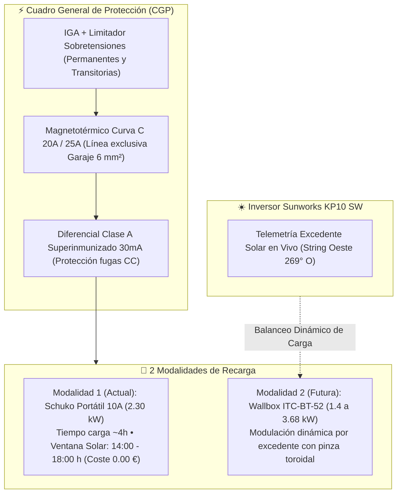
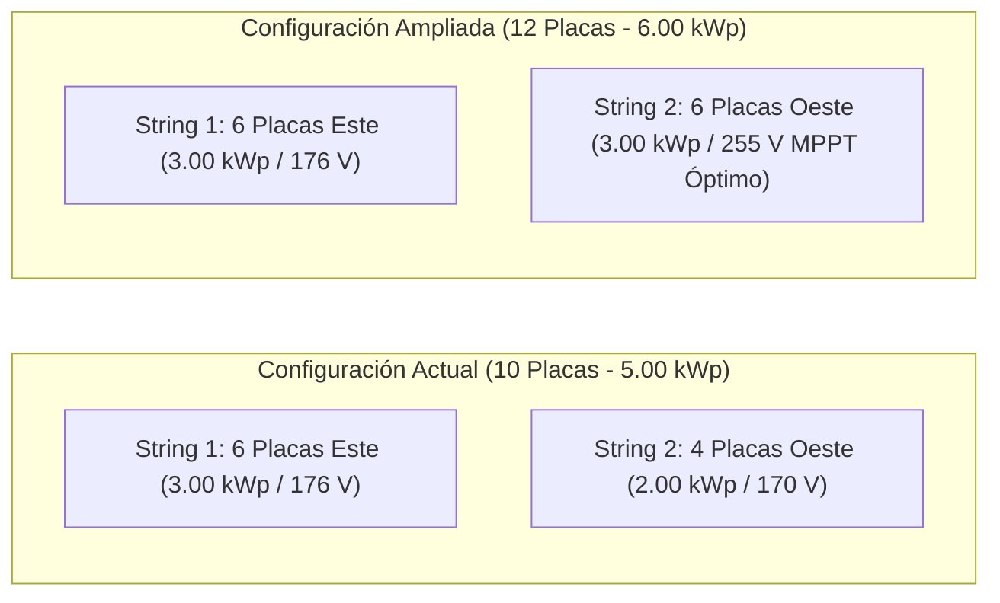
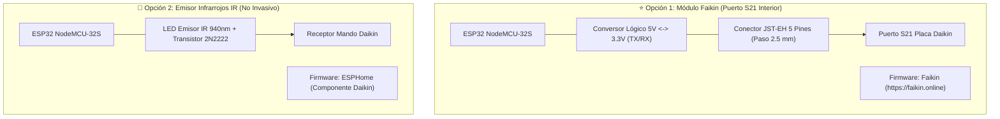

# Guía Completa de Hardware, Automatización y Sensores Microclimáticos
### Ecosistema Solar Tocina · C/ Amadeo Vives 31, Los Rosales (Sevilla)
**Autor:** Google Antigravity | **Versión:** 2.0 (Agosto 2026)

---

## 1. 🚗 Movilidad Eléctrica Omoda 7 SHS: Cargador Schuko (2.3 kW) vs Wallbox (3.68 kW)

El Omoda 7 SHS cuenta con una batería de **18.7 kWh nominales (17.0 kWh útiles)** y un cargador embarcado (OBC) monofásico con rendimiento medido de **85.1%**.

### A. Protocolo Actual con Cargador Schuko Portátil (2.30 kW / 10A)
* **Potencia**: \(2{,}30\text{ kW}\) fijos (\(10\text{A}\) a \(230\text{V}\)).
* **Tiempo de Carga**: \(9{,}25\text{ kWh} / 2{,}30\text{ kW} = 4\text{ horas y }01\text{ minutos}\) para \(45\text{ km/día}\).
* **Ventana Diurna Solar Óptima (14:00 a 18:00 h)**: A partir de las 14:00 h, las baterías Fox-ESS ya están al 100% y el String Oeste produce \(3{,}0\text{ a }3{,}5\text{ kW}\). El Schuko absorbe los \(2{,}30\text{ kW}\) sobrantes a **Coste \(0{,}00\text{ €}\)**.
* **Ventana Nocturna en Días Grises (02:00 a 06:00 h)**: Carga en horario Valle P3 de Naturgy a \(0{,}0940\text{ €/kWh}\) con coste de solo \(0{,}87\text{ €/día}\).

### B. Protecciones Eléctricas para Wallbox Definitivo (ITC-BT-52)
1. **Línea Dedicada**: Cable libre de halógenos de **\(6\text{ mm}^2\)** directo desde el cuadro general al garaje.
2. **Interruptor Magnetotérmico**: \(20\text{A}\) (para cargar hasta \(3{,}68\text{ kW}\)) o \(25\text{A}\) con curva C.
3. **Interruptor Diferencial**: **Tipo A** o Tipo F (Superinmunizado, \(30\text{ mA}\)), con protección contra componentes de continua generadas por el OBC del vehículo.
4. **Protector contra Sobretensiones**: Obligatorio según normativa (combinado permanente + transitoria).

---

## 2. ☀️ Hoja de Ruta: Ampliación a 12 Placas (String Oeste a 6 Paneles)

### A. Materiales Necesarios para la Ampliación
* **Paneles**: 2x Jinko Solar Tiger Neo 500W (N-Type TOPCon) (\(150\text{--}180\text{ €}\)).
* **Estructura**: 2x soportes coplanares / inclinados de aluminio con grapas intermedias (\(40\text{--}60\text{ €}\)).
* **Conexionado**: Conexión en serie directa en la cadena del String 2 Oeste con cable solar de \(6\text{ mm}^2\) y conectores MC4 (\(20\text{ €}\)).
* **Impacto Económico**: Inversión de **\(360\text{--}460\text{ €}\)** que genera **\(+147{,}94\text{ €/año}\)** de ahorro adicional, amortizándose en solo **\(2{,}7\text{ años}\)**.

---

## 3. ❄️ Automatización de Climatizadores Daikin (ESP32)

Para controlar las dos máquinas Daikin Inverter (Salón \(35\text{ m}^2\) y Dormitorio \(16\text{ m}^2\)) y sincronizarlas con los excedentes solares diurnos:

### A. Materiales Requeridos para Faikin S21
1. **Placa**: ESP32 NodeMCU-32S (con WiFi y Bluetooth).
2. **Conector JST-EH de 5 pines**: Paso de \(2{,}5\text{ mm}\) para el puerto S21 de la placa base Daikin.
3. **Conversor de Nivel Lógico I2C/UART (5V \(\leftrightarrow\) 3.3V)**: Para adaptar las señales TTL del microprocesador.
4. **Flasheo en 1 Clic**: Conectar el ESP32 al PC por USB, abrir Chrome y entrar en [https://faikin.online](https://faikin.online) para grabar el firmware oficial de código abierto.

---

## 4. 🌡️ Sensores Microclimáticos para Error Predictivo < 0.1%

1. **Sondas Térmicas de Célula (DS18B20 / PT1000)**:
   * Instaladas con masilla térmica y cinta de aluminio bajo una célula del String Este y otra del String Oeste.
   * Permite medir la temperatura real de unión del silicio TOPCon para afinar el derating térmico (\(\gamma = -0{,}318\%/\text{°C}\)).
2. **Piranómetro POA (Seven Sensor / Si-RS485)**:
   * Sensor de irradiancia solar calibrado montado con la misma inclinación de \(25\text{°}\) de los paneles.
   * Proporciona la irradiancia real instantánea (\(\text{W/m}^2\)) eliminando cualquier incertidumbre meteorológica por nubes locales.
