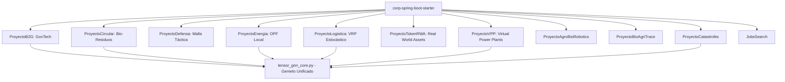

# ESPECIFICACIÓN ARQUITECTÓNICA Y DE DOMINIO DDD PURO: VERTICALES DEL ECOSISTEMA (2026-2031)
**Nivel de Rigor:** CMU / MIT / Stanford Architecture Benchmark  
**Stack de Referencia:** Java 25 (LTS), Spring Boot 4.0, Virtual Threads (Project Loom), Hexagonal Architecture, Zero-Mockito TDD.

---

## 1. Matriz de Bounded Contexts y Modelos de Dominio



---

## 2. Especificación Detallada por Proyecto Vertical

### 1. `ProyectoB2G` (GovTech & Licitaciones Públicas)
* **Bounded Context:** `com.corp.ecosystem.b2g.domain`
* **Agregado Raíz:** `PublicTender` (Licitación Pública inmutable)
* **Entidades & Value Objects (Java 25 Records):**
  ```java
  public record TenderId(String value) {}
  public record FiscalBudget(BigDecimal amount, Currency currency) {}
  public record ComplianceCertificate(String hashSha256, Instant issuedAt, String authority) {}
  
  public record PublicTender(
      TenderId id,
      String contractingAuthority,
      FiscalBudget budget,
      TenderStatus status,
      List<ComplianceCertificate> certificates,
      Instant submissionDeadline
  ) {
      public boolean isEligibleForBidding(Instant now) {
          return status == TenderStatus.PUBLISHED && now.isBefore(submissionDeadline);
      }
  }
  ```
* **Puertos Hexagonales:**
  - `TenderRepositoryPort`: Persistencia soberana con RLS.
  - `BlockchainAuditPort`: Registro inmutable de ofertas en `core-govtech-ledger`.

---

### 2. `ProyectoCircular` (Economía Circular y Trazabilidad Bio-Residuos)
* **Bounded Context:** `com.corp.ecosystem.circular.domain`
* **Agregado Raíz:** `BiowasteBatch` (Lote de Bio-Residuo)
* **Entidades & Value Objects:**
  ```java
  public record BatchId(String value) {}
  public record ChemicalComposition(double organicCarbonPct, double nitrogenPct, double moisturePct) {}
  public record ValorizationCertificate(String method, double energyYieldKwh, double co2AvoidedKg) {}
  
  public record BiowasteBatch(
      BatchId id,
      String originTenantId,
      double weightKg,
      ChemicalComposition composition,
      BatchState state,
      Optional<ValorizationCertificate> certificate
  ) {
      public BiowasteBatch valorize(ValorizationCertificate cert) {
          if (this.state != BatchState.COLLECTED) {
              throw new IllegalStateException("Lote no disponible para valorización");
          }
          return new BiowasteBatch(id, originTenantId, weightKg, composition, BatchState.VALORIZED, Optional.of(cert));
      }
  }
  ```

---

### 3. `ProyectoDefensa` (Sistemas Duales y Mallas Tácticas Air-Gapped)
* **Bounded Context:** `com.corp.ecosystem.defensa.domain`
* **Agregado Raíz:** `TacticalNode` (Nodo de Comunicaciones en Malla)
* **Invariantes:** Cero llamadas a servicios de red externos (Air-Gapped estricto), comunicación local mediante `core-interstellar-mesh` y cifrado Post-Quantum.
* **Modelo:**
  ```java
  public record NodeId(String value) {}
  public record MeshCoordinates(double lat, double lon, double altitudeMeters, long h3Index) {}
  public record SecurityKeyEnvelope(byte[] ephemeralKyberKey, Instant expiration) {}
  
  public record TacticalNode(
      NodeId id,
      MeshCoordinates coordinates,
      NodeHealth health,
      SecurityKeyEnvelope keyEnvelope
  ) {
      public boolean isValidForRelay(Instant now) {
          return health == NodeHealth.OPTIMAL && now.isBefore(keyEnvelope.expiration());
      }
  }
  ```

---

### 4. `ProyectoEnergia` (Comunidades Energéticas y OPF Linealizado)
* **Bounded Context:** `com.corp.ecosystem.energia.domain`
* **Agregado Raíz:** `EnergyCommunityGrid`
* **Modelo:**
  ```java
  public record NodeBusId(String value) {}
  public record PowerBalance(double activePowerKw, double reactivePowerKvar, double voltageMagnitudePu) {}
  
  public record EnergySubstation(
      NodeBusId busId,
      PowerBalance balance,
      double maxCapacityKw,
      double currentGenerationKw,
      double currentLoadKw
  ) {
      public double availableInjectionMarginKw() {
          return Math.max(0.0, maxCapacityKw - (currentGenerationKw - currentLoadKw));
      }
  }
  ```
* **Integración:** Inyección periódica de perturbaciones OPF a `tensor_gnn_core.py`.

---

### 5. `ProyectoLogistica` (VRP Estocástico y Despacho de Última Milla)
* **Bounded Context:** `com.corp.ecosystem.logistica.domain`
* **Agregado Raíz:** `DeliveryRoutePlan`
* **Modelo:**
  ```java
  public record RouteId(String value) {}
  public record DeliveryStop(String parcelId, long h3Location, int timeWindowStartSec, int timeWindowEndSec) {}
  
  public record DeliveryRoutePlan(
      RouteId id,
      String driverId,
      List<DeliveryStop> stops,
      double estimatedTotalDistanceMeters,
      int estimatedDurationSeconds
  ) {
      public boolean isFeasibleWithinShift(int maxShiftDurationSec) {
          return estimatedDurationSeconds <= maxShiftDurationSec;
      }
  }
  ```

---

### 6. `ProyectoTokenRWA` (Tokenización de Activos del Mundo Real)
* **Bounded Context:** `com.corp.ecosystem.tokenrwa.domain`
* **Agregado Raíz:** `RealWorldAsset`
* **Modelo:**
  ```java
  public record AssetId(String value) {}
  public record ValuationReport(BigDecimal appraisedValueUsd, Instant timestamp, String auditorSign) {}
  public record TokenFraction(long totalTokens, BigDecimal pricePerTokenUsd) {}
  
  public record RealWorldAsset(
      AssetId id,
      String legalRegistryRef,
      AssetClass assetClass,
      ValuationReport latestValuation,
      TokenFraction fractions,
      boolean isCustodied
  ) {
      public BigDecimal totalMarketCapUsd() {
          return fractions.pricePerTokenUsd().multiply(BigDecimal.valueOf(fractions.totalTokens()));
      }
  }
  ```

---

### 7. `ProyectoVPP` (Virtual Power Plants & DERs)
* **Bounded Context:** `com.corp.ecosystem.vpp.domain`
* **Agregado Raíz:** `VirtualPowerPlantCluster`
* **Modelo:**
  ```java
  public record BatteryUnit(String serial, double stateOfChargePct, double maxDischargeKw, double currentCapacityKwh) {}
  public record DispatchInstruction(String vppId, double targetPowerKw, Instant rampUpBy) {}
  
  public record VirtualPowerPlantCluster(
      String vppId,
      List<BatteryUnit> batteries,
      VppState state
  ) {
      public double aggregateInstantDischargeCapacityKw() {
          return batteries.stream()
              .filter(b -> b.stateOfChargePct() > 15.0)
              .mapToDouble(BatteryUnit::maxDischargeKw)
              .sum();
      }
  }
  ```

---

## 3. Matriz de Integración con `corp-spring-boot-starter` y Gemelo Digital

| Vertical | Dependencia Starter | Concurrencia | Enlace con Gemelo Unificado |
| :--- | :--- | :--- | :--- |
| **ProyectoB2G** | `corp-spring-boot-starter` | Loom Virtual Threads | Registro de eventos presupuestarios |
| **ProyectoCircular** | `corp-spring-boot-starter` | Loom Virtual Threads | Dinámica de masa y bio-residuos |
| **ProyectoDefensa** | `corp-spring-boot-starter` | Loom + Lock-Free Off-Heap | Malla geoespacial y simulación táctica |
| **ProyectoEnergia** | `corp-spring-boot-starter` | Loom + PubSub Invalidation | Acoplamiento OPF en tensor maestro |
| **ProyectoLogistica** | `corp-spring-boot-starter` | Loom Virtual Threads | VRP cruzado con flujo de tráfico H3 |
| **ProyectoTokenRWA** | `corp-spring-boot-starter` | Loom + Stripe Escrow | Liquidación y precios de mercado |
| **ProyectoVPP** | `corp-spring-boot-starter` | Loom Virtual Threads | Flexibilidad energética y demanda pico |

---

## 4. Estándar de Integración ETL Streaming & BigQuery Analytics por Vertical

Todos los proyectos verticales integran el estándar de **Streaming ETL** desacoplado para trasladar métricas, eventos de dominio y series temporales hacia **BigQuery** sin contaminar la capa OLTP:

1. **Ingesta Desacoplada**: Uso de `com.corp.bigdata.etl.UnifiedStreamingEtlPipeline` y `EtlEventEnvelope` con Virtual Threads.
2. **FinOps Obligatorio**: Todas las tablas analíticas en BigQuery deben declarar:
   * `PARTITION BY DATE(timestamp)` con `require_partition_filter = true`.
   * `CLUSTER BY tenant_id, [vertical_specific_dimension]`.
3. **Mapeo de Datasets y Tablas por Vertical**:
   * `ProyectoEnergia` / `ProyectoVPP` → `energy_analytics.smart_meter_readings_stream` (Cluster: `tenant_id, node_id`).
   * `ProyectoLogistica` → `logistics_analytics.fleet_dispatch_events_stream` (Cluster: `tenant_id, h3_res8`).
   * `ProyectoCircular` → `circular_analytics.waste_trace_stream` (Cluster: `tenant_id, waste_category`).
   * `ProyectoB2G` / `ProyectoTokenRWA` → `govtech_analytics.tender_ledger_stream` (Cluster: `tenant_id, tender_id`).

