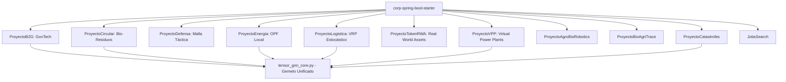

# ESPECIFICACIÓN ARQUITECTÓNICA Y DE DOMINIO DDD PURO: VERTICALES DEL ECOSISTEMA (2026-2031)
**Nivel de Rigor:** CMU / MIT / Stanford Architecture Benchmark  
**Stack de Referencia:** Java 25 (LTS), Spring Boot 4.1, Virtual Threads (Project Loom), Hexagonal Architecture, Zero-Mockito TDD.

---

## 1. Matriz de Bounded Contexts y Modelos de Dominio



---

## 2. Especificación Detallada por Proyecto Vertical

### 1. `ProyectoB2G` (GovTech & Licitaciones Públicas)
* **Bounded Context:** `com.corp.ecosystem.b2g.domain`
* **Agregado Raíz:** `PublicTender` (Licitación Pública inmutable)
* **Entidades & Value Objects (Java 25 Records):**
  ```java
  public record TenderId(String value) {}
  public record FiscalBudget(BigDecimal amount, Currency currency) {}
  public record ComplianceCertificate(String hashSha256, Instant issuedAt, String authority) {}
  
  public record PublicTender(
      TenderId id,
      String contractingAuthority,
      FiscalBudget budget,
      TenderStatus status,
      List<ComplianceCertificate> certificates,
      Instant submissionDeadline
  ) {
      public boolean isEligibleForBidding(Instant now) {
          return status == TenderStatus.PUBLISHED && now.isBefore(submissionDeadline);
      }
  }
  ```
* **Puertos Hexagonales:**
  - `TenderRepositoryPort`: Persistencia soberana con RLS.
  - `BlockchainAuditPort`: Registro inmutable de ofertas en `core-govtech-ledger`.

---

### 2. `ProyectoCircular` (Economía Circular y Trazabilidad Bio-Residuos)
* **Bounded Context:** `com.corp.ecosystem.circular.domain`
* **Agregado Raíz:** `BiowasteBatch` (Lote de Bio-Residuo)
* **Entidades & Value Objects:**
  ```java
  public record BatchId(String value) {}
  public record ChemicalComposition(double organicCarbonPct, double nitrogenPct, double moisturePct) {}
  public record ValorizationCertificate(String method, double energyYieldKwh, double co2AvoidedKg) {}
  
  public record BiowasteBatch(
      BatchId id,
      String originTenantId,
      double weightKg,
      ChemicalComposition composition,
      BatchState state,
      Optional<ValorizationCertificate> certificate
  ) {
      public BiowasteBatch valorize(ValorizationCertificate cert) {
          if (this.state != BatchState.COLLECTED) {
              throw new IllegalStateException("Lote no disponible para valorización");
          }
          return new BiowasteBatch(id, originTenantId, weightKg, composition, BatchState.VALORIZED, Optional.of(cert));
      }
  }
  ```

---

### 3. `ProyectoDefensa` (Sistemas Duales y Mallas Tácticas Air-Gapped)
* **Bounded Context:** `com.corp.ecosystem.defensa.domain`
* **Agregado Raíz:** `TacticalNode` (Nodo de Comunicaciones en Malla)
* **Invariantes:** Cero llamadas a servicios de red externos (Air-Gapped estricto), comunicación local mediante `core-interstellar-mesh` y cifrado Post-Quantum.
* **Modelo:**
  ```java
  public record NodeId(String value) {}
  public record MeshCoordinates(double lat, double lon, double altitudeMeters, long h3Index) {}
  public record SecurityKeyEnvelope(byte[] ephemeralKyberKey, Instant expiration) {}
  
  public record TacticalNode(
      NodeId id,
      MeshCoordinates coordinates,
      NodeHealth health,
      SecurityKeyEnvelope keyEnvelope
  ) {
      public boolean isValidForRelay(Instant now) {
          return health == NodeHealth.OPTIMAL && now.isBefore(keyEnvelope.expiration());
      }
  }
  ```

---

### 4. `ProyectoEnergia` (Comunidades Energéticas y OPF Linealizado)
* **Bounded Context:** `com.corp.ecosystem.energia.domain`
* **Agregado Raíz:** `EnergyCommunityGrid`
* **Modelo:**
  ```java
  public record NodeBusId(String value) {}
  public record PowerBalance(double activePowerKw, double reactivePowerKvar, double voltageMagnitudePu) {}
  
  public record EnergySubstation(
      NodeBusId busId,
      PowerBalance balance,
      double maxCapacityKw,
      double currentGenerationKw,
      double currentLoadKw
  ) {
      public double availableInjectionMarginKw() {
          return Math.max(0.0, maxCapacityKw - (currentGenerationKw - currentLoadKw));
      }
  }
  ```
* **Integración:** Inyección periódica de perturbaciones OPF a `tensor_gnn_core.py`.

---

### 5. `ProyectoLogistica` (VRP Estocástico y Despacho de Última Milla)
* **Bounded Context:** `com.corp.ecosystem.logistica.domain`
* **Agregado Raíz:** `DeliveryRoutePlan`
* **Modelo:**
  ```java
  public record RouteId(String value) {}
  public record DeliveryStop(String parcelId, long h3Location, int timeWindowStartSec, int timeWindowEndSec) {}
  
  public record DeliveryRoutePlan(
      RouteId id,
      String driverId,
      List<DeliveryStop> stops,
      double estimatedTotalDistanceMeters,
      int estimatedDurationSeconds
  ) {
      public boolean isFeasibleWithinShift(int maxShiftDurationSec) {
          return estimatedDurationSeconds <= maxShiftDurationSec;
      }
  }
  ```

---

### 6. `ProyectoTokenRWA` (Tokenización de Activos del Mundo Real)
* **Bounded Context:** `com.corp.ecosystem.tokenrwa.domain`
* **Agregado Raíz:** `RealWorldAsset`
* **Modelo:**
  ```java
  public record AssetId(String value) {}
  public record ValuationReport(BigDecimal appraisedValueUsd, Instant timestamp, String auditorSign) {}
  public record TokenFraction(long totalTokens, BigDecimal pricePerTokenUsd) {}
  
  public record RealWorldAsset(
      AssetId id,
      String legalRegistryRef,
      AssetClass assetClass,
      ValuationReport latestValuation,
      TokenFraction fractions,
      boolean isCustodied
  ) {
      public BigDecimal totalMarketCapUsd() {
          return fractions.pricePerTokenUsd().multiply(BigDecimal.valueOf(fractions.totalTokens()));
      }
  }
  ```

---

### 7. `ProyectoVPP` (Virtual Power Plants & DERs)
* **Bounded Context:** `com.corp.ecosystem.vpp.domain`
* **Agregado Raíz:** `VirtualPowerPlantCluster`
* **Modelo:**
  ```java
  public record BatteryUnit(String serial, double stateOfChargePct, double maxDischargeKw, double currentCapacityKwh) {}
  public record DispatchInstruction(String vppId, double targetPowerKw, Instant rampUpBy) {}
  
  public record VirtualPowerPlantCluster(
      String vppId,
      List<BatteryUnit> batteries,
      VppState state
  ) {
      public double aggregateInstantDischargeCapacityKw() {
          return batteries.stream()
              .filter(b -> b.stateOfChargePct() > 15.0)
              .mapToDouble(BatteryUnit::maxDischargeKw)
              .sum();
      }
  }
  ```

---

### 8. `ProyectoCarbonLedger` (Pasaporte Digital de Producto DPP & Carbon MRV ISO 14064)
* **Bounded Context:** `com.corp.ecosystem.carbonledger.domain`
* **Agregado Raíz:** `DigitalProductPassport`
* **Modelo:**
  ```java
  public record PassportId(String value) {}
  public record CarbonFootprint(double rawMaterialEmissionKgCo2, double manufacturingEmissionKgCo2, double logisticsEmissionKgCo2, double co2AvoidedKg, double totalNetKgCo2PerUnit) {}
  public record ZkProofSeal(String merkleRootHash, String snarkProofHash, String verifierAuthority) {}
  public record DigitalProductPassport(PassportId id, String tenantId, String batchIdentifier, ProductCategory category, CarbonFootprint footprint, CircularMetrics circularity, ZkProofSeal proofSeal, PassportState state, Instant issuedAt) {}
  ```

---

### 9. `ProyectoFleetColdChain` (Logística de Frío & VRPTW Térmico)
* **Bounded Context:** `com.corp.ecosystem.coldchain.domain`
* **Agregado Raíz:** `ColdChainFleetPlan`
* **Modelo:**
  ```java
  public record RoutePlanId(String value) {}
  public record ThermalReading(double temperatureCelsius, double humidityPct, long timestampEpochMs, boolean isExcursion) {}
  public record ColdChainFleetPlan(RoutePlanId id, String tenantId, String vehicleId, TemperatureCategory requiredCategory, ThermalRange thermalRange, List<DeliveryStop> stops, List<ThermalReading> telemetryLog, PlanState state, Instant departureTime) {}
  ```

---

### 10. `ProyectoAgroEnergyVPP` (Comunidades Energéticas Rurales & Arbitraje VPP)
* **Bounded Context:** `com.corp.ecosystem.agroenergy.domain`
* **Agregado Raíz:** `AgroEnergyCommunity`
* **Modelo:**
  ```java
  public record CommunityId(String value) {}
  public record SolarParkSpecs(double peakCapacityKw, double currentGenerationKw, double efficiencyFactor) {}
  public record BatteryStorageSpecs(double totalCapacityKwh, double stateOfChargePct, double maxChargeDischargeKw) {}
  public record AgroEnergyCommunity(CommunityId id, String tenantId, String communityName, SolarParkSpecs solarPark, BatteryStorageSpecs batteryStorage, List<PumpStationLoad> pumpLoads, CommunityEnergyState state, Instant lastDispatchedAt) {}
  ```

---

### 11. `ProyectoGovProcureMatch` (Radar de Licitaciones B2G & Scoring Semántico)
* **Bounded Context:** `com.corp.ecosystem.govmatch.domain`
* **Agregado Raíz:** `TenderOpportunity`
* **Modelo:**
  ```java
  public record OpportunityId(String value) {}
  public record SolvencyCriteria(BigDecimal minAnnualRevenueEur, int minYearsExperience, List<String> requiredIsoCertifications, double maxSubcontractingAllowedPct) {}
  public record TenderOpportunity(OpportunityId id, String tenderRefCode, String contractingAuthority, BigDecimal budgetEur, List<String> cpvCodes, SolvencyCriteria requiredSolvency, OpportunityState state, Instant submissionDeadline) {}
  ```

---

### 12. `ProyectoPresaTwinSCADA` (Gemelo Digital de Seguridad de Presas & EnKF)
* **Bounded Context:** `com.corp.ecosystem.presatwin.domain`
* **Agregado Raíz:** `DamHydroTwinNode`
* **Modelo:**
  ```java
  public record DamId(String value) {}
  public record StructuralHealth(double porePressureBar, double seepageRateLitersPerSec, double crestDisplacementMm, boolean isPiezometerHealthy) {}
  public record DamHydroTwinNode(DamId id, String tenantId, String damName, ReservoirCapacity capacity, StructuralHealth structuralHealth, CurrentHydroState currentState, List<HydroObservation> telemetryHistory, DamSafetyStatus safetyStatus, Instant lastAssimilatedAt) {}
  ```

---

### 13. `ProyectoSmartDestinationDTI` (Gemelo Digital DTI & Dispersión de Flujos H3 UNE 178)
* **Bounded Context:** `com.corp.ecosystem.dti.domain`
* **Agregado Raíz:** `SmartDestinationZone`
* **Modelo:**
  ```java
  public record ZoneId(String value) {}
  public record CarryingCapacityLimits(int maxSimultaneousVisitors, double maxPcuPerKm2, double maxInstantNoiseDb, double criticalOccupancyRatio) {}
  public record SmartDestinationZone(ZoneId id, String tenantId, String destinationName, long h3IndexRes8, ZoneType type, CarryingCapacityLimits limits, CurrentCrowdState currentState, List<DispersionRoute> alternativeRoutes, ZoneAlertLevel alertLevel, Instant lastAssimilatedAt) {}
  ```

---

### 14. `ProyectoHotelTwinRevPAR` (Total RevPAR & Eficiencia Energética Hotelera MPC)
* **Bounded Context:** `com.corp.ecosystem.hotelrevpar.domain`
* **Agregado Raíz:** `HotelRoomTwinCluster`
* **Modelo:**
  ```java
  public record HotelId(String value) {}
  public record RoomInventoryState(int occupiedRooms, int preCheckinAssignedRooms, int availableRooms, double averageDailyRateEur) {}
  public record HotelRoomTwinCluster(HotelId id, String tenantId, String hotelName, int totalRooms, RoomInventoryState inventoryState, EnergyThermalProfile thermalProfile, DynamicPricingStrategy pricingStrategy, Instant lastOptimizedAt) {}
  ```

---

### 15. `ProyectoEcoTourismPassport` (Pasaporte Verde & Ecotasa Dinámica ZK)
* **Bounded Context:** `com.corp.ecosystem.ecopassport.domain`
* **Agregado Raíz:** `EcoTourismPassport`
* **Modelo:**
  ```java
  public record PassportId(String value) {}
  public record TripFootprint(double transportEmissionKgCo2, double accommodationEmissionKgCo2, double activitiesEmissionKgCo2, double totalKgCo2) {}
  public record EcoTourismPassport(PassportId id, String tenantId, String bookingReference, TravelerProfile traveler, TripFootprint footprint, EcoTaxAssessment ecoTax, ZkEcoProofSeal proofSeal, PassportState state, Instant issuedAt) {}
  ```

---

### 16. `ProyectoSeamlessIntermodalHub` (Transfers Masivos de Cruceros/Vuelos & Despacho H3)
* **Bounded Context:** `com.corp.ecosystem.intermodal.domain`
* **Agregado Raíz:** `IntermodalTransferHub`
* **Modelo:**
  ```java
  public record HubId(String value) {}
  public record FleetAvailability(int availableMinibuses16pax, int availableVans8pax, int availableTaxis4pax) {}
  public record IntermodalTransferHub(HubId id, String tenantId, String terminalName, HubType type, List<ArrivalEvent> scheduledArrivals, FleetAvailability fleet, List<TransferDispatchGroup> activeDispatches, Instant lastUpdated) {}
  ```

---

### 17. `ProyectoRegenerativeExperience` (Turismo Rural & Marketplace Escrow Stripe)
* **Bounded Context:** `com.corp.ecosystem.regenerative.domain`
* **Agregado Raíz:** `TouristExperienceBooking`
* **Modelo:**
  ```java
  public record BookingId(String value) {}
  public record EscrowFinancials(BigDecimal totalGrossEur, BigDecimal platformFeeEur, BigDecimal netHostPayoutEur, boolean isFundsLockedInEscrow) {}
  public record TouristExperienceBooking(BookingId id, String tenantId, String hostStripeAccountId, String travelerId, ExperienceDetails details, EscrowFinancials financials, GeofenceVerification verification, BookingState state, Instant createdAt) {}
  ```

### 18. `ProyectoPharmaColdChain` (Logística Farmacéutica GAMP 5 GDP / GLP-1 & Terapias Génicas)
* **Bounded Context:** `com.corp.ecosystem.pharmacold.domain`
* **Agregado Raíz:** `PharmaShipmentBatch`
* **Modelo:**
  ```java
  public record BatchId(String value) {}
  public record ThermalEnvelope(double minTempCelsius, double maxTempCelsius, double maxAllowedPotencyLossPct, double activationEnergyKjMol) {}
  public record ThermalTelemetryReading(double temperatureCelsius, double humidityPct, long timestampEpochMs, boolean isTemperatureExcursion) {}
  public record PharmaShipmentBatch(BatchId id, String tenantId, String drugName, DrugCategory category, ThermalEnvelope envelope, double currentPotencyLossPct, List<ThermalTelemetryReading> readings, BatchReleaseStatus releaseStatus, Instant dispatchedAt) {}
  ```

---

### 19. `ProyectoCriticalMineralsMRV` (Pasaporte Digital de Baterías & EU CRMA Mineral Traceability)
* **Bounded Context:** `com.corp.ecosystem.minerals.domain`
* **Agregado Raíz:** `BatteryMineralPassport`
* **Modelo:**
  ```java
  public record PassportId(String value) {}
  public record MineralComposition(double lithiumKg, double cobaltKg, double nickelKg, double recycledLithiumPct, double recycledCobaltPct, double recycledNickelPct) {}
  public record RefiningCarbonFootprint(double miningKgCo2PerKg, double refiningKgCo2PerKg, double totalKgCo2PerKwhCapacity) {}
  public record ZkMineralProofSeal(String proofHash, String ledgerCommitment, boolean isVerified) {}
  public record BatteryMineralPassport(PassportId id, String tenantId, String batterySerialNumber, MineralComposition composition, RefiningCarbonFootprint carbonFootprint, ZkMineralProofSeal proofSeal, PassportStatus status, Instant issuedAt) {}
  ```

---

### 20. `ProyectoEmergencyGeoGrid` (Protección Civil & Gemelo Digital de Incendios H3 Rothermel)
* **Bounded Context:** `com.corp.ecosystem.emergency.domain`
* **Agregado Raíz:** `EmergencyPerimeterTwin`
* **Modelo:**
  ```java
  public record EmergencyId(String value) {}
  public record MeteorologicalVector(double windSpeedKmH, double windDirectionDegrees, double ambientTemperatureCelsius, double relativeHumidityPct) {}
  public record EvacuationAssessment(int estimatedAffectedPopulation, List<Long> recommendedEvacuationH3CellsRes8, int deployedFirefightingUnits, boolean isAirSupportRequested) {}
  public record EmergencyPerimeterTwin(EmergencyId id, String tenantId, EmergencyType type, List<Long> activeH3CellsRes8, MeteorologicalVector weather, EvacuationAssessment evacuation, EmergencyLevel level, Instant lastSpreadCalculationAt) {}
  ```

---

### 21. `ProyectoZeroTrustOTMesh` (Ciberseguridad OT & Detección de Discrepancias Físicas SCADA)
* **Bounded Context:** `com.corp.ecosystem.zerotrustot.domain`
* **Agregado Raíz:** `ScadaNodeSecurityTwin`
* **Modelo:**
  ```java
  public record NodeSecurityId(String value) {}
  public record PhysicalThresholds(double maxPressureBar, double maxFlowRateM3s, double maxValveActuationSpeedMmSec) {}
  public record LastCommandAudit(String commandName, double targetSetpoint, boolean isPhysicallyFeasible, String anomalyReason) {}
  public record ScadaNodeSecurityTwin(NodeSecurityId id, String tenantId, String rtuModbusAddress, PhysicalThresholds thresholds, LastCommandAudit lastCommand, SecurityDefenseStatus defenseStatus, Instant lastVerifiedAt) {}
  ```

---

### 22. `ProyectoGreenHydrogenDesal` (Hidrógeno Verde & Desalación con MPC)
* **Bounded Context:** `com.corp.ecosystem.hydrogen.domain`
* **Agregado Raíz:** `HybridDesalHydrogenCluster`
* **Modelo:**
  ```java
  public record PlantId(String value) {}
  public record PlantCapacities(double electrolyzerMaxMw, double desalMaxM3Day, double solarPvInstalledMw, double windInstalledMw) {}
  public record CurrentOperatingState(double availableRenewablePowerMw, double spotElectricityPriceEurMwh, double currentHydrogenKgHour, double currentDesalWaterM3Hour) {}
  public record MpcDispatchSetpoint(double allocatedElectrolyzerMw, double allocatedDesalMw, double hydrogenProductionKgHour, double desalWaterProductionM3Hour, double estimatedHourlyProfitEur) {}
  public record HybridDesalHydrogenCluster(PlantId id, String tenantId, PlantCapacities capacities, CurrentOperatingState state, MpcDispatchSetpoint currentSetpoint, Instant lastOptimizedAt) {}
  ```

---

## 3. Matriz de Integración con `corp-spring-boot-starter` y Gemelo Digital

| Vertical | Dependencia Starter | Concurrencia | Enlace con Gemelo Unificado |
| :--- | :--- | :--- | :--- |
| **ProyectoB2G** | `corp-spring-boot-starter` | Loom Virtual Threads | Registro de eventos presupuestarios |
| **ProyectoCircular** | `corp-spring-boot-starter` | Loom Virtual Threads | Dinámica de masa y bio-residuos |
| **ProyectoDefensa** | `corp-spring-boot-starter` | Loom + Lock-Free Off-Heap | Malla geoespacial y simulación táctica |
| **ProyectoEnergia** | `corp-spring-boot-starter` | Loom + PubSub Invalidation | Acoplamiento OPF en tensor maestro |
| **ProyectoLogistica** | `corp-spring-boot-starter` | Loom Virtual Threads | VRP cruzado con flujo de tráfico H3 |
| **ProyectoTokenRWA** | `corp-spring-boot-starter` | Loom + Stripe Escrow | Liquidación y precios de mercado |
| **ProyectoVPP** | `corp-spring-boot-starter` | Loom Virtual Threads | Flexibilidad energética y demanda pico |
| **ProyectoCarbonLedger** | `corp-spring-boot-starter` | Loom + ZK-Rollup | Huella de carbono y ciclo de vida LCA |
| **ProyectoFleetColdChain** | `corp-spring-boot-starter` | Loom + Edge Outbox | Tracking térmico H3 en tiempo real |
| **ProyectoAgroEnergyVPP** | `corp-spring-boot-starter` | Loom + MPC Optimizer | Arbitraje solar y bombeo de regadío |
| **ProyectoGovProcureMatch**| `corp-spring-boot-starter` | Loom + RAG Vector | Scoring semántico de solvencia B2G |
| **ProyectoPresaTwinSCADA** | `corp-spring-boot-starter` | Loom + EnKF Twin | Asimilación hidrodinámica Saint-Venant |
| **ProyectoSmartDestinationDTI**| `corp-spring-boot-starter`| Loom + EnKF Twin | Capacidad de carga y dispersión H3 |
| **ProyectoHotelTwinRevPAR** | `corp-spring-boot-starter` | Loom + MPC Optimizer | Confort térmico y Dynamic Pricing |
| **ProyectoEcoTourismPassport**| `corp-spring-boot-starter`| Loom + ZK-Rollup | Ecotasas y trazabilidad verde |
| **ProyectoSeamlessIntermodal**| `corp-spring-boot-starter`| Loom + OSRM Hub | Despacho de transfer y pooling H3 |
| **ProyectoRegenerativeExperience**| `corp-spring-boot-starter`| Loom + Stripe Escrow | Validación geovalla H3 y custodia |
| **ProyectoPharmaColdChain** | `corp-spring-boot-starter` | Loom + Arrhenius Kinetics | Degradación cinética farmacéutica |
| **ProyectoCriticalMineralsMRV** | `corp-spring-boot-starter` | Loom + ZK Proof Seal | Pasaporte y circularidad CRMA |
| **ProyectoEmergencyGeoGrid** | `corp-spring-boot-starter` | Loom + Rothermel H3 | Propagación de incendios y rescate |
| **ProyectoZeroTrustOTMesh** | `corp-spring-boot-starter` | Loom + SCADA Defense | Detección de discrepancias físicas |
| **ProyectoGreenHydrogenDesal** | `corp-spring-boot-starter` | Loom + MPC Optimizer | Despacho híbrido \(H_2\) / desalación |
| **ProyectoPortTwinAutonomous** | `corp-spring-boot-starter` | Loom + Berth Allocation | Asignación de atraque y grúas STS |
| **ProyectoDroneAirspaceUSpace** | `corp-spring-boot-starter` | Loom + 3D H3 Deconflict | Desconflicción de corredores aéreos |
| **ProyectoSubSurfaceGeoTwin** | `corp-spring-boot-starter` | Loom + EnKF Geotechnics | Estabilidad de túneles y convergencia |
| **ProyectoCircularTextileDPP** | `corp-spring-boot-starter` | Loom + ZK ESPR Seal | Pasaporte digital textil y fibras |
| **ProyectoSoilBioCarbonTwin** | `corp-spring-boot-starter` | Loom + Soil Metagenomics | Secuestro SOC y créditos Verra VM0042 |
| **ProyectoIndustrialMicrogridMPC** | `corp-spring-boot-starter` | Loom + Fast Demand Response| Despacho milisegundo y soporte red |
| **ProyectoClinicalTrialsZK** | `corp-spring-boot-starter` | Loom + SNARK Matching | Cohort matching ZK sin PII médica |
| **ProyectoSmartStreetLightingV2G** | `corp-spring-boot-starter` | Loom + Vision Edge + V2G | Alumbrado adaptativo y recarga VE |
| **ProyectoTaxComplianceLedger** | `corp-spring-boot-starter` | Loom + Graph Fraud Defense| Liquidación ViDA y fraude carrusel |
| **ProyectoQuantumResistantRWA** | `corp-spring-boot-starter` | Loom + NIST ML-KEM/Dilithium| Tokenización de infraestructuras RWA |
| **ProyectoGlobalCruiseMRV** | `corp-spring-boot-starter` | Loom + FuelEU Maritime | Descarbonización de flotas de cruceros |
| **ProyectoAirportTouristIntermodal** | `corp-spring-boot-starter` | Loom + OSRM MCT Check | Pasajeros y transfer avión-tren alta velocidad |
| **ProyectoMiceConferenceTwin** | `corp-spring-boot-starter` | Loom + Graph Analytics | Inteligencia de congresos y ferias MICE |
| **ProyectoSegitturDtiStandard** | `corp-spring-boot-starter` | Loom + UNE 178501 DTI | Gobernanza y sostenibilidad DTI Segittur |
| **ProyectoDiputacionTurismoRural** | `corp-spring-boot-starter`| Loom + Reto Demográfico | Casas rurales y dinamización provincial |
| **ProyectoCaminoSantiagoXacobeo** | `corp-spring-boot-starter` | Loom + ZK Compostela | Credencial digital y albergues Xacobeo |
| **ProyectoPlayasInteligentesCostas** | `corp-spring-boot-starter`| Loom + Vision Edge + Calidad| Aforo de playas y calidad de aguas |
| **ProyectoRedParadoresTwin** | `corp-spring-boot-starter` | Loom + Heritage Bioclimatic | Eficiencia bioclimática en Paradores históricos |
| **ProyectoParquesNacionalesNatura2000** | `corp-spring-boot-starter`| Loom + Eco Carrying Capacity| Capacidad de carga en Red Natura 2000 |
| **ProyectoEcotasaSoberanaTax** | `corp-spring-boot-starter` | Loom + ZK Rollup Tax | Liquidación de ecotasa turística autonómica |
| **ProyectoEnoturismoRutasVino** | `corp-spring-boot-starter` | Loom + Cellar Capacity | Rutas del vino y pasaporte digital enoturístico |
| **ProyectoCascoHistoricoCrowd** | `corp-spring-boot-starter` | Loom + UNESCO Crowd Dispersion | Capacidad de carga y acústica en cascos históricos |
| **ProyectoFiestasInteresTuristico** | `corp-spring-boot-starter` | Loom + Festival Safety Level | Aforos y seguridad en fiestas de interés turístico |
| **ProyectoHeritageDigitalTwin3D** | `corp-spring-boot-starter` | Loom + LiDAR PointCloud Health | Gemelos 3D y salud estructural de monumentos |
| **ProyectoAirlineInterlineBaggage** | `corp-spring-boot-starter` | Loom + IATA 753 Interline Mesh | Conciliación de equipajes y tags BLE/UWB |
| **ProyectoTurismoTermalBalnearios** | `corp-spring-boot-starter` | Loom + Mineral Spring Health | Termalismo histórico y balnearios en España |
| **ProyectoAstroturismoStarlight** | `corp-spring-boot-starter` | Loom + Dark Sky SQM Metrics | Astroturismo y certificación de reservas Starlight |
| **ProyectoRutasSenderismoGR** | `corp-spring-boot-starter` | Loom + Mountain Safety IoT | Senderos GR/PR y seguridad en montaña |
| **ProyectoSmartGridStorageVPP** | `corp-spring-boot-starter` | Loom + BESS Electrochemistry | Almacenamiento con baterías BESS y arbitraje intradiario |
| **ProyectoCriticalSupplyRisk** | `corp-spring-boot-starter` | Loom + Cascade Graph Disruption | Gemelo digital de riesgo geopolítico y materias primas críticas |
| **ProyectoSpaceTrafficCoordination** | `corp-spring-boot-starter` | Loom + SGP4 Orbit Conjunction | Coordinación de tráfico espacial LEO y desorbitación pasiva |
| **ProyectoClinicalOmicsMultiTenant** | `corp-spring-boot-starter` | Loom + Zero-PII Variant Scoring | Medicina personalizada y genómica federada multi-tenant |
| **ProyectoFusionPowerGrid** | `corp-spring-boot-starter` | Loom + Tokamak MHD Plasma | Confinamiento magnético MHD y control de reactores de fusión |
| **ProyectoCarbonDirectAirCapture** | `corp-spring-boot-starter` | Loom + Basalt Mineralization DAC | Captura directa de aire DAC y mineralización en basalto |
| **ProyectoAutonomousShippingCorridor** | `corp-spring-boot-starter` | Loom + COLREGs S-100 Navigation | Corredores marítimos autónomos y cartas náuticas S-100 |
| **ProyectoBiodiversityGenomicBank** | `corp-spring-boot-starter` | Loom + eDNA Shannon Biodiversity | Biobanco de ADN ambiental eDNA y créditos de biodiversidad |
| **ProyectoQuantumMaterialsGraphene** | `corp-spring-boot-starter` | Loom + Twisted Graphene 2D | Superconductividad de ángulo mágico y bandas planas |
| **ProyectoStratosphericAerosolGeoengineering** | `corp-spring-boot-starter` | Loom + SAI Radiative Forcing | Balance radiativo terrestre y aerosoles estratosféricos |
| **ProyectoCislunarSpaceLogistics** | `corp-spring-boot-starter` | Loom + CR3BP Lagrange Navigation | Transferencia orbital L1/L2 Tierra-Luna y logística espacial |
| **ProyectoSyntheticEnzymeBioFoundry** | `corp-spring-boot-starter` | Loom + De Novo Enzyme Design | Biofundición de enzimas sintéticas para degradar PFAS |
| **ProyectoNuclearFusionStellarator** | `corp-spring-boot-starter` | Loom + 3D Non-Planar Coils | Fusión nuclear estacionaria sin corriente neta de plasma |
| **ProyectoInterplanetarySwarmMesh** | `corp-spring-boot-starter` | Loom + DTN Bundle Protocol | Redes tolerantes a retrasos interplanetarias y custodia de paquetes |
| **ProyectoDeNovoPlasticDegradation** | `corp-spring-boot-starter` | Loom + PETase Catalytic Kinetics | Biofundición para despolimerización de microplásticos y PET |

---

## 4. Estándar de Integración ETL Streaming & BigQuery Analytics por Vertical

Todos los proyectos verticales integran el estándar de **Streaming ETL** desacoplado para trasladar métricas, eventos de dominio y series temporales hacia **BigQuery** sin contaminar la capa OLTP:

1. **Ingesta Desacoplada**: Uso de `com.corp.bigdata.etl.UnifiedStreamingEtlPipeline` y `EtlEventEnvelope` con Virtual Threads.
2. **FinOps Obligatorio**: Todas las tablas analíticas en BigQuery deben declarar:
   * `PARTITION BY DATE(timestamp)` con `require_partition_filter = true`.
   * `CLUSTER BY tenant_id, [vertical_specific_dimension]`.
3. **Mapeo de Datasets y Tablas por Vertical**:
   * `ProyectoEnergia` / `ProyectoVPP` / `ProyectoAgroEnergyVPP` / `ProyectoHotelTwinRevPAR` / `ProyectoGreenHydrogenDesal` / `ProyectoIndustrialMicrogridMPC` / `ProyectoSmartStreetLightingV2G` / `ProyectoRedParadoresTwin` / `ProyectoSmartGridStorageVPP` / `ProyectoFusionPowerGrid` / `ProyectoQuantumMaterialsGraphene` → `energy_analytics.smart_meter_readings_stream` (Cluster: `tenant_id, node_id`).
   * `ProyectoLogistica` / `ProyectoFleetColdChain` / `ProyectoSeamlessIntermodal` / `ProyectoPharmaColdChain` / `ProyectoPortTwinAutonomous` / `ProyectoDroneAirspaceUSpace` / `ProyectoGlobalCruiseMRV` / `ProyectoAirportTouristIntermodal` / `ProyectoAirlineInterlineBaggage` / `ProyectoCriticalSupplyRisk` / `ProyectoAutonomousShippingCorridor` / `ProyectoCislunarSpaceLogistics` → `logistics_analytics.fleet_dispatch_events_stream` (Cluster: `tenant_id, h3_res8`).
   * `ProyectoCircular` / `ProyectoCarbonLedger` / `ProyectoEcoTourismPassport` / `ProyectoCriticalMineralsMRV` / `ProyectoCircularTextileDPP` / `ProyectoSoilBioCarbonTwin` / `ProyectoParquesNacionalesNatura2000` / `ProyectoAstroturismoStarlight` / `ProyectoCarbonDirectAirCapture` / `ProyectoBiodiversityGenomicBank` / `ProyectoStratosphericAerosolGeoengineering` / `ProyectoSyntheticEnzymeBioFoundry` → `circular_analytics.waste_trace_stream` (Cluster: `tenant_id, waste_category`).
   * `ProyectoB2G` / `ProyectoTokenRWA` / `ProyectoGovProcureMatch` / `ProyectoRegenerativeExperience` / `ProyectoTaxComplianceLedger` / `ProyectoQuantumResistantRWA` / `ProyectoSegitturDtiStandard` / `ProyectoDiputacionTurismoRural` / `ProyectoMiceConferenceTwin` / `ProyectoEcotasaSoberanaTax` / `ProyectoEnoturismoRutasVino` / `ProyectoTurismoTermalBalnearios` → `govtech_analytics.tender_ledger_stream` (Cluster: `tenant_id, tender_id`).
   * `ProyectoPresaTwinSCADA` / `ProyectoSmartDestinationDTI` / `ProyectoEmergencyGeoGrid` / `ProyectoZeroTrustOTMesh` / `ProyectoSubSurfaceGeoTwin` / `ProyectoClinicalTrialsZK` / `ProyectoCaminoSantiagoXacobeo` / `ProyectoPlayasInteligentesCostas` / `ProyectoCascoHistoricoCrowd` / `ProyectoFiestasInteresTuristico` / `ProyectoHeritageDigitalTwin3D` / `ProyectoRutasSenderismoGR` / `ProyectoSpaceTrafficCoordination` / `ProyectoClinicalOmicsMultiTenant` → `emergency_analytics.scada_mesh_stream` (Cluster: `tenant_id, h3_res8`).


