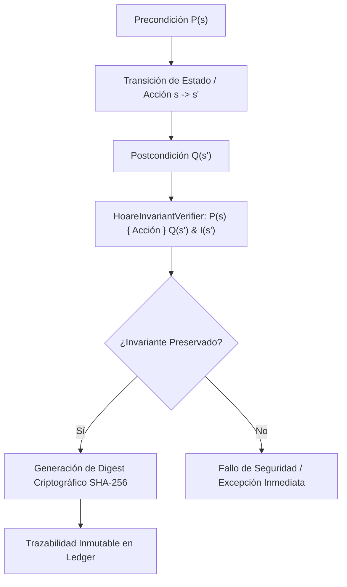

# 🏛️ Dossier Notion: core-formal-verification

## 1. Identificación del Módulo
* **Nombre**: `core-formal-verification`
* **Tipo**: Motor Algorítmico Puro de Verificación Formal y Lógica de Hoare
* **Lenguaje & Runtime**: Java 25 LTS, Java Records
* **Complejidad Asintótica**: \(O(1)\) por comprobación inductiva de invariantes de estado

---

## 2. Diagrama de Arquitectura y Flujo de Verificación Formal

---

## 3. Estado de Calidad y Pruebas
* **Zero-Mockito TDD**: 6 tests unitarios JUnit 5 (100% verdes).
* **Dependencias Externas**: 0 (Java Puro).
* **Universidad Privada**: Facultad IX (Verificación Formal y Demostración de Teoremas).
