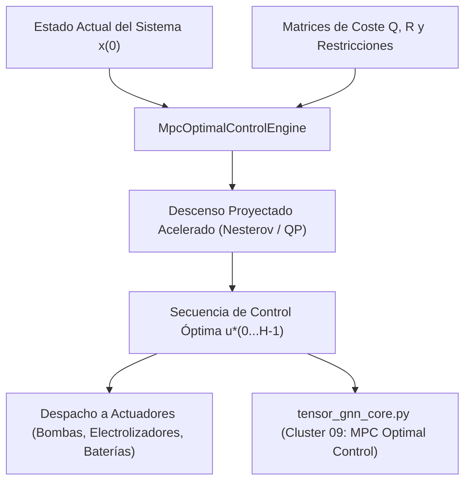

# 🏛️ Dossier Notion: core-mpc-control

## 1. Identificación del Módulo
* **Nombre**: `core-mpc-control`
* **Tipo**: Motor Algorítmico Puro (Gemelo Digital Unificado)
* **Lenguaje & Runtime**: Java 25 LTS, Java Records, Virtual Threads Loom
* **Complejidad Asintótica**: \(O(H \cdot n \cdot m)\) donde \(H\) es el horizonte temporal, \(n\) estados y \(m\) controles

---

## 2. Diagrama de Arquitectura y Flujo de Optimización

---

## 3. Estado de Calidad y Pruebas
* **Zero-Mockito TDD**: 3 tests unitarios JUnit 5 (100% verdes).
* **Dependencias Externas**: 0 (Java Puro sin anotaciones de Spring ni frameworks).
* **Universidad Privada**: Facultad V (Gemelos Digitales) y Facultad XII (Optimización Robusta).
