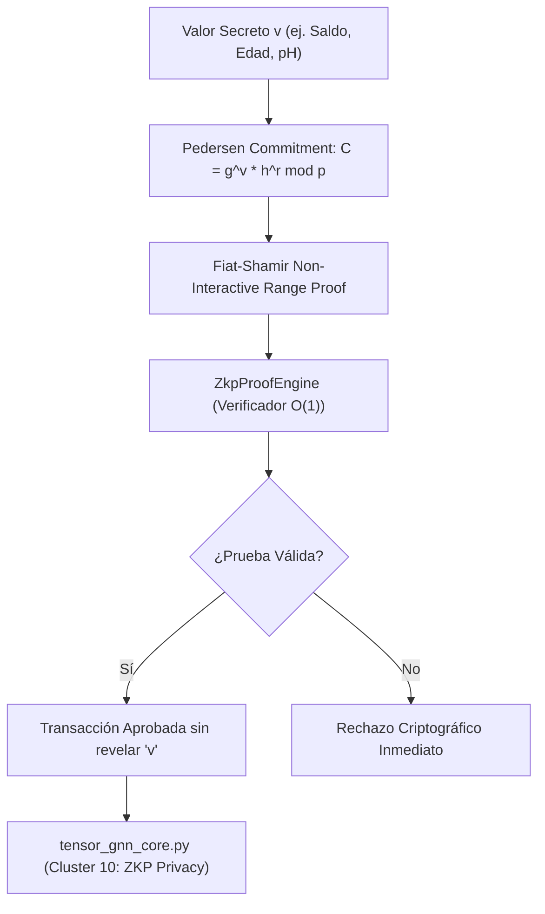

# 🏛️ Dossier Notion: core-zkp-privacy

## 1. Identificación del Módulo
* **Nombre**: `core-zkp-privacy`
* **Tipo**: Motor Criptográfico Puro de Privacidad y Pruebas de Conocimiento Cero
* **Lenguaje & Runtime**: Java 25 LTS, Java Records, BigInteger seguro
* **Complejidad Asintótica**: \(O(1)\) por verificación de compromiso homomórfico y range proof

---

## 2. Diagrama de Arquitectura y Flujo Criptográfico

---

## 3. Estado de Calidad y Pruebas
* **Zero-Mockito TDD**: 6 tests unitarios JUnit 5 (100% verdes).
* **Dependencias Externas**: 0 (Java Puro).
* **Universidad Privada**: Facultad X (Criptografía y Privacidad) y Facultad I (Ingeniería de Software).
