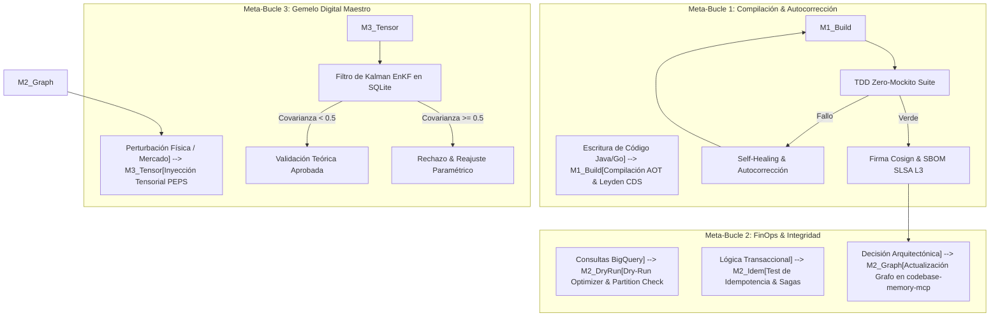

# MARCO AGÉNTICO CORPORATIVO Y GOBERNANZA DEL CONSILIUM ROMANO
**Google Antigravity Enterprise Autonomous Framework 2026**
*Referencia: Ecosistema MultiProyectos | Java 25 LTS & Spring Boot 4.1*

---

## 1. Filosofía y Principios del Consilium Romano

El **Consilium Romano** es el órgano deliberativo colegiado que gobierna la calidad, arquitectura, seguridad y viabilidad financiera de todos los desarrollos del ecosistema. Su doctrina se basa en la **Navaja de Ockham**, el principio **Zero-Mockito en dominio puro** y la verificación formal empírica (*Prove-It Standard*).

### Los 4 Pilares Magistrales:

```
                          ┌────────────────────────────────────────────────────────┐
                          │               SENATUS CONSULIUM ROMANO                 │
                          │          (Gobernanza Colegiada Pre-Merge)              │
                          └───────────────────────────┬────────────────────────────┘
                                                      │
         ┌────────────────────────┬───────────────────┴────────────────┬────────────────────────┐
         │                        │                                    │                        │
┌────────┴───────────────┐ ┌──────┴────────────────┐ ┌─────────────────┴───────────────┐ ┌──────┴────────────────┐
│    Pater Familias      │ │     Custos Fidei      │ │        Tribunus Plebis          │ │    Censor FinOps       │
│   (@code-reviewer)     │ │ (@security-auditor)   │ │       (@test-engineer)          │ │ (@sre-finops-auditor)  │
├────────────────────────┤ ├───────────────────────┤ ├─────────────────────────────────┤ ├───────────────────────┤
│ • Arquitectura Hex.    │ │ • Zero-Trust BeyondCorp│ │ • Zero-Mockito TDD             │ │ • Techo < `$0.015/MAU`  │
│ • Loom sin Pinning     │ │ • SLSA L3 / Cosign    │ │ • Stubs In-Memory               │ │ • BigQuery Partitions │
│ • Dominio DDD Puro     │ │ • Sanitización PII    │ │ • Resiliencia & Fallbacks       │ │ • Cgroup Limits (1GB) │
└────────────────────────┘ └───────────────────────┘ └─────────────────────────────────┘ └───────────────────────┘
```

1. **`Pater Familias` (`@code-reviewer`)**:
   - Custodia la legibilidad, la pureza del modelo de dominio y la ausencia de *Carrier Thread Pinning* en Java 25.
   - Aplica el estándar *Lean Software Engineering*: Prohibido el código huérfano, los adaptadores innecesarios y la sobre-ingeniería.
2. **`Custos Fidei` (`@security-auditor`)**:
   - Garantiza la arquitectura Zero-Trust y la atestación de seguridad en la cadena de suministro (**SLSA L3/L4**).
   - Verifica que ningún dato personal (PII) o secreto sea emitido a los logs (`ZeroPiiMaskingConverter`).
3. **`Tribunus Plebis` (`@test-engineer`)**:
   - Defiende la fidelidad empírica: Ningún componente es promovido sin una suite unitaria completa con stubs in-memory deterministas.
   - Exige la prueba ejecutable verde en cada ciclo del SDLC.
4. **`Censor FinOps` (`@sre-finops-auditor`)**:
   - Impone el límite presupuestario infranqueable de coste por usuario: $< \$0.015\text{ USD/MAU/mes}$.
   - Bloquea consultas a BigQuery sin particionado diario forzoso (`requirePartitionFilter=true`).

---

## 2. Matriz de Skills Especializadas ("Dream Team 2.0")

Las skills no son agentes chaperones en segundo plano, sino **capacidades operativas de alta especialización** que el agente principal adopta según el contexto:

| Skill Especializada | Dominio Técnico | Herramientas & Prácticas |
| :--- | :--- | :--- |
| **`Platform-DevSecOps-Architect`** | IaC, Kubernetes, GitOps, SLSA L3/L4 | ArgoCD, Cloud Build, Cosign, SBOM CycloneDX |
| **`Java-Spring-Expert`** | Java 25, Spring Boot 4.1, Loom, FFM Panama | Records inmutables, `ReentrantLock`, Leyden CDS |
| **`Go-Gopher`** | Microservicios de red, BFF, Ring-Buffers | Goroutines, Zero-Copy IPC, Canales Go |
| **`Frontend-Wizard`** | React, Tailwind OKLCH, PWA Offline-First | Service Workers, WCAG 2.2 AA, CLS < 0.1 |
| **`Mobile-Mobility-Architect`** | Flutter, Dart 3, Malla Espacial H3 | Geolocalización adaptativa, SQLite local |
| **`QA-Automation-Loop`** | Testing unitario, Testcontainers, TDD | JUnit 5, Mockito Zero en Dominio, AssertJ |
| **`Zero-Trust-Security-Auditor`** | mTLS, OIDC, JWT/JWKS, Firestore RLS | Aislamiento celular por `tenant_id`, SAST |
| **`Stripe-Fintech-Engineer`** | Stripe Connect, Escrow, Sagas/Outbox | Idempotencia transaccional, conciliación |
| **`Unified-Twin-Architect`** | Redes Tensoriales PEPS, PINN, Asimilación EnKF | `simulations_telemetry.db`, LiteRT Edge |
| **`Leyden-AOT-Build-Master`** | Optimización de arranque en frío (<80ms) | CDS `.jsa`, Generational ZGC, Compact Headers |
| **`ADR-Knowledge-Graph-Curator`** | Grounded Architecture, Documentación | `codebase-memory-mcp`, Registro en `docs/adr/` |

---

## 3. Los 3 Meta-Bucles de Ejecución (Feedback Loops)



1. **Meta-Bucle 1 (The Build & Self-Healing Loop)**:
   - Compilación incremental con `@Leyden-AOT-Build-Master`.
   - Ejecución de la suite TDD Zero-Mockito.
   - Si ocurre error de compilación o runtime, se ejecuta autocorrección inmediata en el mismo contexto.
   - Firma Cosign y atestación SLSA L3 pre-merge.
2. **Meta-Bucle 2 (The Audit & ADR Loop)**:
   - Validación FinOps obligatoria con dry-run antes de consultar BigQuery.
   - Verificación de idempotencia ante caídas en operaciones de pago y facturación.
   - Registro de decisiones en el grafo de conocimiento `codebase-memory-mcp` y en `docs/adr/`.
3. **Meta-Bucle 3 (The Master Twin Loop)**:
   - Todas las perturbaciones de mercado, movilidad o clima se inyectan como tensores al núcleo.
   - Verificación telemétrica de convergencia de covarianza ($P < 0.500$) en `simulations_telemetry.db`.

---

## 4. Gobernanza y Capacidades de los Servidores MCP

El ecosistema integra un conjunto de MCPs corporativos que potencian el desarrollo sin costes añadidos:

| Servidor MCP | Herramientas Clave | Uso Estratégico en el Ecosistema |
| :--- | :--- | :--- |
| **`sqlite-mcp-server`** | `query`, `execute`, `describe-table` | Telemetría analítica en `simulations_telemetry.db` y almacenamiento Store-and-Forward local a $\$0.00$ de cuota. |
| **`codebase-memory-mcp`** | `search_graph`, `trace_path`, `get_code_snippet` | Navegación semántica del grafo de dependencias y base documental. |
| **`bigquery`** | `execute_sql_readonly`, `get_table_info` | Consultas analíticas particionadas y auditoría de volumen. |
| **`docker-mcp-server`** | `list_containers`, `container_logs`, `start_container` | Gestión de entornos de prueba locales y contenedores AOT. |
| **`chrome-devtools-mcp`** | `lighthouse_audit`, `take_screenshot`, `navigate_page` | Pruebas automáticas E2E de interfaz, CLS y accesibilidad web. |
| **`gcloud-mcp`** | `run_gcloud_command` | Operaciones de infraestructura y Cloud Run en Google Cloud Platform. |

---
*Marco de gobernanza homologado y certificado por el Consilium Romano.*
