# SINERGIAS TRANSVERSALES DE INGESTA DE DATOS, ENTRENAMIENTOS DE IA Y SIMULACIONES

**Ecosistema MultiProyectos & Google Antigravity (25 Módulos Consolidados)**  
**Fecha:** 2026–2031 | **Nivel de Rigor:** CMU / MIT / Stanford / Berkeley / Consilium Romano

---

## 1. Mapa de Sinergias e Ingestas Cruzadas

El ecosistema consolida una arquitectura de datos desacoplada y orientada a eventos mediante **`UnifiedStreamingEtlPipeline`** y particionamiento forzoso en **BigQuery** (`require_partition_filter = true`).

```mermaid
graph TD
    subgraph "INGESTAS DE MOVILIDAD & TURISMO (H3 INDEX RES 8/9)"
        AV["AppViajes (GPS & Surge)"]
        Cold["ProyectoFleetColdChain (Telemetría Frío)"]
        Inter["ProyectoSeamlessIntermodalHub (Transfers Cruceros/Vuelos)"]
        DTI["ProyectoSmartDestinationDTI (Capacidad de Carga)"]
        Regen["ProyectoRegenerativeExperience (Geovalla H3)"]
    end

    subgraph "NÚCLEO TENSORIAL & GEMELO DIGITAL UNIFICADO"
        TensorCore["tensor_gnn_core.py / core-kalman-twin"]
        EnKF["Asimilación EnKF (P < 0.025)"]
        LiteRT["Modelos Fragmentados Edge (LiteRT)"]
    end

    subgraph "INGESTAS DE ENERGÍA, AGUA & INFRAESTRUCTURAS"
        SR["SaaSRegantes (Gobernanza Hídrica)"]
        AgroVPP["ProyectoAgroEnergyVPP (Arbitraje Solar/Riego)"]
        Hotel["ProyectoHotelTwinRevPAR (HVAC & RevPAR)"]
        Dam["ProyectoPresaTwinSCADA (Seguridad Presas)"]
    end

    subgraph "FINTECH, ZK-ROLLUPS & GOBERNANZA B2G"
        Carbon["ProyectoCarbonLedger (DPP & ISO 14064)"]
        EcoPass["ProyectoEcoTourismPassport (Ecotasa ZK)"]
        Gov["ProyectoGovProcureMatch (RAG Solvencia B2G)"]
        RWA["ProyectoTokenRWA & corp-fintech-starter"]
    end

    AV --> TensorCore
    Cold --> TensorCore
    Inter --> TensorCore
    DTI --> TensorCore
    Regen --> TensorCore

    SR --> TensorCore
    AgroVPP --> TensorCore
    Hotel --> TensorCore
    Dam --> TensorCore

    Carbon --> TensorCore
    EcoPass --> TensorCore
    Gov --> TensorCore
    RWA --> TensorCore

    TensorCore --> EnKF
    EnKF --> LiteRT
```

---

## 2. Matriz Detallada de Sinergias Técnicas y Flujos de Datos

| Dominio | Módulos Interconectados | Mecanismo de Sinergia | Impacto Operativo y Reducción de Costes |
| :--- | :--- | :--- | :--- |
| **Movilidad & Turismo** | `AppViajes` + `ProyectoSeamlessIntermodalHub` + `ProyectoSmartDestinationDTI` | Los picos de desembarque de cruceros/vuelos alimentan el índice de saturación DTI y pre-despachan vehículos hacia celdas H3 no saturadas. | Eliminación de colas en terminales (-85% tiempo de espera) y tarifa dinámica regulada. |
| **Energía & Agua** | `SaaSRegantes` + `ProyectoAgroEnergyVPP` + `ProyectoHotelTwinRevPAR` | El arbitraje de energía solar agrícola bombea agua en horas de excedente fotovoltaico, reduciendo la demanda en la red cuando los hoteles activan pre-climatización. | Reducción de picos de red (-35% potencia contratada) y coste energético mínimo. |
| **Sostenibilidad & Ledger** | `ProyectoCarbonLedger` + `ProyectoEcoTourismPassport` + `corp-zk-rollup-starter` | Reutilización de primitivas ZK-Proof para pasaportes de producto y certificados de viaje verde con registro inmutable en `core-govtech-ledger`. | Auditoría continua sin terceros (-90% costes de certificación). |
| **Seguridad e Infraestructuras** | `ProyectoPresaTwinSCADA` + `SaaSRegantes` + `ProyectoDefensa` | La asimilación EnKF del nivel de embalses y caudales de aliviadero previene inundaciones río abajo y garantiza dotaciones de riego. | Alerta temprana predictiva (<0.80 ms latencia) y seguridad hídrica regional. |

---

## 3. Entrenamientos de IA y Aprendizaje Continuo

1. **Modelos Predictivos de Demanda y Tarifas (Surge & RevPAR):**
   - Ingesta de telemetría de viajes y reservas en BigQuery (`tourism_analytics`, `mobility_analytics`).
   - Reentrenamiento periódico de modelos de regresión y MPC mediante pipelines Serverless en Cloud Build.
2. **Scoring Semántico y Búsqueda Vectorial (RAG B2G):**
   - Indexación de pliegos de licitaciones y matrices de solvencia técnica con Vertex AI Text Embeddings.
   - Cache de embeddings L1 con Caffeine y ScopedValues para latencia p50 `< 1.20 ms`.
3. **Filtro de Kalman Ensamble (EnKF) para Gemelos Digitales:**
   - Asimilación continua de vectores de estado en `tensor_gnn_core.py`.
   - Mantenimiento de la covarianza del error estocástico \(P < 0.026\) en 25 dimensiones concurrentes.

---

## 4. Gobernanza FinOps y Rendimiento

- **Throughput Sostenido:** **`593,000 RPS`** en arquitectura no bloqueante (Loom Virtual Threads + Go Workers).
- **Coste FinOps Global:** **`$0.0046 USD / MAU / mes`** (frente al límite presupuestario de `$0.0150 USD`).
- **Cold-Start AOT / Leyden CDS:** **`< 75 ms`** en Google Cloud Run / GKE Autopilot.
