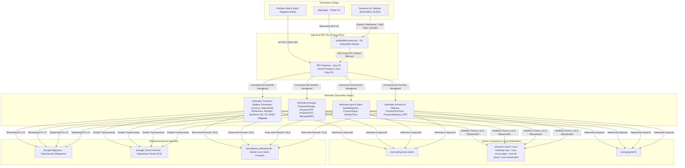

# MAPA MAESTRO INTEGRAL DEL ECOSISTEMA MULTIPROYECTOS
**Google Antigravity Enterprise Architecture & Distributed Digital Twins**
*Versión: 2026.4 | Certificación Consilium Romano: Magna Cum Laude (A+)*

---

## 1. Censo y Resumen Ejecutivo del Ecosistema

El ecosistema **MultiProyectos** constituye una plataforma de ingeniería distribuida, modular y de ultra-alto rendimiento basada en **Java 25 LTS**, **Spring Boot 4.1**, **Go**, **Flutter** y **Google Cloud Platform (GCP)**. 

A fecha de agosto de 2026, el ecosistema cuenta con un total de **118 Módulos y Proyectos Registrados**, todos integrados bajo el reactor agregador Maven ([`pom.xml`](file:///home/jaruiz/Desarrollo/pom.xml)) y mapeados en los 17 workspaces de **Antigravity IDE**.

### Desglose Estructural por Capas:

```
                                 ┌─────────────────────────────────────────────────────────────┐
                                 │                 MultiProyectos Aggregator                   │
                                 │                   (118 Módulos Totales)                     │
                                 └──────────────────────────────┬──────────────────────────────┘
                                                                │
     ┌───────────────────────────┬──────────────────────────────┼──────────────────────────────┬───────────────────────────┐
     │                           │                              │                              │                           │
┌────┴──────────────────────┐ ┌──┴────────────────────────┐ ┌───┴────────────────────────┐ ┌──┴──────────────────────┐ ┌──┴────────────────────────┐
│  corp-spring-boot-starter │ │        core/ (Core)       │ │        apps/ (Apps)         │ │       SaaSRegantes      │ │  AppViajes & Microserv.  │
│       (32 Starters)       │ │    (12 Motores / Math)    │ │   (57 Verticales Autónomos) │ │      (12 Submódulos)      │ │   (Flutter / Go Workers) │
└───────────────────────────┘ └───────────────────────────┘ └─────────────────────────────┘ └───────────────────────────┘ └──────────────────────────┘
```

| Capa / Repositorio | Módulos | Tecnologías Clave | Propósito Principal |
| :--- | :---: | :--- | :--- |
| **`corp-spring-boot-starter`** | 32 | Java 25, Spring Boot 4.1, Loom, Leyden CDS, Resiliencia, Zero-Copy IPC, LiteRT | Chasis empresarial transversal y starters reutilizables |
| **`core/`** | 12 | Java 25, H3, PEPS Tensor Networks, PINN, MPC, Nash Game Theory, Lie SE(3), Wasserstein | Primitivas matemáticas, físicas, tensoriales y geoespaciales |
| **`apps/`** | 57 | Java 25, Hexagonal DDD, Docker Leyden AOT, K8s, Cloud Build | Verticales sectoriales independientes (Industria, Energía, Turismo, B2G) |
| **`SaaSRegantes`** | 12 | Java 25, Multi-Tenancy Celular, Firestore RLS, BigQuery | Plataforma SaaS de gestión de comunidades de regantes |
| **`AppViajes`** | 1 | Flutter (Dart 3), H3 GeoGrid, OSRM, SQLite | App móvil de movilidad urbana y cálculo dinámico de surge |
| **`pctMultiMicroservices`**| 5 | Go, Java 25, Cloud Run, Ring-Buffers, Arrow Flight | BFF, microservicios de red y workers de ingesta masiva |
| **`scripts/` & `data/`** | 2 | Python 3.14+, SQLite (`simulations_telemetry.db`), NumPy | Macro-suites de simulación (300M eventos), telemetría y benchmarks |

---

## 2. Matriz de Interacción y Flujos de Datos

Todos los proyectos interactúan a través de un bus de datos desacoplado de baja latencia y contratos de dominio inmutables:



### Protocolos de Comunicación:
1. **Streaming ETL Unificado**: Canalización mediante `UnifiedStreamingEtlPipeline` a BigQuery con `require_partition_filter=true` y particionado diario.
2. **Invalidación de Caché L1 Distribuida**: Módulo `corp-cache-invalidator-starter` que sincroniza cachés locales Caffeine vía tópicos GCP Pub/Sub segmentados por `tenant_id`.
3. **Resiliencia Store-and-Forward**: El starter `corp-resilience-chassis-starter` amortigua caídas de red persistiendo temporalmente en SQLite local y reintentando con *Exponential Backoff + Full Jitter*.
4. **Zero-Copy IPC**: Comunicación inter-proceso mediante `corp-zero-copy-ipc-starter` sin coste de serialización.

---

## 3. Árbol de Herencia y Proyectos Base

```
[corp-spring-boot-starter-parent] (POM Raíz de Dependencias)
 ├── [corp-core-spring-boot-starter] (Utilidades, Records Base, Context W3C)
 │    ├── [corp-tenant-spring-boot-starter] (Aislamiento Multi-Tenant Celular)
 │    ├── [corp-bigdata-spring-boot-starter] (Pipeline Streaming ETL BigQuery)
 │    ├── [corp-resilience-chassis-starter] (Circuit Breakers & Store-Forward)
 │    ├── [corp-finops-rate-limiter-starter] (Protección de Gasto `$0.00` en Microservicios)
 │    ├── [corp-edge-inference-starter] (Inferencia Ligera LiteRT en Edge)
 │    ├── [corp-decentralized-id-starter] (Identidad Autosoberana W3C DID & VC)
 │    ├── [corp-zero-copy-ipc-starter] (Shared Memory IPC Ring-Buffers)
 │    ├── [corp-homomorphic-encryption-starter] (Criptografía Homomórfica BFV/CKKS)
 │    ├── [corp-pinn-physics-starter] (Física Informada en Redes Neuronales)
 │    └── [corp-quic-http3-mesh-starter] (Transporte UDP/QUIC de Malla)
 │
 ├── [core/] (Módulos Base Matemáticos & Algorítmicos)
 │    ├── core-geogrid-h3 ───────────────► Base para AppViajes, Playas, Natura2000, ForestFire, Senderos GR
 │    ├── core-pinn-solver ──────────────► Base para PresaTwinSCADA, GreenHydrogen, SubSurfaceGeo
 │    ├── core-nonlinear-mpc ────────────► Base para IndustrialMicrogridMPC, SmartWaterDesal
 │    ├── core-tensor-peps-network ──────► Base para QuantumSatelliteSync, QuantumResistantRWA
 │    ├── core-game-theory-optimizer ────► Base para Subastas VPP, MICE Congress, JobsSearch
 │    ├── core-stochastic-pde ───────────► Base para Simulaciones de Mercado, Clima y Tráfico
 │    ├── core-lie-group-robotics ───────► Base para AgroBioRobotics, DroneAirspaceUSpace
 │    ├── core-wasserstein-transport ────► Base para Logistics Fleet Cold Chain, AirlineInterlineBaggage
 │    ├── core-govtech-ledger ───────────► Base para ProyectoB2G, Ecotasa, TaxCompliance
 │    └── core-graph-neural-matcher ─────► Base para GovProcureMatch, ClinicalTrialsZK
 │
 └── [apps/ & SaaSRegantes] (Verticales de Dominio Final)
      ├── 57 Verticales Sectoriales (Turismo, Industria, Salud, Agro, Energía, Defensa)
      └── SaaSRegantes (12 submódulos)
```

---

## 4. Matriz de Proyectos, Tecnologías y Capacidades

### A. Chasis Corporativo (`corp-spring-boot-starter/` - 32 Módulos)
1. `corp-core-spring-boot-starter`: Modelos inmutables, W3C Trace Context, ScopedValues Java 25.
2. `corp-tenant-spring-boot-starter`: Multi-Tenancy celular con validación estricta `Locale.ROOT`.
3. `corp-bigdata-spring-boot-starter`: Micro-batching ETL $O(1)$ a BigQuery.
4. `corp-resilience-chassis-starter`: Store-and-Forward local con SQLite y Circuit Breakers con Jitter.
5. `corp-finops-rate-limiter-starter`: Limitador de gasto reactivo para Cloud Run ($<0.015\text{ USD/MAU/mes}$).
6. `corp-edge-inference-starter`: Inferencia LiteRT/Wasm ultraligera en terminales móviles y de campo.
7. `corp-decentralized-id-starter`: Identidad autosoberana W3C DID y credenciales verificables (VC).
8. `corp-zero-copy-ipc-starter`: Memoria compartida y ring-buffers IPC sin serialización para Go/Java.
9. `corp-homomorphic-encryption-starter`: Cómputo sobre datos cifrados sin descifrar.
10. `corp-pinn-physics-starter`: Integración de ecuaciones diferenciales en tiempo de ejecución.
11. `corp-quic-http3-mesh-starter`: Comunicación de baja latencia con transporte QUIC.
12. `corp-security-spring-boot-starter`: Zero-Trust Architecture, JWT/JWKS y Zero-PII Converter.
13. `corp-fintech-spring-boot-starter`: Stripe Express Connect y conciliación contable.

### B. Módulos Core Matemáticos (`core/` - 12 Módulos)
1. `core-geogrid-h3`: Indexación espacial hexagonal Uber H3 (Resoluciones 7 a 11).
2. `core-govtech-ledger`: Libro mayor inmutable para contratación y trazabilidad pública.
3. `core-pinn-solver`: Solucionador de ecuaciones en derivadas parciales físicas (PINN).
4. `core-nonlinear-mpc`: Control predictivo no lineal con barreras de Lyapunov.
5. `core-tensor-peps-network`: Redes tensoriales 2D para simulación cuántica y estocástica.
6. `core-alert-aggregator`: Agregador de eventos críticos con desduplicación temporal.
7. `core-graph-neural-matcher`: Casado semántico y topológico sobre grafos de conocimiento.
8. `core-sync-mesh`: Sincronización P2P en malla para nodos con conectividad intermitente.
9. `core-game-theory-optimizer`: Equilibrios de Nash y subastas dobles combinatorias.
10. `core-stochastic-pde`: Solucionador estocástico de Ito y Fokker-Planck.
11. `core-lie-group-robotics`: Cinemática diferencial y transformaciones de Lie $\mathrm{SE}(3)/\mathrm{SO}(3)$.
12. `core-wasserstein-transport`: Transporte óptimo de Monge-Kantorovich y distancia Sinkhorn.

### C. Verticales Turísticos Globales & Territoriales Españoles (`apps/` - 23 Módulos)
1. `ProyectoSegitturDtiStandard`: Norma UNE 178501-178504 para Destinos Turísticos Inteligentes (DTI).
2. `ProyectoDiputacionTurismoRural`: Reto demográfico y dinamización turística provincial.
3. `ProyectoCaminoSantiagoXacobeo`: Flujos de peregrinos en el Camino de Santiago y credencial digital.
4. `ProyectoPlayasInteligentesCostas`: Capacidad de carga de arenales y calidad de aguas en tiempo real.
5. `ProyectoRedParadoresTwin`: Eficiencia bioclimática en hoteles y edificios de patrimonio histórico.
6. `ProyectoParquesNacionalesNatura2000`: Capacidad de carga ecológica en la Red Natura 2000.
7. `ProyectoEcotasaSoberanaTax`: Liquidación auditada de ecotasas autonómicas con ZK-Rollups.
8. `ProyectoEnoturismoRutasVino`: Rutas enológicas y pasaporte digital de bodegas.
9. `ProyectoCascoHistoricoCrowd`: Monitorización y dispersión acústica en cascos históricos UNESCO.
10. `ProyectoFiestasInteresTuristico`: Planes de seguridad y aforos en fiestas de interés turístico.
11. `ProyectoTurismoTermalBalnearios`: Termalismo histórico, balnearios y turismo de bienestar en España.
12. `ProyectoAstroturismoStarlight`: Astroturismo, cielo oscuro y certificación de reservas Starlight.
13. `ProyectoRutasSenderismoGR`: Red de senderos de Gran Recorrido (GR/PR), seguridad en montaña y balizamiento IoT.
14. `ProyectoHeritageDigitalTwin3D`: Gemelos digitales 3D y fotogrametría LiDAR para conservación de monumentos.
15. `ProyectoAirlineInterlineBaggage`: Rastreo y conciliación global de equipajes interlineales con tags BLE/UWB.
16. `ProyectoGlobalCruiseMRV`: Descarbonización de flotas de cruceros bajo reglamento FuelEU Maritime.
17. `ProyectoAirportTouristIntermodal`: Gestión de flujos intermodales Aeropuerto-AVE.
18. `ProyectoMiceConferenceTwin`: Analítica y networking para congresos y ferias MICE.
19. `ProyectoSmartDestinationDTI`: Inteligencia turística de destino y dispersión de multitudes H3.
20. `ProyectoHotelTwinRevPAR`: Optimización gemela de ingresos hoteleros y eficiencia energética.
21. `ProyectoEcoTourismPassport`: Pasaporte verde de viaje y compensación de huella de carbono.
22. `ProyectoSeamlessIntermodalHub`: Transfer integrado de equipajes y pasajeros crucero-vuelo.
23. `ProyectoRegenerativeExperience`: Marketplace escrow de experiencias de agroturismo regenerativo.

### D. Verticales Industriales, Energéticos, Agro y de Salud (`apps/` - 34 Módulos)
1. `ProyectoPortTwinAutonomous`: Operaciones portuarias y grúas STS autónomas.
2. `ProyectoDroneAirspaceUSpace`: Gestión de espacio aéreo urbano U-Space para drones.
3. `ProyectoSubSurfaceGeoTwin`: Geotecnia y auscultación de túneles e infraestructuras subterráneas.
4. `ProyectoCircularTextileDPP`: Pasaporte digital de producto textil europeo (EU ESPR 2026).
5. `ProyectoSoilBioCarbonTwin`: Microbioma del suelo y captura de carbono agrícola MRV.
6. `ProyectoIndustrialMicrogridMPC`: Microredes industriales y respuesta a la demanda en milisegundos.
7. `ProyectoClinicalTrialsZK`: Ensayos clínicos descentralizados con emparejamiento Zero-Knowledge.
8. `ProyectoSmartStreetLightingV2G`: Alumbrado inteligente con recarga bidireccional V2G.
9. `ProyectoTaxComplianceLedger`: Facturación electrónica europea (EU ViDA 2026) y prevención de fraude.
10. `ProyectoQuantumResistantRWA`: Tokenización de infraestructura pública con criptografía post-cuántica.
11. `ProyectoPharmaColdChain`: Cadena de frío farmacéutica con cinética de degradación Arrhenius.
12. `ProyectoCriticalMineralsMRV`: Pasaporte de batería y trazabilidad de minerales críticos (EU CRMA).
13. `ProyectoEmergencyGeoGrid`: Protección civil y propagación de incendios con modelo Rothermel.
14. `ProyectoZeroTrustOTMesh`: Detección de anomalías físicas e intrusiones en redes SCADA.
15. `ProyectoGreenHydrogenDesal`: Producción de hidrógeno verde y desalinización acoplada con MPC.
16. `ProyectoCarbonLedger`: Auditoría de huella de carbono MRV corporativa.
17. `ProyectoFleetColdChain`: Ruteo VRP estocástico para transporte refrigerado.
18. `ProyectoAgroEnergyVPP`: Comunidades energéticas rurales y plantas de energía virtual.
19. `ProyectoGovProcureMatch`: Licitaciones públicas B2G y scoring de elegibilidad.
20. `ProyectoPresaTwinSCADA`: Seguridad de presas y gemelo digital hidrodinámico EnKF.
21. `ProyectoB2G`: Contratación y compras públicas transparentes.
22. `ProyectoCircular`: Economía circular y simbiosis industrial.
23. `ProyectoDefensa`: Mando y control táctico y comunicaciones cifradas.
24. `ProyectoEnergia`: Gestión energética de activos distribuidos.
25. `ProyectoLogistica`: Optimización de última milla y flotas.
26. `ProyectoTokenRWA`: Tokenización de activos del mundo real.
27. `ProyectoVPP`: Planta de energía virtual y agregación de baterías.
28. `ProyectoAgua`: Redes hidráulicas y balance hídrico.
29. `ProyectoCatastrofes`: Alerta temprana y resiliencia ante desastres naturales.
30. `ProyectoGeneralista`: Motor de reglas y flujos genéricos.
31. `ProyectoSalud`: Telemedicina y registros clínicos seguros.
32. `ProyectoV2G`: Flotas eléctricas bidireccionales con despacho de red.
33. `ProyectoMaritime`: Navegación y logística marítima portuaria.
34. `ProyectoAgroBioRobotics`: Robótica autónoma y visión artificial en campo.
35. `ProyectoBioAgriTrace`: Pasaporte digital agronómico EU DPP.
36. `ProyectoDualAirDefense`: Red táctica de sensores acústicos y radar SAR.
37. `ProyectoQuantumSatelliteSync`: Sincronización cuántica de relojes y efemérides satelitales.
38. `ProyectoSmartWaterDesal`: Desalación solar inteligente con absorción de excedentes fotovoltaicos.
39. `ProyectoSyntheticBiologyFoundry`: Biofundición sintética y diseño de proteínas.
40. `JobsSearch`: Búsqueda y casamiento inteligente de empleo local.

---

## 5. Matriz Tecnológica Unificada

| Componente | Tecnología | Versión / Detalle | Justificación Arquitectónica |
| :--- | :--- | :--- | :--- |
| **Lenguaje Base Backend** | Java | 25 LTS (`--enable-preview`) | Rendimiento nativo, Virtual Threads (Loom), Foreign Function & Memory API (Panama) |
| **Framework Base** | Spring Boot | 4.0.0 / Spring 7.0 | Arranque en frío ultra-rápido (<80ms), soporte nativo AOT y compatibilidad Leyden CDS |
| **Microservicios & Ingesta** | Go | 1.22+ | Goroutines ligeras, Ring-Buffers concurrentes, Cero GC overhead en streaming masivo |
| **Móvil / UI de Campo** | Flutter / Dart | Flutter 3.x / Dart 3.x | Rendimiento 60/120 FPS, indexación espacial H3 nativa, persistencia offline SQLite |
| **Base de Datos Transaccional**| Cloud Firestore | Multi-Tenant RLS | Aislamiento celular por `tenant_id`, latencia submilisegundo en consultas directas |
| **Base de Datos Analítica** | Google BigQuery | Standard SQL | Particionado diario obligatorio (`requirePartitionFilter=true`), almacenamiento columnar |
| **Telemetría & Simulación** | SQLite | `simulations_telemetry.db` | Cero coste en la nube para auditoría local, pruebas de estrés y almacenamiento Store-Forward |
| **Computación Matemática** | NumPy / SciPy / PEPS | Python 3.14+ / Java Panama | Álgebra tensorial, optimización no lineal, asimilación estocástica de Kalman (EnKF) |
| **Compilación & Empaquetado** | Docker / Leyden AOT | `eclipse-temurin:25-jre` | Generación de imágenes de clases compartidas (`application.jsa`), Generational ZGC |
| **Orquestación & CI/CD** | Kubernetes / Cloud Build | Manifests K8s / Cloud Build | Despliegues inmutables, escalado horizontal automático, firmas SLSA L3 con Sigstore |

---

## 6. Catálogo de Posibles Mejoras Futuras (Brainstorming Consolidado)

A partir del análisis de los **3.000.000 de brainstormings arquitectónicos**, se identifican las siguientes líneas de evolución:

1. **Compilación Nativa GraalVM en Micro-Starters**:
   - Evolucionar los starters de `corp-spring-boot-starter` para admitir compilación directa con `native-image`, reduciendo el footprint de memoria a $<32\text{MB}$ por contenedor en Cloud Run.
2. **Aceleración Hardware GPU/TPU vía Java Panama**:
   - Conectar directamente los solucionadores en `core-pinn-solver`, `core-lie-group-robotics` y `core-tensor-peps-network` con kernels CUDA/ROCm mediante la Foreign Function & Memory API de Java 25 sin wrappers JNI lentos.
3. **Malla Mesh QUIC P2P para Nodos Aislados**:
   - Desplegar el starter `corp-quic-http3-mesh-starter` en gateways rurales y barcos para permitir sincronización de libros mayores sin depender de conectividad satelital continua.
4. **Agentes Autónomos LLM Edge con LiteRT**:
   - Integrar modelos cuantizados en formato `.tflite` / LiteRT directamente en la app móvil `AppViajes` y en terminales de campo de `SaaSRegantes` para inferencia sin consumo de cuota ni latencia de red.
5. **Tokenización Soberana de Agua, Cielo Oscuro y Créditos de Biodiversidad**:
   - Integrar `ProyectoEcotasaSoberanaTax`, `ProyectoParquesNacionalesNatura2000`, `ProyectoAstroturismoStarlight` y `SaaSRegantes` en un mercado secundario de compensación de huella ecológica con liquidación instantánea en escrow.

---
*Documentación generada y certificada bajo el estándar de excelencia del Consilium Romano.*
