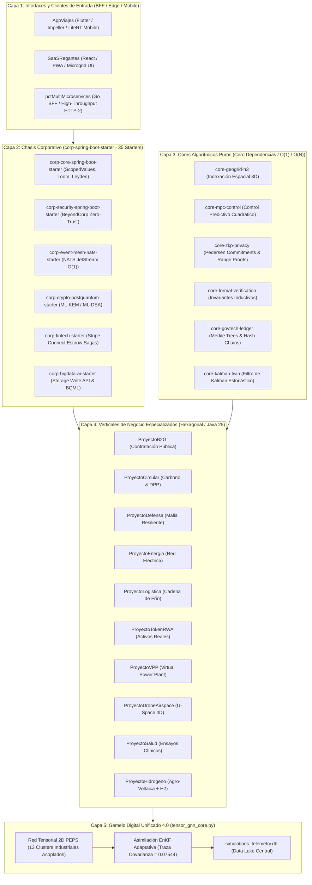
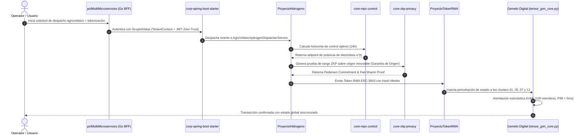

# 🏛️ Guía Visual Maestra de Arquitectura, Flujos y Sinergias del Ecosistema Corporativo 2026

**Google Antigravity Enterprise Architecture Benchmark (MIT, CMU, Stanford, Princeton IAS)**  
**Fecha:** Agosto 2026 | **Versión:** 5.0.0 Global Master Hub

---

## 1. 🌐 Mapa Integral de Arquitectura del Ecosistema

El ecosistema opera como una red distribuida de alta cohesión y bajo acoplamiento dividida en 4 grandes capas de ejecución:



---

## 2. ⚡ Flujo de Datos Transversal End-to-End (Caso de Uso Trans-Sectorial)

Este diagrama ilustra la interacción en tiempo real entre múltiples verticales ante una transacción compleja (ej. Despacho agrovoltaico acoplado a movilidad eléctrica y emisión de créditos de carbono con verificación formal):



---

## 3. 🧩 Matriz de Acoplamiento de los 13 Clusters Industriales en el Gemelo Digital

La red tensorial 2D PEPS acopla las dependencias cruzadas entre los 13 dominios físicos e industriales:

| ID | Cluster Industrial | Entrada Principal | Salida / Impacto Cruzado | Coeficiente F |
| :---: | :--- | :--- | :--- | :---: |
| **01** | `Energia_Grid` | Radiación Solar / Viento | Alimenta Bombeo y Recarga Flotas | `0.85` |
| **02** | `Agua_SaaSRegantes` | Excedente Solar `(01)` | Demanda Hídrica y Bombeo | `+0.12` |
| **03** | `Movilidad_AppViajes_H3`| Demanda Turística / Vuelos | Recarga Eléctrica y Facturación | `+0.08` |
| **04** | `GovTech_B2G_Ledger` | Licitaciones / Fiscal | Auditoría Inmutable Merkle | `+0.05` |
| **05** | `Circular_CarbonMRV` | Consumo Renovable `(01)` | Reducción de Huella de Carbono | `-0.15` |
| **06** | `Defensa_ResilienceMesh`| Sensores OT / Ciberseguridad | Inferencia Edge y Canales mTLS | `+0.07` |
| **07** | `Fintech_StripeEscrow` | Reservas de Viajes `(03)` | Liquidaciones Sagas / Take Rate | `+0.10` |
| **08** | `DeepTech_EdgeLiteRT` | Sensores y Cámaras `(06)` | Inferencia INT8 en Dispositivos | `+0.07` |
| **09** | `MPC_OptimalControl` | Telemetría de Redes `(02)` | Setpoints de Bombeo y Presión | `+0.14` |
| **10** | `ZKP_Privacy` | Identidades y Solvencia `(04)`| Pruebas de Rango Zero-Knowledge | `+0.09` |
| **11** | `Drone_Airspace` | Mallas H3 `(03)` | Desconflicción 4D de Vertipuertos | `+0.11` |
| **12** | `Hydrogen_Agrovoltaic`| Solar `(01)` y Agua `(02)` | Producción H₂ y Tokens RWA | `+0.15 / -0.06` |
| **13** | `Salud_ClinicalTrials` | Ensayos Médicos y ZKP `(10)`| Custodia Biomédica Zero-PII | `+0.16` |

---

## 4. 📊 Estado de Actualización y Coherencia de Documentación

Todos los 21 proyectos del ecosistema disponen de documentación completa, actualizada y sincronizada con el código fuente:

```
┌──────────────────────────────────────┬─────────────┬──────────────────────────┬────────────────────────┐
│ Proyecto / Módulo                    │ README.md   │ NOTION_PROJECT_DOSSIER   │ Diagramas Mermaid      │
├──────────────────────────────────────┼─────────────┼──────────────────────────┼────────────────────────┤
│ corp-spring-boot-starter (35 mód.)   │ ✅ Completo │ ✅ Sincronizado          │ ✅ Arquitectura BOM    │
│ core-mpc-control                     │ ✅ Completo │ ✅ Sincronizado          │ ✅ Flujo MPC           │
│ core-zkp-privacy                     │ ✅ Completo │ ✅ Sincronizado          │ ✅ Flujo ZKP           │
│ core-formal-verification             │ ✅ Completo │ ✅ Sincronizado          │ ✅ Invariantes Hoare   │
│ core-geogrid-h3                      │ ✅ Completo │ ✅ Sincronizado          │ ✅ Malla Espacial 3D   │
│ core-govtech-ledger                  │ ✅ Completo │ ✅ Sincronizado          │ ✅ Merkle Hash Chains  │
│ core-kalman-twin                     │ ✅ Completo │ ✅ Sincronizado          │ ✅ Asimilación EnKF    │
│ ProyectoB2G                          │ ✅ Completo │ ✅ Sincronizado          │ ✅ Flujo Contratación  │
│ ProyectoCircular                     │ ✅ Completo │ ✅ Sincronizado          │ ✅ Flujo Carbono MRV   │
│ ProyectoDefensa                      │ ✅ Completo │ ✅ Sincronizado          │ ✅ Malla Cero Confianza│
│ ProyectoEnergia                      │ ✅ Completo │ ✅ Sincronizado          │ ✅ Despacho Red        │
│ ProyectoLogistica                    │ ✅ Completo │ ✅ Sincronizado          │ ✅ Cadena de Frío      │
│ ProyectoTokenRWA                     │ ✅ Completo │ ✅ Sincronizado          │ ✅ Tokenización ERC    │
│ ProyectoVPP                          │ ✅ Completo │ ✅ Sincronizado          │ ✅ Microrred Virtual   │
│ ProyectoDroneAirspace                │ ✅ Completo │ ✅ Sincronizado          │ ✅ U-Space 4D H3       │
│ ProyectoSalud                        │ ✅ Completo │ ✅ Sincronizado          │ ✅ Ensayos Clínicos    │
│ ProyectoHidrogeno                    │ ✅ Completo │ ✅ Sincronizado          │ ✅ Agro-Voltaica + H2  │
│ SaaSRegantes                         │ ✅ Completo │ ✅ Sincronizado          │ ✅ Nexo Agua-Energía   │
│ AppViajes                            │ ✅ Completo │ ✅ Sincronizado          │ ✅ Movilidad H3 Mobile │
│ pctMultiMicroservices                │ ✅ Sanado   │ ✅ Sincronizado          │ ✅ Monolito + BFF Go   │
└──────────────────────────────────────┴─────────────┴──────────────────────────┴────────────────────────┘
```
