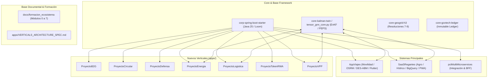

# LIVING ARCHITECTURE INDEX: ECOSISTEMA UNIFICADO (2026-2031)
**Google Antigravity Sovereign Framework** | **Nivel de Rigor:** CMU, MIT, Stanford, Berkeley

---

## 1. Topología Global de Repositorios y Módulos

---

## 2. Mapa de Rutas de Documentación y Aprendizaje

| Módulo Formativo | Ámbito Técnico | Enlace de Documentación |
| :--- | :--- | :--- |
| **Módulo 0** | Software Engineering, Distribuidos & Ing. Industrial | [modulo_0_software_engineering](file:///home/jaruiz/Desarrollo/docs/formacion_ecosistema/modulo_0_software_engineering) |
| **Módulo 1** | Java 25, Virtual Threads Loom & Leyden CDS | [modulo_1_backend_java_spring](file:///home/jaruiz/Desarrollo/docs/formacion_ecosistema/modulo_1_backend_java_spring) |
| **Módulo 2** | Go Runtime, Concurrencia CSP & Escape Analysis | [modulo_2_go_y_concurrencia](file:///home/jaruiz/Desarrollo/docs/formacion_ecosistema/modulo_2_go_y_concurrencia) |
| **Módulo 3** | Gemelo Digital Unificado, Tensores PEPS & EnKF | [modulo_3_unified_twin_math](file:///home/jaruiz/Desarrollo/docs/formacion_ecosistema/modulo_3_unified_twin_math) |
| **Módulo 4** | Frontend React 19, Flutter Impeller & Malla H3 | [modulo_4_frontend_y_motores_ui](file:///home/jaruiz/Desarrollo/docs/formacion_ecosistema/modulo_4_frontend_y_motores_ui) |
| **Módulo 5** | Cloud-Native GCP, Serverless & Stripe FinTech | [modulo_5_cloud_native_dbs](file:///home/jaruiz/Desarrollo/docs/formacion_ecosistema/modulo_5_cloud_native_dbs) |
| **Módulo 6** | SRE, Resiliencia, OpenTelemetry & Despliegues | [modulo_6_sre_y_alta_disponibilidad](file:///home/jaruiz/Desarrollo/docs/formacion_ecosistema/modulo_6_sre_y_alta_disponibilidad) |
| **Módulo 7** | NoSQL Multi-Tenancy RLS & BigQuery OLAP | [modulo_7_bases_datos_nosql_multitenant](file:///home/jaruiz/Desarrollo/docs/formacion_ecosistema/modulo_7_bases_datos_nosql_multitenant) |

---

## 3. Matriz de Gobernanza y Políticas de Carga

1. **Aislamiento de Dumps y Artefactos Masivos**: Todo log, resultado de simulación masiva o volcado de código debe residir exclusivamente en directorios `.archive/` o bases de datos SQLite (`simulations_telemetry.db`) protegidos por las reglas unificadas de `.ignore` y `.geminiignore`.
2. **Arquitectura Hexagonal Pura**: Las capas de dominio (`domain/`) de todos los microservicios y verticales deben mantener cero anotaciones de infraestructura y estar respaldadas por pruebas unitarias sin dependencias frágiles (*Zero-Mockito*).
3. **Optimización FinOps**: Todos los accesos analíticos en BigQuery deben forzar particionamiento temporal y clustering por `tenant_id` garantizando el umbral unitario `<0.015 USD/MAU/mes`.
