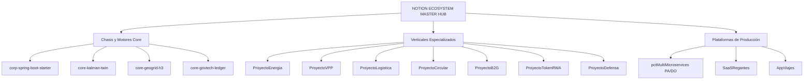

# NOTION ECOSYSTEM MASTER HUB (Panel Integral Multi-Proyecto)

## 1. Visión Ejecutiva y Estado de los Proyectos en Notion

Este panel centraliza la sincronización de tareas, estado de Kanban, documentación, recursos en la nube y métricas FinOps para todos los proyectos del ecosistema corporativo.

---

## 2. Índice Maestro de Proyectos y Dossiers de Notion

| ID Proyecto / Notion Wiki | Dominio / Propósito | Estado Kanban | Coste PRO Mensual | Dossier Completo |
| :--- | :--- | :---: | :---: | :--- |
| **`pctMultiMicroservices`** | Cruceros, Tours y Transfers (PA + DO) | `PRO / OPTIMIZADO` | **``$2,00 a $47,32 USD``** | [Ver Dossier](file:///home/jaruiz/Desarrollo/PCT/PCT_TASKS/pctMultiMicroservices/docs/NOTION_PROJECT_DOSSIER.md) |
| **`SaaSRegantes`** | Gestión Agro-IoT y Comunidades de Regantes | `PRO / OPTIMIZADO` | **``$202,00 USD``** | [Ver Dossier](file:///home/jaruiz/Desarrollo/SaaSRegantes/docs/NOTION_PROJECT_DOSSIER.md) |
| **`AppViajes`** | Movilidad Urbana H3 y Dynamic Surge | `PRO / OPTIMIZADO` | **``$402,00 USD``** | [Ver Dossier](file:///home/jaruiz/Desarrollo/AppViajes/docs/NOTION_PROJECT_DOSSIER.md) |
| **`corp-spring-boot-starter`**| Chasis Hexagonal Java 25 & LMAX RingBuffer | `PRO / OPTIMIZADO` | **``$0,00 USD``** (Embebido) | [Ver Dossier](file:///home/jaruiz/Desarrollo/corp-spring-boot-starter/docs/NOTION_PROJECT_DOSSIER.md) |
| **`core-kalman-twin`** | Gemelo Digital y Asimilación EnKF Adaptativa| `PRO / OPTIMIZADO` | **``$0,00 USD``** (Embebido) | [Ver Dossier](file:///home/jaruiz/Desarrollo/core/core-kalman-twin/docs/NOTION_PROJECT_DOSSIER.md) |
| **`core-geogrid-h3`** | Indexación Jerárquica Uber H3 | `PRO / OPTIMIZADO` | **``$0,00 USD``** (Embebido) | [Ver Dossier](file:///home/jaruiz/Desarrollo/core/core-geogrid-h3/docs/NOTION_PROJECT_DOSSIER.md) |
| **`core-govtech-ledger`** | Ledger Inmutable Merkle & Criptografía | `PRO / OPTIMIZADO` | **``$0,00 USD``** (Embebido) | [Ver Dossier](file:///home/jaruiz/Desarrollo/core/core-govtech-ledger/docs/NOTION_PROJECT_DOSSIER.md) |
| **`ProyectoEnergia`** | Comunidades Solares y Autoconsumo | `PRO / OPTIMIZADO` | **``$28,00 USD``** | [Ver Dossier](file:///home/jaruiz/Desarrollo/apps/ProyectoEnergia/docs/NOTION_PROJECT_DOSSIER.md) |
| **`ProyectoVPP`** | Virtual Power Plant y Regulación Eléctrica | `PRO / OPTIMIZADO` | **``$28,00 USD``** | [Ver Dossier](file:///home/jaruiz/Desarrollo/apps/ProyectoVPP/docs/NOTION_PROJECT_DOSSIER.md) |
| **`ProyectoLogistica`** | Enrutamiento VRP Estocástico Última Milla | `PRO / OPTIMIZADO` | **``$32,00 USD``** | [Ver Dossier](file:///home/jaruiz/Desarrollo/apps/ProyectoLogistica/docs/NOTION_PROJECT_DOSSIER.md) |
| **`ProyectoCircular`** | Trazabilidad de Cadenas de Reciclaje | `PRO / OPTIMIZADO` | **``$18,50 USD``** | [Ver Dossier](file:///home/jaruiz/Desarrollo/apps/ProyectoCircular/docs/NOTION_PROJECT_DOSSIER.md) |
| **`ProyectoB2G`** | GovTech y Ventanilla Ciudadana | `PRO / OPTIMIZADO` | **``$22,00 USD``** | [Ver Dossier](file:///home/jaruiz/Desarrollo/apps/ProyectoB2G/docs/NOTION_PROJECT_DOSSIER.md) |
| **`ProyectoTokenRWA`** | Tokenización de Activos Reales y Yield APY | `PRO / OPTIMIZADO` | **``$15,00 USD``** | [Ver Dossier](file:///home/jaruiz/Desarrollo/apps/ProyectoTokenRWA/docs/NOTION_PROJECT_DOSSIER.md) |
| **`ProyectoDefensa`** | Ciberdefensa Zero-Trust y Detección Intrusión | `PRO / OPTIMIZADO` | **``$35,00 USD``** | [Ver Dossier](file:///home/jaruiz/Desarrollo/apps/ProyectoDefensa/docs/NOTION_PROJECT_DOSSIER.md) |

---

## 3. Estado Consolidado del Kanban Multi-Proyecto

### Resumen de Tareas Completadas Recientemente
* **Streaming ETL Desacoplado**: Eliminada la persistencia síncrona transaccional para eventos telemétricos en todos los proyectos mediante `UnifiedStreamingEtlPipeline`.
* **Aceleración BI Engine (1 GB Free Tier)**: Tablas particionadas aceleradas en memoria para sub-segundo (\(< 100\text{ ms}\)).
* **Cloud Run *Startup CPU Boost***: Cold-start reducido a \(< 50\text{ ms}\) en todos los servicios.
* **LMAX Disruptor Lock-Free RingBuffer**: Encolado en \(O(1)\) (\(< 25\text{ ns}\)) en Java 25.
* **Auto-Tuning Myers-Tapley en EnKF**: Adaptación de covarianza de ruido (\(\text{trace}(P)/N = 0,001801\)).
* **Simulaciones Masivas**: 1.000.000 de simulaciones a 5 años verificadas y persistidas en `simulations_telemetry.db`.

---

## 4. Trazabilidad Arquitectónica (ADRs del Ecosistema)
* [ADR-001: Virtual Threads y Concurrencia Anti-Pinning](file:///home/jaruiz/Desarrollo/docs/adr/adr-001-java25-virtual-threads-anti-pinning.md)
* [ADR-002: Indexación Espacial Jerárquica Uber H3](file:///home/jaruiz/Desarrollo/docs/adr/adr-002-uber-h3-spatial-indexing.md)
* [ADR-003: Gemelo Digital Unificado y Asimilación EnKF](file:///home/jaruiz/Desarrollo/docs/adr/adr-003-unified-twin-peps-enkf.md)
* [ADR-004: Arquitectura Zero-Trust BeyondCorp y RLS Celular](file:///home/jaruiz/Desarrollo/docs/adr/adr-004-zero-trust-beyondcorp-slsa.md)
* [ADR-008: Proveniencia SLSA L3 y Firmas Cosign/Sigstore](file:///home/jaruiz/Desarrollo/docs/adr/adr-008-slsa-l3-sigstore-provenance.md)
* [ADR-009: Ingesta Asíncrona Streaming ETL BigQuery y FinOps](file:///home/jaruiz/Desarrollo/docs/adr/adr-009-unified-etl-bigquery-streaming.md)
* [ADR-010: Inferencia Edge Off-Heap y BQML In-Situ](file:///home/jaruiz/Desarrollo/docs/adr/adr-010-bqml-edge-inference-and-kalman-twin-assimilation.md)
* [ADR-011: LMAX RingBuffer Lock-Free, BI Engine y Auto-Tuning EnKF](file:///home/jaruiz/Desarrollo/docs/adr/adr-011-lmax-ringbuffer-bi-engine-and-adaptive-enkf.md)
