# NOTION ECOSYSTEM MASTER HUB (Panel Integral Multi-Proyecto)

## 1. Visión Ejecutiva y Estado de los Proyectos en Notion

Este panel centraliza la sincronización de tareas, estado de Kanban, documentación, recursos en la nube y métricas FinOps para todos los proyectos del ecosistema corporativo.

```mermaid
flowchart TD
    Hub["NOTION ECOSYSTEM MASTER HUB"] --> Core["Chasis y 6 Motores Core"]
    Hub --> Apps["10 Verticales Especializados"]
    Hub --> Platforms["Plataformas de Producción"]
    
    Core --> C1["corp-spring-boot-starter - 36 Starters"]
    Core --> C2["core-kalman-twin"]
    Core --> C3["core-geogrid-h3"]
    Core --> C4["core-govtech-ledger"]
    Core --> C5["core-mpc-control"]
    Core --> C6["core-zkp-privacy"]
    Core --> C7["core-formal-verification"]
    
    Platforms --> P1["pctMultiMicroservices PA/DO"]
    Platforms --> P2["SaaSRegantes"]
    Platforms --> P3["AppViajes"]
    
    Apps --> A1["ProyectoEnergia"]
    Apps --> A2["ProyectoVPP"]
    Apps --> A3["ProyectoLogistica"]
    Apps --> A4["ProyectoCircular"]
    Apps --> A5["ProyectoB2G"]
    Apps --> A6["ProyectoTokenRWA"]
    Apps --> A7["ProyectoDefensa"]
    Apps --> A8["ProyectoDroneAirspace"]
    Apps --> A9["ProyectoSalud"]
    Apps --> A10["ProyectoHidrogeno"]
```

---

## 2. Índice Maestro de Proyectos y Dossiers de Notion

| ID Proyecto / Notion Wiki | Dominio / Propósito | Estado Kanban | Coste PRO Mensual | Dossier Completo |
| :--- | :--- | :---: | :---: | :--- |
| **`pctMultiMicroservices`** | Cruceros, Tours y Transfers (PA + DO) | `PRO / OPTIMIZADO` | **``$2,00 a $47,32 USD``** | [Ver Dossier](file:///home/jaruiz/Desarrollo/PCT/PCT_TASKS/pctMultiMicroservices/docs/NOTION_PROJECT_DOSSIER.md) |
| **`SaaSRegantes`** | Gestión Agro-IoT y Comunidades de Regantes | `PRO / OPTIMIZADO` | **``$202,00 USD``** | [Ver Dossier](file:///home/jaruiz/Desarrollo/SaaSRegantes/docs/NOTION_PROJECT_DOSSIER.md) |
| **`AppViajes`** | Movilidad Urbana H3 y Dynamic Surge | `PRO / OPTIMIZADO` | **``$402,00 USD``** | [Ver Dossier](file:///home/jaruiz/Desarrollo/AppViajes/docs/NOTION_PROJECT_DOSSIER.md) |
| **`corp-spring-boot-starter`**| Chasis Hexagonal Java 25 & 36 Starters | `PRO / OPTIMIZADO` | **``$0,00 USD``** (Embebido) | [Ver Dossier](file:///home/jaruiz/Desarrollo/corp-spring-boot-starter/docs/NOTION_PROJECT_DOSSIER.md) |
| **`core-kalman-twin`** | Gemelo Digital y Asimilación EnKF Adaptativa| `PRO / OPTIMIZADO` | **``$0,00 USD``** (Embebido) | [Ver Dossier](file:///home/jaruiz/Desarrollo/core/core-kalman-twin/docs/NOTION_PROJECT_DOSSIER.md) |
| **`core-geogrid-h3`** | Indexación Jerárquica Uber H3 | `PRO / OPTIMIZADO` | **``$0,00 USD``** (Embebido) | [Ver Dossier](file:///home/jaruiz/Desarrollo/core/core-geogrid-h3/docs/NOTION_PROJECT_DOSSIER.md) |
| **`core-govtech-ledger`** | Ledger Inmutable Merkle & Criptografía | `PRO / OPTIMIZADO` | **``$0,00 USD``** (Embebido) | [Ver Dossier](file:///home/jaruiz/Desarrollo/core/core-govtech-ledger/docs/NOTION_PROJECT_DOSSIER.md) |
| **`core-mpc-control`** | Control Óptimo Predictivo Basado en Modelos | `PRO / OPTIMIZADO` | **``$0,00 USD``** (Embebido) | [Ver Dossier](file:///home/jaruiz/Desarrollo/core/core-mpc-control/README.md) |
| **`core-zkp-privacy`** | Pruebas de Conocimiento Cero & Pedersen | `PRO / OPTIMIZADO` | **``$0,00 USD``** (Embebido) | [Ver Dossier](file:///home/jaruiz/Desarrollo/core/core-zkp-privacy/README.md) |
| **`core-formal-verification`**| Verificación Formal & Lógica de Hoare | `PRO / OPTIMIZADO` | **``$0,00 USD``** (Embebido) | [Ver Dossier](file:///home/jaruiz/Desarrollo/core/core-formal-verification/README.md) |
| **`ProyectoEnergia`** | Comunidades Solares y Autoconsumo | `PRO / OPTIMIZADO` | **``$28,00 USD``** | [Ver Dossier](file:///home/jaruiz/Desarrollo/apps/ProyectoEnergia/docs/NOTION_PROJECT_DOSSIER.md) |
| **`ProyectoVPP`** | Virtual Power Plant y Regulación Eléctrica | `PRO / OPTIMIZADO` | **``$28,00 USD``** | [Ver Dossier](file:///home/jaruiz/Desarrollo/apps/ProyectoVPP/docs/NOTION_PROJECT_DOSSIER.md) |
| **`ProyectoLogistica`** | Enrutamiento VRP Estocástico Última Milla | `PRO / OPTIMIZADO` | **``$32,00 USD``** | [Ver Dossier](file:///home/jaruiz/Desarrollo/apps/ProyectoLogistica/docs/NOTION_PROJECT_DOSSIER.md) |
| **`ProyectoCircular`** | Trazabilidad de Cadenas de Reciclaje | `PRO / OPTIMIZADO` | **``$18,50 USD``** | [Ver Dossier](file:///home/jaruiz/Desarrollo/apps/ProyectoCircular/docs/NOTION_PROJECT_DOSSIER.md) |
| **`ProyectoB2G`** | GovTech y Ventanilla Ciudadana | `PRO / OPTIMIZADO` | **``$22,00 USD``** | [Ver Dossier](file:///home/jaruiz/Desarrollo/apps/ProyectoB2G/docs/NOTION_PROJECT_DOSSIER.md) |
| **`ProyectoTokenRWA`** | Tokenización de Activos Reales y Yield APY | `PRO / OPTIMIZADO` | **``$15,00 USD``** | [Ver Dossier](file:///home/jaruiz/Desarrollo/apps/ProyectoTokenRWA/docs/NOTION_PROJECT_DOSSIER.md) |
| **`ProyectoDefensa`** | Ciberdefensa Zero-Trust y Detección Intrusión | `PRO / OPTIMIZADO` | **``$35,00 USD``** | [Ver Dossier](file:///home/jaruiz/Desarrollo/apps/ProyectoDefensa/docs/NOTION_PROJECT_DOSSIER.md) |
| **`ProyectoDroneAirspace`**| Espacio Aéreo U-Space y Movilidad Aérea | `PRO / OPTIMIZADO` | **``$38,00 USD``** | [Ver Dossier](file:///home/jaruiz/Desarrollo/apps/ProyectoDroneAirspace/README.md) |
| **`ProyectoSalud`** | Ensayos Clínicos Descentralizados & Zero-PII| `PRO / OPTIMIZADO` | **``$25,00 USD``** | [Ver Dossier](file:///home/jaruiz/Desarrollo/apps/ProyectoSalud/README.md) |
| **`ProyectoHidrogeno`** | Nexo Agro-Voltaico e Hidrógeno Verde | `PRO / OPTIMIZADO` | **``$30,00 USD``** | [Ver Dossier](file:///home/jaruiz/Desarrollo/apps/ProyectoHidrogeno/README.md) |

---

## 3. Estado Consolidado del Kanban Multi-Proyecto

### Resumen de Tareas Completadas Recientemente
* **Nuevos Cores Algorítmicos**:
  - `core-mpc-control`: Control predictivo cuadrático acelerado con propagación adjunta en \(O(H \cdot n \cdot m)\).
  - `core-zkp-privacy`: Compromisos de Pedersen homomórficos y pruebas de rango Fiat-Shamir en \(O(1)\).
  - `core-formal-verification`: Motor axiomático de verificación formal de lógica de Hoare e invariantes inductivos.
* **Nuevos Verticales Empresariales**:
  - `ProyectoDroneAirspace`: Espacio aéreo U-Space con mallas H3 3D y resolución determinista de conflictos de vuelo.
  - `ProyectoSalud`: Ensayos clínicos descentralizados, cadena de custodia biológica y pruebas de privacidad Zero-Knowledge.
  - `ProyectoHidrogeno`: Despacho de potencia agro-voltaico para electrólisis de hidrógeno verde y optimización termodinámica.
* **Nuevos Starters de Infraestructura**:
  - `corp-event-mesh-nats-starter`: Pub/Sub mesh NATS JetStream de latencia sub-milisegundo.
  - `corp-crypto-postquantum-starter`: Criptografía resistente a computación cuántica (ML-KEM / ML-DSA NIST).
* **Gemelo Digital 4.0 (13 Clusters Industriales)**:
  - Red tensorial PEPS 2D y filtro de Kalman por conjuntos EnKF con convergencia de covarianza de \(0,07544 < 0,20\).

---

## 4. Trazabilidad Arquitectónica (ADRs del Ecosistema)
* [ADR-001: Virtual Threads y Concurrencia Anti-Pinning](file:///home/jaruiz/Desarrollo/docs/adr/adr-001-java25-virtual-threads-anti-pinning.md)
* [ADR-002: Indexación Espacial Jerárquica Uber H3](file:///home/jaruiz/Desarrollo/docs/adr/adr-002-uber-h3-spatial-indexing.md)
* [ADR-003: Gemelo Digital Unificado y Asimilación EnKF](file:///home/jaruiz/Desarrollo/docs/adr/adr-003-unified-twin-peps-enkf.md)
* [ADR-004: Firestore RLS y BigQuery FinOps](file:///home/jaruiz/Desarrollo/docs/adr/adr-004-firestore-rls-bigquery-finops.md)
* [ADR-005: Proveniencia SLSA L3 y Firmas Cosign/Sigstore](file:///home/jaruiz/Desarrollo/docs/adr/adr-005-slsa-l3-cosign-provenance.md)
* [ADR-006: Dominio Puro Zero-Mockito TDD](file:///home/jaruiz/Desarrollo/docs/adr/adr-006-zero-mockito-pure-domain-tdd.md)
* [ADR-007: Aislamiento Multi-Tenant con Scoped Values](file:///home/jaruiz/Desarrollo/docs/adr/adr-007-multi-tenant-scoped-values-isolation.md)
* [ADR-008: Lean CI/CD Six Sigma](file:///home/jaruiz/Desarrollo/docs/adr/adr-008-lean-cicd-six-sigma.md)
* [ADR-009: Ingesta Asíncrona Streaming ETL BigQuery y FinOps](file:///home/jaruiz/Desarrollo/docs/adr/adr-009-unified-etl-bigquery-streaming.md)
* [ADR-010: Inferencia Edge Off-Heap y BQML In-Situ](file:///home/jaruiz/Desarrollo/docs/adr/adr-010-bqml-edge-inference-and-kalman-twin-assimilation.md)
* [ADR-011: LMAX RingBuffer Lock-Free, BI Engine y Auto-Tuning EnKF](file:///home/jaruiz/Desarrollo/docs/adr/adr-011-lmax-ringbuffer-bi-engine-and-adaptive-enkf.md)
* [ADR-012: Universal W3C Logging y Zero-PII](file:///home/jaruiz/Desarrollo/docs/adr/adr-012-universal-w3c-logging-and-zero-pii.md)
* [ADR-013: Resiliencia Pub/Sub y Gobernanza DLQ](file:///home/jaruiz/Desarrollo/docs/adr/adr-013-pubsub-resilience-batching-and-dlq-governance.md)
* [ADR-014: RFC 9457 Problem Details y Auto-Remediación](file:///home/jaruiz/Desarrollo/docs/adr/adr-014-rfc9457-problem-details-resilience-and-auto-remediation.md)
* [ADR-015: Declarative BigQuery Reconciler y Edge Outbox](file:///home/jaruiz/Desarrollo/docs/adr/adr-015-declarative-bigquery-reconciler-and-edge-outbox.md)
* [ADR-016: Go Worker vs Java Virtual Threads Performance Benchmarks](file:///home/jaruiz/Desarrollo/docs/adr/adr-016-go-worker-vs-java-virtual-threads.md)
* [ADR-017: Ingesta Estocástica de Alta Fidelidad y Resiliencia en Cascada](file:///home/jaruiz/Desarrollo/docs/adr/adr-017-high-fidelity-stochastic-ingestion-and-cascading-resilience.md)
* [ADR-018: Arquitectura Híbrida de Modelos LLM Locales](file:///home/jaruiz/Desarrollo/docs/adr/adr-018-hybrid-local-llm-architecture.md)
* [ADR-019: Criptografía Zero-Knowledge (ZKP), Pedersen y Fiat-Shamir](file:///home/jaruiz/Desarrollo/docs/adr/adr-019-zkp-privacy-pedersen-fiat-shamir.md)
* [ADR-020: Control Predictivo Basado en Modelos (MPC) y Optimización Cuadrática](file:///home/jaruiz/Desarrollo/docs/adr/adr-020-model-predictive-control-quadratic-optimization.md)
* [ADR-021: Verificación Formal de Contratos basada en Lógica de Hoare](file:///home/jaruiz/Desarrollo/docs/adr/adr-021-formal-verification-hoare-logic-inductive-invariants.md)
