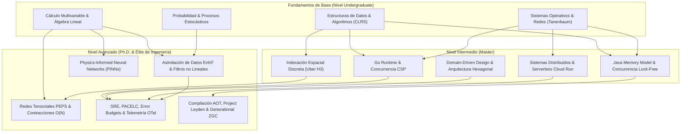

# PRERREQUISITOS Y GRAFO DE APRENDIZAJE DEL ECOSISTEMA (CURRICULUM PH.D.)
**Google Antigravity Sovereign Framework** | **Nivel de Rigor:** CMU, MIT, Stanford, Berkeley, Princeton, ETH Zurich

Este documento define el mapa formal de dependencias de conocimiento, los aprendizajes previos requeridos por cada módulo y las rutas de especialización técnica para dominar la arquitectura, matemáticas e infraestructura del ecosistema.

---

## 1. Grafo de Dependencias Conceptuales



---

## 2. Matriz de Prerrequisitos por Módulo Formativo

### Módulo 0: Software Engineering & Sistemas Distribuidos
* **Aprendizajes Previos Necesarios:**
  - Concepto de procesos, hilos, memoria virtual y descriptores de archivos.
  - Fundamentos de redes TCP/IP (handshake, ventanas deslizantes, time-wait).
  - Paradigmas de programación funcional y orientada a objetos orientada a contratos.
* **Bibliografía Imprescindible:**
  - *Clean Architecture: A Craftsman's Guide to Software Structure and Design* (Robert C. Martin).
  - *Distributed Systems: Concepts and Design* (Coulouris, Dollimore, Kindberg).
  - *Designing Data-Intensive Applications* (Martin Kleppmann).

### Módulo 1: Backend de Alto Rendimiento, Java 25 & Virtual Threads
* **Aprendizajes Previos Necesarios:**
  - Compilación de Java, carga de clases (`ClassLoader`), formato de archivos `.class` y bytecode.
  - Modelo de Memoria de Java (JMM): relaciones *happens-before*, variables `volatile`, `VarHandle`.
  - Diferencia entre hilos a nivel de kernel (1:1) e hilos en espacio de usuario (M:N).
* **Bibliografía Imprescindible:**
  - *Java Concurrency in Practice* (Brian Goetz et al.).
  - *JVM Anatomy Quarks* (Aleksey Shipilëv).
  - *HotSpot Virtual Machine Garbage Collection Tuning Guide* (Oracle Official Docs).

### Módulo 2: Concurrencia Pura y Sistemas de Red en Go
* **Aprendizajes Previos Necesarios:**
  - Gestión manual de memoria en C/C++ (punteros, asignación dinámica `malloc`/`free`).
  - Primitivas de sincronización de bajo nivel (mutexes, semáforos, variables de condición).
  - Modelo de concurrencia CSP (*Communicating Sequential Processes* de C.A.R. Hoare).
* **Bibliografía Imprescindible:**
  - *The Go Programming Language* (Alan Donovan & Brian Kernighan).
  - *Concurrency in Go: Tools and Techniques for Developers* (Katherine Cox-Buday).
  - *Go Runtime Internals* (Documentación oficial de Go).

### Módulo 3: Gemelo Digital Unificado, Matemáticas Avanzadas y Físicas
* **Aprendizajes Previos Necesarios:**
  - Álgebra Lineal Avanzada: Espacios vectoriales, descomposición espectral, SVD, producto de Kronecker.
  - Ecuaciones Diferenciales Parciales (PDEs): Ecuaciones de calor, onda y fluidos incompresibles de Navier-Stokes.
  - Cálculo Estocástico: Movimiento Browniano, Integral de Itô, Ecuación de Fokker-Planck.
* **Bibliografía Imprescindible:**
  - *Data Assimilation: The Ensemble Kalman Filter* (Geir Evensen).
  - *Tensor Network States: A Brief Introduction* (Roman Orus).
  - *Physics-Informed Neural Networks* (Raissi, Perdikaris, Karniadakis, 2019).
  - *Introduction to Queueing Theory* (Robert B. Cooper).

### Módulo 4: Frontend Moderno, Motores UI y Movilidad Espacial
* **Aprendizajes Previos Necesarios:**
  - Estructuras de datos espaciales: Árboles R-Tree, QuadTrees y Geometría Proyectiva.
  - Grafos viales y algoritmos de caminos mínimos (Dijkstra, A*, Contraction Hierarchies).
  - Pipeline de renderizado de navegadores (DOM, CSSOM, Render Tree, Layout, Paint, Composite).
* **Bibliografía Imprescindible:**
  - *Uber H3 Technical Documentation & Core Whitepapers* (Isaac Brodsky).
  - *Contraction Hierarchies: Faster and Simpler Hierarchical Routing in Road Networks* (Geisberger et al.).
  - *Flutter Architecture & Engine Internals* (Google Flutter Team).

### Módulo 5: Cloud-Native GCP, FinTech y Data Warehousing
* **Aprendizajes Previos Necesarios:**
  - Primitivas de aislamiento de Linux: Cgroups v2, Namespaces (PID, Mount, Net, IPC), Chroot.
  - Arquitecturas de almacenamiento OLTP vs OLAP y compresión columnar (Run-Length, Dictionary, Bitmap).
  - Protocolos de autenticación Zero-Trust: OIDC, JWT con firmas asimétricas JWKS, mTLS.
* **Bibliografía Imprescindible:**
  - *Google Cloud Run Architecture & Internals* (Google Cloud Architecture Center).
  - *Capacitor: A Next-Generation Columnar Storage Engine in BigQuery* (Google Research).
  - *Enterprise Integration Patterns* (Gregor Hohpe & Bobby Woolf).

### Módulo 6: SRE, Alta Disponibilidad y Resiliencia
* **Aprendizajes Previos Necesarios:**
  - Teoremas de consistencia distribuida: CAP (Brewer) y PACELC (Abadi).
  - Teoría de colas para sistemas saturados: Ley de Little, amortiguación de picos (*Burst Absorption*).
  - Modelado estadístico de fallos: Distribución de Poisson, Ley de Potencias en eventos raros.
* **Bibliografía Imprescindible:**
  - *Site Reliability Engineering: How Google Runs Production Systems* (Beyer, Jones, Petoff, Murphy).
  - *The Site Reliability Workbook* (Beyer, Murphy, Rensin, Kawahara, Thorne).
  - *Release It!: Design and Deploy Production-Ready Software* (Michael T. Nygard).

---

## 3. Cuatro Rutas de Aprendizaje Recomendadas

```
Ruta 1: Core Backend & Extreme Concurrency
[Módulo 0: Software Engineering] -> [Módulo 1: Java 25 Loom/Leyden] -> [Módulo 2: Go CSP Runtime] -> [corp-spring-boot-starter]

Ruta 2: Digital Twin & Mathematical Modeling
[Módulo 3: Álgebra Tensorial] -> [Módulo 3: EnKF & Kalman] -> [Módulo 3: PINNs & Navier-Stokes] -> [tensor_gnn_core.py]

Ruta 3: Spatial Mobility & Frontend Architecture
[Módulo 4: React 19 / PWA] -> [Módulo 4: Flutter Impeller] -> [Módulo 4: H3 & OSRM] -> [AppViajes]

Ruta 4: Cloud-Native, SRE & FinTech
[Módulo 5: Cloud Run & BigQuery] -> [Módulo 5: Stripe Connect] -> [Módulo 6: SRE & OTel] -> [Módulo 7: NoSQL Multi-Tenant]
```
