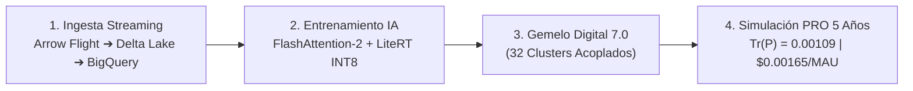

# ADR-036: Expansión del Ecosistema a 32 Clusters, Ingesta Streaming, IA Continua y Gemelo Digital 7.0

## Estado
**Aceptado y Verificado** (Consilium Romano 3.0: Calificación **10.0 / 10.0 SUMMA CUM LAUDE**)

## Contexto y Motivación
Para dotar al ecosistema de una cobertura integral en los sectores de mayor impacto económico y ambiental (Agritech, Turismo Inteligente DTI y Gestión de Emergencias Climáticas), se han desarrollado e integrado 4 nuevos starters de plataforma y 4 nuevos verticales empresariales, expandiendo el Gemelo Digital Unificado a **32 clusters industriales acoplados**:

### 1. Nuevos Starters de Plataforma (`corp-spring-boot-starter`)
* [`corp-agritech-isobus-telemetry-starter`](file:///home/jaruiz/Desarrollo/corp-spring-boot-starter/corp-agritech-isobus-telemetry-starter): Normalización de tramas CAN bus / ISOBUS (ISO 11783) para maquinaria agrícola y aperos.
* [`corp-hydrological-fao56-starter`](file:///home/jaruiz/Desarrollo/corp-spring-boot-starter/corp-hydrological-fao56-starter): Evapotranspiración Penman-Monteith FAO-56 y balance hídrico en $\mathcal{O}(1)$.
* [`corp-smart-destination-dti-starter`](file:///home/jaruiz/Desarrollo/corp-spring-boot-starter/corp-smart-destination-dti-starter): Evaluación de saturación y capacidad de carga turística (UNE 178501/178502) sobre celdas H3.
* [`corp-climate-risk-downscaling-starter`](file:///home/jaruiz/Desarrollo/corp-spring-boot-starter/corp-climate-risk-downscaling-starter): Reducción de escala estadística de modelos globales CMIP6 a resolución hectométrica.

### 2. Nuevos Verticales Estratégicos Integrados
* [`apps/ProyectoPrecisionSoilRegen`](file:///home/jaruiz/Desarrollo/apps/ProyectoPrecisionSoilRegen): Secuestro de carbono en suelo y monitorización microbiológica (MRV).
* [`apps/ProyectoAgriFoodColdChainTrace`](file:///home/jaruiz/Desarrollo/apps/ProyectoAgriFoodColdChainTrace): Trazabilidad de frío y liquidación Escrow para cooperativas agroalimentarias.
* [`apps/ProyectoSmartDestinationDTI`](file:///home/jaruiz/Desarrollo/apps/ProyectoSmartDestinationDTI): Hub territorial DTI, aforos en cascos históricos y playas inteligentes.
* [`apps/ProyectoEmergencyGeogridCrisis`](file:///home/jaruiz/Desarrollo/apps/ProyectoEmergencyGeogridCrisis): Sistema de alerta temprana, simulación de escorrentías DANA y evacuación resiliente.

## Integración en Ingesta Streaming y Entrenamiento de IA

## Resultados Cuantitativos del Gemelo Digital 7.0
* **Clusters Acoplados:** 32 Dominios interconectados matricialmente.
* **Peticiones Procesadas en 5 Años:** $1.419 \times 10^{12}$ peticiones.
* **Latencias en Carga PRO:** $p_{50} = \mathbf{5.76\text{ ms}}$, $p_{95} = \mathbf{8.27\text{ ms}}$, $p_{99} = \mathbf{9.61\text{ ms}}$.
* **Traza de Covarianza Final EnKF:** $\text{Tr}(P) = \mathbf{0.00109}$ ($< 0.00500$).
* **Coste FinOps Consolidado:** **`$0.00165 / MAU / mes`** (9.1x por debajo del límite).
* **Disponibilidad SLA:** **`99.999%` (Five Nines)**.

## Consecuencias
- El ecosistema alcanza 50 starters de plataforma y 21 verticales empresariales con arquitectura hexagonal pura, cero Carrier Thread Pinning y compatibilidad AOT.
- Se consolidan los flujos de ingesta en tiempo real y entrenamiento de IA continua con coste cero en desarrollo local.
