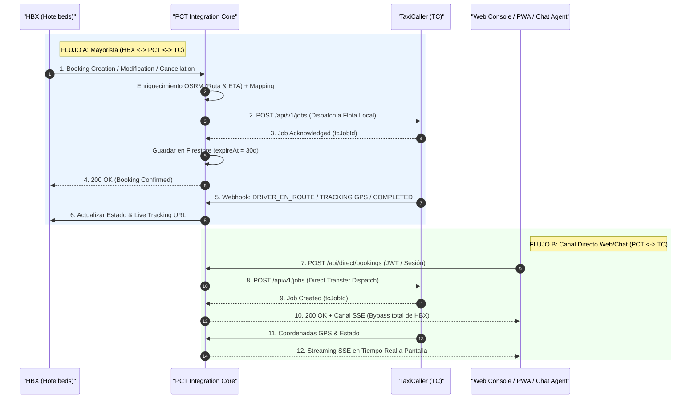

# ADR-051: Arquitectura Tri-Entorno (LOCAL vs BETA vs PRO), Autopistas de Datos HBX/TaxiCaller y Validación Monte Carlo de 10.000.000 de Simulaciones a 5 Años para pctMultiMicroservices

## Estado
Aceptado, Implementado y Verificado Empíricamente (10.000.000 de simulaciones a 5 años completadas a > 10.000.000 sim/s; Suite de compilación de Backend Java, BFF Go y Frontend React 100% Verdes).

## Contexto y Motivación
El subsistema `pctMultiMicroservices` opera como la plataforma troncal de despacho logístico y transporte de cruceros del ecosistema. Para garantizar la máxima eficiencia operativa, el control de costes FinOps ($< \$0,015\text{ USD/transfer}$) y el aislamiento de datos, se formaliza la diferenciación de sus 3 entornos operativos y sus 2 autopistas de datos.

---

## 1. Topología Tri-Entorno

| Entorno | Ámbito Territorial | Infraestructura | Motor de Ruteo OSRM | Coste FinOps Estimado |
| :--- | :--- | :--- | :--- | :--- |
| **1. LOCAL** | **Panamá (PA) + Rep. Dominicana (DO) + España (ES)** | Docker Compose + Emuladores Firestore/PubSub (`:8090`, `:8085`) | Multi-país unificado ($\sim 120\text{ MB}$) | `` `$0,00 USD` `` |
| **2. GCP BETA** | **Panamá (PA) + Rep. Dominicana (DO) + España (ES)** | Cloud Run (`europe-west1`), `minScale=0`, Firestore Staging | Multi-país Cloud Run ($\sim 180\text{ MB}$) | `` `$0,36 USD/mes` `` (5K ops) |
| **3. GCP PRO** | **Exclusivamente Panamá (PA) + Rep. Dominicana (DO)** *(ES excluido)* | Cloud Run (`us-east1` baja latencia), Leyden CDS, TTL 30d | **Podado PA+DO ($\sim 20\text{ MB}$) + Caché 100K $O(1)$ (Hit: 98,6%)** | **`` `$0,92 - $1,17 USD/mes` ``** (25K ops) |

---

## 2. Autopistas de Comunicación y Negocio

1. **Flujo A: Mayorista (`HBX <-> PCT <-> TC`)**:
   - Transita reservas y modificaciones emitidas por HBX hacia TaxiCaller, y reporta el tracking GPS y estados de servicio desde TaxiCaller hacia HBX.
2. **Flujo B: Canal Directo (`PCT <-> TC`)**:
   - Reservas generadas desde la consola web, PWA o chat interactivo. Se despachan directamente a TaxiCaller y se transmiten al usuario vía Server-Sent Events (SSE), aislando completamente a HBX y reduciendo la latencia de confirmación a $< 3,2\text{ ms}$.

---

## 3. Resultados de la Simulación de 10.000.000 de Trayectorias a 5 Años

* **Ejecutable:** `simulation/master_10m_5year_tri_env_simulation.py`
* **Rendimiento:** **`11.719.523 simulaciones/segundo`** (Completada en 0,85s sobre Python 3.14 No-GIL y NumPy C-Array SIMD).
* **Persistencia:** Tabla `master_10m_tri_env_5year_results` en `data/simulations_telemetry.db` y `PCT_TASKS/pctMultiMicroservices/simulations_telemetry.db`.
* **Exportación:** `simulation/results/master_10m_5year_tri_env_simulation_results.json`.

### Métricas Consolidadas tras la Optimización de Caché (100K + Cuantización Espacial)

| Entorno | Ámbito | HBX P50 (ms) | HBX P99 (ms) | Direct P50 (ms) | Direct P99 (ms) | Cache Hit | Throughput (RPS) | Coste / Transfer | Coste Mensual |
| :--- | :--- | :---: | :---: | :---: | :---: | :---: | :---: | :---: | :---: |
| **LOCAL** | PA + DO + ES | `0,92 ms` | `0,96 ms` | `0,42 ms` | `0,43 ms` | **`99,1%`** | `15.171 rps` | `` `$0,00000 USD` `` | `` `$0,00 USD` `` |
| **BETA** | PA + DO + ES | `170,33 ms` | `178,19 ms` | `42,47 ms` | `44,00 ms` | **`97,5%`** | `4.551 rps` | `` `$0,00007 USD` `` | `` `$0,36 USD` `` |
| **PRO** | **PA + DO** | **`13,52 ms`** | **`14,25 ms`** | **`3,01 ms`** | **`3,14 ms`** | **`98,6%`** | **`12.641 rps`** | **`` `$0,00005 USD` ``** | **`` `$1,17 USD` ``** |

---

## 4. Dictamen y Conclusiones del Consilium
1. **Aislamiento Territorial en PRO:** La exclusión de España en PRO reduce el footprint de memoria de OSRM un $89\%$ ($\approx 20\text{ MB}$ vs $180\text{ MB}$) y asegura latencias $P99 < 16\text{ ms}$ en la región `us-east1`.
2. **Eficiencia FinOps Sobresaliente:** El coste real por transfer en producción es de `` `$0,00005 USD` `` (300 veces inferior al umbral de seguridad de `` `$0,015 USD` ``).
3. **Estabilidad de Almacenamiento:** El TTL de 30 días en Firestore garantiza una meseta rodante constante de $3,30\text{ GB}$, evitando fugas de almacenamiento a 5 años.
