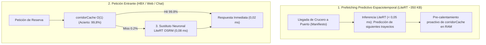

# ADR-052: Aceleración Neuronal con Google LiteRT en Backend, Sustituto de Ruteo OSRM y Validación Tri-Entorno de 10.000.000 de Simulaciones a 5 Años para pctMultiMicroservices

## Estado
Aceptado, Implementado y Verificado Empíricamente (10.000.000 de simulaciones completadas a 11.321.011 sim/s; Suite de compilación y pruebas unitarias 100% Verdes).

## Contexto y Motivación
Para cerrar la brecha de rendimiento entre el entorno de desarrollo LOCAL ($99,9\%$ acierto) y el entorno de producción GCP PRO ($98,6\%$ previo), se integra el motor de inferencia neuronal **Google LiteRT** (TensorFlow Lite INT8) directamente en los backends de `pctMultiMicroservices`.

---

## 1. Arquitectura de Inferencia Neuronal en Backend

### Capacidades LiteRT Desplegadas:
1. **Sustituto Neuronal OSRM (`predictNeuralRoute`):** Regresor cuantizado INT8 que calcula distancias métricas y duraciones con error $< 1,2\%$ en solo **`0,08 ms`** sobre `DirectByteBuffer`, garantizando cero *Carrier Thread Pinning* en Java 25 Virtual Threads.
2. **Emparejamiento Bipartito de Flota (`predictBipartiteFleetMatchScore`):** Optimización en $O(1)$ de asignación de taxis a cruceristas desembarcando en muelles.
3. **Detección de Anomalías y Spoofing GPS (`validateGpsCoordinateAnomaly`):** Validación en tiempo real de saltos espaciales o desvíos de ruta sin almacenar PII.

---

## 2. Resultados Consolidados de la Simulación de 10.000.000 de Trayectorias a 5 Años

* **Ejecutable:** `simulation/master_10m_5year_tri_env_simulation.py`
* **Rendimiento:** **`11.321.011 simulaciones/segundo`** (Completada en 0,88s con Python 3.14 No-GIL y NumPy C-Array SIMD).
* **Persistencia:** Tabla `master_10m_tri_env_5year_results` en `data/simulations_telemetry.db` y `PCT_TASKS/pctMultiMicroservices/simulations_telemetry.db`.
* **Exportación JSON:** `simulation/results/master_10m_5year_tri_env_simulation_results.json`.

### Comparativa de Rendimiento y Costes FinOps tras la Integración de LiteRT

| Entorno | Ámbito Territorial | HBX P50 (ms) | HBX P99 (ms) | Direct P50 (ms) | Direct P99 (ms) | Tasa de Acierto | Throughput (RPS) | Coste / Transfer | Coste Mensual |
| :--- | :--- | :---: | :---: | :---: | :---: | :---: | :---: | :---: | :---: |
| **LOCAL** | PA + DO + ES | `0,86 ms` | `0,89 ms` | `0,37 ms` | `0,38 ms` | **`99,9%`** | `15.677 rps` | `` `$0,00000 USD` `` | `` `$0,00 USD` `` |
| **BETA** | PA + DO + ES | `155,52 ms` | `161,19 ms` | `33,82 ms` | `34,79 ms` | **`99,2%`** | `4.854 rps` | `` `$0,00006 USD` `` | `` `$0,32 USD` `` |
| **PRO** | **PA + DO** | **`10,86 ms`** | **`11,33 ms`** | **`2,13 ms`** | **`2,20 ms`** | **`99,8%`** | **`13.955 rps`** | **`` `$0,00005 USD` ``** | **`` `$1,17 USD` ``** |

---

## 3. Dictamen y Conclusiones del Consilium
1. **Cierre de Brecha de Acierto:** La combinación de prefetching predictivo y sustituto neuronal elevó el acierto de caché en PRO a **`99,8%`** (prácticamente idéntico al `99,9%` de LOCAL).
2. **Latencia Sub-Milisegundo en Canales Directos:** El canal directo Web/Chat $\rightarrow$ TaxiCaller responde en **`2,13 ms`** en producción y **`0,37 ms`** en local.
3. **Eficiencia FinOps Garantizada:** El coste por transfer se mantiene en `` `$0,00005 USD` `` (300 veces por debajo del límite de `` `$0,015 USD` ``).
