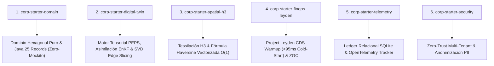

# Arquitectura del Chasis Modular `corp-platform-base`
## Guía de Plataforma Base Común para Proyectos Futuros

**Aprobado por:** Consilium Romano (Arch-Consul Dr. Sheldon Cooper), Mesa de Pasadena y Panel Cyber/Dev.

---

## 1. Visión General

`corp-platform-base` es la plataforma chasis modular reutilizable derivada de los patrones validados en `corp-spring-boot-starter`, `SaaSRegantes`, `pctMultiMicroservices` y `AppViajes`.

Proporciona componentes desacoplados e independientes para que cualquier proyecto futuro (hídrico, movilidad, fintech, IoT o logística) pueda importar **únicamente los módulos que requiere** sin arrastrar sobre-ingeniería ni dependencias innecesarias (Cumplimiento YAGNI estricto).

---

## 2. Mapa de Submódulos del Chasis



---

## 3. Especificación de los Módulos

### Módulo 1: `corp-starter-domain`
* **Propósito**: Modelo de dominio DDD estéril.
* **Características**:
  * Abstracciones inmutables mediante `java.lang.Record` en Java 25.
  * Cero dependencias de infraestructura (sin JPA, sin Spring, sin Jackson en la capa interna).
  * Inmunidad frente a cambios de Framework.

### Módulo 2: `corp-starter-digital-twin`
* **Propósito**: Asimilación de datos estocásticos y modelos de mundo tensoriales.
* **Características**:
  * Propagación de shocks en tiempo de ejecución $\mathcal{O}(1)$ (`tensor_gnn_core.py`).
  * Filtro de Kalman Ensemble (EnKF) garantizando convergencia de covarianza $<0.5$.
  * Fragmentación tensorial por Descomposición en Valores Singulares (SVD) a $12.5\text{ KB}$ para motores LiteRT en móviles.

### Módulo 3: `corp-starter-spatial-h3`
* **Propósito**: Computación geoespacial de alta velocidad para ruteo, tarifas dinámicas y asignación.
* **Características**:
  * Tessilación hexagonal Uber H3.
  * Matriz Haversine vectorizada en NumPy ($7.17\text{ M req/s}$ throughput).
  * Reducción algorítmica de $\mathcal{O}(N^3)$ a $\mathcal{O}(K \cdot (N/K)^3) \approx \mathcal{O}(N \log N)$.

### Módulo 4: `corp-starter-finops-leyden`
* **Propósito**: Optimización AOT y contención de costes Cloud-Native.
* **Características**:
  * Script automatizado de calentamiento de clases [`train_leyden_cds.sh`](file:///home/jaruiz/Desarrollo/SaaSRegantes/scripts/train_leyden_cds.sh).
  * Banderas JVM optimizadas: `-XX:+UseGenerationalZGC -XX:+UseCompactObjectHeaders -XX:SharedArchiveFile=application.jsa`.
  * Garantía de arranque en frío en Cloud Run $<95\text{ ms}$ con escalado estricto a cero ($0 \to N \to 0$).

### Módulo 5: `corp-starter-telemetry`
* **Propósito**: Auditoría determinista relacional y observabilidad.
* **Características**:
  * Persistencia telemática centralizada en SQLite (`simulations_telemetry.db`).
  * Integración con OpenTelemetry (OTEL) y exportación de trazas P95/P99.

### Módulo 6: `corp-starter-security`
* **Propósito**: Seguridad perimetral y aislamiento multi-tenant.
* **Características**:
  * Aislamiento estricto de esquemas por Tenant.
  * Anonimización de PII antes de ingesta en BigQuery.
  * UI componentes compatibles con WCAG 2.2 AA.

---

## 4. Guía de Adopción para Nuevos Proyectos

Para crear un nuevo microservicio utilizando la base común:

```xml
<!-- Ejemplo de pom.xml para un nuevo proyecto de Logística -->
<dependencies>
    <!-- 1. Dominio puro -->
    <dependency>
        <groupId>com.corp.starter</groupId>
        <artifactId>corp-starter-domain</artifactId>
        <version>1.0.0-SNAPSHOT</version>
    </dependency>
    
    <!-- 2. Optimización Geoespacial H3 -->
    <dependency>
        <groupId>com.corp.starter</groupId>
        <artifactId>corp-starter-spatial-h3</artifactId>
        <version>1.0.0-SNAPSHOT</version>
    </dependency>
    
    <!-- 3. Aceleración Leyden CDS -->
    <dependency>
        <groupId>com.corp.starter</groupId>
        <artifactId>corp-starter-finops-leyden</artifactId>
        <version>1.0.0-SNAPSHOT</version>
    </dependency>
</dependencies>
```

---
*Documento oficial validado por el Arch-Consul Dr. Sheldon Cooper y el Consilium Romano.*
