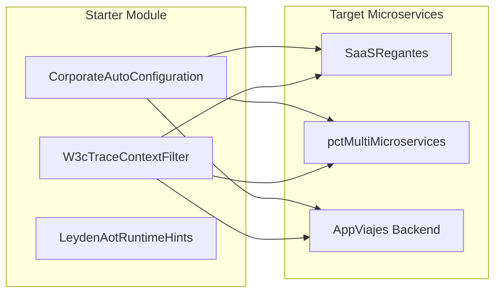

# Especificación del Starter Corporativo y Estándares de Proyecto - corp-spring-boot-starter

## 1. Propósito del Starter Corporativo

**corp-spring-boot-starter** centraliza las configuraciones comunes, clases base de dominio, adaptadores de infraestructura compartidos (Secret Manager, Cloud Logging, W3C Trace Filter) y validaciones AOT para garantizar coherencia en todos los microservicios del ecosistema.

---

## 2. Estándares Inconvenientes y Autoconfiguración Spring Boot 4.1

### Componentes Clave:
1. **`W3cTraceContextFilter`**: Intercepta automáticamente el encabezado `traceparent` de W3C u OpenTelemetry y propaga el `trace_id` de forma uniforme.
2. **`LeydenAotRuntimeHints`**: Registra reflectivamente los Records de dominio y adaptadores para el empaquetado nativo/CDS con GraalVM / HotSpot Leyden.
3. **`ZeroMockitoRuleChecker`**: Verificador estático durante el proceso de build para auditar la ausencia de dependencias de mockeo en el dominio.
