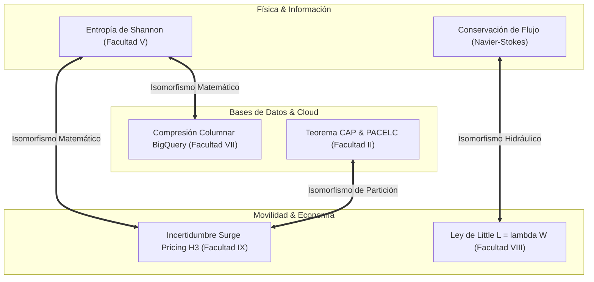

# 🌐 Grafo Isomórfico Universal Inter-Facultades
## *Universidad Privada del Ecosistema: Cátedra de Física Computacional & Teoría Unificada*

La excelencia en ingeniería de software radica en comprender que **los mismos principios matemáticos y físicos rigen dominios aparentemente no relacionados**. Este documento establece los puentes isomórficos entre las 12 Facultades del ecosistema.

---

---

### 1. 📡 La Trilogía de la Entropía: Shannon \(\leftrightarrow\) BigQuery \(\leftrightarrow\) Surge Pricing

El concepto matemático de **Entropía de la Información** (\(H(X) = -\sum p(x) \log_2 p(x)\)) descubierto por Claude Shannon en 1948 es exactamente la misma función en tres cátedras distintas:

| Cátedra | Manifestación del Concepto | Ecuación / Mecanismo |
| :--- | :--- | :--- |
| **Facultad V (Información)** | Límite físico de compresión de datos y ruido en un canal. | \(H(X) = -\sum p_i \log_2 p_i\) |
| **Facultad VII (BigQuery)** | Eficiencia de compresión columnar en Capacitor (*Dictionary Encoding & RLE*). | Si \(H(X)\) es baja (pocos valores únicos), BigQuery comprime a 1 bit por fila. |
| **Facultad IX (H3 Movilidad)** | Grado de incertidumbre en la oferta/demanda de taxis por celda hexagonal. | Si \(H(X)\) es alta (demanda impredecible), el multiplicador de *Surge Pricing* aumenta. |

---

### 2. 🌊 Conservación de Flujo: Navier-Stokes \(\leftrightarrow\) Ley de Little \(\leftrightarrow\) Cloud Tasks

El principio físico de que la materia no se destruye en un fluido incompresible se traduce de forma idéntica en sistemas de colas y procesamiento de eventos:

$$\underbrace{\nabla \cdot \mathbf{u} = 0}_{\text{Fluidos Incompresibles (Facultad V)}} \iff \underbrace{L = \lambda \cdot W}_{\text{Ley de Little en Colas (Facultad VIII)}} \iff \underbrace{\text{Tasa Ingesta} = \text{Tasa Procesamiento} + \frac{d(\text{Queue})}{dt}}_{\text{Cloud Tasks / PubSub (Facultad VII)}}$$

* **Aplicación Feynman:** Si entra más agua por una tubería de la que puede salir por el desagüe (más peticiones que capacidad de hilos en CPU), la bañera se desborda (OOM crash) a menos que tengas un tanque de reserva (Cloud Tasks Buffer).

---

### 3. ⚖️ Contratos Formales: Lógica de Hoare \(\leftrightarrow\) Linearizabilidad \(\leftrightarrow\) Rust Types

La demostración de corrección de un programa informático sigue el mismo principio algebraico:

* **Facultad I (Lógica de Hoare 1969):** Tripletas \(\{P\} \; C \; \{Q\}\) donde el estado antes de la función cumple \(P\) y tras la ejecución garantiza \(Q\).
* **Facultad II (Herlihy-Wing Linearizabilidad 1990):** Cada operación concurrente parece tener efecto de forma instantánea en un punto exacto en el tiempo entre su invocación y su respuesta.
* **Facultad I (Tipos Algebraicos & Rust):** El compilador demuestra en tiempo de compilación que no pueden existir estados inválidos ni referencias nulas en el ejecutable final.
