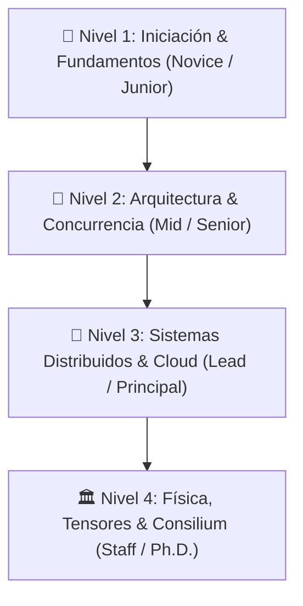

# 🗺️ Guía de Estudio Progresivo: De Junior a Staff Architect (Nivel Ph.D.)
## *Ruta de Aprendizaje Cristalina de la Universidad Privada del Ecosistema*

Esta guía está diseñada para que cualquier ingeniero novato, junior, senior o agente autónomo de IA pueda progresar paso a paso desde los fundamentos básicos hasta la cúspide de la ingeniería de software y la modelización matemática avanzada, aplicando rigurosamente el **Método Feynman** (comprensión profunda, anclas cotidianas y cero jerga defensiva).

---

---

## 🌱 NIVEL 1: INICIACIÓN & FUNDAMENTOS (Novice / Junior)
*Objetivo: Dominar el código limpio, la pureza de dominio y las estructuras de datos sin miedo a la complejidad.*

1. **Ingeniería de Software & Arquitectura Hexagonal**:
   * 📖 [Arquitectura Hexagonal y DDD Puro](file:///home/jaruiz/Desarrollo/docs/formacion_ecosistema/modulo_0_software_engineering/01_arquitectura_hexagonal_ddd_puro.md)
   * 📜 *Paper Clave:* [Out of the Tar Pit (Moseley & Marks 2006)](file:///home/jaruiz/Desarrollo/docs/formacion_ecosistema/biblioteca_papers_pdf_rfc/01_software_eng_ddd_tipos/2006_moseley_out_of_the_tar_pit.pdf)
   * 🧠 *Ancla Feynman:* La receta de cocina (dominio) nunca debe depender de la marca del horno (framework).
2. **Fundamentos de Bases de Datos & Modelo Relacional**:
   * 📖 [OLAP BigQuery y Almacenamiento Columnar](file:///home/jaruiz/Desarrollo/docs/formacion_ecosistema/modulo_7_bases_datos_nosql_multitenant/01_olap_bigquery_arquitectura_columnar.md)
   * 📜 *Paper Clave:* [A Relational Model of Data for Large Shared Data Banks (Codd 1970)](file:///home/jaruiz/Desarrollo/docs/formacion_ecosistema/biblioteca_papers_pdf_rfc/07_cloud_bigquery_finops/1970_codd_relational_model_for_large_shared_databanks.pdf)
3. **Fundamentos de Interfaces & Ergonomía (UI/UX)**:
   * 📖 [Diseño UI/UX y Sistemas de Diseño](file:///home/jaruiz/Desarrollo/docs/formacion_ecosistema/modulo_4_frontend_y_motores_ui/07_diseno_ui_ux_y_sistemas_de_diseno.md)
   * 📜 *Estándar Clave:* [10 Usability Heuristics for User Interface Design (Nielsen 1994)](file:///home/jaruiz/Desarrollo/docs/formacion_ecosistema/biblioteca_papers_pdf_rfc/08_industrial_colas_hci/1994_nielsen_10_usability_heuristics.txt)

---

## 🌿 NIVEL 2: ARQUITECTURA & CONCURRENCIA (Mid / Senior)
*Objetivo: Dominar el hardware, el runtime moderno, la concurrencia lock-free y la resiliencia en producción.*

1. **Java 25 (LTS), Loom & Memoria Plana (Valhalla)**:
   * 📖 [Desarrollo en Java 25 & Virtual Threads Loom](file:///home/jaruiz/Desarrollo/docs/formacion_ecosistema/modulo_1_backend_java_spring/)
   * 📜 *Especificación:* [JEP 491: Synchronize Virtual Threads without Pinning](file:///home/jaruiz/Desarrollo/docs/formacion_ecosistema/biblioteca_papers_pdf_rfc/03_runtime_jvm_memoria/2025_openjdk_java25_loom_virtual_threads_pinning.txt)
   * 📜 *Lectura Imprescindible:* [What Every Programmer Should Know About Memory (Ulrich Drepper 2007)](file:///home/jaruiz/Desarrollo/docs/formacion_ecosistema/biblioteca_papers_pdf_rfc/03_runtime_jvm_memoria/2007_drepper_what_every_programmer_should_know_about_memory.pdf)
2. **Concurrencia Go 1.25, CSP & Canales**:
   * 📖 [Go Runtime Internals y Goroutines](file:///home/jaruiz/Desarrollo/docs/formacion_ecosistema/modulo_2_go_y_concurrencia/)
   * 📜 *Paper Clave:* [Communicating Sequential Processes (Hoare 1978)](file:///home/jaruiz/Desarrollo/docs/formacion_ecosistema/biblioteca_papers_pdf_rfc/04_concurrencia_go_csp/1978_hoare_csp.pdf)
   * 📜 *Paper Clave:* [The LMAX Disruptor (Thompson 2011)](file:///home/jaruiz/Desarrollo/docs/formacion_ecosistema/biblioteca_papers_pdf_rfc/04_concurrencia_go_csp/2011_thompson_lmax_disruptor.pdf)
3. **Frontend de Alto Rendimiento & Motor Gráfico**:
   * 📖 [Arquitectura Flutter & Impeller GPU Engine](file:///home/jaruiz/Desarrollo/docs/formacion_ecosistema/modulo_4_frontend_y_motores_ui/02_arquitectura_flutter_y_skia.md)
   * 📜 *Estándar:* [Google Core Web Vitals Specification (INP, LCP, CLS)](file:///home/jaruiz/Desarrollo/docs/formacion_ecosistema/biblioteca_papers_pdf_rfc/08_industrial_colas_hci/2024_google_core_web_vitals_inp_lcp_cls.txt)

---

## 🌳 NIVEL 3: SISTEMAS DISTRIBUIDOS & CLOUD NATIVE (Lead / Principal)
*Objetivo: Diseñar sistemas tolerantes a particiones, consenso distribuido, Sagas e infraestructura global.*

1. **Consenso Distribuido, Causalidad & Linearizabilidad**:
   * 📖 [Sistemas Distribuidos & Algoritmos de Consenso](file:///home/jaruiz/Desarrollo/docs/formacion_ecosistema/modulo_0_sistemas_distribuidos/)
   * 📜 *Paper Clave:* [In Search of an Understandable Consensus Algorithm - Raft (Ongaro 2014)](file:///home/jaruiz/Desarrollo/docs/formacion_ecosistema/biblioteca_papers_pdf_rfc/02_sistemas_distribuidos_consenso/2014_ongaro_raft_consensus_extended.pdf)
   * 📜 *Paper Clave:* [Linearizability: Correctness for Concurrent Objects (Herlihy & Wing 1990)](file:///home/jaruiz/Desarrollo/docs/formacion_ecosistema/biblioteca_papers_pdf_rfc/02_sistemas_distribuidos_consenso/1990_herlihy_wing_linearizability.pdf)
   * 📜 *Paper Clave:* [Paxos Made Simple (Lamport 2001)](file:///home/jaruiz/Desarrollo/docs/formacion_ecosistema/biblioteca_papers_pdf_rfc/02_sistemas_distribuidos_consenso/2001_lamport_paxos_made_simple.pdf)
2. **Cloud-Native, Big Data & Escalamiento Exaescala (Google GCP)**:
   * 📖 [Cloud Run, BigQuery & Arquitectura Serverless](file:///home/jaruiz/Desarrollo/docs/formacion_ecosistema/modulo_5_cloud_native_dbs/)
   * 📜 *Paper Clave:* [Spanner: Google's Globally-Distributed Database (Corbett & Dean 2012)](file:///home/jaruiz/Desarrollo/docs/formacion_ecosistema/biblioteca_papers_pdf_rfc/07_cloud_bigquery_finops/2012_corbett_dean_spanner_database.pdf)
   * 📜 *Paper Clave:* [Dremel: Interactive Analysis of Web-Scale Datasets (Melnik 2010)](file:///home/jaruiz/Desarrollo/docs/formacion_ecosistema/biblioteca_papers_pdf_rfc/07_cloud_bigquery_finops/2010_melnik_dremel_interactive_analysis.pdf)
3. **Fintech, Idempotencia Transaccional & Sagas**:
   * 📖 [Stripe Connect, Escrow & Sagas](file:///home/jaruiz/Desarrollo/docs/formacion_ecosistema/modulo_9_fintech_facturacion_stripe_sagas/01_stripe_connect_escrow_multi_tenant.md)
   * 📜 *Paper Clave:* [Sagas: Distributed Long-Lived Transactions (Garcia-Molina 1987)](file:///home/jaruiz/Desarrollo/docs/formacion_ecosistema/biblioteca_papers_pdf_rfc/10_fintech_stripe_sagas/1987_garcia_molina_sagas.pdf)
4. **Seguridad Soberana & Zero-Trust**:
   * 📖 [BeyondCorp Zero-Trust Architecture](file:///home/jaruiz/Desarrollo/docs/formacion_ecosistema/modulo_10_identidad_zero_trust_beyondcorp/01_beyondcorp_zero_trust_architecture.md)
   * 📜 *Paper Clave:* [New Directions in Cryptography (Diffie & Hellman 1976)](file:///home/jaruiz/Desarrollo/docs/formacion_ecosistema/biblioteca_papers_pdf_rfc/11_identidad_zerotrust_beyondcorp/1976_diffie_hellman_new_directions_in_cryptography.pdf)
   * 📜 *Estándar NIST:* [NIST SP 800-207 Zero Trust Architecture (2020)](file:///home/jaruiz/Desarrollo/docs/formacion_ecosistema/biblioteca_papers_pdf_rfc/11_identidad_zerotrust_beyondcorp/2020_nist_sp800_207_zero_trust.pdf)

---

## 🏛️ NIVEL 4: FÍSICA, TENSORES & CONSILIUM (Staff / Fellow Ph.D.)
*Objetivo: Dominar el Gemelo Digital Unificado, redes tensoriales PEPS, asimilación estocástica EnKF e IA generativa en el Edge.*

1. **Inteligencia Artificial Generativa, Transformers & Edge LiteRT**:
   * 📖 [Arquitectura de Transformers & RAG](file:///home/jaruiz/Desarrollo/docs/formacion_ecosistema/modulo_3_unified_twin_math/09_arquitectura_transformers.md)
   * 📜 *Paper Clave:* [Attention Is All You Need (Vaswani et al. 2017)](file:///home/jaruiz/Desarrollo/docs/formacion_ecosistema/biblioteca_papers_pdf_rfc/06_edge_ai_litert_neurosimbolico/2017_vaswani_attention_is_all_you_need.pdf)
   * 📜 *Paper Clave:* [Quantization for Integer-Arithmetic Inference LiteRT (Jacob et al. 2018)](file:///home/jaruiz/Desarrollo/docs/formacion_ecosistema/biblioteca_papers_pdf_rfc/06_edge_ai_litert_neurosimbolico/2018_jacob_integer_quantization_inference.pdf)
   * 📜 *Paper Clave:* [HNSW Vector Graph Search (Malkov 2018)](file:///home/jaruiz/Desarrollo/docs/formacion_ecosistema/biblioteca_papers_pdf_rfc/06_edge_ai_litert_neurosimbolico/2018_malkov_hnsw_vector_search.pdf)
2. **Gemelo Digital Unificado, Tensores PEPS & PINNs**:
   * 📖 [Fundamentos de Álgebra Tensorial & PEPS](file:///home/jaruiz/Desarrollo/docs/formacion_ecosistema/modulo_3_unified_twin_math/01_fundamentos_algebra_tensorial_numpy.md)
   * 📜 *Paper Clave:* [PEPS Tensor Networks (Verstraete & Cirac 2008)](file:///home/jaruiz/Desarrollo/docs/formacion_ecosistema/biblioteca_papers_pdf_rfc/05_gemelo_digital_tensores_enkf/2008_verstraete_peps_tensor_networks.pdf)
   * 📜 *Paper Clave:* [Physics-Informed Neural Networks - PINNs (Raissi et al. 2019)](file:///home/jaruiz/Desarrollo/docs/formacion_ecosistema/biblioteca_papers_pdf_rfc/05_gemelo_digital_tensores_enkf/2019_raissi_pinns_deep_learning.pdf)
   * 📜 *Paper Clave:* [A Mathematical Theory of Communication (Claude Shannon 1948)](file:///home/jaruiz/Desarrollo/docs/formacion_ecosistema/biblioteca_papers_pdf_rfc/05_gemelo_digital_tensores_enkf/1948_shannon_mathematical_theory_of_communication.pdf)
3. **Tribunal de Arquitectura & Consilium Romano 3.0**:
   * ⚖️ Ejecución del Tribunal: `python3 scripts/consilium_romano_tribunal.py --audit-all`
   * 🎯 Autoevaluación Interactiva: `python3 scripts/feynman_interactive_tutor.py --quiz`
