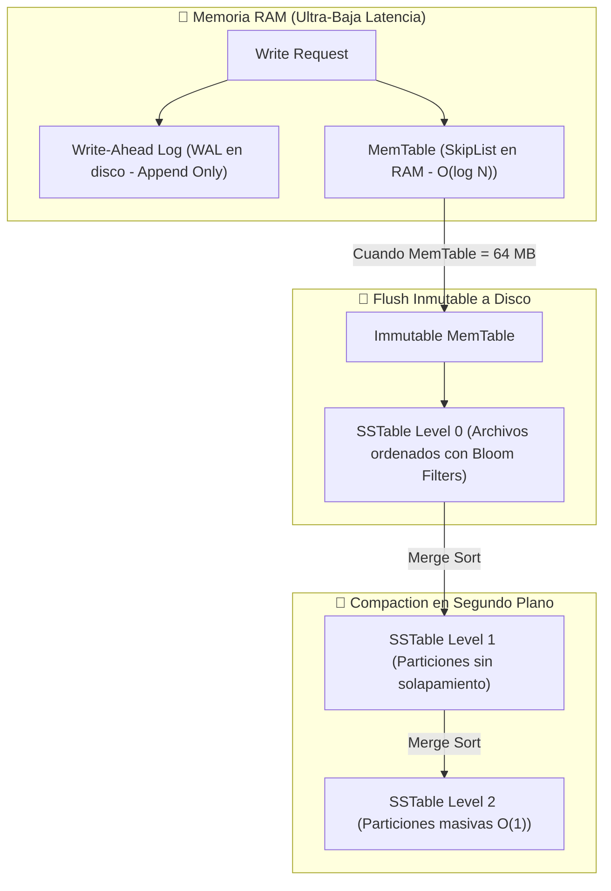

# 📐 Mapas de Memoria, Microarquitectura CPU y Layouts Físicos
## *Universidad Privada del Ecosistema: Cátedra de Hardware & Runtime Internals*

Este documento detalla la estructura física a nivel de bytes, palabras de máquina y líneas de caché de las estructuras de datos fundamentales del ecosistema (`Java 25 Valhalla`, `LMAX Disruptor`, `Uber H3 Indexing` y `LSM-Trees`).

---

### 1. ☕ Java 25 Valhalla vs HotSpot Clásico: Layout Físico en RAM

En la JVM tradicional, cada instancia de objeto tiene una cabecera (*Object Header*) obligatoria de 12 a 16 bytes que destruye la densidad de la caché L1.

```
OBJETO TRADICIONAL HOTSPOT (Point class con x: int, y: int) -> 24 BYTES EN HEAP
+-------------------------------------------------------------------------------+
| Mark Word (64 bits / 8 bytes)  : Locking, GC Age, Identity Hashcode           |
+-------------------------------------------------------------------------------+
| Klass Word (32-64 bits / 8 B)  : Puntero a Metadata de Clase en Metaspace     |
+-------------------------------------------------------------------------------+
| int x (32 bits / 4 bytes)      | int y (32 bits / 4 bytes)                    |
+-------------------------------------------------------------------------------+
| Padding (0-4 bytes para alinear a múltiplos de 8 bytes en memoria)            |
+-------------------------------------------------------------------------------+
  ⚠️ Array de 1,000 Points: 1,000 punteros de 8 bytes + 1,000 objetos = 32 KB
  (Dispersos en RAM -> Fallos constantes de caché L1 / Pointer Chasing).

VALUE OBJECT PROJECT VALHALLA (JEP 401: Value Point con x: int, y: int) -> 8 BYTES
+-------------------------------+-------------------------------+
| int x (32 bits / 4 bytes)     | int y (32 bits / 4 bytes)     |
+-------------------------------+-------------------------------+
  ✅ Cero Mark Word. Cero Klass Word. Cero Punteros Indireccionales.
  ✅ Array de 1,000 Points en RAM: Bloque contiguo de exactamente 8,000 bytes.
  ✅ Una sola línea de caché L1 (64 bytes) carga 8 Points contiguos en 1 ciclo CPU.
```

---

### 2. ⚡ LMAX Disruptor: Aislamiento de Línea de Caché L1 (Evitar False Sharing)

Una línea de caché L1 típica en procesadores x86_64 y ARM64 mide exactamente **64 bytes**. Si dos hilos escriben en variables distintas dentro de los mismos 64 bytes, el protocolo MESI invalida la línea en ambos núcleos.

```
MEMORIA SIN PADDING (FALSE SHARING ACTIVO)
Linea de Caché L1 #42 (64 Bytes)
+------------------------+------------------------+-----------------------------+
| Secuencia Productor    | Secuencia Consumidor   | Datos no relacionados...    |
| (uint64 = 8 bytes)     | (uint64 = 8 bytes)     | (48 bytes)                  |
+------------------------+------------------------+-----------------------------+
   Core 0 (Escribe)           Core 1 (Escribe)
      \                          /
       \------- CONFLICTO ------/ (Protocolo de coherencia MESI invalida caché)

MEMORIA CON PADDING DE 56 BYTES (AISLAMIENTO MECÁNICO L1)
Linea de Caché L1 #42 (64 Bytes)
+------------------------+------------------------------------------------------+
| Secuencia Productor    | 7 x uint64 de Relleno Vacío (Padding = 56 Bytes)     |
| (uint64 = 8 bytes)     | Cero otros hilos pueden tocar esta línea             |
+------------------------+------------------------------------------------------+
Linea de Caché L1 #43 (64 Bytes)
+------------------------+------------------------------------------------------+
| Secuencia Consumidor   | 7 x uint64 de Relleno Vacío (Padding = 56 Bytes)     |
| (uint64 = 8 bytes)     | Cero otros hilos pueden tocar esta línea             |
+------------------------+------------------------------------------------------+
   Core 0 escribe en L1 #42 | Core 1 escribe en L1 #43 -> CERO INVALIDACIONES (~10x Speedup)
```

---

### 3. 🗺️ Uber H3: Estructura de Bits de un Índice Espacial Hexagonal (64 Bits)

Cada celda espacial del planeta se codifica en un único entero sin signo `uint64_t` de 64 bits, permitiendo búsquedas y ordenamientos en tiempo constante \(\mathcal{O}(1)\).

```
MAPA DE BITS DE UN ÍNDICE H3 (64 BITS)
 0   1-4    5-8    9-15   16-18  19-21  22-24  25-27  28-30  31-33 ... 58-60  61-63
+---+------+------+------+------+------+------+------+------+------+     +------+------+
| R | Mode | Res  | Base | Dir1 | Dir2 | Dir3 | Dir4 | Dir5 | Dir6 | ... |Dir14 |Dir15 |
+---+------+------+------+------+------+------+------+------+------+     +------+------+
| 1 |  4b  |  4b  |  7b  |  3b  |  3b  |  3b  |  3b  |  3b  |  3b  | ... |  3b  |  3b  |
+---+------+------+------+------+------+------+------+------+------+     +------+------+

CAMPOS:
- Bit 0      : Reservado (0)
- Bits 1-4   : Modo de índice H3 (1 = Celda Hexagonal estándar)
- Bits 5-8   : Resolución Espacial (0 a 15, donde Res 8 = ~460 metros)
- Bits 9-15  : Índice de la Celda Base (0 a 121 pentágonos/hexágonos del icosaedro)
- Bits 16-60 : 15 dígitos direccionales de 3 bits (0 a 6) para descender jerárquicamente
- Bits 61-63 : Relleno con 7s binarios (111) para resoluciones menores
```

---

### 4. 🗄️ LSM-Tree: Pipeline de Almacenamiento en Memoria y Disco

La arquitectura de almacenamiento estructurado en log (Bigtable, RocksDB, Firestore Internals) transforma escrituras aleatorias lentas en escrituras secuenciales continuas.


