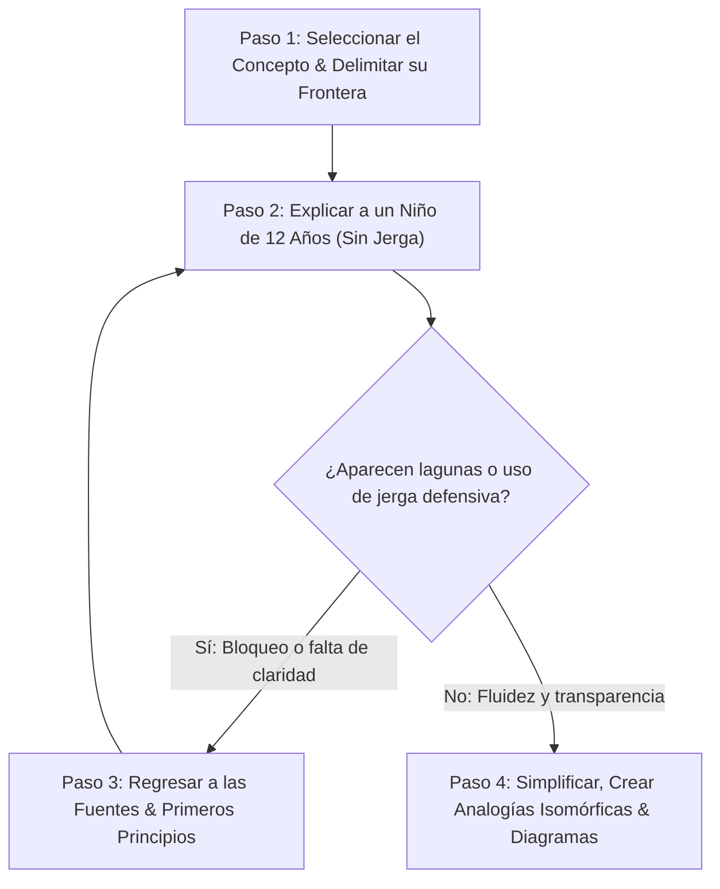

# 🧠 GUÍA PEDAGÓGICA Y MANUAL DEL MÉTODO FEYNMAN
## *Estándar de Claridad, Modelos Mentales y Primeros Principios para la Universidad del Ecosistema*

---

### 🏛️ 1. Filosofía del Método Feynman en Ingeniería y Ciencia

El físico **Richard Feynman** (Premio Nobel de Física 1965) estableció una distinción epistemológica fundamental:

> *"Saber el nombre de algo no significa que entiendas ese algo. Conocer la etiqueta te da una ilusión de conocimiento, pero solo cuando puedes descomponer el mecanismo en sus partes mecánicas fundamentales y explicárselo a un profano sin usar jerga, demuestras verdadero dominio."*

En un ecosistema con alta densidad técnica (Java 25, Loom, GraalVM AOT, BigQuery Capacitor, Redes Tensoriales PEPS, Filtrado EnKF, Consenso Raft y Zero-Trust), el mayor riesgo es la **complejidad accidental** y la **ilusión de competencia**.

El **Método Feynman** actúa como el *filtro supremo de simplicidad y veracidad* (*Navaja de Ockham*): si un diseño, patrón o algoritmo no puede explicarse a partir de primeros principios en términos intuitivos, contiene sobreingeniería (*over-engineering*) o vacíos de comprensión.

---

### 🔄 2. El Algoritmo Feynman de 4 Pasos



#### Paso 1: Seleccionar el Concepto y Definir la Frontera
* Delimitar con precisión qué se está explicando (ej. *«¿Cómo gestiona la JVM la alternancia de Virtual Threads sin bloquear el hilo de sistema operativo?»*).
* Prohibido abarcar múltiples abstracciones heterogéneas en un solo salto explicativo.

#### Paso 2: Explicarlo a un Principiante (El Test de los 12 Años)
* Escribir la explicación utilizando lenguaje directo, claro y cotidiano.
* **Regla Anti-Buzzword**: Prohibido usar palabras técnicas sin haber construido previamente su significado mecánico (ej. no decir *"aplicamos un circuit breaker con fallback"* sin explicar que *"es como un fusible eléctrico que se corta cuando detecta demasiada corriente para que no se queme la casa"*).

#### Paso 3: Identificar Lagunas y Volver a las Fuentes
* Cada vez que se sienta la tentación de usar una palabra compleja para tapar un hueco, detenerse.
* Consultar la fuente canónica: el código fuente del JDK, el paper de Lamport sobre Paxos, el manual de instrucciones del procesador x86/ARM o las especificaciones RFC.

#### Paso 4: Construir Analogías Isomórficas y Simplificar
* Crear una analogía que comparta la **misma topología causal y matemática** que el sistema real (no una metáfora superficial que induzca a error).
* Condensar la idea hasta que pueda enunciarse en una ecuación o en un diagrama mínimo de interacción.

---

### 📐 3. Plantilla Estándar Feynman para Lecciones del Ecosistema

Toda lección y módulo del ecosistema debe estructurarse obligatoriamente bajo las siguientes **5 Secciones Feynman**:

```markdown
# Módulo X - Lección Y: [Nombre del Concepto]

---

## 1. 🐣 Ancla Mental Feynman & Analogía Isomórfica
* Analogía intuitiva del mundo real que reproduce fielmente la física o la lógica del sistema.
* Explicación en lenguaje llano comprensible para un perfil junior sin experiencia previa.

---

## 2. 🔬 Primeros Principios & Desglose Mecánico
* Qué ocurre realmente en la máquina: memoria RAM, registros de CPU, ciclos de reloj, red y almacenamiento.
* Demostración de por qué existe el problema antes de proponer la solución.

---

## 3. 🚀 Arquitectura Práctica & Código en O(1) / O(N)
* Implementación concreta, limpia y sin sobreingeniería (Zero-Mockito, Records Java 25, Go CSP puro).
* Diagrama Mermaid de flujo causal o secuencia.

---

## 4. 🧠 Internals Avanzados (Nivel Ph.D. / Staff Fellow)
* Rigor matemático o de bajo nivel: teoremas formales, análisis asintótico Big-O, optimizaciones AOT/Leyden o física tensorial.

---

## 5. 🎯 Desafío Feynman & Auto-Evaluación sin Jerga
* **El Reto de los 12 Años**: Preguntas donde el estudiante/agente debe explicar el funcionamiento sin usar los 4 términos técnicos clave del tema.
* Criterio de superación binario (Pasa / No Pasa).
```

---

### 🧪 4. Ejemplos de Analogías Isomórficas del Ecosistema

| Concepto Técnico | Jerga Habitual (A evitar al inicio) | Analogía Isomórfica Feynman |
| :--- | :--- | :--- |
| **Virtual Threads (Java Loom)** | *"Fibras ligeras en espacio de usuario con continuaciones delimitadas montadas en ForkJoinPool."* | **El Marcapáginas en la Cocina**: Un cocinero (Carrier Thread) no se queda mirando la puerta del horno esperando 10 minutos a que se hornee un pastel (I/O bloqueante); deja un marcapáginas con la receta en la mesa (Heap) y atiende otra comanda. Cuando suena el timbre del horno, cualquier cocinero disponible recoge el marcapáginas y continúa donde lo dejó. |
| **Circuit Breaker** | *"Máquina de estados finita con transiciones Closed, Open y Half-Open que intercepta fallos en cascada."* | **El Fusible Eléctrico del Hogar**: Si un electrodoméstico sufre un cortocircuito, el fusible salta para aislar la avería y evitar que se incendie toda la instalación eléctrica de la casa. Tras un tiempo, subes la palanca con cuidado (Half-Open); si la luz aguanta, vuelve a funcionar normal. |
| **Indexación H3 (Uber)** | *"Teselación espacial jerárquica basada en poliedros icosaédricos con métrica de adyacencia uniforme."* | **El Tablero de Panal de Abejas**: Si divides el mapa en cuadrados, las esquinas están más lejos del centro que los lados. Las abejas usan hexágonos porque todos los vecinos están exactamente a la misma distancia del centro, facilitando calcular quién está cerca sin hacer trigonometría pesada. |
| **Consenso Raft / Paxos** | *"Protocolo de replicación de máquinas de estados con quórum mayoritario y logs monótonos ordenados por épocas."* | **El Cuaderno Notarial del Pueblo**: Para comprar un terreno, no basta con decírselo al vecino. Se necesita que la mayoría de los notarios del pueblo anoten la transacción en su cuaderno en la misma página. Si uno de los notarios se enferma o cae, el resto sigue validando acuerdos porque la mayoría viva sabe cuál fue el último acuerdo firmado. |
| **Zero-Trust (BeyondCorp)** | *"Perímetro definido por software con validación contextual de identidades y mTLS continuo."* | **El Guardaespaldas dentro del Edificio**: En lugar de confiar en cualquiera solo porque cruzó la puerta de la calle, cada habitación, cajón y pasillo del edificio tiene un guardia que te pide el pasaporte y la huella digital cada vez que intentas abrir una puerta, sin importar quién seas ni de dónde vengas. |

---

### 🛡️ 5. El Índice Feynman en el Consilium Romano

Durante la fase de revisión y auditoría (`scripts/consilium_romano_tribunal.py`), los agentes del tribunal evalúan el **Índice Feynman (\(I_F\))** de cualquier nueva especificación, módulo o ADR:

\[
I_F = \frac{\text{Claridad en Primeros Principios} + \text{Fidelidad de la Analogía} + \text{Eficacia del Desafío Anti-Jerga}}{3}
\]

* **\(I_F \ge 0.90\) (Summa Cum Laude)**: Aprobado. El documento explica la física real del software de forma transparente.
* **\(I_F < 0.75\) (Rechazado)**: Devuelto al autor por sobreingeniería semántica o justificaciones abstractas sin grounding mecánico.


---
## 🧠 Ejercicio Práctico: El Método Feynman

Para garantizar una asimilación profunda de los conceptos presentados en este módulo, aplica el **Método Feynman**:

> **Instrucción:** Explica los conceptos centrales de este módulo como si tu audiencia fuera un estudiante brillante de 12 años que no ha visto nunca este tema. Si no puedes hacerlo con lenguaje sencillo, analogías claras y sin jerga técnica, significa que aún no lo entiendes lo suficientemente bien.

*Inténtalo tú mismo:* Toma el concepto más complejo de este módulo, escríbelo en un papel en blanco y redáctalo usando únicamente términos cotidianos.
