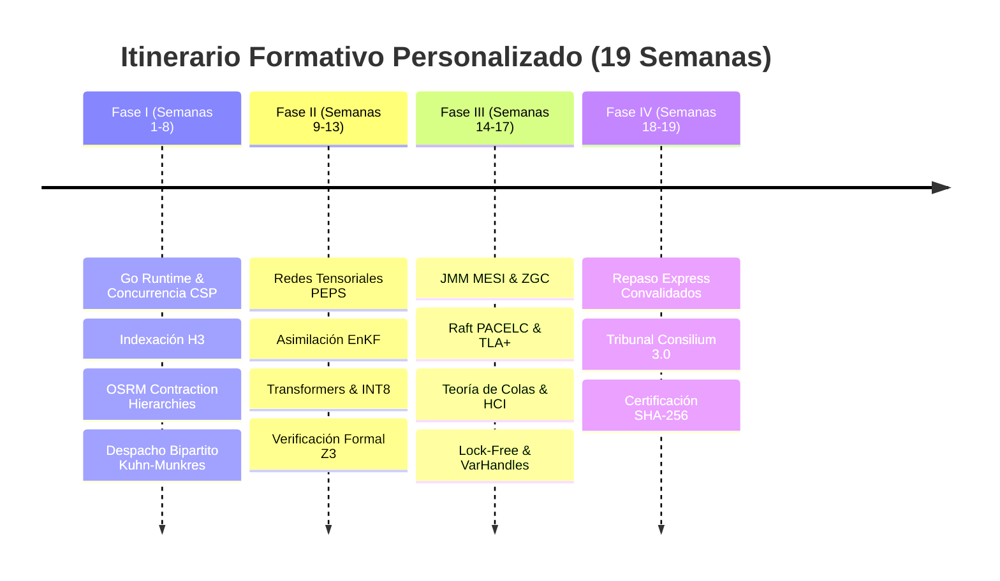
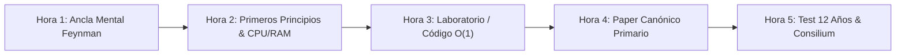

# 🗺️ MI PLAN DE ESTUDIO PERSONALIZADO & ITINERARIO ADAPTATIVO
## *Universidad Privada del Ecosistema — Generado el 2026-08-17 tras Examen Diagnóstico*

> [!IMPORTANT]
> **Resumen del Diagnóstico**: Has demostrado un nivel sobresaliente (**Staff / Senior**) en 8 de las 12 facultades (Arquitectura DDD, Backend Cloud, Fintech, Zero-Trust y SLSA L3).
> **Optimización de Tiempo**: El plan estándar de 225 horas se ha **reducido a 92 horas netas**, convalidando tus conocimientos previos y concentrando tu esfuerzo de **5 horas/semana durante 19 semanas (~4.5 meses)** en tus áreas clave de crecimiento: **Go Concurrente, Ingeniería Geoespacial H3/OSRM, Gemelo Digital Tensorial y Edge AI**.
> **Integridad Absoluta**: Toda la base teórica existente en [`docs/formacion_ecosistema/`](file:///home/jaruiz/Desarrollo/docs/formacion_ecosistema/) se mantiene intacta y enlazada de forma interactiva.

---

## 🛠️ 0. Kit de Inicio & Preparación Rápida (Entorno Verificado)

Para seguir el curso con la máxima calidad, rigor y fluidez, todo tu entorno local ya se encuentra **100% instalado y verificado** en tu máquina:

### A. Runtimes y Compiladores Locales (Verificados)
* ☕ **Java 25 (LTS)**: OpenJDK Temurin-25 con soporte completo para Virtual Threads (Loom JEP 491), Class Data Sharing (Leyden CDS) y Foreign Function & Memory API (Panama).
* 🐹 **Go 1.26.0**: Compilador y runtime de Go con planificador M:N, análisis de escapes (`go build -gcflags="-m"`) y soporte de concurrencia CSP pura.
* 🐍 **Python 3.14**: Entorno científico equipado con librerías numéricas y de verificación formal (`numpy`, `scipy`, `z3-solver` y `sqlite3`).

### B. Herramientas de Estudio Recomendadas
1. **Visor Markdown con soporte Mermaid y KaTeX**:
   * Tu editor actual (IntelliJ IDEA / VS Code) con soporte para renderizado gráfico de diagramas Mermaid y fórmulas matemáticas en LaTeX.
2. **El Cuaderno Feynman (Físico o Digital)**:
   * Dedica un cuaderno de notas físico o un espacio en Notion para la **Hora 5 semanal (Test de los 12 Años)**: explicar en papel en blanco cada concepto con analogías cotidianas y sin jerga técnica.
3. **Lector de PDFs**:
   * Para consultar los 130 papers originales en [`biblioteca_papers_pdf_rfc/`](file:///home/jaruiz/Desarrollo/docs/formacion_ecosistema/biblioteca_papers_pdf_rfc/).

### C. Comandos de Asistencia y Tutoría Rápida
* **Autoevaluación Interactiva & Tutor**:
  ```bash
  python3 /home/jaruiz/Desarrollo/scripts/feynman_interactive_tutor.py --quiz
  ```
* **Auditoría de Calidad y Calificación**:
  ```bash
  python3 /home/jaruiz/Desarrollo/scripts/audit_feynman_knowledge_quality.py
  ```
* **Auditoría de Código y Tribunal Consilium Romano**:
  ```bash
  python3 /home/jaruiz/Desarrollo/scripts/consilium_romano_tribunal.py --audit-all
  ```

---

## 📊 1. Matriz de Resultados del Diagnóstico por Facultad

| Facultad / Eje Temático | Aciertos | Nivel Diagnosticado | Horas Asignadas | Módulos y Referencias Clave |
| :--- | :---: | :--- | :---: | :--- |
| **I. Ingeniería de Software & DDD Puro** | `4 / 4` | **Nivel 3/4: Staff / Fellow** (Convalidado) | **2 h** | [`modulo_0_software_engineering`](file:///home/jaruiz/Desarrollo/docs/formacion_ecosistema/modulo_0_software_engineering/) |
| **II. Sistemas Distribuidos & Consenso** | `3 / 4` | **Nivel 2: Senior** (Consolidación PACELC/TLA+) | **6 h** | [`modulo_0_sistemas_distribuidos`](file:///home/jaruiz/Desarrollo/docs/formacion_ecosistema/modulo_0_sistemas_distribuidos/) |
| **III. Runtime JVM, Java 25 & Loom** | `3 / 4` | **Nivel 2: Senior** (Consolidación JMM/ZGC) | **6 h** | [`modulo_1_backend_java_spring`](file:///home/jaruiz/Desarrollo/docs/formacion_ecosistema/modulo_1_backend_java_spring/) |
| **IV. Concurrencia Go CSP & Runtime** | `0 / 4` | **Nivel 0: Iniciación** (Itinerario Completo) | **20 h** | [`modulo_2_go_y_concurrencia`](file:///home/jaruiz/Desarrollo/docs/formacion_ecosistema/modulo_2_go_y_concurrencia/) |
| **V. Gemelo Digital, Tensores PEPS & EnKF** | `2 / 4` | **Nivel 1: Junior** (Consolidación Física/Matemáticas) | **12 h** | [`modulo_3_unified_twin_math`](file:///home/jaruiz/Desarrollo/docs/formacion_ecosistema/modulo_3_unified_twin_math/) |
| **VI. Edge AI LiteRT & Verificación Formal** | `2 / 4` | **Nivel 1: Junior** (Transformers & SMT Solvers) | **12 h** | [`modulo_4_frontend_y_motores_ui`](file:///home/jaruiz/Desarrollo/docs/formacion_ecosistema/modulo_4_frontend_y_motores_ui/) |
| **VII. Cloud-Native, BigQuery & FinOps** | `4 / 4` | **Nivel 3/4: Staff / Fellow** (Convalidado) | **2 h** | [`modulo_5_cloud_native_dbs`](file:///home/jaruiz/Desarrollo/docs/formacion_ecosistema/modulo_5_cloud_native_dbs/) |
| **VIII. Industrial, Teoría de Colas & HCI** | `3 / 4` | **Nivel 2: Senior** (Consolidación Colas/Little) | **6 h** | [`modulo_0_ingenieria_industrial`](file:///home/jaruiz/Desarrollo/docs/formacion_ecosistema/modulo_0_ingenieria_industrial/) |
| **IX. Geoespacial H3, OSRM & Movilidad** | `0 / 4` | **Nivel 0: Iniciación** (Itinerario Completo) | **20 h** | [`modulo_8_ingenieria_geoespacial_h3_osrm`](file:///home/jaruiz/Desarrollo/docs/formacion_ecosistema/modulo_8_ingenieria_geoespacial_h3_osrm/) |
| **X. Fintech, Stripe Connect & Sagas** | `4 / 4` | **Nivel 3/4: Staff / Fellow** (Convalidado) | **2 h** | [`modulo_9_fintech_facturacion_stripe_sagas`](file:///home/jaruiz/Desarrollo/docs/formacion_ecosistema/modulo_9_fintech_facturacion_stripe_sagas/) |
| **XI. Identidad & Zero-Trust BeyondCorp** | `4 / 4` | **Nivel 3/4: Staff / Fellow** (Convalidado) | **2 h** | [`modulo_10_identidad_zero_trust_beyondcorp`](file:///home/jaruiz/Desarrollo/docs/formacion_ecosistema/modulo_10_identidad_zero_trust_beyondcorp/) |
| **XII. Supply Chain SLSA L3 & GitOps** | `4 / 4` | **Nivel 3/4: Staff / Fellow** (Convalidado) | **2 h** | [`modulo_11_supply_chain_security_slsa_gitops`](file:///home/jaruiz/Desarrollo/docs/formacion_ecosistema/modulo_11_supply_chain_security_slsa_gitops/) |
| **TOTALES** | **31 / 48 (65%)** | **Perfil: Staff Architect con Gaps en Go/Física/Geo** | **92 horas** | **19 semanas a 5h/semana** |

---

## 🗓️ 2. Calendario de Estudio Semana a Semana (5 Horas / Semana)



### 🚀 FASE I: Fundamentos Nuevos y Concurrencia (Semanas 1 a 8 - 40h)
*Objetivo: Dominar el runtime de Go, canales CSP y la ingeniería geoespacial H3/OSRM.*

* **📅 Semana 1 (5h) — Go Básico & Runtime M:N**:
  * 📖 [Arquitectura y Runtime Go (Planificador M:N y Work Stealing)](file:///home/jaruiz/Desarrollo/docs/formacion_ecosistema/modulo_2_go_y_concurrencia/01_arquitectura_y_runtime_go.md) (2.5 h).
  * 🧪 Laboratorio: [`laboratorios/01_go_fundamentos_desde_cero.md`](file:///home/jaruiz/Desarrollo/docs/formacion_ecosistema/modulo_2_go_y_concurrencia/laboratorios/01_go_fundamentos_desde_cero.md) (2.5 h).
* **📅 Semana 2 (5h) — Concurrencia CSP & Canales en Go**:
  * 📖 [Modelo de Concurrencia CSP (Channels, Select y Deadlocks)](file:///home/jaruiz/Desarrollo/docs/formacion_ecosistema/modulo_2_go_y_concurrencia/02_modelo_de_concurrencia_csp.md) (2.5 h).
  * 📜 Paper: [Communicating Sequential Processes (Hoare 1978)](file:///home/jaruiz/Desarrollo/docs/formacion_ecosistema/biblioteca_papers_pdf_rfc/04_concurrencia_go_csp/1978_hoare_csp.pdf) (2.5 h).
* **📅 Semana 3 (5h) — Memoria, Escape Analysis & GC Tricolor en Go**:
  * 📖 [Gestión de Memoria y Tricolor GC en Go](file:///home/jaruiz/Desarrollo/docs/formacion_ecosistema/modulo_2_go_y_concurrencia/03_gestion_de_memoria_y_gc_go.md) (2.5 h).
  * 🧪 Laboratorio: [`laboratorios/01_go_concurrency_memory_opt.md`](file:///home/jaruiz/Desarrollo/docs/formacion_ecosistema/modulo_2_go_y_concurrencia/laboratorios/01_go_concurrency_memory_opt.md) (2.5 h).
* **📅 Semana 4 (5h) — Patrones Avanzados, sync.Pool & Worker Pools**:
  * 📖 [Patrones Avanzados de Concurrencia en Go](file:///home/jaruiz/Desarrollo/docs/formacion_ecosistema/modulo_2_go_y_concurrencia/04_patrones_avanzados_concurrencia_go.md) (2.5 h).
  * 🧪 Laboratorio: [`03_lab_false_sharing_cache_line_padding.go`](file:///home/jaruiz/Desarrollo/docs/formacion_ecosistema/laboratorios_practicos/03_lab_false_sharing_cache_line_padding.go) (2.5 h).
* **📅 Semana 5 (5h) — Indexación Espacial Discreta Uber H3**:
  * 📖 [Indexación Espacial H3 y Geometría Icosaédrica](file:///home/jaruiz/Desarrollo/docs/formacion_ecosistema/modulo_8_ingenieria_geoespacial_h3_osrm/01_indexacion_espacial_h3_geometria.md) (2.5 h).
  * 📜 Paper: [H3: Uber's Hexagonal Hierarchical Spatial Index (Brodsky 2018)](file:///home/jaruiz/Desarrollo/docs/formacion_ecosistema/biblioteca_papers_pdf_rfc/09_geoespacial_h3_osrm/2018_brodsky_h3_hexagonal_spatial_index.pdf) (2.5 h).
* **📅 Semana 6 (5h) — Ruteo de Ultra-Baja Latencia con OSRM & CH**:
  * 📖 [Ruteo OSRM y Jerarquías de Contracción](file:///home/jaruiz/Desarrollo/docs/formacion_ecosistema/modulo_8_ingenieria_geoespacial_h3_osrm/02_ruteo_osrm_contraction_hierarchies.md) (2.5 h).
  * 📜 Paper: [Contraction Hierarchies (Geisberger et al. 2008)](file:///home/jaruiz/Desarrollo/docs/formacion_ecosistema/biblioteca_papers_pdf_rfc/09_geoespacial_h3_osrm/2008_geisberger_contraction_hierarchies.pdf) (2.5 h).
* **📅 Semana 7 (5h) — Despacho Bipartito & Surge Pricing Sigmoide**:
  * 📖 [Algoritmos de Despacho Bipartito y Surge Pricing](file:///home/jaruiz/Desarrollo/docs/formacion_ecosistema/modulo_8_ingenieria_geoespacial_h3_osrm/03_algoritmos_despacho_surge_pricing.md) (3 h).
  * 🧠 Desafío Feynman: Simulación de despacho con Kuhn-Munkres en papel (2 h).
* **📅 Semana 8 (5h) — Integración Go + H3 en Movilidad (AppViajes / Worker)**:
  * 📖 [Optimización Extrema y Algoritmia Competitiva en Go](file:///home/jaruiz/Desarrollo/docs/formacion_ecosistema/modulo_2_go_y_concurrencia/05_programacion_competitiva_y_optimizacion_extrema.md) (2.5 h).
  * 🧪 Laboratorio: [`laboratorios/02_resilience_circuit_breaker_chaos.md`](file:///home/jaruiz/Desarrollo/docs/formacion_ecosistema/modulo_2_go_y_concurrencia/laboratorios/02_resilience_circuit_breaker_chaos.md) (2.5 h).

---

### 🌐 FASE II: Gemelo Digital, Tensores & Edge AI (Semanas 9 a 13 - 24h)
*Objetivo: Dominar las redes tensoriales PEPS, asimilación EnKF, Transformers y verificación formal.*

* **📅 Semana 9 (5h) — Álgebra Tensorial & Redes PEPS**:
  * 📖 [Fundamentos de Álgebra Tensorial con NumPy](file:///home/jaruiz/Desarrollo/docs/formacion_ecosistema/modulo_3_unified_twin_math/01_fundamentos_algebra_tensorial_numpy.md) y [Redes Tensoriales PEPS](file:///home/jaruiz/Desarrollo/docs/formacion_ecosistema/modulo_3_unified_twin_math/01_tensor_networks_peps.md) (3 h).
  * 📜 Paper: [PEPS Tensor Networks (Verstraete & Cirac 2008)](file:///home/jaruiz/Desarrollo/docs/formacion_ecosistema/biblioteca_papers_pdf_rfc/05_gemelo_digital_tensores_enkf/2008_verstraete_peps_tensor_networks.pdf) (2 h).
* **📅 Semana 10 (5h) — Asimilación de Datos con Filtro de Kalman EnKF**:
  * 📖 [Asimilación de Datos EnKF y Sistemas Dinámicos](file:///home/jaruiz/Desarrollo/docs/formacion_ecosistema/modulo_3_unified_twin_math/03_asimilacion_de_datos_enkf.md) (2.5 h).
  * 🧪 Laboratorio: [`04_lab_kalman_filter_enkf_assimilation.py`](file:///home/jaruiz/Desarrollo/docs/formacion_ecosistema/laboratorios_practicos/04_lab_kalman_filter_enkf_assimilation.py) (2.5 h).
* **📅 Semana 11 (5h) — Cálculo Estocástico (Itô) & PINNs**:
  * 📖 [Cálculo Estocástico e Integrales de Itô](file:///home/jaruiz/Desarrollo/docs/formacion_ecosistema/modulo_3_unified_twin_math/04_calculo_estocastico_ito.md) y [PINNs para Navier-Stokes](file:///home/jaruiz/Desarrollo/docs/formacion_ecosistema/modulo_3_unified_twin_math/12_pinns_water_hammer.md) (3 h).
  * 📜 Paper: [Physics-Informed Neural Networks - PINNs (Raissi 2019)](file:///home/jaruiz/Desarrollo/docs/formacion_ecosistema/biblioteca_papers_pdf_rfc/05_gemelo_digital_tensores_enkf/2019_raissi_pinns_deep_learning.pdf) (2 h).
* **📅 Semana 12 (5h) — Arquitectura Transformers & Cuantización INT8 LiteRT**:
  * 📖 [Arquitectura Transformers y Espacios Latentes](file:///home/jaruiz/Desarrollo/docs/formacion_ecosistema/modulo_3_unified_twin_math/09_arquitectura_transformers.md) y [Edge AI LiteRT Cuantizado](file:///home/jaruiz/Desarrollo/docs/formacion_ecosistema/modulo_4_frontend_y_motores_ui/07_edge_ai_litert_neurosimbolico_smt.md) (2.5 h).
  * 🧪 Laboratorio: [`01_lab_transformer_numpy_from_scratch.py`](file:///home/jaruiz/Desarrollo/docs/formacion_ecosistema/laboratorios_practicos/01_lab_transformer_numpy_from_scratch.py) (2.5 h).
* **📅 Semana 13 (5h) — Búsqueda Vectorial HNSW & Verificación Formal Z3**:
  * 📖 [Zero-Copy LiteRT y Verificación Formal Neuro-Simbólica](file:///home/jaruiz/Desarrollo/docs/formacion_ecosistema/modulo_4_frontend_y_motores_ui/08_zero_copy_litert_smt_formal_verification.md) (2.5 h).
  * 🧪 Laboratorio: [`lab_01_verificacion_formal_z3_smt.py`](file:///home/jaruiz/Desarrollo/docs/formacion_ecosistema/laboratorios_practicos/lab_01_verificacion_formal_z3_smt.py) (2.5 h).

---

### 🏛️ FASE III: Consolidación Senior & Perfeccionamiento (Semanas 14 a 17 - 18h)
*Objetivo: Cerrar las brechas de bajo nivel en JVM, Sistemas Distribuidos e Ingeniería Industrial.*

* **📅 Semana 14 (5h) — Java Memory Model (JMM), MESI & ZGC**:
  * 📖 [El Java Memory Model (JMM) y Coherencia MESI](file:///home/jaruiz/Desarrollo/docs/formacion_ecosistema/modulo_1_backend_java_spring/03_modelo_de_memoria_java_jmm.md) (2.5 h).
  * 📖 [Garbage Collection Internals (Generational ZGC y TLABs)](file:///home/jaruiz/Desarrollo/docs/formacion_ecosistema/modulo_1_backend_java_spring/04_garbage_collection_internals.md) (2.5 h).
* **📅 Semana 15 (5h) — Consenso Raft, PACELC & Verificación TLA+**:
  * 📖 [Teorema CAP, PACELC y Consenso Raft](file:///home/jaruiz/Desarrollo/docs/formacion_ecosistema/modulo_0_sistemas_distribuidos/05_consenso_distribuido_avanzado.md) y [TLA+](file:///home/jaruiz/Desarrollo/docs/formacion_ecosistema/modulo_0_sistemas_distribuidos/06_verificacion_formal_tla.md) (2.5 h).
  * 🧪 Laboratorio: [`02_lab_raft_consensus_go_cluster.go`](file:///home/jaruiz/Desarrollo/docs/formacion_ecosistema/laboratorios_practicos/02_lab_raft_consensus_go_cluster.go) (2.5 h).
* **📅 Semana 16 (5h) — Teoría de Colas (Ley de Little & M/M/1) y HCI**:
  * 📖 [Teoría de Colas, Ley de Little y Modelos M/M/1](file:///home/jaruiz/Desarrollo/docs/formacion_ecosistema/modulo_0_ingenieria_industrial/02_teoria_de_colas_ley_little.md) (2.5 h).
  * 📖 [Rendimiento Web Extremo y Core Web Vitals (INP/LCP/CLS)](file:///home/jaruiz/Desarrollo/docs/formacion_ecosistema/modulo_4_frontend_y_motores_ui/03_web_performance_y_core_web_vitals.md) (2.5 h).
* **📅 Semana 17 (3h) — Optimización Lock-Free & VarHandles en Java 25**:
  * 📖 [Programación Lock-Free y VarHandles](file:///home/jaruiz/Desarrollo/docs/formacion_ecosistema/modulo_1_backend_java_spring/07_programacion_lock_free_varhandles.md) (3 h).

---

### 🏆 FASE IV: Convalidación Rápida & Consilium Final (Semanas 18 a 19 - 10h)
*Objetivo: Repaso transversal de los 5 módulos dominados y graduación Summa Cum Laude.*

* **📅 Semana 18 (5h) — Repaso Express de Facultades Convalidadas**:
  * 📖 Lectura de síntesis de [DDD Hexagonal](file:///home/jaruiz/Desarrollo/docs/formacion_ecosistema/modulo_0_software_engineering/01_arquitectura_hexagonal_ddd_puro.md), [BigQuery Capacitor](file:///home/jaruiz/Desarrollo/docs/formacion_ecosistema/modulo_7_bases_datos_nosql_multitenant/01_olap_bigquery_arquitectura_columnar.md), [Stripe Escrow/Sagas](file:///home/jaruiz/Desarrollo/docs/formacion_ecosistema/modulo_9_fintech_facturacion_stripe_sagas/01_stripe_connect_escrow_multi_tenant.md) y [Zero-Trust / SLSA L3](file:///home/jaruiz/Desarrollo/docs/formacion_ecosistema/modulo_10_identidad_zero_trust_beyondcorp/01_beyondcorp_zero_trust_architecture.md).
* **📅 Semana 19 (5h) — Gran Consilium Romano 3.0 & Certificación Digital**:
  * 🎯 Ejecutar evaluación global completa:
    ```bash
    python3 /home/jaruiz/Desarrollo/scripts/feynman_interactive_tutor.py --quiz --certify "J.A. Ruiz" --level "STAFF_PHD"
    ```
  * 📜 Emisión del certificado digital con firma SHA-256 en [`docs/formacion_ecosistema/certificados/`](file:///home/jaruiz/Desarrollo/docs/formacion_ecosistema/certificados/).

---

## 🔄 3. Protocolo de Estudio Semanal (5 Horas)

Para cada semana formativa, distribuye tus 5 horas siguiendo este bucle activo:



1. **Hora 1 — Ancla Mental (30 min) & Lectura del Módulo (30 min)**: Comprender la analogía de la vida real sin tecnicismos.
2. **Hora 2 — Primeros Principios & Desglose Mecánico**: Analizar qué ocurre en los registros de CPU, memoria RAM, red o matemáticas tensoriales.
3. **Hora 3 — Laboratorio Práctico o Kata**: Ejecutar los scripts en [`laboratorios_practicos/`](file:///home/jaruiz/Desarrollo/docs/formacion_ecosistema/laboratorios_practicos/) y verificar tests en verde.
4. **Hora 4 — Destilación de Paper Académico**: Leer el paper original en [`biblioteca_papers_pdf_rfc/`](file:///home/jaruiz/Desarrollo/docs/formacion_ecosistema/biblioteca_papers_pdf_rfc/) para asentar la fuente primaria.
5. **Hora 5 — Test de los 12 Años**: Escribir en una hoja en blanco la explicación del concepto para un niño de 12 años sin usar jerga defensiva.