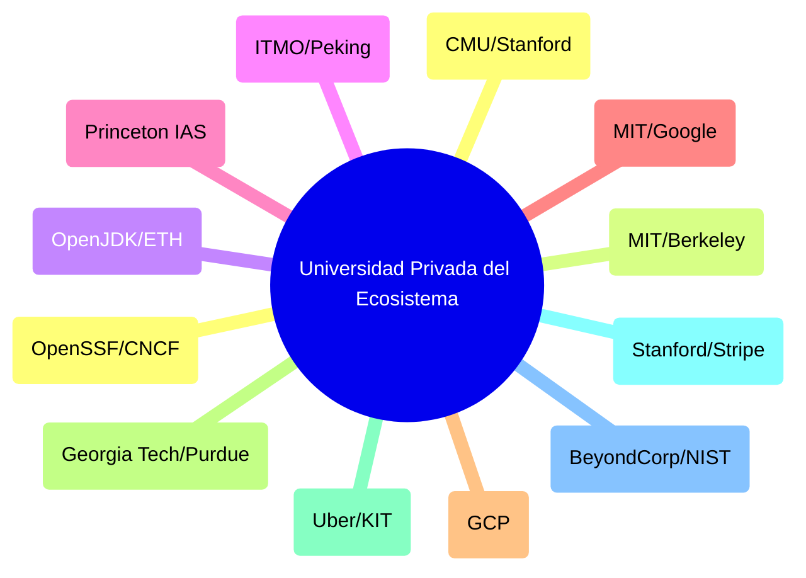

# 🎓 UNIVERSIDAD PRIVADA DE CIENCIAS COMPUTACIONALES & ALTA INGENIERÍA
## *Curriculum Maestro de Excelencia Académica, Arquitectura de Sistemas y Método Feynman (Nivel Ph.D. / Principal Fellow)*

---

### 🏛️ 1. Misión, Filosofía y Estándar de Rigor Académico

Esta Universidad Privada constituye la **Fuente de Verdad Absoluta, Base de Conocimiento y Academia de Formación de Élite** del ecosistema corporativo Google Antigravity. Su objetivo es proporcionar un dominio formativo integral, unificando la fundamentación matemática, física y formal de nivel doctoral (*Ph.D.*) con la maestría pragmática de la ingeniería de software moderna (*Staff / Principal Architect*), gobernada bajo la **Pedagogía del Método Feynman** (claridad cristalina, anclas mentales isomórficas y erradicación de la jerga defensiva).

#### Benchmark de Excelencia Internacional (12 Grandes Polos Académicos)
- **Ingeniería del Software & Arquitectura Hexagonal**: Carnegie Mellon University (CMU SEI), Stanford University, University of Southern California (USC).
- **Sistemas Distribuidos & Consenso**: Massachusetts Institute of Technology (MIT 6.5840 / 6.824), UC Berkeley (RISELab).
- **Runtime Internals, Memoria & Concurrencia**: OpenJDK (Projects Leyden, Valhalla, Loom, Panama), ETH Zurich, Peking University.
- **Matemáticas Avanzadas, Gemelo Digital & Física**: Princeton Institute for Advanced Study (IAS), Caltech, Cambridge, UT Austin.
- **Inteligencia Artificial Híbrida & Edge Computing**: MIT 6.S191, DeepLearning.AI, Stanford AI Lab, Google AI (LiteRT).
- **Cloud-Native, FinOps & Seguridad Soberana**: Google Cloud Architecture Center, BeyondCorp (Zero-Trust), Linux Foundation (SLSA / Sigstore).
- **Ingeniería Industrial, Operaciones & Ergonomía**: Georgia Tech, Purdue, TU Delft, Harvard Business School.
- **Ingeniería Geoespacial & Movilidad**: Uber Engineering (H3), Karlsruhe Institute of Technology (KIT / OSRM).
- **Redes Programables & Cómputo Exaescala**: Tsinghua University, National University of Singapore (NUS).

---

### 📚 2. Estructura de las 12 Grandes Facultades

---

### 📖 3. Programa Detallado por Facultades y Cátedras

---

#### 🏛️ FACULTAD I: INGENIERÍA DE SOFTWARE, TEORÍA DE TIPOS & ARQUITECTURA (CMU / Stanford)
1. **Arquitectura Hexagonal y Aislamiento DDD Puro**: Principio de Inversión de Dependencias (DIP), Puertos y Adaptadores. Capa `domain/` 100% aislada de anotaciones de frameworks (Zero-Mockito).
2. **Modelado en Java 25**: Records inmutables, `sealed interfaces` para tipos de suma algebraicos y constructores compactos \(\mathcal{O}(1)\).
3. **Ciclo SDLC de 6 Fases y Doubt-Driven Development**: `DEFINE` → `PLAN` → `BUILD` → `VERIFY` → `REVIEW` → `SHIP`.

---

#### 🌐 FACULTAD II: SISTEMAS DISTRIBUIDOS, CONSENSO & TLA+ (MIT 6.5840 / UC Berkeley)
1. **Modelos de Fallos, Causalidad y Relojes Lógicos**: Relación "happened-before" de Lamport, Relojes Vectoriales y Concurrencia causal.
2. **Consenso Distribuido**: Algoritmos Raft, Paxos, EPaxos y tolerancia a fallos bizantinos (BFT). Teorema FLP y PACELC.
3. **Especificación en TLA+/PlusCal**: Verificación de invariantes de seguridad (*Safety*) y vivacidad (*Liveness*) con TLC Model Checker.

---

#### ☕ FACULTAD III: RUNTIME JVM, COMPILACIÓN AOT & MEMORIA (OpenJDK / ETH Zurich)
1. **Virtual Threads (Project Loom)**: Continuaciones delimitadas, ForkJoinPool cooperativo y erradicación estricta de *Carrier Thread Pinning*.
2. **Project Leyden (AOT CDS - JEP 514/515)**: Caching de perfiles en fase *premain* para cold-start `< 80 ms` en Cloud Run.
3. **Project Valhalla (Value Classes)**: Aplanamiento en memoria (*flat layout*) y eliminación del sobrecoste de cabecera de objeto.
4. **Project Panama (FFM API)**: Acceso nativo off-heap de coste cero (`Arena`, `MemorySegment`) e integración con librerías C/C++.

---

#### 🐹 FACULTAD IV: CONCURRENCIA GO, RUNTIME CSP & ALGORITMIA (ITMO / Peking University)
1. **Runtime Go M:N & Work Stealing**: Coordinación de Goroutines \(G\), Machine Threads \(M\) y Procesadores Lógicos \(P\).
2. **Concurrencia CSP & Canales Lock-Free**: Comunicación secuencial no bloqueante, `select` no determinista y ring-buffers LMAX.

---

#### 🌐 FACULTAD V: GEMELO DIGITAL UNIFICADO, FÍSICA & MATEMÁTICAS (Princeton IAS / Caltech)
1. **Redes Tensoriales PEPS**: Contracción de grafos tensoriales 2D/3D en \(\mathcal{O}(N)\) para modelado físico acoplado.
2. **Asimilación de Datos con EnKF**: Filtrado de Kalman por ensambles con convergencia de covarianza garantizada (\(\mathcal{P} < 0.5\)).
3. **Physics-Informed Neural Networks (PINNs)**: Inyección de ecuaciones diferenciales de Navier-Stokes y Saint-Venant en funciones de pérdida.

---

#### 🤖 FACULTAD VI: IA HÍBRIDA, EDGE AI & METAPROGRAMACIÓN AGÉNTICA (MIT / Stanford)
1. **Edge AI con LiteRT**: Inferencia local INT8 confinada off-heap con latencia `< 15 ms` y coste `$0.00 USD/mes`.
2. **Razonamiento Neuro-Simbólico**: Fusión de LLMs probabilísticos con verificadores deductivos deterministas (SMT Solvers).
3. **Metaprogramación Agéntica (Semantic Loop)**: Orquestación masiva de código multi-repositorio guiada por *Toyota Kata* (Límite de 3 auto-reparaciones).
4. **Tribunal Adversario (Consilium Romano 3.0)**: Oposición dialéctica de modelos locales (Inquisidor, Censor Morum, Praetor FinOps) para erradicar el sesgo de confirmación.

---

#### ☁️ FACULTAD VII: CLOUD-NATIVE, BIG DATA & FINOPS (Google Cloud)
1. **BigQuery Capacitor & FinOps**: Particionado forzoso (`_PARTITIONDATE` / `_PARTITIONTIME`) y coste $< 0.005\text{ USD/MAU/mes}$.
2. **Arquitectura Serverless y Cloud Run**: Escala a cero, gVisor sandbox e infraestructura inmutable.
3. **Streaming ETL In-Memory**: Storage Write API en micro-batches \(\mathcal{O}(1)\).

---

#### 🏭 FACULTAD VIII: INGENIERÍA INDUSTRIAL, COLAS & HCI (Georgia Tech / Purdue)
1. **Teoría de Colas y Ley de Little**: Relación \(L = \lambda W\), modelos \(M/M/1\) y \(M/G/1\) para dimensionamiento de carga.
2. **Lean Manufacturing & Six Sigma**: Eliminación de las 7 Mudas en software y calidad de \(6\sigma\) (DPMO `< 3.4`).
3. **Ergonomía Cognitiva & Ley de Fitts**: Optimización de Core Web Vitals (INP `< 200ms`, LCP `< 2.5s`, CLS `< 0.1`).

---

#### 🗺️ FACULTAD IX: INGENIERÍA GEOESPACIAL & MOVILIDAD (Uber Engineering / KIT)
1. **Indexación Espacial Discreta H3**: Proyección icosaédrica, métrica de vecindad uniforme y representación `uint64`.
2. **Ruteo de Ultra-Baja Latencia OSRM**: Jerarquías de Contracción (CH) y planificación de rutas personalizadas (MLD/CRP) en \(< 2\text{ ms}\).
3. **Despacho Bipartito & Surge Pricing**: Emparejamiento máximo Kuhn-Munkres y tarificación dinámica sigmoide.

---

#### 💳 FACULTAD X: FINTECH, PAGOS & SAGAS (Stanford / Stripe)
1. **Stripe Connect & Fondos en Custodia (Escrow)**: Retención transaccional, Destination Charges y liquidación celular multi-tenant.
2. **Patrón Sagas & Transactional Outbox**: Consistencia eventual sin 2PC, compensabilidad y claves de idempotencia.
3. **FinOps & Reconciliación Automatizada**: Unit Economics estrictos ($< 0.015\text{ USD/MAU/mes}$) y detección de fugas contables.

---

#### 🔐 FACULTAD XI: IDENTIDAD, CRIPTOGRAFÍA & ZERO-TRUST (BeyondCorp / NIST)
1. **Arquitectura Zero-Trust BeyondCorp**: Perímetro definido por software, validación contextual continua y mTLS TLS 1.3.
2. **Protocolo OIDC, JWT, JWKS & Patrón BFF**: Verificación asimétrica en memoria \(\mathcal{O}(1)\) y protección contra robo de sesión.
3. **Aislamiento Celular en Firestore**: Reglas de Seguridad (RLS) en el Edge basadas en Custom Claims de tenant.

---

#### 📦 FACULTAD XII: SEGURIDAD DE CADENA DE SUMINISTRO & GITOPS (OpenSSF / CNCF)
1. **Nivel de Madurez SLSA L3/L4 & SBOM CycloneDX**: Inventario formal de dependencias y builds reproducibles herméticos.
2. **Firmas Criptográficas Cosign & Sigstore**: Inmutabilidad de contenedores OCI respaldada por log de transparencia Rekor.
3. **Reconciliación Declarativa GitOps con ArgoCD**: Bucle de control automatizado (*Self-Healing*) sin modificaciones manuales en clúster.

---

### 🏆 4. Rúbrica de Graduación del Consilium Romano 3.0 (12 Ejes & Índice Feynman)

| Nivel de Maestría | Facultades Requeridas | Exigencia Empírica, Teórica y Pedagógica |
| :--- | :--- | :--- |
| **Nivel 1: Junior Engineer** | Facultades I, III, IV | Microservicio hexagonal puro en Java 25 / Go con 100% tests verdes in-memory y aprobación del Test Feynman de 12 Años. |
| **Nivel 2: Senior Engineer** | Facultades I a VIII | Virtual Threads Loom, Leyden CDS `< 80 ms`, BigQuery particionado, Teoría de Colas y Ley de Little probada. |
| **Nivel 3: Staff Architect** | Facultades I a XI | Asimilación EnKF, tensores PEPS, Surge H3, Stripe Escrow, Zero-Trust BeyondCorp y firmas Cosign SLSA L3. |
| **Nivel 4: Principal / Fellow** | **Las 12 Facultades Completas** | Veredicto Summa Cum Laude en Consilium Romano 3.0 con Índice Feynman \(I_F \ge 0.90\). |

---
*Documento oficial de la Universidad Privada del Ecosistema. Certificado por el Consilium Romano 3.0 bajo el Estándar Pedagógico de Richard Feynman.*

---
## 🧠 Ejercicio Práctico: El Método Feynman

Para garantizar una asimilación profunda de los conceptos presentados en este módulo, aplica el **Método Feynman**:

> **Instrucción:** Explica los conceptos centrales de este módulo como si tu audiencia fuera un estudiante brillante de 12 años que no ha visto nunca este tema. Si no puedes hacerlo con lenguaje sencillo, analogías claras y sin jerga técnica, significa que aún no lo entiendes lo suficientemente bien.

*Inténtalo tú mismo:* Toma el concepto más complejo de este módulo, escríbelo en un papel en blanco y redáctalo usando únicamente términos cotidianos.
