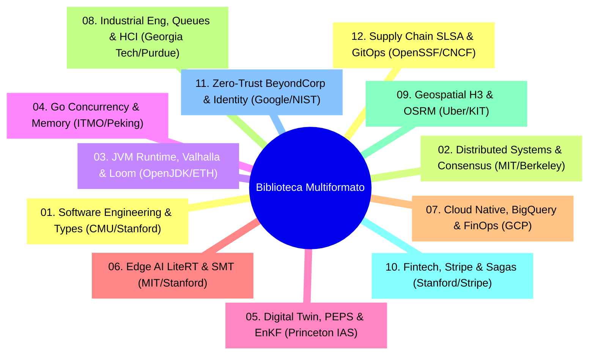

# 📚 BIBLIOTECA MULTIFORMATO DE PAPERS ACADÉMICOS, RFCS Y FUENTES PRIMARIAS
## *Repositorio Central de Fuentes de Verdad Doctoral & Estándares Internacionales*

---

### 🏛️ 1. Propósito y Estructura

Esta carpeta constituye el **almacén unificado de fuentes primarias** (PDFs, código fuente LaTeX `.tex`, textos planos de RFCs de la IETF, cuadernos Jupyter `.ipynb` y especificaciones técnicas oficiales) que fundamentan la **Universidad Privada del Ecosistema** y alimentan el **Motor de Destilación Feynman** (`scripts/ingest_and_distill_papers_feynman.py`).



---

### 📁 2. Formatos Soportados

| Extensión | Tipo de Documento | Procesador Interno |
| :--- | :--- | :--- |
| **`.pdf`** | Papers de arXiv, IEEE, ACM, VLDB y manuales oficiales | Extracción nativa con `PyMuPDF` (`fitz`). |
| **`.tex` / `.tar.gz`** | Fuentes LaTeX originales de pre-prints de arXiv | Parser de fórmulas matemáticas directas. |
| **`.txt` / `.rfc`** | RFCs de la IETF, estándares W3C y especificaciones ISO | Parser de secciones y gramáticas EBNF. |
| **`.ipynb`** | Jupyter Notebooks de investigación e IA | Extractor de celdas de código y visualizaciones. |
| **`.epub` / `.md`** | Libros técnicos y whitepapers | Extractor semántico estructurado. |

---

### 🏷️ 3. Convención de Nomenclatura y Metadatos

Para que el script automático catalogue el documento con máxima precisión, nombra los archivos con el siguiente estándar:

```text
[AÑO]_[AUTOR_O_INSTITUCION]_[TITULO_CORTO].[ext]
```

* *Ejemplo PDF*: `2014_ongaro_raft_consensus.pdf`
* *Ejemplo RFC*: `2015_ietf_rfc7519_jwt.txt`
* *Ejemplo LaTeX*: `2008_verstraete_peps_tensor_networks.tex`

#### Archivo Opcional de Metadatos (`.meta.json`)
Puedes acompañar cualquier documento con un archivo JSON con el mismo nombre base para forzar metadatos adicionales:

```json
{
  "title": "In Search of an Understandable Consensus Algorithm (Extended Version)",
  "authors": ["Diego Ongaro", "John Ousterhout"],
  "year": 2014,
  "institution": "Stanford University",
  "faculty": "02_sistemas_distribuidos_consenso",
  "doi_or_url": "https://raft.github.io/raft.pdf",
  "target_lesson": "modulo_0_sistemas_distribuidos/03_algoritmos_de_eleccion_de_lider.md"
}
```

---

### 🚀 4. Procesamiento Automático

Una vez subido o descargado un archivo a cualquier subcarpeta, ejecuta:

```bash
# Ingestar y destilar todos los nuevos documentos
python3 /home/jaruiz/Desarrollo/scripts/ingest_and_distill_papers_feynman.py
```


---
## 🧠 Ejercicio Práctico: El Método Feynman

Para garantizar una asimilación profunda de los conceptos presentados en este módulo, aplica el **Método Feynman**:

> **Instrucción:** Explica los conceptos centrales de este módulo como si tu audiencia fuera un estudiante brillante de 12 años que no ha visto nunca este tema. Si no puedes hacerlo con lenguaje sencillo, analogías claras y sin jerga técnica, significa que aún no lo entiendes lo suficientemente bien.

*Inténtalo tú mismo:* Toma el concepto más complejo de este módulo, escríbelo en un papel en blanco y redáctalo usando únicamente términos cotidianos.
