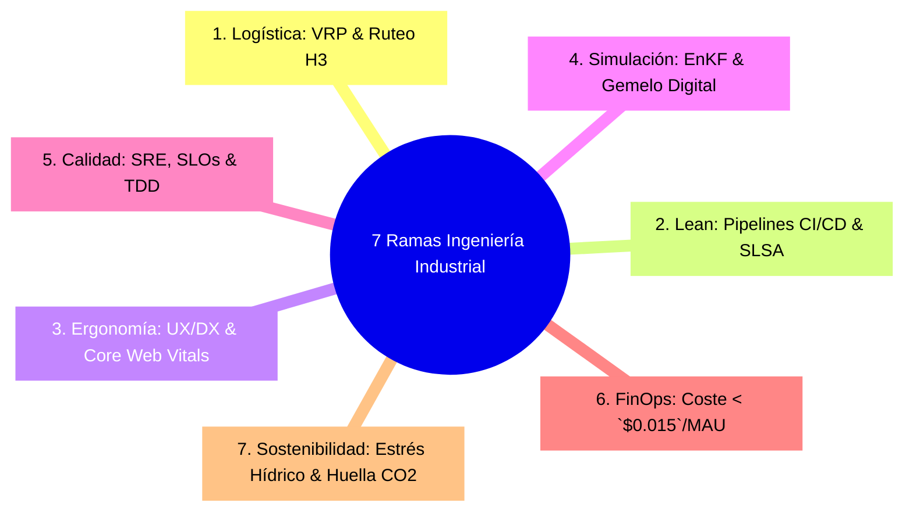

# Módulo 0C - Lección 1: Las 7 Ramas de la Ingeniería Industrial y Operaciones
## *Cátedra de Fundamentos de Optimización de Recursos y Sistemas Socio-Técnicos (Georgia Tech / MIT)*

---

## 1. 🐣 Ancla Mental Feynman & Analogía Isomórfica

### La Orquesta Sinfónica y el Director de Fábrica
Imagina una orquesta con 80 músicos: violinistas, trompetistas, percusionistas y pianistas:
* Si cada músico toca su instrumento a la velocidad que le apetece, sin importar si los demás van más despacio o si el público escucha un ruido ensordecedor, el concierto es un desastre.
* El **Director de Orquesta (el Ingeniero Industrial)** no necesita ser el mejor violinista de la sala; su trabajo es asegurarse de que los tiempos coincidan al milisegundo, que nadie toque notas de más (eliminación de desperdicios), que el sonido fluya con claridad armónica y que los músicos no terminen agotados con lesiones físicas tras dos horas de función.

La **Ingeniería Industrial** es la disciplina que optimiza cómo interactúan las personas, los datos, las máquinas y la energía para que todo el sistema funcione con el menor coste, la mayor velocidad y la máxima calidad posible.

---

## 2. 🔬 Primeros Principios & Desglose Mecánico

### Mapa de las 7 Ramas Fundamentales y su Mapeo al Software



1. **Gestión de Operaciones, Cadena de Suministro y Logística (MIT, Georgia Tech)**:
   * *Mapeo Software*: Despacho en tiempo real, emparejamiento bipartito en `AppViajes` y algoritmos de optimización de rutas VRP en \(\mathcal{O}(1)\).
2. **Ingeniería de Manufactura y Procesos (Stanford, Cambridge)**:
   * *Mapeo Software*: Filosofía *Lean* y ensamble de artefactos inmutables en `corp-spring-boot-starter`.
3. **Ergonomía, Seguridad y Diseño del Trabajo (UC Berkeley, TU Delft)**:
   * *Mapeo Software*: Accesibilidad WCAG 2.2 AA, reducción de carga cognitiva en interfaces React/Flutter y Developer Experience (DX).
4. **Analítica de Datos, Investigación de Operaciones y Simulación (CMU, Oxford)**:
   * *Mapeo Software*: Asimilación estocástica de datos (EnKF), Gemelo Digital de cuencas en `SaaSRegantes` y predicción BQML.
5. **Gestión de la Calidad y Sistemas de Mejora Continua (Purdue, U. Tokyo)**:
   * *Mapeo Software*: Six Sigma aplicado a Error Budgets de SRE y tests herméticos (Zero-Mockito / Testcontainers).
6. **Gestión de Proyectos y Finanzas Industriales (Harvard, Wharton)**:
   * *Mapeo Software*: Arquitectura FinOps y control estricto de costes unitarios ($< 0.015\text{ USD/MAU/mes}$).
7. **Sostenibilidad e Ingeniería Ambiental (ETH Zurich, Wageningen)**:
   * *Mapeo Software*: Mitigación de estrés hídrico, ahorro energético y balance de carbono en tiempo real.

---

## 3. 🚀 Arquitectura Práctica & Código en Java 25

Modelo unificado de métricas de eficiencia operativa industrial:

```java
package com.pct.core.industrial;

/**
 * Registro inmutable de eficiencia operativa global (OEE - Overall Equipment Effectiveness).
 */
public record IndustrialEfficiencyMetrics(
        double availabilityRatio, // Disponibilidad (Uptime / Total Time)
        double performanceRatio,  // Rendimiento (Throughput Real / Teórico)
        double qualityRatio       // Calidad (Items Correctos / Items Totales)
) {
    public IndustrialEfficiencyMetrics {
        if (availabilityRatio < 0.0 || availabilityRatio > 1.0 ||
            performanceRatio < 0.0 || performanceRatio > 1.0 ||
            qualityRatio < 0.0 || qualityRatio > 1.0) {
            throw new IllegalArgumentException("Los ratios deben estar acotados en el intervalo [0.0, 1.0]");
        }
    }

    /**
     * Calcula el OEE en O(1). Un valor >= 0.85 representa nivel Clase Mundial (World Class).
     */
    public double computeOEE() {
        return availabilityRatio * performanceRatio * qualityRatio;
    }

    public boolean isWorldClass() {
        return computeOEE() >= 0.85;
    }
}
```

---

## 4. 🧠 Internals Avanzados (MIT / Georgia Tech): La Frontera Eficiente de Pareto en \(O(N \log N)\)

En problemas de optimización multiobjetivo (ej. coste monetario vs tiempo de entrega vs impacto ambiental), no existe un único óptimo global sino una **Frontera de Pareto**:

\[
\mathcal{P} = \{ x \in \Omega \mid \nexists y \in \Omega \text{ tal que } f_i(y) \le f_i(x) \, \forall i \land \exists j : f_j(y) < f_j(x) \}
\]

* El Gemelo Digital del ecosistema utiliza algoritmos genéticos (NSGA-II) para aproximar esta frontera en \(\mathcal{O}(M \cdot N^2)\), permitiendo a directores de operaciones seleccionar el compromiso óptimo en tiempo real.

---

## 5. 🎯 Desafío Feynman & Auto-Evaluación sin Jerga

> [!NOTE]
> **El Reto de los 12 Años**: Explica por qué una fábrica donde todas las máquinas trabajan al 100% de velocidad todo el tiempo puede quebrar más rápido que una fábrica donde las máquinas van al 70%, **sin usar las palabras:** *"Inventario", "Lean", "Pareto", "OEE" ni "Asintótico"*.

### Criterio de Verificación
* **Aprobado**: Si explicas que si una máquina hace piezas 10 veces más rápido de lo que la siguiente máquina puede ensamblarlas, se acumulan montañas de piezas en el pasillo que nadie puede vender todavía, bloqueando el paso y gastando todo el dinero de la empresa en cajas acumuladas.
* **No Aprobado**: Si te limitas a transcribir definiciones teóricas de libros de texto.


---
## 🧠 Ejercicio Práctico: El Método Feynman

Para garantizar una asimilación profunda de los conceptos presentados en este módulo, aplica el **Método Feynman**:

> **Instrucción:** Explica los conceptos centrales de este módulo como si tu audiencia fuera un estudiante brillante de 12 años que no ha visto nunca este tema. Si no puedes hacerlo con lenguaje sencillo, analogías claras y sin jerga técnica, significa que aún no lo entiendes lo suficientemente bien.

*Inténtalo tú mismo:* Toma el concepto más complejo de este módulo, escríbelo en un papel en blanco y redáctalo usando únicamente términos cotidianos.
