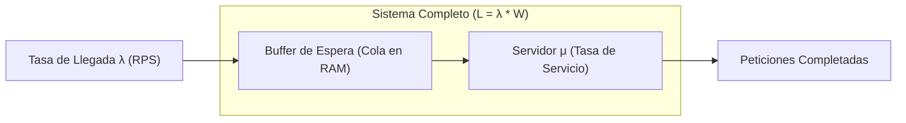

# Módulo 0C - Lección 2: Teoría de Colas, Ley de Little y Modelos M/M/1
## *Cátedra de Investigación Operativa & Rendimiento Asintótico (Georgia Tech / MIT)*

---

## 1. 🐣 Ancla Mental Feynman & Analogía Isomórfica

### La Fila de la Panadería
Imagina una panadería donde los clientes llegan a comprar pan.
* Si llegan 10 clientes por hora y cada cliente tarda 6 minutos (0.1 horas) en ser atendido y pagar, ¿cuánta gente habrá dentro de la tienda en promedio en cualquier momento?
* Habrá exactamente \(10 \times 0.1 = 1\) persona.

Esta sencilla relación es la **Ley de Little** (\(L = \lambda W\)). En software, la panadería es tu servidor web o microservicio, los clientes son las peticiones HTTP y el panadero es el procesador o la base de datos.
Si entran más clientes de los que el panadero puede despachar, la fila de espera crece hasta que la tienda se llena, la gente se marcha enfadada (timeout) y el negocio colapsa.

---

## 2. 🔬 Primeros Principios & Desglose Mecánico

### La Ley de Little Fundamental
Demostrada formalmente por John Little (MIT, 1961), establece que bajo condiciones de estado estacionario:

\[
L = \lambda \cdot W
\]

Donde:
* \(L\): Número promedio de elementos en el sistema (concurrencia / peticiones en vuelo).
* \(\lambda\): Tasa promedio de llegada de elementos (peticiones por segundo, RPS).
* \(W\): Tiempo promedio de permanencia en el sistema (latencia de respuesta, segundos).



### Mecánica del Cuello de Botella y Utilización (\(\rho\))
La utilización del servidor (\(\rho\)) se define como el ratio entre la tasa de llegada y la capacidad máxima de servicio:

\[
\rho = \frac{\lambda}{\mu}
\]

* Si \(\rho < 1\): El sistema es estable y la cola no diverge.
* Si \(\rho \ge 1\): La cola crece hacia el infinito (\(\infty\)) y la latencia colapsa.

En un modelo \(M/M/1\) (Llegadas de Poisson, tiempos de servicio exponenciales y 1 servidor), el tiempo promedio en el sistema es:

\[
W = \frac{1}{\mu - \lambda} = \frac{1}{\mu (1 - \rho)}
\]

> [!IMPORTANT]
> **La no-linealidad del 80%**: Cuando la utilización \(\rho\) pasa del \(80\%\) al \(95\%\), la latencia no sube un \(15\%\); se multiplica por 4. Mantener la utilización media de CPU por debajo del \(70\%\) es un principio físico, no una sugerencia de configuración.

---

## 3. 🚀 Arquitectura Práctica & Código en \(O(1)\)

En Java 25 y Go, calculamos el dimensionamiento de buffers y límites de concurrencia de forma analítica en \(O(1)\), evitando colas ilimitadas en memoria que provoquen OutOfMemoryError.

```java
package com.pct.core.queue;

/**
 * Calculador de capacidad analítica O(1) basado en Ley de Little y M/M/1.
 */
public record QueueCapacityPlanner(double maxRps, double targetLatencyMs, double maxCpuUtilization) {

    public QueueCapacityPlanner {
        if (maxCpuUtilization <= 0.0 || maxCpuUtilization >= 1.0) {
            throw new IllegalArgumentException("La utilización debe estar en el rango (0.0, 1.0)");
        }
    }

    /**
     * Calcula la concurrencia máxima permitida en vuelo (L) sin saturar el sistema.
     */
    public int calculateMaxInFlightRequests() {
        double arrivalRatePerMs = maxRps / 1000.0;
        double l = arrivalRatePerMs * targetLatencyMs;
        return (int) Math.ceil(l / maxCpuUtilization);
    }

    /**
     * Evalúa si una tasa de llegada adicional provocará inestabilidad en el sistema.
     */
    public boolean isStableUnderLoad(double currentRps, double incomingRps, double serviceCapacityRps) {
        double totalLoad = (currentRps + incomingRps) / serviceCapacityRps;
        return totalLoad < maxCpuUtilization;
    }
}
```

---

## 4. 🧠 Internals Avanzados (MIT / Georgia Tech): Paradoja de la Inspección & Colas M/G/1

Cuando la distribución de tiempos de servicio no es puramente exponencial sino que presenta alta variabilidad (ej. consultas pesadas a base de datos mezcladas con lecturas en caché), se aplica la **Fórmula de Pollaczek-Khinchine (P-K)** para sistemas \(M/G/1\):

\[
W_q = \frac{\lambda \mathbb{E}[S^2]}{2(1 - \rho)} = \frac{\rho \mathbb{E}[S]}{1 - \rho} \cdot \left( \frac{1 + C_v^2}{2} \right)
\]

Donde \(C_v = \frac{\sigma}{\mathbb{E}[S]}\) es el coeficiente de variación.

* **Impacto en Arquitectura**: Si la varianza del tiempo de respuesta (\(\sigma^2\)) es alta (\(C_v > 1\)), la cola promedio se dispara aunque la CPU esté al \(50\%\). De ahí la necesidad de aislar cargas analíticas (BigQuery) de transacciones transaccionales (OLTP) y aplicar *bulkheading* con hilos virtuales.

---

## 5. 🎯 Desafío Feynman & Auto-Evaluación sin Jerga

> [!NOTE]
> **El Reto de los 12 Años**: Explica por qué una autopista con 95 coches por cada 100 de capacidad sufre atascos monumentales si un solo conductor frena levemente, **sin usar las palabras:** *"Little", "estocástico", "Poisson", "utilización" ni "buffer"*.

### Criterio de Verificación
* **Aprobado**: Si explicas que cuando los coches van muy pegados, el tiempo que tarda un conductor en reaccionar obliga al siguiente a frenar más fuerte, propagando una ola de frenazos hacia atrás porque no hay espacio vacío libre para absorber el retraso.
* **No Aprobado**: Si recurres a fórmulas matemáticas o citas teóricas sin explicar la causa física.


---
## 🧠 Ejercicio Práctico: El Método Feynman

Para garantizar una asimilación profunda de los conceptos presentados en este módulo, aplica el **Método Feynman**:

> **Instrucción:** Explica los conceptos centrales de este módulo como si tu audiencia fuera un estudiante brillante de 12 años que no ha visto nunca este tema. Si no puedes hacerlo con lenguaje sencillo, analogías claras y sin jerga técnica, significa que aún no lo entiendes lo suficientemente bien.

*Inténtalo tú mismo:* Toma el concepto más complejo de este módulo, escríbelo en un papel en blanco y redáctalo usando únicamente términos cotidianos.
