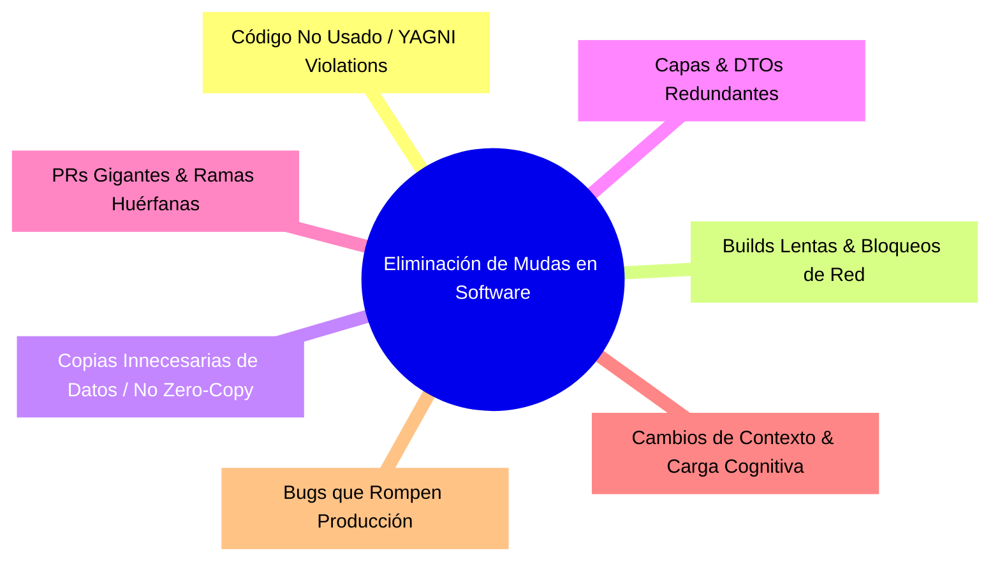

# Módulo 0C - Lección 3: Lean Manufacturing, Six Sigma y Ergonomía Cognitiva (HCI)
## *Cátedra de Optimización de Procesos y Diseño de Sistemas Humano-Máquina (Purdue / Georgia Tech)*

---

## 1. 🐣 Ancla Mental Feynman & Analogía Isomórfica

### La Cocina del Restaurante sin Pasos Desperdiciados
Imagina dos cocineros preparando ensaladas:
* El **Cocinero A** tiene la lechuga en una nevera a 10 metros, el aceite en un armario alto y los platos en otra habitación. Por cada ensalada da 40 pasos innecesarios y busca los cuchillos durante 3 minutos.
* El **Cocinero B** tiene la tabla de cortar, el bol, las verduras limpias y el aliño justo al alcance de la mano. Prepara la misma ensalada en 30 segundos sin moverse del sitio.

El **Lean Manufacturing** consiste en eliminar todos los pasos y movimientos inútiles (*Mudas*). En desarrollo de software, cada clic de más, cada salto entre pestañas, cada dependencia no utilizada o cada microservicio que solo pasa datos a otro es el Cocinero A dando vueltas por la cocina.

---

## 2. 🔬 Primeros Principios & Desglose Mecánico

### Los 7 Desperdicios (Mudas) de Ohno aplicados al Software



1. **Sobreproducción**: Escribir características o abstracciones "por si acaso" (Violación del principio YAGNI).
2. **Espera**: Hilos bloqueados esperando I/O síncrona o despliegues manuales lentos.
3. **Transporte**: Serializaciones innecesarias (JSON -> Objeto -> DTO -> Base de datos) en lugar de *Direct Buffers* y *Zero-Copy*.
4. **Sobreprocesamiento**: Múltiples capas de interfaces con una sola implementación.
5. **Inventario**: Lotes grandes de trabajo acumulados en ramas sin fusionar (rompiendo el flujo continuo).
6. **Movimiento**: Carga cognitiva excesiva en la UI que obliga al usuario o ingeniero a buscar información dispersa.
7. **Defectos**: Errores en producción que requieren retrabajo y apagar fuegos.

### Ergonomía Cognitiva y Ley de Fitts
En interfaces de usuario (Flutter, React, PWA), el tiempo \(T\) para alcanzar un objetivo visual depende de la distancia \(D\) y el ancho del objetivo \(W\):

\[
T = a + b \cdot \log_2 \left( 1 + \frac{D}{W} \right)
\]

* **Principio de Ergonomía Segura**: Los botones críticos deben ser amplios, estar cerca del pulgar (en móviles) y tener suficiente contraste (WCAG 2.2 AA) para que el cerebro humano no gaste energía visual procesándolos.

---

## 3. 🚀 Arquitectura Práctica & Código en \(O(1)\)

Aplicación del principio Lean a un pipeline de procesamiento por lotes pequeños (*Single-Piece Flow* vs *Batch size* grande):

```go
package leanflow

import "context"

// Item representa la unidad mínima de valor que fluye sin acumular inventario.
type Item struct {
	ID    string
	Valor float64
}

// SinglePiecePipeline procesa elementos de uno en uno con buffer cero, erradicando la espera.
func SinglePiecePipeline(ctx context.Context, in <-chan Item, out chan<- Item, transform func(Item) Item) {
	defer close(out)
	for {
		select {
		case <-ctx.Done():
			return
		case item, ok := <-in:
			if !ok {
				return
			}
			// Procesamiento O(1) inmediato sin acumulación en memoria
			out <- transform(item)
		}
	}
}
```

---

## 4. 🧠 Internals Avanzados (Purdue / TU Delft): Six Sigma (DMAIC) & Defectos por Millón (DPMO)

La metodología **Six Sigma** busca un nivel de calidad tal que la probabilidad de fallo sea menor a 3.4 defectos por millón de oportunidades (DPMO), equivalente a una distancia de \(6\sigma\) de la media en una distribución normal:

\[
\text{DPMO} = 1{,}000{,}000 \cdot \left( 1 - \Phi\left( Z - 1.5 \right) \right)
\]

* En fiabilidad de sistemas (SRE), \(6\sigma\) equivale al \(99.99966\%\) de disponibilidad (*Five Nines*).
* Para lograrlo en arquitecturas distribuidas, el ecosistema utiliza:
  1. Tipado estricto en tiempo de compilación (Java 25 Records y Go structs).
  2. Verificación formal de invariantes con TLA+.
  3. Tests herméticos con stubs in-memory (Zero-Mockito).

---

## 5. 🎯 Desafío Feynman & Auto-Evaluación sin Jerga

> [!NOTE]
> **El Reto de los 12 Años**: Explica por qué es mejor lavar un plato justo después de comer en lugar de dejar que se acumulen 50 platos sucios en el fregadero durante una semana, relacionándolo con el desarrollo de software **sin usar las palabras:** *"Lean", "Batch", "Muda", "Single-Piece" ni "Six Sigma"*.

### Criterio de Verificación
* **Aprobado**: Si explicas que lavar un plato recién usado lleva 10 segundos porque la comida no se ha secado y no ocupa espacio, mientras que 50 platos secos se pegan, huelen mal, requieren frotar durante horas y te dejan sin platos limpios cuando tienes hambre.
* **No Aprobado**: Si te limitas a repetir definiciones teóricas de gestión de proyectos.


---
## 🧠 Ejercicio Práctico: El Método Feynman

Para garantizar una asimilación profunda de los conceptos presentados en este módulo, aplica el **Método Feynman**:

> **Instrucción:** Explica los conceptos centrales de este módulo como si tu audiencia fuera un estudiante brillante de 12 años que no ha visto nunca este tema. Si no puedes hacerlo con lenguaje sencillo, analogías claras y sin jerga técnica, significa que aún no lo entiendes lo suficientemente bien.

*Inténtalo tú mismo:* Toma el concepto más complejo de este módulo, escríbelo en un papel en blanco y redáctalo usando únicamente términos cotidianos.
