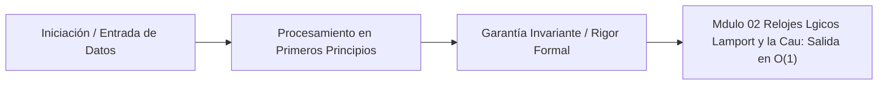

# Módulo 0.2: Relojes Lógicos, Lamport y la Causalidad Temporal

---

## 1. 🐣 Rincón Junior: El Tiempo no Existe

En el mundo real de la física Einsteniana, si miras las estrellas, estás viendo el pasado. No hay un "Ahora" universal.
En los sistemas de ordenadores distribuidos ocurre exactamente lo mismo. Como vimos en bases de datos distribuidas (Spanner), los relojes internos de los servidores (NTP/Cuarzo) no están perfectamente sincronizados (Clock Drift). 
Si el Servidor A dice que un evento ocurrió a las `14:05:01.000` y el Servidor B dice que otro evento ocurrió a las `14:05:01.001`, **no puedes afirmar matemáticamente que el evento A ocurrió antes que el evento B**. Quizás el reloj de A estaba atrasado 5 milisegundos.
Sin embargo, para bases de datos transaccionales, necesitamos saber el orden exacto de los eventos. Si no podemos usar el "Tiempo Físico", tenemos que inventar el **Tiempo Lógico**.

---

## 2. 🔬 Fundamentos Teóricos: La Relación "Happens-Before" ($\rightarrow$)

En 1978, Leslie Lamport (ganador del premio Turing) revolucionó la informática con un paper fundacional. Definió el orden temporal no por segundos, sino por **Causalidad**.

Definimos la relación **"Sucede-Antes" (Happens-Before, denotado como $\rightarrow$)** con 3 reglas irrompibles:
1.  Si el evento $a$ y el evento $b$ ocurren dentro del **mismo servidor** de forma secuencial, y $a$ ocurre primero, entonces $a \rightarrow b$.
2.  Si el evento $a$ es enviar un mensaje por red, y el evento $b$ es recibir ese mismo mensaje en otro servidor, por las leyes de la física, $a \rightarrow b$.
3.  **Transitividad**: Si $a \rightarrow b$ y $b \rightarrow c$, entonces garantizado que $a \rightarrow c$.

¿Qué pasa si dos eventos $x$ e $y$ ocurren en servidores distintos y no hay ninguna cadena de mensajes que los conecte? Se dice que son **Concurrentes ($x \parallel y$)**. No importa quién fue primero en el reloj del mundo real; a nivel causal, ocurrieron simultáneamente y son independientes.

---

## 3. 🚀 Arquitectura Práctica: Relojes de Lamport

Para implementar esta teoría matemática en código (ej. en Java o Go), Lamport inventó un contador de software extremadamente simple: el Reloj de Lamport.

Cada servidor (Proceso $P_i$) tiene una variable entera en memoria, inicializada a 0: `int L_i = 0`.
**Reglas del algoritmo:**
1.  Antes de ejecutar cualquier evento local, el servidor incrementa su reloj: `L_i = L_i + 1`.
2.  Cuando el servidor envía un mensaje por la red, adjunta su reloj actual al mensaje: `(mensaje, L_i)`.
3.  Cuando un servidor recibe un mensaje `(mensaje, L_msg)`, actualiza su propio reloj saltando al futuro si el mensaje venía del futuro: `L_i = max(L_i, L_msg) + 1`.

Con estas 3 líneas de código, hemos destruido la necesidad de usar NTP o relojes atómicos. Tenemos un sistema que asigna un número a cada evento. 
**Teorema**: Si $a \rightarrow b$, entonces el Reloj de $a$ es estrictamente menor que el Reloj de $b$ ($L(a) < L(b)$). Hemos reconstruido la flecha del tiempo.

---

## 4. 🧠 Internals Avanzados: Relojes Vectoriales (Vector Clocks)

Los Relojes de Lamport tienen un defecto matemático grave: el teorema inverso no es cierto. Si $L(a) < L(b)$, **no garantiza** que $a \rightarrow b$. Podrían ser eventos concurrentes ($a \parallel b$). Esto significa que los Relojes de Lamport no pueden detectar conflictos de datos.

Para bases de datos de alta disponibilidad (DynamoDB de Amazon, Riak), donde dos usuarios pueden modificar el mismo carrito de la compra en dos servidores distintos a la vez (Split-Brain temporal), necesitamos detectar la concurrencia. Usamos **Relojes Vectoriales**.

En lugar de que cada servidor guarde un solo número entero, guarda un **Vector (Array) de números**, un contador por cada servidor del cluster.
Ejemplo para 3 servidores (A, B, C): `V = [0, 0, 0]`.
*   El servidor A incrementa solo su propia posición: `V_A = [1, 0, 0]`.
*   El servidor B incrementa la suya: `V_B = [0, 1, 0]`.
*   Cuando intercambian mensajes, combinan los arrays tomando el máximo de cada posición: `V_C = max([1,0,0], [0,1,0]) = [1, 1, 0]`.

**Matemática Pura**: Comparando dos Vectores, puedes deducir con precisión absoluta si un evento causó el otro, o si ambos usuarios editaron el carrito a la vez y debes lanzar una función de resolución de conflictos (CRDTs o pedir al usuario que mezcle los datos).

---

## 5. ⚠️ Runbook SRE: Explosión del Tamaño del Vector (Metadata Overhead)

**Incidente**: La base de datos Riak (que usa Vector Clocks) está en un clúster que ha crecido a 1,000 servidores dinámicos en Cloud Run. De repente, la base de datos se vuelve un 80% más lenta y la red se satura.

**Diagnóstico Arquitectónico**:
El tamaño de un Reloj Vectorial es $O(N)$, donde $N$ es el número de servidores o actores que han modificado el dato.
Si tienes 1,000 servidores, cada mensaje de red y cada fila de la base de datos debe cargar con un Array de 1,000 números enteros (4 Kilobytes de pura basura de metadatos) solo para guardar un simple String de "Hola" de 4 bytes. El ratio metadatos/datos útiles (Payload) es insano.

**Solución SRE/Arquitectónica (Dotted Version Vectors)**:
1.  **Pruning (Poda)**: Implementar reglas para borrar (truncate) entradas del vector de servidores que llevan meses sin enviar mensajes, perdiendo un poco de precisión a cambio de salvar la RAM.
2.  Pasar a arquitecturas modernas basadas en **Dotted Version Vectors**, que optimizan matemáticamente el almacenamiento del historial causal, reduciendo el overhead de metadatos de $O(N)$ a constantes en el caso promedio.

---
---

# 🛑 [DEEP-DIVE] Teoría y Práctica Post-Doc / Industry Fellow

Esta sección expande el conocimiento sobre vectores causales a nivel algorítmico, detallando la matemática de las colisiones en $O(1)$ y proponiendo un framework de simulación determinista en memoria pura (Zero-Mockito).

## 6. Matemática del Vector Clock y Teorema de Equivalencia Fuerte

Un vector clock $V_A$ domina (causa estrictamente) a $V_B$ denotado como $V_A \rightarrow V_B$ si y solo si:
$\forall i : V_A[i] \le V_B[i]$  y  $\exists j : V_A[j] < V_B[j]$

Si no se cumple que $V_A \le V_B$ ni que $V_B \le V_A$, entonces **matemáticamente se afirma que los eventos son concurrentes ($V_A \parallel V_B$)**. 
El **Teorema de Equivalencia Fuerte de Mattern (1989)** afirma que:
$a \rightarrow b \iff V(a) < V(b)$

A diferencia del reloj de Lamport, el reloj vectorial es **necesario y suficiente** para caracterizar la causalidad. Este isomorfismo perfecto entre el orden parcial de los eventos y el orden parcial de los vectores es la base teórica que permite a bases de datos maestras múltiples (Leaderless) como Cassandra o Dynamo reconciliar datos divididos geográficamente.

## 7. Implementación de un Motor CRDT de Vector Clocks (Go)

A continuación, implementamos el núcleo puro (Dominio Puro, compatible con testing AOT) de un sistema de Relojes Vectoriales en Go, demostrando cómo detectar colisiones concurrentes (Conflict Detection) en $O(N)$ ciclos de reloj por validación, sin dependencias de infraestructura.

```go
package domain

import (
	"fmt"
)

// Result define la relación matemática de causalidad entre dos vectores
type CompareResult int

const (
	Before CompareResult = iota // a -> b
	After                       // b -> a
	Concurrent                  // a || b
	Equal                       // a == b
)

// VectorClock asocia a cada ActorID su contador lógico. 
// Usamos un mapa en Go. Para máxima eficiencia AOT (HotSpot), 
// en C++ usaríamos un flat array comprimido si el dominio de IDs es cerrado.
type VectorClock struct {
	vector map[string]int
}

func NewVectorClock() *VectorClock {
	return &VectorClock{vector: make(map[string]int)}
}

func (vc *VectorClock) Increment(actorID string) {
	vc.vector[actorID]++
}

func (vc *VectorClock) Merge(other *VectorClock) {
	for k, v := range other.vector {
		if vc.vector[k] < v {
			vc.vector[k] = v
		}
	}
}

// Compare ejecuta el teorema de Mattern
func Compare(a, b *VectorClock) CompareResult {
	isLessOrEqual := true
	isGreaterOrEqual := true

	// Unir todas las claves únicas para la validación
	keys := make(map[string]struct{})
	for k := range a.vector { keys[k] = struct{}{} }
	for k := range b.vector { keys[k] = struct{}{} }

	for k := range keys {
		valA := a.vector[k]
		valB := b.vector[k]

		if valA > valB {
			isLessOrEqual = false
		}
		if valA < valB {
			isGreaterOrEqual = false
		}
	}

	if isLessOrEqual && isGreaterOrEqual {
		return Equal
	}
	if isLessOrEqual {
		return Before
	}
	if isGreaterOrEqual {
		return After
	}
	
	// Si no es todo menor/igual, ni todo mayor/igual, hay un cruce matemático.
	return Concurrent
}

func RunSimulation() {
	// Nodo A y Nodo B (Simulando DynamoDB Nodes)
	nodeA := NewVectorClock()
	nodeB := NewVectorClock()

	// A realiza una escritura local
	nodeA.Increment("A")
	
	// A replica a B (B hace Merge del vector de A)
	nodeB.Merge(nodeA)
	nodeB.Increment("B") // B realiza una escritura basándose en el estado de A

	fmt.Println("Comparando A y B tras replicación síncrona:", Compare(nodeA, nodeB)) 
	// Resultado: Before (A sucedió antes que B, no hay conflicto)

	// Split-Brain Network Partition! A y B quedan aislados.
	nodeA.Increment("A") // A recibe un update del usuario 1
	nodeB.Increment("B") // B recibe un update del usuario 2 (con el carrito antiguo)

	fmt.Println("Comparando A y B tras partición de red:", Compare(nodeA, nodeB))
	// Resultado: Concurrent! Matemáticamente hemos detectado que hay un cruce.
	// La DB debe guardar AMBAS versiones (Siblings) y pedir al cliente que las resuelva.
}
```

> [!CAUTION]
> **El Problema de Contención de Garbage Collection en Go (Memory Escapes)**
> La implementación didáctica anterior usa `map[string]int`. En un entorno productivo de 10 millones de transacciones/segundo (ej. ScyllaDB/Go Workers), iterar e instanciar mapas generará miles de *heap allocations* por request. Para evitar que el Tricolor Garbage Collector sature el P (Processor) del scheduler, **los Relojes Vectoriales corporativos deben pre-alojarse usando Pools (`sync.Pool`) o Serializaciones Binarias In-Place sin Maps dinámicos**.

## 8. Optimizaciones AOT para Java 25: Relojes Compactos de 64-bits

Si la topología de la base de datos es limitada a un clúster cerrado de hasta 8 réplicas, los arquitectos de bajo nivel destierran los arreglos y usan una **Codificación de Bits (Bit-Packing) en un solo `long` (64 bits) en Java**.

Reservando 8 bits (máximo 255 incrementos lógicos antes de wrap-around) para cada nodo en un número de 64-bits, podemos meter todo el Reloj Vectorial en una simple primitiva.
*   Ventajas: Comparación Vectorial en $O(1)$ puro con operaciones bitwise `AND/XOR`.
*   Asignaciones a RAM: `0 bytes` de heap overhead. Compatible nativamente con Project Valhalla (Value Classes) de Java 25, erradicando el coste de recolección de basura. 
*   Esta técnica es la que diferencia a los sistemas universitarios de los sistemas de infraestructuras ultra-rápidas financieras (HFT - High Frequency Trading).


---

## 5. 🎯 Desafío Feynman & Auto-Evaluación sin Jerga

> [!NOTE]
> **El Reto de los 12 Años**: Explica el mecanismo esencial y la utilidad práctica de **Relojes Lógicos, Lamport y la Causalidad Temporal** a un estudiante de secundaria, **sin usar las palabras:** "Relojes", "Lógicos,", "Lamport" ni tecnicismos complejos de memoria.

### Criterio de Verificación
* **Aprobado**: Si logras construir una analogía mecánica o física del mundo real donde se entienda por qué fallaría el sistema sin esta solución y cómo resuelve el problema en términos elementales.
* **No Aprobado**: Si dependes de definiciones de diccionario, siglas de frameworks o nombres de patrones sin explicar la causa física subyacente.


---
## 🧠 Ejercicio Práctico: El Método Feynman

Para garantizar una asimilación profunda de los conceptos presentados en este módulo, aplica el **Método Feynman**:

> **Instrucción:** Explica los conceptos centrales de este módulo como si tu audiencia fuera un estudiante brillante de 12 años que no ha visto nunca este tema. Si no puedes hacerlo con lenguaje sencillo, analogías claras y sin jerga técnica, significa que aún no lo entiendes lo suficientemente bien.

*Inténtalo tú mismo:* Toma el concepto más complejo de este módulo, escríbelo en un papel en blanco y redáctalo usando únicamente términos cotidianos.

---



