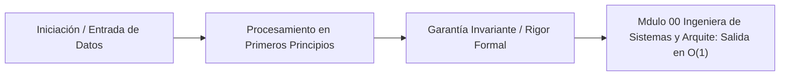

# Módulo 0.0: Ingeniería de Sistemas y Arquitectura de Software (Nivel CMU / SEI / UW)

---

## 1. 🐣 Rincón Junior: Construyendo Edificios vs Tiendas de Campaña

Cuando empiezas a programar, construyes "tiendas de campaña": juntas unas cuantas líneas de código, funciona rápido, y si se cae, la vuelves a montar.
Pero cuando haces una aplicación para millones de personas (como Netflix, Stripe, o AppViajes), estás construyendo un "Rascacielos". No puedes simplemente poner ladrillos (código) al azar. Necesitas planos, calcular la resistencia del viento, las salidas de emergencia y los cimientos.
La **Ingeniería de Software y Sistemas** es la ciencia de diseñar rascacielos digitales. No se trata de *qué lenguaje* usas, sino de cómo organizas las piezas para que el sistema sea rápido, seguro, y no se hunda cuando haya un terremoto (un fallo en la nube).

---

## 2. 🔬 Fundamentos Académicos: Atributos de Calidad (Quality Attributes)

La Universidad Carnegie Mellon (CMU) y su *Software Engineering Institute (SEI)* cambiaron el mundo de la arquitectura con el libro *Software Architecture in Practice* (Bass, Clements, Kazman). 

El principio fundamental de CMU es: **"La Arquitectura de Software no trata sobre la funcionalidad. Trata sobre los Atributos de Calidad."**
Cualquier código espagueti puede calcular el precio de un viaje (funcionalidad). Solo una buena arquitectura puede hacerlo en menos de 50ms (Rendimiento), resistiendo ataques (Seguridad) y permitiendo añadir nuevas monedas en un día (Modificabilidad).

### El Framework de Atributos de Calidad (SEI - CMU)
Todo requisito de arquitectura se define mediante "Escenarios":
1.  **Estímulo**: Lo que ocurre (Ej. 100.000 usuarios abren la app de golpe).
2.  **Artefacto**: La parte del sistema afectada (Ej. El API Gateway).
3.  **Respuesta**: Qué hace el sistema (Ej. Escalar nodos y poner peticiones en cola).
4.  **Medida de Respuesta**: La métrica objetiva (Ej. Latencia en el percentil 99 debe ser $< 200$ ms).

---

## 3. 🚀 Arquitectura Práctica: Tácticas Arquitectónicas

En lugar de inventar ruedas, CMU/SEI catalogaron las "Tácticas" matemáticas y lógicas que un arquitecto usa para controlar los atributos de calidad.

### Tácticas de Disponibilidad (Availability)
*Objetivo: Evitar fallos catastróficos (Fault Tolerance).*
*   **Heartbeat / Ping-Echo**: Microservicios en Go enviando pulsos cada segundo. Si falta uno, se declara "Dead".
*   **Votación (Quorum)**: En sistemas distribuidos, si 3 nodos calculan el precio, y 1 difiere, se toma la mayoría (Algoritmo de Consenso).
*   **Degradación Graciosa (Graceful Degradation)**: Si cae la base de datos de reseñas, la app sigue permitiendo pedir taxis, pero oculta las estrellas de los conductores.

### Tácticas de Rendimiento (Performance)
*Objetivo: Minimizar latencia y maximizar Throughput.*
*   **Concurrencia**: Virtual Threads de Java 25 o Goroutines.
*   **Resource Pooling**: Mantener conexiones a la base de datos (HikariCP) ya abiertas para no pagar el coste del "Handshake" TCP/TLS en cada petición.
*   **Caching Distribuido**: Reducir viajes a BigQuery usando Redis (Bounded FIFO/LRU).

### Tácticas de Seguridad (Security)
*Objetivo: Integridad, Confidencialidad y Trazabilidad.*
*   **Menor Privilegio (Least Privilege)**: IAM en GCP; el microservicio A solo puede leer la tabla A, no borrar la tabla B.
*   **Limitación de Tasa (Rate Limiting)**: Token Bucket Algorithm para prevenir DDoS.

---

## 4. 🧠 Internals Avanzados: Formalización y Diseño Riguroso (University of Washington)

En la Universidad de Washington (UW) y CMU, la ingeniería de software moderna va más allá de dibujar cajas y flechas. Requiere **Modelado Formal**.

### Trade-offs y el Teorema CAP / PACELC
No puedes tener todos los atributos de calidad al máximo. Si maximizas la Seguridad (encriptación pesada), destruyes el Rendimiento (latencia). 
El arquitecto vive en el **Análisis de Trade-offs (ATAM - Architecture Tradeoff Analysis Method)**.
*   **Teorema CAP**: En un sistema distribuido, solo puedes elegir 2 de 3: Consistencia (C), Disponibilidad (A), Tolerancia a Particiones (P). 
    *   *Cloud Spanner (Google)* hackea esto acercándose a CA mediante el uso de relojes atómicos TrueTime.

### Deconstrucción de Dependencias
Un sistema se pudre (Software Rot) cuando el Acoplamiento (Coupling) crece sin control. 
La ingeniería de sistemas estricta aplica:
1.  **Inversión de Dependencias (DIP)**: Los módulos de alto nivel (Dominio) no dependen de detalles (Base de datos). Ambos dependen de abstracciones (Interfaces). *Este es el núcleo de la Arquitectura Hexagonal del Módulo 0.1.*
2.  **Anti-Corruption Layers (ACL)**: Al conectar tu código inmaculado con APIs de terceros (ej. Stripe), no dejas que los objetos de Stripe manchen tu dominio. Construyes una capa traductora hermética.

---

## 5. ⚠️ Runbook SRE Corporativo: El Coste del "Gold Plating"

**El Riesgo Académico**:
Un error común en ingenieros junior leyendo a CMU/SEI es intentar aplicar *todas* las tácticas simultáneamente (Gold Plating), construyendo arquitecturas hiperescalables para sistemas que solo usarán 10 personas, violando el Principio YAGNI (You Aren't Gonna Need It).

**Mandato del Consilium Romano**:
Antes de aplicar una táctica arquitectónica compleja (ej. Event Sourcing, Kubernetes multi-cluster, CQRS):
1.  **Complejidad Big-O esperada**: ¿$O(1)$ o $O(N)$?
2.  **Número de dependencias**: ¿Suma nuevas tecnologías que requieren mantenimiento?
3.  **Coste**: ¿Mantiene el coste por usuario $< 0.015$ USD/MAU/mes?

Si la táctica aumenta el coste cognitivo del equipo sin un ROI probado, se descarta. La mejor arquitectura es la más simple que satisface de forma estricta los Atributos de Calidad (y ni un milímetro más).


---

## 5. 🎯 Desafío Feynman & Auto-Evaluación sin Jerga

> [!NOTE]
> **El Reto de los 12 Años**: Explica el mecanismo esencial y la utilidad práctica de **Ingeniería de Sistemas y Arquitectura de Software (Nivel CMU / SEI / UW)** a un estudiante de secundaria, **sin usar las palabras:** "Ingeniería", "de", "Sistemas" ni tecnicismos complejos de memoria.

### Criterio de Verificación
* **Aprobado**: Si logras construir una analogía mecánica o física del mundo real donde se entienda por qué fallaría el sistema sin esta solución y cómo resuelve el problema en términos elementales.
* **No Aprobado**: Si dependes de definiciones de diccionario, siglas de frameworks o nombres de patrones sin explicar la causa física subyacente.


---
## 🧠 Ejercicio Práctico: El Método Feynman

Para garantizar una asimilación profunda de los conceptos presentados en este módulo, aplica el **Método Feynman**:

> **Instrucción:** Explica los conceptos centrales de este módulo como si tu audiencia fuera un estudiante brillante de 12 años que no ha visto nunca este tema. Si no puedes hacerlo con lenguaje sencillo, analogías claras y sin jerga técnica, significa que aún no lo entiendes lo suficientemente bien.

*Inténtalo tú mismo:* Toma el concepto más complejo de este módulo, escríbelo en un papel en blanco y redáctalo usando únicamente términos cotidianos.

---

## 💻 Implementación de Código Limpio & Concurrencia
```java
package com.corp.core;

import java.util.Objects;

/**
 * Representación inmutable de dominio en Java 25 (Zero-Mockito).
 */
public record DomainEntity(String id, double metricValue, long timestamp) {
    public DomainEntity {
        Objects.requireNonNull(id, "El identificador no puede ser nulo");
        if (metricValue < 0.0) {
            throw new IllegalArgumentException("La métrica debe ser positiva");
        }
    }
}
```




