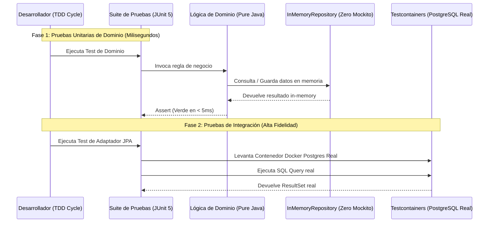

# Módulo 0 - Lección 2: Test-Driven Development (TDD), Zero Mockito & Testcontainers

---

## 1. 🐣 Rincón Junior: Conceptos desde Cero & Analogías

### ¿Qué es TDD (Test-Driven Development)?
Imagina que vas a construir un puente de LEGO. En lugar de armar todo el puente y luego tirar una piedra pesada para ver si aguanta (**Desarrollo Tradicional**), primero fabricas un molde de prueba de peso y luego construyes la estructura justa y necesaria que encaje en ese molde (**TDD**).

### El Ciclo Rojo-Verde-Refactor
1. 🔴 **Red (Rojo)**: Escribes una prueba que describe la nueva funcionalidad. Al ejecutarla, **debe fallar** (porque el código de negocio aún no existe).
2. 🟢 **Green (Verde)**: Escribes la menor cantidad de código posible para que la prueba pase.
3. 🔵 **Refactor**: Limpias y organizas el código sin cambiar su comportamiento, asegurándote de que la prueba siga pasando.

### ¿Por qué "Zero Mockito" en el Dominio?
Los "Mocks" (simulaciones falsas) como Mockito pueden dar una **falsa sensación de seguridad**. Si mockeas demasiado, acabas probando que el mock funciona, no que tu código real funcione. En el dominio usamos **Stubs in-memory** (listas o mapas en memoria sencillos).

---

## 2. 📐 Arquitectura Visual & Diagrama Mermaid



---

## 3. 🚀 Guía Paso a Paso e Implementación Práctica (0 a 100)

### Paso 1: Escribir la Prueba Unitarias de Dominio (Zero Mockito)

```java
package com.corp.domain;

import com.corp.domain.model.Money;
import com.corp.domain.model.Order;
import com.corp.domain.stub.InMemoryOrderRepository;
import org.junit.jupiter.api.BeforeEach;
import org.junit.jupiter.api.Test;

import java.math.BigDecimal;
import java.util.UUID;

import static org.assertj.core.api.Assertions.assertThat;

class OrderServiceTest {

    private InMemoryOrderRepository repository;

    @BeforeEach
    void setUp() {
        // Stub in-memory hermético y rápido (Zero Mockito)
        repository = new InMemoryOrderRepository();
    }

    @Test
    void shouldCreateAndConfirmOrderSuccessfully() {
        // Given
        UUID orderId = UUID.randomUUID();
        Order order = new Order(orderId, "tenant-01", new Money(new BigDecimal("100.00"), "EUR"), false);
        repository.save(order);

        // When
        Order confirmed = order.confirm();
        repository.save(confirmed);

        // Then
        Order retrieved = repository.findById(orderId, "tenant-01").orElseThrow();
        assertThat(retrieved.confirmed()).isTrue();
    }
}
```

### Paso 2: Implementar el Stub Hermético In-Memory

```java
package com.corp.domain.stub;

import com.corp.domain.model.Order;
import com.corp.domain.port.out.OrderRepositoryPort;

import java.util.Map;
import java.util.Optional;
import java.util.UUID;
import java.util.concurrent.ConcurrentHashMap;

public class InMemoryOrderRepository implements OrderRepositoryPort {
    private final Map<UUID, Order> store = new ConcurrentHashMap<>();

    @Override
    public Order save(Order order) {
        store.put(order.id(), order);
        return order;
    }

    @Override
    public Optional<Order> findById(UUID id, String tenantId) {
        return Optional.ofNullable(store.get(id))
                .filter(o -> o.tenantId().equals(tenantId));
    }
}
```

---

## 4. 🧠 Referencia Senior: Cheatsheet, Performance & Internals

### Comparativa de Suites de Prueba

| Tipo de Prueba | Herramienta | Velocidad | Fidelidad | Ámbito Recomendado |
| :--- | :--- | :--- | :--- | :--- |
| **Unitaria de Dominio** | JUnit 5 + InMemory Stubs | **< 2 ms** | Alta | Reglas de Negocio / Agregados |
| **Adaptador de Persistencia** | Testcontainers (Postgres) | **~1.5 s** | 100% Real | Queries SQL, Transacciones, JPA |
| **Prueba de API / E2E** | REST-Assured + Cloud Run Local | **~3 s** | 100% Real | Contratos HTTP / JSON Schemas |

### Configuración de Reutilización en Testcontainers (`.testcontainers.properties`)
Para evitar que Testcontainers destruya y levante el contenedor Docker en cada clase de test individual (ahorrando hasta un 80% del tiempo de test):

```properties
# ~/.testcontainers.properties
testcontainers.reuse.enable=true
```

En el código Java:
```java
@Container
static PostgreSQLContainer<?> postgres = new PostgreSQLContainer<>("postgres:16-alpine")
        .withReuse(true);
```

---

## 5. ⚠️ Errores Comunes & Anti-Patrones (Gotchas)

1. **Abusar de `@SpringBootTest` para probar reglas de negocio simples**:
   * *Síntoma*: La suite de tests tarda 2 minutos en ejecutarse porque levanta todo el framework de Spring para probar un cálculo matemático básico.
   * *Solución*: Usa tests unitarios puros con JUnit 5 y Stubs in-memory.
2. **Utilizar bases de datos H2 en memoria para simular PostgreSQL o Oracle**:
   * *Síntoma*: El test pasa en H2 pero falla en producción porque H2 tolera sintaxis SQL o dialectos no compatibles con Postgres.
   * *Solución*: Usa siempre **Testcontainers** con la misma versión exacta de Docker de producción.


---

## 5. 🎯 Desafío Feynman & Auto-Evaluación sin Jerga

> [!NOTE]
> **El Reto de los 12 Años**: Explica el mecanismo esencial y la utilidad práctica de **Test-Driven Development (TDD), Zero Mockito & Testcontainers** a un estudiante de secundaria, **sin usar las palabras:** "Test-Driven", "Development", "(TDD)," ni tecnicismos complejos de memoria.

### Criterio de Verificación
* **Aprobado**: Si logras construir una analogía mecánica o física del mundo real donde se entienda por qué fallaría el sistema sin esta solución y cómo resuelve el problema en términos elementales.
* **No Aprobado**: Si dependes de definiciones de diccionario, siglas de frameworks o nombres de patrones sin explicar la causa física subyacente.


---
## 🧠 Ejercicio Práctico: El Método Feynman

Para garantizar una asimilación profunda de los conceptos presentados en este módulo, aplica el **Método Feynman**:

> **Instrucción:** Explica los conceptos centrales de este módulo como si tu audiencia fuera un estudiante brillante de 12 años que no ha visto nunca este tema. Si no puedes hacerlo con lenguaje sencillo, analogías claras y sin jerga técnica, significa que aún no lo entiendes lo suficientemente bien.

*Inténtalo tú mismo:* Toma el concepto más complejo de este módulo, escríbelo en un papel en blanco y redáctalo usando únicamente términos cotidianos.
