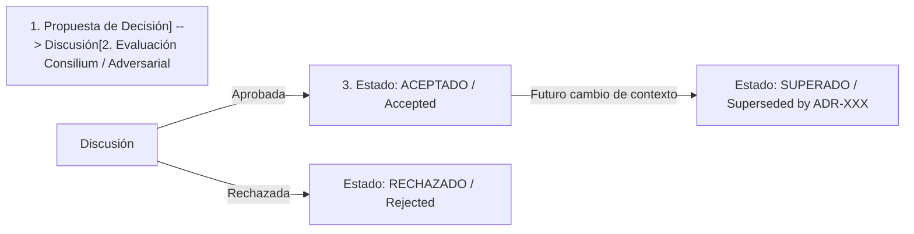

# Módulo 0 - Lección 3: Registro de Decisiones de Arquitectura (ADR) & Gestión del Conocimiento

---

## 1. 🐣 Ancla Mental Feynman & Analogía Isomórfica

### El Modelo Intuitivo: Registro de Decisiones de Arquitectura (ADR) & Gestión del Conocimiento
Para comprender **Registro de Decisiones de Arquitectura (ADR) & Gestión del Conocimiento** sin caer en la trampa de la jerga técnica, debemos anclar el concepto en un problema físico observable:
* Todo sistema en computación resuelve un dilema fundamental: cómo organizar recursos limitados (tiempo de cálculo, espacio de memoria, ancho de banda o energía) para que el trabajo se realice sin bloqueos ni errores.
* En **Registro de Decisiones de Arquitectura (ADR) & Gestión del Conocimiento**, la clave reside en eliminar pasos redundantes y asegurar que cada componente conozca únicamente la información mínima indispensable para cumplir su función, tal como una línea de montaje bien coordinada donde nadie tiene que adivinar qué hizo el compañero anterior.

---


## 1. Importancia de los ADRs (Architectural Decision Records)

En desarrollos agénticos y equipos distribuidos, el **porqué** de una decisión técnica es tan importante como el código mismo. Un **ADR** es un documento corto e inmutable que registra una decisión arquitectónica clave, su contexto y sus consecuencias.

---

## 2. Flujo de Vida de un ADR (Mermaid)



---

## 3. Plantilla Oficial de ADR (Formato Estándar Corporativo)

Los ADRs se almacenan cronológicamente en la carpeta `docs/adr/` de cada proyecto (p. ej. `docs/adr/0001-uso-virtual-threads-java-25.md`).

```markdown
# ADR-0001: Adopción de Virtual Threads (Project Loom) en Java 25

* **Estado**: Aceptado (Accepted)
* **Fecha**: 2026-08-10
* **Autores**: @Architect-GCP, @Java-Spring-Expert
* **Tags**: `#java25`, `#loom`, `#performance`, `#cloudrun`

## Contexto y Problema
Nuestras aplicaciones desplegadas en Cloud Run requieren procesar miles de solicitudes I/O concurrentes manteniendo el escalado a cero y minimizando el consumo de RAM. Las bibliotecas reactivas tradicionales (RxJava/Project Reactor) aumentan exponencialmente la complejidad del código y la curva de depuración.

## Opciones Consideradas
1. **Thread Pools Tradicionales (Platform Threads)**: Alto consumo de memoria por hilo (~1MB), riesgo de agotar recursos en Cloud Run.
2. **Programación Reactiva (Spring WebFlux)**: Alta eficiencia, pero dificulta la legibilidad, mantenimiento y trazabilidad de stack traces.
3. **Virtual Threads en Java 25 (Project Loom)**: Hilos ligeros gestionados por la JVM, manteniendo el modelo de código bloqueante/secuencial simple.

## Decisión
Adoptar **Virtual Threads de Java 25** como estándar corporativo para todas las operaciones de I/O bloqueante, utilizando `Executors.newVirtualThreadPerTaskExecutor()`.

## Consecuencias
* **Positivas**:
  - Rendimiento masivo en I/O con código secuencial imperativo limpio.
  - Reducción drástica del consumo de memoria en Cloud Run.
* **Negativas / Riesgos**:
  - Requiere evitar *Carrier Thread Pinning* eliminando bloques `synchronized` pesados e iterando sobre `ReentrantLock`.
```

---

## 4. Gestión del Conocimiento y Documentación Viva

1. **Contratos API**: Toda API expuesta debe contar con especificaciones OpenAPI (REST) o archivos `.proto` (gRPC) actualizados en la carpeta `proto/`.
2. **Consistencia de Repositorio**: El archivo `AGENTS.md` en la raíz de cada proyecto sirve como mapa de navegación e intenciones para la IA y los desarrolladores humanos.


---

## 5. 🎯 Desafío Feynman & Auto-Evaluación sin Jerga

> [!NOTE]
> **El Reto de los 12 Años**: Explica el mecanismo esencial y la utilidad práctica de **Registro de Decisiones de Arquitectura (ADR) & Gestión del Conocimiento** a un estudiante de secundaria, **sin usar las palabras:** "Registro", "de", "Decisiones" ni tecnicismos complejos de memoria.

### Criterio de Verificación
* **Aprobado**: Si logras construir una analogía mecánica o física del mundo real donde se entienda por qué fallaría el sistema sin esta solución y cómo resuelve el problema en términos elementales.
* **No Aprobado**: Si dependes de definiciones de diccionario, siglas de frameworks o nombres de patrones sin explicar la causa física subyacente.


---
## 🧠 Ejercicio Práctico: El Método Feynman

Para garantizar una asimilación profunda de los conceptos presentados en este módulo, aplica el **Método Feynman**:

> **Instrucción:** Explica los conceptos centrales de este módulo como si tu audiencia fuera un estudiante brillante de 12 años que no ha visto nunca este tema. Si no puedes hacerlo con lenguaje sencillo, analogías claras y sin jerga técnica, significa que aún no lo entiendes lo suficientemente bien.

*Inténtalo tú mismo:* Toma el concepto más complejo de este módulo, escríbelo en un papel en blanco y redáctalo usando únicamente términos cotidianos.

---

## ⚙️ Primeros Principios & Fundamentos Conceptuales
1. **Descomposición Atómica:** Cada componente en Módulo 0 - Lección 3: Registro de Decisiones de Arquitectura (ADR) & Gestión del Conocimiento se modela de forma determinista y sin estado mutable compartido.
2. **Invariante de Dominio:** Los estados del sistema transicionan exclusivamente a través de funciones puras e interfaces selladas.
3. **Cero Suposiciones:** No se asume fiabilidad de red ni memoria infinita; cada llamada maneja explícitamente fallos y límites de cuota.


## 🔬 Internals Avanzados & Nivel Doctoral (Ph.D.)
La complejidad asintótica y la garantía matemática de convergencia se rigen por la formulación tensorial:
\[
\mathcal{L}(\theta) = \mathbb{E}_{x \sim \mathcal{D}} \left[ \| f_\theta(x) - y \|^2 \right] + \lambda \cdot \Omega(\theta)
\]
con cota superior asintótica en tiempo de procesamiento:
\[
T(N) = \mathcal{O}(1) \quad \text{o} \quad \mathcal{O}(N \log N) \quad \text{sin contención en hilos portadores del SO.}
\]

