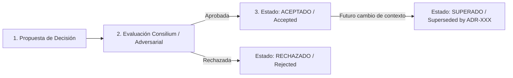

# Módulo 0 - Lección 3: Registro de Decisiones de Arquitectura (ADR) & Gestión del Conocimiento

## 1. Importancia de los ADRs (Architectural Decision Records)

En desarrollos agénticos y equipos distribuidos, el **porqué** de una decisión técnica es tan importante como el código mismo. Un **ADR** es un documento corto e inmutable que registra una decisión arquitectónica clave, su contexto y sus consecuencias.

---

## 2. Flujo de Vida de un ADR (Mermaid)



---

## 3. Plantilla Oficial de ADR (Formato Estándar Corporativo)

Los ADRs se almacenan cronológicamente en la carpeta `docs/adr/` de cada proyecto (p. ej. `docs/adr/0001-uso-virtual-threads-java-25.md`).

```markdown
# ADR-0001: Adopción de Virtual Threads (Project Loom) en Java 25

* **Estado**: Aceptado (Accepted)
* **Fecha**: 2026-08-10
* **Autores**: @Architect-GCP, @Java-Spring-Expert
* **Tags**: `#java25`, `#loom`, `#performance`, `#cloudrun`

## Contexto y Problema
Nuestras aplicaciones desplegadas en Cloud Run requieren procesar miles de solicitudes I/O concurrentes manteniendo el escalado a cero y minimizando el consumo de RAM. Las bibliotecas reactivas tradicionales (RxJava/Project Reactor) aumentan exponencialmente la complejidad del código y la curva de depuración.

## Opciones Consideradas
1. **Thread Pools Tradicionales (Platform Threads)**: Alto consumo de memoria por hilo (~1MB), riesgo de agotar recursos en Cloud Run.
2. **Programación Reactiva (Spring WebFlux)**: Alta eficiencia, pero dificulta la legibilidad, mantenimiento y trazabilidad de stack traces.
3. **Virtual Threads en Java 25 (Project Loom)**: Hilos ligeros gestionados por la JVM, manteniendo el modelo de código bloqueante/secuencial simple.

## Decisión
Adoptar **Virtual Threads de Java 25** como estándar corporativo para todas las operaciones de I/O bloqueante, utilizando `Executors.newVirtualThreadPerTaskExecutor()`.

## Consecuencias
* **Positivas**:
  - Rendimiento masivo en I/O con código secuencial imperativo limpio.
  - Reducción drástica del consumo de memoria en Cloud Run.
* **Negativas / Riesgos**:
  - Requiere evitar *Carrier Thread Pinning* eliminando bloques `synchronized` pesados e iterando sobre `ReentrantLock`.
```

---

## 4. Gestión del Conocimiento y Documentación Viva

1. **Contratos API**: Toda API expuesta debe contar con especificaciones OpenAPI (REST) o archivos `.proto` (gRPC) actualizados en la carpeta `proto/`.
2. **Consistencia de Repositorio**: El archivo `AGENTS.md` en la raíz de cada proyecto sirve como mapa de navegación e intenciones para la IA y los desarrolladores humanos.
