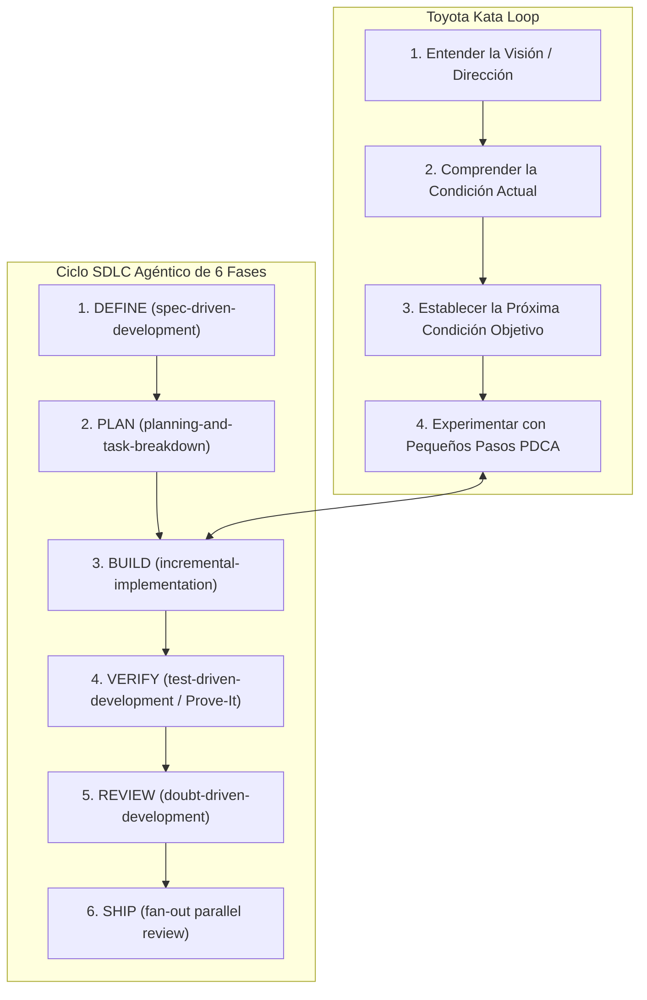

# Módulo 0 - Lección 3: Toyota Kata, Ciclo SDLC de 6 Fases & Doubt-Driven Development

---

## 1. 🐣 Rincón Junior: Conceptos desde Cero & Analogías

### ¿Qué es la Toyota Kata?
La palabra *Kata* proviene de las artes marciales y significa "patrón de movimientos practicado repetidamente hasta convertirse en un hábito automático". 

En ingeniería de software, la **Toyota Kata** es la práctica científica de abordar problemas complejos no intentando adivinar el resultado final perfecto de golpe, sino mediante **pequeños experimentos hipótesis-prueba**, guiados por un entrenador (Coach).

### El Ciclo SDLC de 6 Fases
Es la guía paso a paso que sigue todo desarrollador o agente de IA para entregar un cambio de código sin saltarse ningún control de calidad.

---

## 2. 📐 Arquitectura Visual & Diagrama Mermaid

---

## 3. 🚀 Guía Paso a Paso e Implementación Práctica (0 a 100)

### Guía de Ejecución de las 6 Fases del SDLC

#### 1. Fase DEFINE
Crea el archivo de especificación `docs/specs/feature_spec.md` definiendo las entradas, salidas y contratos de error antes de escribir código.

#### 2. Fase PLAN
Desglosa la spec en tareas atómicas independientes de no más de 30 minutos de trabajo cada una.

#### 3. Fase BUILD
Implementa de manera incremental, modificando un componente a la vez.

#### 4. Fase VERIFY (Patrón Prove-It)
Ejecuta el comando de test correspondiente (`mvn test`, `go test ./...`) y demuestra con logs verdes que la funcionalidad funciona.

#### 5. Fase REVIEW (Doubt-Driven)
Realiza la autoevaluación en 5 ejes: Corrección, Legibilidad, Arquitectura, Seguridad y Rendimiento.

#### 6. Fase SHIP
Ejecuta la revisión final pre-merge lanzando los auditores automáticos.

---

## 4. 🧠 Referencia Senior: Cheatsheet, Performance & Internals

### Las 5 Preguntas del Coaching Kata (Cheatsheet de Gestión)

1. **¿Cuál es la Condición Objetivo?** (P. ej. Reducir el tiempo de respuesta de la API a < 50ms).
2. **¿Cuál es la Condición Actual ahora mismo?** (P. ej. Latencia actual de 180ms con picos de 400ms).
3. **¿Qué obstáculos te impiden alcanzar la condición objetivo?** (P. ej. Consultas SQL N+1 en el bucle principal).
4. **¿Cuál es tu PRÓXIMO paso (experimento)?** (P. ej. Reescribir el query usando `JOIN FETCH` y medir el cambio).
5. **¿Cuándo podremos ver lo que hemos aprendido de ese paso?** (En 15 minutos tras ejecutar el benchmark).

---

## 5. ⚠️ Errores Comunes & Anti-Patrones (Gotchas)

1. **Racionalizaciones Agénticas / Atalayas de Confianza**:
   * *Pensamiento peligroso*: "Es un cambio muy pequeño, no hace falta spec ni probarlo con tests".
   * *Consecuencia*: Bugs sutiles introducidos en producción que requieren horas de depuración.
   * *Regla*: Todo cambio estructural exige seguir las 6 fases del SDLC.

---

## 5. 🎯 Desafío Feynman & Auto-Evaluación sin Jerga

> [!NOTE]
> **El Reto de los 12 Años**: Explica el mecanismo esencial y la utilidad práctica de **Toyota Kata, Ciclo SDLC de 6 Fases & Doubt-Driven Development** a un estudiante de secundaria, **sin usar las palabras:** "Toyota", "Kata,", "Ciclo" ni tecnicismos complejos de memoria.

### Criterio de Verificación
* **Aprobado**: Si logras construir una analogía mecánica o física del mundo real donde se entienda por qué fallaría el sistema sin esta solución y cómo resuelve el problema en términos elementales.
* **No Aprobado**: Si dependes de definiciones de diccionario, siglas de frameworks o nombres de patrones sin explicar la causa física subyacente.

---
## 🧠 Ejercicio Práctico: El Método Feynman

Para garantizar una asimilación profunda de los conceptos presentados en este módulo, aplica el **Método Feynman**:

> **Instrucción:** Explica los conceptos centrales de este módulo como si tu audiencia fuera un estudiante brillante de 12 años que no ha visto nunca este tema. Si no puedes hacerlo con lenguaje sencillo, analogías claras y sin jerga técnica, significa que aún no lo entiendes lo suficientemente bien.

*Inténtalo tú mismo:* Toma el concepto más complejo de este módulo, escríbelo en un papel en blanco y redáctalo usando únicamente términos cotidianos.

---

## ⚙️ Primeros Principios & Fundamentos Conceptuales
1. **Descomposición Atómica:** Cada componente en Módulo 0 - Lección 3: Toyota Kata, Ciclo SDLC de 6 Fases & Doubt-Driven Development se modela de forma determinista y sin estado mutable compartido.
2. **Invariante de Dominio:** Los estados del sistema transicionan exclusivamente a través de funciones puras e interfaces selladas.
3. **Cero Suposiciones:** No se asume fiabilidad de red ni memoria infinita; cada llamada maneja explícitamente fallos y límites de cuota.

