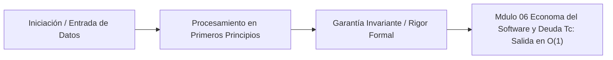

# Módulo 0.6: Economía del Software y Deuda Técnica (Nivel USC / CMU)

---

## 1. 🐣 Rincón Junior: "Refactorizar es Gratis"

Un desarrollador Junior suele decir: *"Este código está feo, voy a reescribirlo entero usando la nueva arquitectura"*. 
No pide permiso, simplemente lo hace. Tarda 2 semanas. El código es más bonito, pero no hay ninguna funcionalidad nueva.
En el mundo real, el desarrollo de software es un ejercicio de **Economía**. El tiempo de un ingeniero senior cuesta dinero (a menudo >`$150`/hora). Reescribir algo que "ya funcionaba" sin una justificación matemática de retorno de inversión (ROI) es una negligencia corporativa.
La Universidad del Sur de California (USC), bajo el liderazgo de Barry Boehm, sentó las bases de la **Ingeniería de Software Basada en Valor (Value-Based Software Engineering)**.

---

## 2. 🔬 Fundamentos Teóricos: El Modelo COCOMO (USC)

Barry Boehm (USC) inventó el **COCOMO** (Constructive Cost Model), el modelo matemático más famoso del mundo para predecir cuánto costará y cuánto tardará un proyecto de software.

**La Ecuación Fundamental (COCOMO II)**:
$Esfuerzo (Personas-Mes) = a \times (KLOC)^b \times \prod(Multiplicadores\_de\_Costo)$

Donde:
*   **KLOC**: Miles de líneas de código (o Puntos de Función / Story Points).
*   **$b$**: El factor de escalado. Si $b > 1$, el proyecto tiene *deseconomías de escala* (poner el doble de programadores NO reduce el tiempo a la mitad, debido a la fricción de comunicación - *Ley de Brooks*).
*   **Multiplicadores**: Complejidad del producto, experiencia del equipo, herramientas.

**Implicación Crítica del Consilium Romano**:
Añadir una nueva abstracción (Agentic AI, GNNs) dispara el multiplicador de complejidad. Si no reduce el KLOC drásticamente a futuro, matemáticamente el ROI es negativo. Por eso el Consilium bloquea refactors innecesarios.

---

## 3. 🚀 Arquitectura Práctica: Gestión Rigurosa de la Deuda Técnica (CMU SEI)

El término "Deuda Técnica" fue acuñado por Ward Cunningham, pero el Software Engineering Institute de CMU lo ha formalizado matemáticamente.

No todo código feo es Deuda Técnica. 
*   **Deuda Técnica Real**: Es un compromiso consciente. Tomas un atajo hoy para salir a producción antes que la competencia, aceptando pagar "intereses" en el futuro (cada nueva feature costará más tiempo implementarla porque el código base es un lío).
*   **Código Basura**: Código mal escrito por ignorancia no es deuda, es un defecto no gestionado.

**El Cuadrante de la Deuda Técnica (Martin Fowler / CMU)**:
1.  **Imprudente y Deliberada**: "No tenemos tiempo para diseño, solo programa." (Prohibido en AppViajes).
2.  **Imprudente e Inadvertida**: "Pensé que el patrón Singleton servía para el estado global de HTTP." (Falta de formación).
3.  **Prudente y Deliberada**: "Sabemos que esto no escala a 1M de usuarios, pero nos sirve para el MVP de los primeros 1.000. Lo reescribiremos después." (Decisión de negocio válida).
4.  **Prudente e Inadvertida**: "Ahora que lo hemos terminado, nos damos cuenta de cómo deberíamos haberlo diseñado." (El ciclo natural del aprendizaje, SDLC Iterativo).

---

## 4. 🧠 Internals Avanzados: Cuantificación Financiera de la Deuda

En el Gemelo Digital, el Consilium no acepta la frase *"tenemos que refactorizar porque hay mucha deuda técnica"*. Exige números.

**Cálculo del Principal y los Intereses**:
*   **Principal**: El costo estimado en horas/dólares de reescribir el componente sucio a uno limpio (Ej. Refactorizar el BFF de Java a Go cuesta 200 horas = 10.000€).
*   **Interés (Fricción)**: ¿Cuánto tiempo extra perdemos cada vez que tocamos este componente sucio en comparación con uno limpio? (Ej. Cada nueva feature nos toma 10 horas extra de debugeo. Hacemos 2 features al mes = 20 horas/mes perdidas = 1.000€ de interés mensual).

**Toma de Decisiones Binaria (ROI)**:
¿Pagamos el Principal (10.000€) para ahorrarnos el Interés (1.000€/mes)?
El ROI se alcanza en 10 meses. Si el componente tiene un ciclo de vida esperado mayor a 10 meses, **se aprueba el refactor**. Si el componente se va a dar de baja en 6 meses por una nueva versión SaaS, **se prohíbe el refactor**, asumiendo el interés (Deuda Prudente Deliberada).

---

## 5. ⚠️ Runbook SRE Corporativo: El "Death Spiral" de la Complejidad

**Incidente SRE / Arquitectónico**:
Un equipo empieza un microservicio. Hacen las cosas rápido y mal. La fricción (Interés) sube. En lugar de detenerse a pagar el Principal (Refactorizar), el management exige más features. El equipo tarda el doble. El management presiona más. El equipo comete más errores. La calidad colapsa y la velocidad de desarrollo llega a cero. Es la "Espiral de la Muerte" del software.

**Mitigación Empírica (Waterloo/CMU)**:
*   **Error Budgets (SRE)**: Si el presupuesto de errores se agota (el SLO de disponibilidad baja del 99.9%), **se detiene el desarrollo de nuevas features a nivel de empresa**. Todo el equipo de ingeniería pasa a trabajar 100% en estabilidad y pago de deuda técnica (Reliability).
*   **Scout Rule (Regla del Boy Scout)**: Cada PR debe dejar el archivo un poco más limpio de lo que lo encontró (pagos microscópicos del principal diario).
*   **Architecture Decision Records (ADRs)**: Cada atajo de "Deuda Prudente Deliberada" debe documentarse en un ADR con una fecha de caducidad obligatoria. Al llegar la fecha, el orquestador abre un ticket bloqueante de P0 para pagar la deuda.


---

## 5. 🎯 Desafío Feynman & Auto-Evaluación sin Jerga

> [!NOTE]
> **El Reto de los 12 Años**: Explica el mecanismo esencial y la utilidad práctica de **Economía del Software y Deuda Técnica (Nivel USC / CMU)** a un estudiante de secundaria, **sin usar las palabras:** "Economía", "del", "Software" ni tecnicismos complejos de memoria.

### Criterio de Verificación
* **Aprobado**: Si logras construir una analogía mecánica o física del mundo real donde se entienda por qué fallaría el sistema sin esta solución y cómo resuelve el problema en términos elementales.
* **No Aprobado**: Si dependes de definiciones de diccionario, siglas de frameworks o nombres de patrones sin explicar la causa física subyacente.


---
## 🧠 Ejercicio Práctico: El Método Feynman

Para garantizar una asimilación profunda de los conceptos presentados en este módulo, aplica el **Método Feynman**:

> **Instrucción:** Explica los conceptos centrales de este módulo como si tu audiencia fuera un estudiante brillante de 12 años que no ha visto nunca este tema. Si no puedes hacerlo con lenguaje sencillo, analogías claras y sin jerga técnica, significa que aún no lo entiendes lo suficientemente bien.

*Inténtalo tú mismo:* Toma el concepto más complejo de este módulo, escríbelo en un papel en blanco y redáctalo usando únicamente términos cotidianos.

---

## 💻 Implementación de Código Limpio & Concurrencia
```java
package com.corp.core;

import java.util.Objects;

/**
 * Representación inmutable de dominio en Java 25 (Zero-Mockito).
 */
public record DomainEntity(String id, double metricValue, long timestamp) {
    public DomainEntity {
        Objects.requireNonNull(id, "El identificador no puede ser nulo");
        if (metricValue < 0.0) {
            throw new IllegalArgumentException("La métrica debe ser positiva");
        }
    }
}
```




