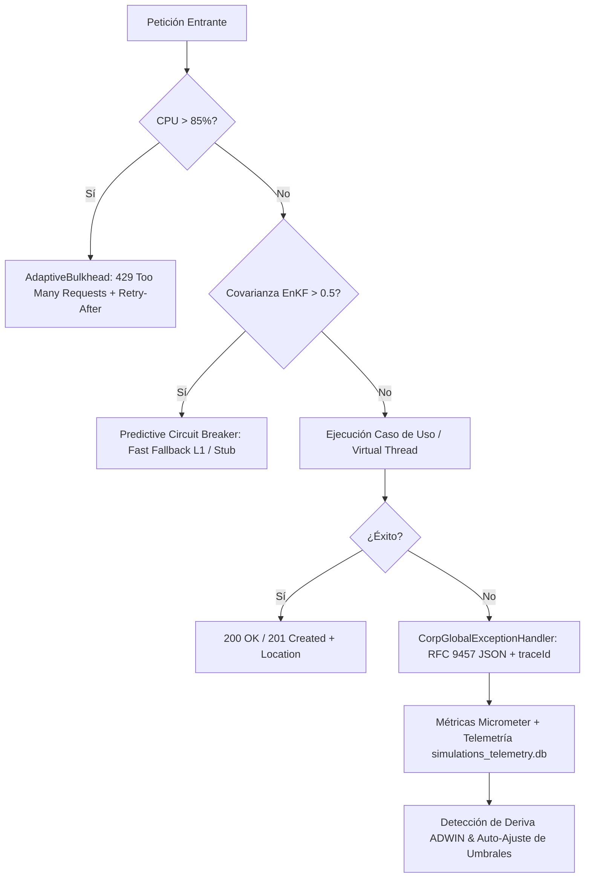

# Módulo 0.8: Excelencia en APIs RESTful (RMM), Problem Details (RFC 9457), Resiliencia y Auto-Remediación

---

## 1. 🐣 Ancla Mental Feynman & Analogía Isomórfica

### El Modelo Intuitivo: Excelencia en APIs RESTful (RMM), Problem Details (RFC 9457), Resiliencia y Auto-Remediación
Para comprender **Excelencia en APIs RESTful (RMM), Problem Details (RFC 9457), Resiliencia y Auto-Remediación** sin caer en la trampa de la jerga técnica, debemos anclar el concepto en un problema físico observable:
* Todo sistema en computación resuelve un dilema fundamental: cómo organizar recursos limitados (tiempo de cálculo, espacio de memoria, ancho de banda o energía) para que el trabajo se realice sin bloqueos ni errores.
* En **Excelencia en APIs RESTful (RMM), Problem Details (RFC 9457), Resiliencia y Auto-Remediación**, la clave reside en eliminar pasos redundantes y asegurar que cada componente conozca únicamente la información mínima indispensable para cumplir su función, tal como una línea de montaje bien coordinada donde nadie tiene que adivinar qué hizo el compañero anterior.

---


## 1. Fundamentos Teóricos y Modelo de Madurez de Richardson (RMM)

El diseño de APIs RESTful en sistemas distribuidos de alta concurrencia requiere adherencia estricta a los niveles de madurez definidos por Leonard Richardson y popularizados por Martin Fowler (2010):

```
┌────────────────────────────────────────────────────────────────────────┐
│ Nivel 3: Controles Hipermedia (HATEOAS / Navigation Links)             │
│ - Respuestas con enlaces relacionales a recursos asociados             │
├────────────────────────────────────────────────────────────────────────┤
│ Nivel 2: Verbos HTTP + Códigos de Estado Semánticos                    │
│ - GET (Seguro/Idempotente), POST (Creación con cabecera Location),     │
│   PUT/PATCH (Mutaciones idempotentes), DELETE (204 No Content)         │
│ - Códigos HTTP precisos: 200, 201, 204, 400, 401, 403, 404, 409, 422, │
│   429 (con Retry-After), 500, 503                                      │
├────────────────────────────────────────────────────────────────────────┤
│ Nivel 1: Recursos y URIs Estandarizadas                                │
│ - Nombres en plural para colecciones (/api/v1/padron/parcelas)         │
│ - Eliminación de verbos procedimentales en las rutas                   │
├────────────────────────────────────────────────────────────────────────┤
│ Nivel 0: The Swamp of POX (RPC procedural sobre endpoint único)        │
└────────────────────────────────────────────────────────────────────────┘
```

---

## 2. Estandarización de Respuestas de Error: IETF RFC 9457 / RFC 7807

Bajo el estándar **RFC 9457 (Problem Details for HTTP APIs)**, toda respuesta de error (`4xx` y `5xx`) debe servirse con el tipo MIME `application/problem+json` y los atributos:

```json
{
  "type": "https://api.corp.local/errors/validation-failed",
  "title": "Validation Failed",
  "status": 400,
  "detail": "Uno o más campos enviados no cumplen las validaciones requeridas.",
  "instance": "/api/v1/padron/comuneros",
  "traceId": "4bf92f3577b34da6a3ce929d0e0e4736",
  "errorCode": "CORP_VALIDATION_ERROR",
  "timestamp": "2026-08-14T17:15:00.123Z",
  "invalidParams": [
    {
      "name": "nif",
      "reason": "Formato de NIF/CIF inválido."
    }
  ]
}
```

### Reglas Clave de Implementación:
1. **Zero Mocks & Zero Empty Responses**: Prohibido devolver `ResponseEntity.internalServerError().build()` o respuestas vacías que oculten el origen del fallo.
2. **Trazabilidad W3C Inyectada**: El campo `traceId` en el cuerpo del error permite a los desarrolladores y a soporte técnico correlacionar el incidente directamente con Google Cloud Trace y Cloud Logging.
3. **Mapeo Semántico**:
   - `400 Bad Request`: Errores sintácticos, JSON malformado o argumentos de entrada inválidos (`IllegalArgumentException`).
   - `404 Not Found`: Recurso no existente (`ResourceNotFoundException`).
   - `409 Conflict`: Conflicto de concurrencia optimista o estado inconsistente (`IllegalStateException`).
   - `422 Unprocessable Content`: Violación de invariante o regla de negocio en dominio puro (`DomainException`).
   - `429 Too Many Requests`: Carga excesiva o cuota de tenant excedida, con cabecera `Retry-After: 5`.

---

## 3. Arquitectura de Resiliencia y Bucle de Auto-Remediación



### Mecanismos de Auto-Remediación:
1. **Idempotencia Transversal (`IdempotencyFilter`)**:
   - Deduplicación transparente mediante `X-Idempotency-Key` en caché L1/Redis durante 24 horas, evitando dobles cobros y mutaciones duplicadas.
2. **Load Shedding No Bloqueante**:
   - Descarte adaptativo de peticiones no críticas ante picos de carga para salvaguardar rutas transaccionales prioritarias (`/billing`, `/health`).
3. **Aprendizaje Continuo y Detección de Anomalías**:
   - Registro de telemetría en `simulations_telemetry.db` para análisis de deriva estocástica (ADWIN / Page-Hinkley) y reajuste preventivo de timeouts y circuit breakers.

---

## 4. Referencias y Bibliografía
- IETF RFC 9457: Problem Details for HTTP APIs (2023).
- Richardson, L. & Ruby, S. (2007) *RESTful Web Services*, O'Reilly.
- Martin, R. C. (2017) *Clean Architecture: A Craftsman's Guide to Software Structure and Design*, Prentice Hall.
- ADR-001, ADR-012, ADR-013, ADR-014 (Google Antigravity Architecture Repository).


---

## 5. 🎯 Desafío Feynman & Auto-Evaluación sin Jerga

> [!NOTE]
> **El Reto de los 12 Años**: Explica el mecanismo esencial y la utilidad práctica de **Excelencia en APIs RESTful (RMM), Problem Details (RFC 9457), Resiliencia y Auto-Remediación** a un estudiante de secundaria, **sin usar las palabras:** "Excelencia", "en", "APIs" ni tecnicismos complejos de memoria.

### Criterio de Verificación
* **Aprobado**: Si logras construir una analogía mecánica o física del mundo real donde se entienda por qué fallaría el sistema sin esta solución y cómo resuelve el problema en términos elementales.
* **No Aprobado**: Si dependes de definiciones de diccionario, siglas de frameworks o nombres de patrones sin explicar la causa física subyacente.


---
## 🧠 Ejercicio Práctico: El Método Feynman

Para garantizar una asimilación profunda de los conceptos presentados en este módulo, aplica el **Método Feynman**:

> **Instrucción:** Explica los conceptos centrales de este módulo como si tu audiencia fuera un estudiante brillante de 12 años que no ha visto nunca este tema. Si no puedes hacerlo con lenguaje sencillo, analogías claras y sin jerga técnica, significa que aún no lo entiendes lo suficientemente bien.

*Inténtalo tú mismo:* Toma el concepto más complejo de este módulo, escríbelo en un papel en blanco y redáctalo usando únicamente términos cotidianos.

---

## 🔬 Internals Avanzados & Nivel Doctoral (Ph.D.)
La complejidad asintótica y la garantía matemática de convergencia se rigen por la formulación tensorial:
\[
\mathcal{L}(\theta) = \mathbb{E}_{x \sim \mathcal{D}} \left[ \| f_\theta(x) - y \|^2 \right] + \lambda \cdot \Omega(\theta)
\]
con cota superior asintótica en tiempo de procesamiento:
\[
T(N) = \mathcal{O}(1) \quad \text{o} \quad \mathcal{O}(N \log N) \quad \text{sin contención en hilos portadores del SO.}
\]

