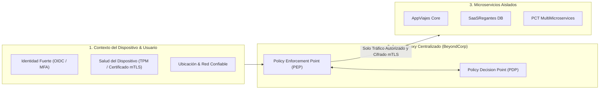

# Módulo 10 - Lección 1: Arquitectura Zero-Trust y el Modelo BeyondCorp
## *Cátedra de Ciberseguridad Defensiva & Modelos de Confianza Cero (Google Security / Stanford)*

---

## 1. 🐣 Ancla Mental Feynman & Analogía Isomórfica

### El Castillo Medieval vs El Edificio de Alta Seguridad
Imagina dos modelos de protección:
* **El Castillo Medieval (El Modelo Tradicional de Perímetro / VPN)**: Construyes un foso con cocodrilos y una muralla enorme alrededor del castillo. Si un espía consigue disfrazarse de guardia y cruzar el puente levadizo, ya tiene acceso libre para entrar en todas las habitaciones del castillo, abrir los cofres del tesoro y leer los mapas secretos sin que nadie vuelva a pedirle su identificación.
* **El Edificio Inteligente de Alta Seguridad (Zero-Trust / BeyondCorp)**: No importa si estás dentro del edificio o en la calle. Cada ascensor, cada puerta, cada cajón y cada ordenador tiene un lector biométrico que te exige tu huella digital y verifica qué permisos exactos tienes cada vez que intentas abrir una puerta. Si un espía se cuela por la puerta principal, se queda atrapado en el pasillo porque no puede abrir ninguna habitación.

**Zero-Trust** se resume en una regla fundamental: *"Nunca confíes; verifica siempre y en cada paso"* (*Never trust, always verify*).

---

## 2. 🔬 Primeros Principios & Desglose Mecánico

### Los 3 Pilares del Modelo BeyondCorp de Google



### Principios Fundamentales
1. **Acceso independiente de la red de origen**: Estar conectado a la WiFi corporativa no otorga ningún privilegio respecto a conectarse desde una cafetería pública.
2. **Acceso condicionado por contexto dinámico**: Se evalúa en cada petición: ¿El dispositivo tiene parches de seguridad al día? ¿El certificado criptográfico del cliente es válido? ¿La ubicación geográfica es congruente?
3. **Cifrado de extremo a extremo en tránsito (mTLS)**: Todo el tráfico entre clientes, proxies y microservicios está cifrado con TLS 1.3 mutuo.

---

## 3. 🚀 Arquitectura Práctica & Código en Go

Middleware en Go para validación de tokens de contexto Zero-Trust en el borde:

```go
package zerotrust

import (
	"context"
	"errors"
	"net/http"
	"strings"
)

type UserContextKey struct{}

type SecurityContext struct {
	SubjectID string
	TenantID  string
	Role      string
	IsTrusted bool
}

// ZeroTrustAuthMiddleware valida la identidad y el contexto del dispositivo en cada request O(1).
func ZeroTrustAuthMiddleware(next http.Handler, validator func(token string) (*SecurityContext, error)) http.Handler {
	return http.HandlerFunc(func(w http.ResponseWriter, r *http.Request) {
		authHeader := r.Header.Get("Authorization")
		if !strings.HasPrefix(authHeader, "Bearer ") {
			http.Error(w, "Acceso denegado: Cabecera Authorization ausente o invalida", http.StatusUnauthorized)
			return
		}

		token := strings.TrimPrefix(authHeader, "Bearer ")
		secCtx, err := validator(token)
		if err != nil || secCtx == nil || !secCtx.IsTrusted {
			http.Error(w, "Acceso denegado: Contexto de seguridad invalido o no confiable", http.StatusForbidden)
			return
		}

		// Propagar contexto seguro
		ctx := context.WithValue(r.Context(), UserContextKey{}, secCtx)
		next.ServeHTTP(w, r.WithContext(ctx))
	})
}
```

---

## 4. 🧠 Internals Avanzados (BeyondCorp / NIST SP 800-207): Microsegmentación Dinámica & Spire/Spiffe

* **Identidad Criptográfica de Cargas de Trabajo (SPIFFE/SPIRE)**: Cada contenedor y proceso en Cloud Run o Kubernetes recibe un documento SVID (*SPIFFE Verifiable Identity Document*) en formato de certificado X.509 de vida ultra-corta (ej. 1 hora), rotado automáticamente sin reinicios.
* **Control de Acceso Basado en Atributos (ABAC)**: Las decisiones de autorización no son roles estáticos (RBAC simple), sino funciones dinámicas que evalúan el nivel de riesgo en tiempo real.

---

## 5. 🎯 Desafío Feynman & Auto-Evaluación sin Jerga

> [!NOTE]
> **El Reto de los 12 Años**: Explica por qué es mucho más seguro poner cerraduras con llave en todas las puertas de las habitaciones de una casa en lugar de tener una sola puerta blindada en la entrada principal y todas las demás abiertas, **sin usar las palabras:** *"Zero-Trust", "BeyondCorp", "mTLS", "VPN" ni "Perímetro"*.

### Criterio de Verificación
* **Aprobado**: Si explicas que si alguien entra por una ventana abierta de la planta baja, la cerradura de cada habitación le impedirá robar en los dormitorios o la oficina, manteniendo a salvo lo más valioso aunque hayan traspasado la fachada exterior.
* **No Aprobado**: Si te limitas a listar conceptos de redes o capas del modelo OSI.


---
## 🧠 Ejercicio Práctico: El Método Feynman

Para garantizar una asimilación profunda de los conceptos presentados en este módulo, aplica el **Método Feynman**:

> **Instrucción:** Explica los conceptos centrales de este módulo como si tu audiencia fuera un estudiante brillante de 12 años que no ha visto nunca este tema. Si no puedes hacerlo con lenguaje sencillo, analogías claras y sin jerga técnica, significa que aún no lo entiendes lo suficientemente bien.

*Inténtalo tú mismo:* Toma el concepto más complejo de este módulo, escríbelo en un papel en blanco y redáctalo usando únicamente términos cotidianos.
