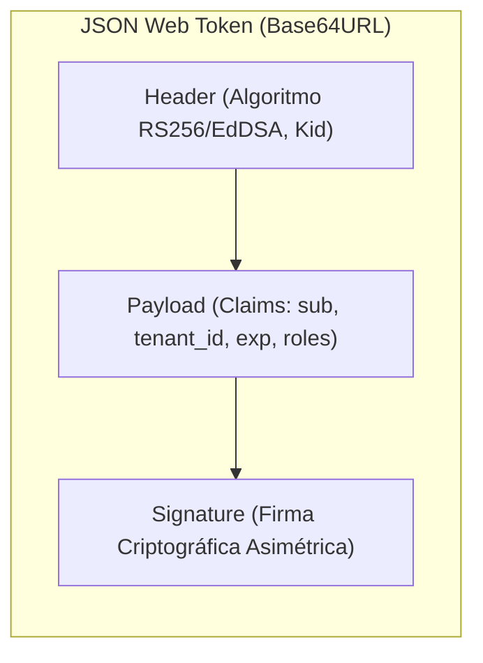

# Módulo 10 - Lección 2: Protocolo OIDC, Tokens JWT, Rotación JWKS y el Patrón BFF
## *Cátedra de Protocolos de Identidad & Seguridad Web (IETF / OpenID Foundation)*

---

## 1. 🐣 Ancla Mental Feynman & Analogía Isomórfica

### La Pulsera del Parque de Atracciones
Imagina que vas a un parque de atracciones temático:
* En la taquilla principal muestras tu DNI y pagas tu entrada (Autenticación / Proveedor de Identidad OIDC).
* La taquilla te coloca una **pulsera sellada con tinta invisible fosforescente** que indica tu nombre, el tipo de pase (ej. "Acceso VIP") y la hora en que caduca (Token JWT firmado).
* Cada vez que quieres subir a una montaña rusa, el encargado no llama por teléfono a la taquilla para preguntar si eres tú; simplemente mira tu pulsera con una linterna ultravioleta (Verificación local de firma con clave pública JWKS). Como el sello es auténtico e infalsificable, te deja pasar en 1 segundo.

Los **JSON Web Tokens (JWT)** son pulseras digitales firmadas criptográficamente que permiten a cualquier microservicio verificar la identidad y permisos de un usuario sin consultar una base de datos central en cada petición.

---

## 2. 🔬 Primeros Principios & Desglose Mecánico

### Estructura de un Token JWT (Header.Payload.Signature)



### Verificación Asimétrica con JWKS (JSON Web Key Set)
1. El Proveedor de Identidad (Firebase Auth / Google Cloud Identity) firma el JWT con su **Clave Privada** (\(K_{\text{priv}}\)).
2. Los microservicios descargan periódicamente las **Claves Públicas** (\(K_{\text{pub}}\)) desde el endpoint estándar `/.well-known/jwks.json` y las guardan en memoria caché.
3. Para validar cualquier petición entrante, el microservicio verifica la firma digital matemáticamente en \(\mathcal{O}(1)\) con cero llamadas de red:

\[
\text{Validar}(K_{\text{pub}}, \text{Header} \cdot \text{Payload}, \text{Firma}) \in \{\text{True}, \text{False}\}
\]

### El Patrón BFF (Backend-for-Frontend)
Para proteger las aplicaciones web contra ataques XSS y robo de tokens en JavaScript:
* La aplicación Single Page (React / Next.js) no guarda tokens JWT en `localStorage`.
* Se interpone un servidor ligero **BFF** (escrito en Go o Java) que maneja las sesiones mediante cookies seguras (`HttpOnly`, `SameSite=Strict`, `Secure`), intercambiando las cookies por tokens Bearer al comunicarse con los microservicios del ecosistema.

---

## 3. 🚀 Arquitectura Práctica & Código en Java 25

Extractor y validador de Claims en Java 25:

```java
package com.pct.identity.jwt;

import java.time.Instant;
import java.util.List;

/**
 * Representación inmutable de un contexto de usuario validado desde JWT.
 */
public record AuthenticatedUserPrincipal(
        String subjectId,
        String tenantId,
        String email,
        List<String> roles,
        Instant expiresAt
) {
    public boolean isExpired() {
        return Instant.now().isAfter(expiresAt);
    }

    public boolean hasRole(String role) {
        return roles != null && roles.contains(role);
    }

    public boolean belongsToTenant(String targetTenantId) {
        return this.tenantId != null && this.tenantId.equals(targetTenantId);
    }
}
```

---

## 4. 🧠 Internals Avanzados (IETF RFC 7519 / RFC 8725): Ataques de Confusión de Algoritmos & JWE

* **Ataque `alg: none` y Confusión RS256/HS256**: Los validadores deben forzar explícitamente el algoritmo criptográfico esperado y rechazar cualquier token que declare `alg: none` o use claves públicas RSA como secreto HMAC.
* **Tokens Cifrados (JWE - JSON Web Encryption)**: Cuando el payload contiene datos médicos o PII protegida por GDPR, se aplica cifrado autenticado AES-GCM-256 para ocultar el contenido a intermediarios.

---

## 5. 🎯 Desafío Feynman & Auto-Evaluación sin Jerga

> [!NOTE]
> **El Reto de los 12 Años**: Explica por qué el vigilante de un concierto puede saber si tu entrada es original mirando un sello holográfico sin tener que llamar por teléfono al dueño del estadio cada vez que entra alguien, **sin usar las palabras:** *"JWT", "Criptografía", "JWKS", "OIDC" ni "Token"*.

### Criterio de Verificación
* **Aprobado**: Si explicas que el estadio tiene una firma o sello tan especial y difícil de copiar que cualquiera que conozca la forma del sello original puede comprobar al instante con sus propios ojos si es auténtico, ahorrando tener que hacer llamadas telefónicas.
* **No Aprobado**: Si te limitas a detallar especificaciones de estándares web.


---
## 🧠 Ejercicio Práctico: El Método Feynman

Para garantizar una asimilación profunda de los conceptos presentados en este módulo, aplica el **Método Feynman**:

> **Instrucción:** Explica los conceptos centrales de este módulo como si tu audiencia fuera un estudiante brillante de 12 años que no ha visto nunca este tema. Si no puedes hacerlo con lenguaje sencillo, analogías claras y sin jerga técnica, significa que aún no lo entiendes lo suficientemente bien.

*Inténtalo tú mismo:* Toma el concepto más complejo de este módulo, escríbelo en un papel en blanco y redáctalo usando únicamente términos cotidianos.
