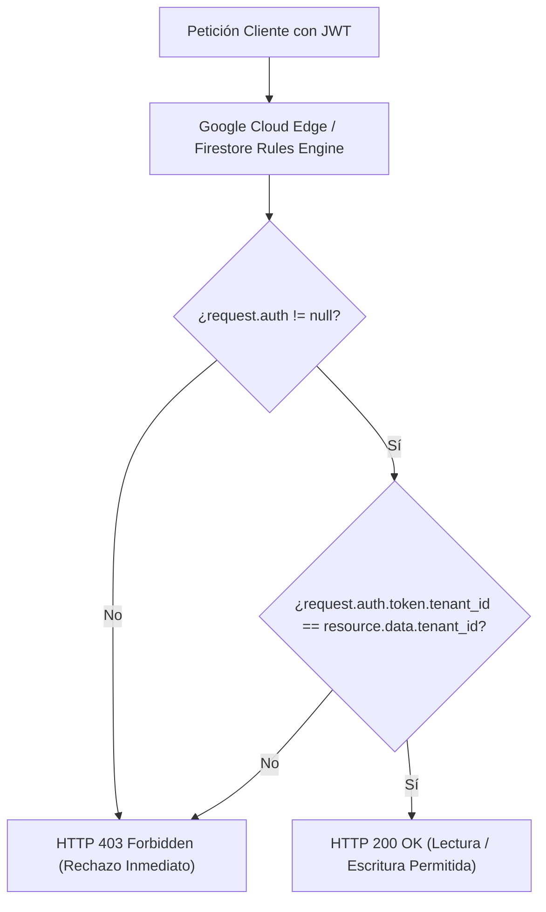

# Módulo 10 - Lección 3: Aislamiento Celular en Firestore, Custom Claims y Row-Level Security (RLS)
## *Cátedra de Seguridad Multi-Tenant en Bases de Datos Documentales (Google Cloud / MIT)*

---

## 1. 🐣 Ancla Mental Feynman & Analogía Isomórfica

### Las Cajas Fuertes del Hotel
Imagina un hotel con 500 habitaciones y una sala de cajas fuertes en la recepción:
* En cada caja fuerte hay un candado electrónico con el número de habitación grabado en la puerta.
* Cuando te registras en el hotel, te dan una tarjeta magnética programada con tu número de habitación (ej. "Habitación 304").
* Cuando bajas a la sala de cajas fuertes, la tarjeta magnética **solo** puede abrir la caja 304. Aunque intentes pasar la tarjeta por la caja 305 o la 102, el candado se niega a abrirse de forma física e inmediata.

En bases de datos multi-tenant como **Firestore**, las **Reglas de Seguridad (RLS)** y las **Custom Claims** son los candados electrónicos que garantizan que los usuarios de la Comunidad de Regantes A nunca puedan ver ni modificar los datos de la Comunidad de Regantes B, evaluando la seguridad en el borde (*Edge*) de Google Cloud sin gastar CPU en tu servidor.

---

## 2. 🔬 Primeros Principios & Desglose Mecánico

### Flujo de Evaluación de Seguridad Celular con Custom Claims



### Reglas de Seguridad Inviolables (Firestore Security Rules)
La regla base multi-tenant exige aislamiento estricto en cada documento:

```javascript
rules_version = '2';
service cloud.firestore {
  match /databases/{database}/documents {
    
    // Función auxiliar de validación de tenant O(1)
    function isAuthenticatedAndBelongsToTenant(targetTenantId) {
      return request.auth != null &&
             request.auth.token.tenant_id == targetTenantId;
    }

    // Regla celular para colecciones multi-tenant
    match /tenants/{tenantId}/{document=**} {
      allow read, write: if isAuthenticatedAndBelongsToTenant(tenantId);
    }
    
    match /trips/{tripId} {
      allow read: if request.auth != null && (
        request.auth.uid == resource.data.passengerId ||
        request.auth.uid == resource.data.driverId ||
        request.auth.token.role == 'admin'
      );
      allow create: if request.auth != null &&
                      request.auth.uid == request.resource.data.passengerId &&
                      request.resource.data.tenant_id == request.auth.token.tenant_id;
    }
  }
}
```

---

## 3. 🚀 Arquitectura Práctica & Código en Java 25

Inyección de Custom Claims de Tenant en Firebase Auth mediante Admin SDK:

```java
package com.pct.identity.claims;

import java.util.Map;

/**
 * Servicio de asignación de atributos de identidad multi-tenant.
 */
public record TenantClaimsAssigner() {

    public Map<String, Object> buildClaimsPayload(String tenantId, String role, boolean isVerified) {
        if (tenantId == null || tenantId.isBlank()) {
            throw new IllegalArgumentException("tenantId no puede ser nulo o vacio");
        }
        return Map.of(
                "tenant_id", tenantId,
                "role", role != null ? role : "user",
                "verified", isVerified
        );
    }
}
```

---

## 4. 🧠 Internals Avanzados (Google Cloud / Princeton): Evaluación Declarativa AST sin Sobrecoste de I/O

* **Compilación de Reglas a AST**: El motor de Firestore Rules compila las reglas declarativas a un Árbol de Sintaxis Abstracta (AST) ejecutado directamente en los servidores de borde de Google.
* **Cero Sobrecoste de I/O**: Cuando una regla solo evalúa `request.auth.token` contra `resource.data`, la comprobación toma menos de **`100 microsegundos`** sin realizar ninguna consulta adicional a la base de datos.

---

## 5. 🎯 Desafío Feynman & Auto-Evaluación sin Jerga

> [!NOTE]
> **El Reto de los 12 Años**: Explica por qué dos empresas distintas pueden guardar sus documentos en la misma base de datos sin poder espiarse la una a la otra, **sin usar las palabras:** *"Firestore", "RLS", "Custom Claims", "Multi-Tenant" ni "JWT"*.

### Criterio de Verificación
* **Aprobado**: Si explicas que cada documento tiene una etiqueta invisible con el nombre de la empresa a la que pertenece, y el bibliotecario tiene una regla estricta: antes de entregar cualquier papel, comprueba que la tarjeta del cliente coincida exactamente con la etiqueta del documento.
* **No Aprobado**: Si te limitas a transcribir sintaxis de Firestore Security Rules.


---
## 🧠 Ejercicio Práctico: El Método Feynman

Para garantizar una asimilación profunda de los conceptos presentados en este módulo, aplica el **Método Feynman**:

> **Instrucción:** Explica los conceptos centrales de este módulo como si tu audiencia fuera un estudiante brillante de 12 años que no ha visto nunca este tema. Si no puedes hacerlo con lenguaje sencillo, analogías claras y sin jerga técnica, significa que aún no lo entiendes lo suficientemente bien.

*Inténtalo tú mismo:* Toma el concepto más complejo de este módulo, escríbelo en un papel en blanco y redáctalo usando únicamente términos cotidianos.
