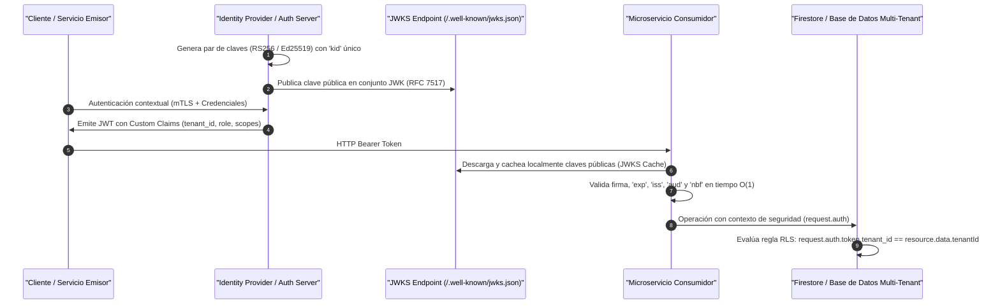

# Cátedra Ph.D.: Firmas Asimétricas JWKS, JSON Web Tokens y Row-Level Security (RLS) en Firestore

**Facultad**: `FACULTAD_XI` - Identidad Soberana & Zero-Trust BeyondCorp  
**Referencia Académica**: RFC 7519 (JSON Web Token), RFC 7517 (JSON Web Key), RFC 8725 (JWT Best Current Practices), NIST SP 800-207 (Zero Trust Architecture), Ward & Beyer (BeyondCorp, Google Research 2014).  
**Instituciones**: IETF / NIST / MIT Lincoln Lab / Google Security.

---

## 1. Arquitectura Criptográfica de Firmas Asimétricas (RS256 & EdDSA)

En una arquitectura Zero-Trust de perímetro nulo (*Perimeterless*), ningún servicio o componente confía ciegamente en la procedencia de una llamada. Cada petición HTTP o gRPC transporta un **JSON Web Token (JWT)** firmado criptográficamente de forma asimétrica mediante un par de claves privada/pública:



---

## 2. Especificación Formal de Claves JSON Web Key (JWK) y Rotación Cero-Downtime

Un conjunto **JWK Set (RFC 7517)** expone las claves públicas válidas permitiendo rotaciones periódicas sin invalidar sesiones activas mediante el identificador de clave `kid`:

```json
{
  "keys": [
    {
      "kty": "RSA",
      "use": "sig",
      "alg": "RS256",
      "kid": "corp-auth-key-2026a",
      "n": "u1W5...[Modulus RSA 2048/4096-bit]...",
      "e": "AQAB"
    }
  ]
}
```

---

## 3. Row-Level Security (RLS) y Reglas de Aislamiento Celular en Firestore

Las reglas de seguridad de Firestore deben evaluar **de forma determinista en tiempo de ejecución** las aserciones criptográficas presentes en el payload del token (`Custom Claims`):

```javascript
rules_version = '2';
service cloud.firestore {
  match /databases/{database}/documents {
    
    // Función de validación de Tenant Celular (Invariante de Hoare)
    function isAuthenticatedTenant(targetTenantId) {
      return request.auth != null &&
             request.auth.token.tenant_id == targetTenantId &&
             request.auth.token.email_verified == true;
    }

    match /tenants/{tenantId}/{document=**} {
      allow read, write: if isAuthenticatedTenant(tenantId);
    }
  }
}
```

---

## 4. Invariantes de Seguridad y Directivas Six Sigma (NIST SP 800-207)

1. **Prohibición de Tokens Simétricos (HS256)**: Se prohíbe el uso de claves compartidas simétricas en entornos distribuidos para evitar la exposición de secretos en microservicios consumidores.
2. **Expiración Corta y Rotación Activa**: Duración máxima de JWT de acceso de \(15\text{ minutos}\) combinada con rotación automatizada de refresh tokens y verificación de revocación en Redis.
3. **Cero PII en Claims Públicos**: Queda estrictamente prohibido incluir datos personales sensibles (PII) en los payloads de tokens no cifrados (JWE).
