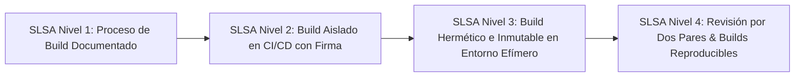

# Módulo 11 - Lección 1: Seguridad de Cadena de Suministro (SLSA L3/L4), SBOM y CycloneDX
## *Cátedra de Integridad de Software & DevSecOps Inmutable (OpenSSF / Linux Foundation)*

---

## 1. 🐣 Ancla Mental Feynman & Analogía Isomórfica

### La Lista de Ingredientes y el Sello de Origen de un Medicamento
Imagina que vas a una farmacia a comprar un medicamento:
* No te tomas una pastilla misteriosa metida en una bolsa de plástico sin etiqueta. Exiges una caja precintada que tenga la lista exacta de todos los ingredientes químicos (el **SBOM - Software Bill of Materials**) y un sello oficial de la fábrica que garantice que fue fabricado en un laboratorio estéril certificado y que nadie abrió la caja durante el transporte (la **Atestación de Proveniencia SLSA**).

En ingeniería de software, un contenedor o librería que instalas puede haber sido alterado por un atacante durante la compilación. El estándar **SLSA (Supply-chain Levels for Software Artifacts)** y los inventarios **CycloneDX** son el prospecto y el precinto de laboratorio que demuestran que tu software contiene exactamente el código que escribiste y nada más.

---

## 2. 🔬 Primeros Principios & Desglose Mecánico

### Los 4 Niveles del Marco SLSA (Supply-chain Levels for Software Artifacts)



### Estructura de un SBOM CycloneDX (JSON)
Un Software Bill of Materials detalla cada componente, versión, hash SHA-256 y licencia:

```json
{
  "bomFormat": "CycloneDX",
  "specVersion": "1.5",
  "serialNumber": "urn:uuid:76981f6d-7f50-465d-99d0-cd17c95d3b8e",
  "version": 1,
  "metadata": {
    "component": {
      "name": "corp-spring-boot-starter",
      "version": "6.3.0",
      "type": "library"
    }
  },
  "components": [
    {
      "name": "spring-boot",
      "version": "4.0.0-M2",
      "hashes": [
        {
          "alg": "SHA-256",
          "content": "e3b0c44298fc1c149afbf4c8996fb92427ae41e4649b934ca495991b7852b855"
        }
      ]
    }
  ]
}
```

---

## 3. 🚀 Arquitectura Práctica & Generación en Pipeline

Comando para generación de SBOM con Syft y verificación SLSA en CI/CD:

```bash
# Generar SBOM en formato CycloneDX JSON
syft packages dir:. -o cyclonedx-json > sbom.cyclonedx.json

# Validar ausencia de vulnerabilidades críticas conocidas
grype sbom:sbom.cyclonedx.json --fail-on high
```

---

## 4. 🧠 Internals Avanzados (OpenSSF / Google): Builds Herméticos & Reproducibilidad Bit a Bit

* **Hermeticidad**: El entorno de compilación se ejecuta en una máquina virtual efímera desconectada de Internet durante la fase de ensamblado, asegurando que ninguna dependencia externa no declarada pueda inyectarse en el binario final.
* **Reproducibilidad Cero-Diff**: Compilar el mismo commit de Git dos veces en máquinas distintas produce exactamente el mismo hash SHA-256 byte a byte.

---

## 5. 🎯 Desafío Feynman & Auto-Evaluación sin Jerga

> [!NOTE]
> **El Reto de los 12 Años**: Explica por qué es peligroso comer comida enlatada que encuentres en la calle sin etiqueta de ingredientes y sin precinto de fábrica, **sin usar las palabras:** *"SLSA", "SBOM", "CycloneDX", "Hash" ni "Supply Chain"*.

### Criterio de Verificación
* **Aprobado**: Si explicas que alguien pudo haber echado veneno dentro de la lata o la comida pudo haberse podrido sin que lo notes, por lo que solo debes comer latas cerradas con el sello original del supermercado que certifique qué ingredientes tiene dentro.
* **No Aprobado**: Si te limitas a recitar normativas de ciberseguridad.


---
## 🧠 Ejercicio Práctico: El Método Feynman

Para garantizar una asimilación profunda de los conceptos presentados en este módulo, aplica el **Método Feynman**:

> **Instrucción:** Explica los conceptos centrales de este módulo como si tu audiencia fuera un estudiante brillante de 12 años que no ha visto nunca este tema. Si no puedes hacerlo con lenguaje sencillo, analogías claras y sin jerga técnica, significa que aún no lo entiendes lo suficientemente bien.

*Inténtalo tú mismo:* Toma el concepto más complejo de este módulo, escríbelo en un papel en blanco y redáctalo usando únicamente términos cotidianos.
