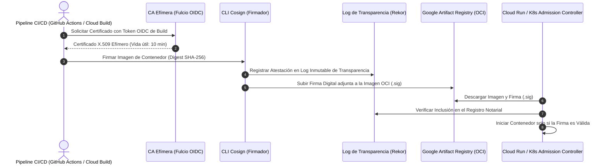

# Módulo 11 - Lección 2: Firmas Criptográficas con Cosign, Sigstore y Artefactos Inmutables
## *Cátedra de Criptografía de Artefactos & Transparencia de Firmas (Linux Foundation / Google)*

---

## 1. 🐣 Ancla Mental Feynman & Analogía Isomórfica

### El Sello de Cera Real en el Decreto del Rey
Imagina que un mensajero llega a caballo a una ciudad con un decreto que dice que todos deben pagar 5 monedas de oro:
* Si el papel es una simple hoja escrita a mano, cualquier farsante podría haberla escrito.
* Pero si el documento lleva estampado el **sello de cera con el anillo del Rey**, y en la plaza mayor hay un libro público (el **Registro Notarial / Rekor**) donde el escriba real anotó la hora exacta en que el Rey estampó su anillo, nadie puede falsificar el decreto ni el Rey puede negar haberlo firmado.

En la nube, **Cosign** y **Sigstore** son el anillo del Rey y el libro notarial público: firman contenedores Docker y binarios de Cloud Run de forma inmutable, de modo que el clúster de producción se niega a arrancar cualquier imagen que no tenga la firma válida del equipo.

---

## 2. 🔬 Primeros Principios & Desglose Mecánico

### La Arquitectura Keyless de Sigstore (Fulcio + Rekor + Cosign)



### Principio de Inmutabilidad de Artefactos
* **Prohibido desplegar etiquetas mutables (`:latest`)**: Todo despliegue en producción debe apuntar al *Digest* inmutable de la imagen: `gcr.io/pct-core/backend@sha256:7f83b1...`.
* La firma Cosign se asocia criptográficamente al Digest exacto, haciendo imposible que un atacante reemplace el contenedor sin invalidar la firma.

---

## 3. 🚀 Arquitectura Práctica & Comandos de Pipeline

Firma y verificación de contenedor con Cosign:

```bash
# 1. Firmar contenedor usando identidad OIDC (Keyless)
cosign sign --yes gcr.io/pct-core/corp-spring-boot-starter@sha256:abcd1234...

# 2. Adjuntar SBOM CycloneDX como atestación
cosign attest --yes --predicate sbom.cyclonedx.json --type cyclonedx gcr.io/pct-core/corp-spring-boot-starter@sha256:abcd1234...

# 3. Verificar firma en el clúster antes del despliegue
cosign verify \
  --certificate-identity "https://github.com/jaruiz78/ecosistema-multiproyectos/.github/workflows/deploy.yml@refs/heads/main" \
  --certificate-oidc-issuer "https://token.actions.githubusercontent.com" \
  gcr.io/pct-core/corp-spring-boot-starter@sha256:abcd1234...
```

---

## 4. 🧠 Internals Avanzados (Sigstore / Rekor): Árboles de Merkle & Pruebas de Inclusión

* **Log de Transparencia Rekor (Basado en Trillian de Google)**: Utiliza una estructura de datos de **Árbol de Merkle**.
* **Prueba de Inclusión (*Inclusion Proof*) en \(\mathcal{O}(\log N)\)**: Permite a cualquier auditor demostrar matemáticamente que una firma específica fue registrada en el log inmutable sin necesidad de descargar todo el historial del clúster.

---

## 5. 🎯 Desafío Feynman & Auto-Evaluación sin Jerga

> [!NOTE]
> **El Reto de los 12 Años**: Explica cómo un guardia de seguridad puede estar seguro de que un paquete que llegó en un camión viene de la fábrica oficial y no fue manipulado en el camino, **sin usar las palabras:** *"Cosign", "Sigstore", "Criptografía", "SHA-256" ni "Certificado"*.

### Criterio de Verificación
* **Aprobado**: Si explicas que el paquete viene con una cinta adhesiva de seguridad especial que deja una marca imborrable si alguien intenta despegarla, y además la fábrica mandó una foto del paquete recién terminado para que el guardia compare que no cambió nada.
* **No Aprobado**: Si te limitas a recitar parámetros del CLI de Cosign.


---
## 🧠 Ejercicio Práctico: El Método Feynman

Para garantizar una asimilación profunda de los conceptos presentados en este módulo, aplica el **Método Feynman**:

> **Instrucción:** Explica los conceptos centrales de este módulo como si tu audiencia fuera un estudiante brillante de 12 años que no ha visto nunca este tema. Si no puedes hacerlo con lenguaje sencillo, analogías claras y sin jerga técnica, significa que aún no lo entiendes lo suficientemente bien.

*Inténtalo tú mismo:* Toma el concepto más complejo de este módulo, escríbelo en un papel en blanco y redáctalo usando únicamente términos cotidianos.
