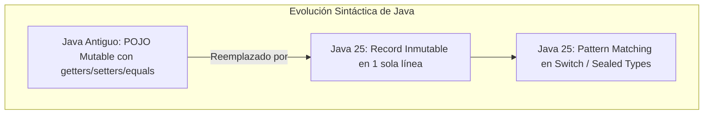

# Módulo 1 - Lección 1: Fundamentos de Java 25 (LTS) desde Cero

---

## 1. 🐣 Rincón Junior: Conceptos desde Cero & Analogías

### ¿Qué aporta Java 25 frente a versiones antiguas (Java 8 o 11)?
Si aprendiste Java hace años, recordarás escribir decenas de líneas de código "ceremonial" (`getters`, `setters`, `toString`, `equals`, `hashCode`, casteos manuales con `(Tipo) objeto`).

En **Java 25 (LTS)**, el lenguaje se ha modernizado drásticamente para permitir un código conciso, seguro e inmutable desde el primer día:
* **Records**: Clases inmutables de datos creadas en 1 sola línea.
* **Sealed Classes**: Clases "selladas" que restringen explícitamente qué subclases pueden heredar de ellas.
* **Pattern Matching**: Comprobación de tipos y extracción de variables sin necesidad de hacer casteos explícitos.

---

## 2. 📐 Arquitectura Visual & Diagrama Mermaid



---

## 3. 🚀 Guía Paso a Paso e Implementación Práctica (0 a 100)

### Paso 1: Crear un Record Inmutable con Validaciones

```java
package com.corp.model;

import java.util.Objects;

// Record de Java 25 (Zero Lombok, Zero Boilerplate)
public record Customer(String id, String email, boolean vip) {
    
    // Constructor compacto para validar invariantes del objeto
    public Customer {
        Objects.requireNonNull(id, "El ID no puede ser nulo");
        Objects.requireNonNull(email, "El email no puede ser nulo");
        if (!email.contains("@")) {
            throw new IllegalArgumentException("Formato de email inválido");
        }
    }

    // Método personalizado de conveniencia
    public boolean isEligibleForDiscount() {
        return vip;
    }
}
```

### Paso 2: Pattern Matching en Switch con Sealed Interfaces

```java
package com.corp.model;

public sealed interface NotificationState permits NotificationState.Sent, NotificationState.Failed {
    record Sent(long timestamp, String messageId) implements NotificationState {}
    record Failed(String errorReason) implements NotificationState {}
}

public class NotificationHandler {

    public String getStatusMessage(NotificationState state) {
        // Switch expression con Pattern Matching exhaustivo (Zero cast manual)
        return switch (state) {
            case NotificationState.Sent s -> "Notificación enviada OK con ID: " + s.messageId();
            case NotificationState.Failed f -> "Error al enviar: " + f.errorReason();
        };
    }
}
```

---

## 4. 🧠 Referencia Senior: Cheatsheet, Performance & Internals

### Layout de Memoria y Optimización JIT

| Característica | Detalle Técnico | Beneficio de Rendimiento |
| :--- | :--- | :--- |
| **Record Scalar Replacement** | El compilador JIT C2 descompone los records en variables escalares locales | Eliminación completa de asignación en Heap (Zero GC Impact) |
| **Sealed Switch Dispatch** | El compilador compila los `switch` sellados como tablas de salto fijas | Invocación en \(O(1)\) sin evaluar cadenas `if-else` |

---

## 5. ⚠️ Errores Comunes & Anti-Patrones (Gotchas)

1. **Intentar mutar campos de un Record reflejivamente**:
   * *Síntoma*: Los campos de un Record son estrictamente `final`. Si usas librerías antiguas que asumen mutabilidad vía getters/setters (como ciertos serializadores antiguos de Jackson), se producirá un error de inicialización.
   * *Solución*: Utiliza Jackson 2.15+ o configure los constructores `@JsonCreator` con Records.
